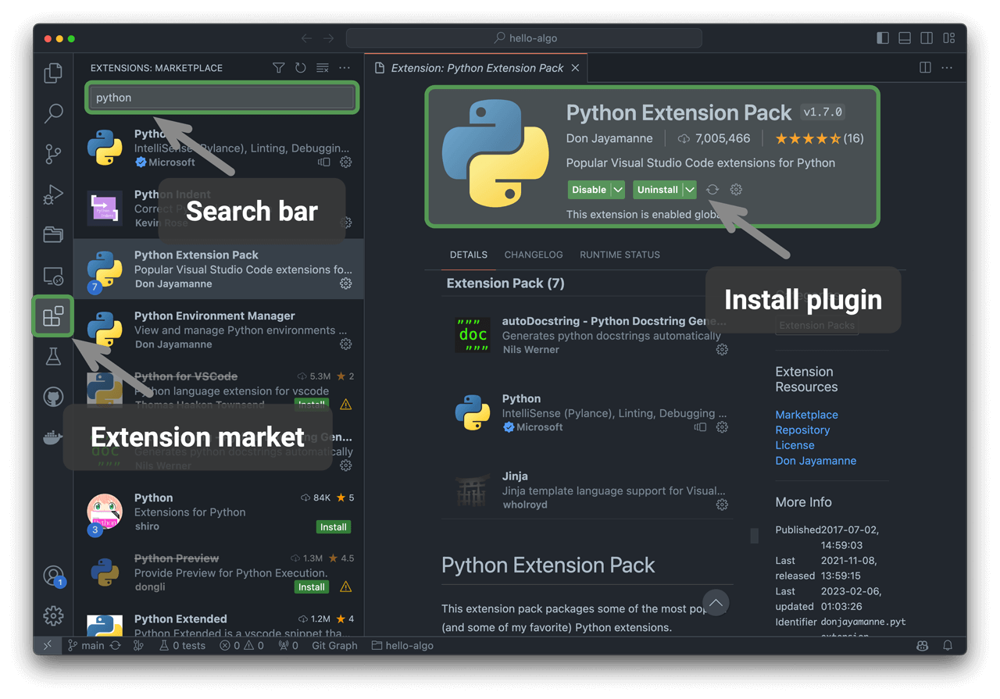

# Programozási környezet telepítése

## IDE telepítése

Helyi integrált fejlesztői környezetként (IDE) a nyílt forráskódú és könnyű VS Code használatát ajánljuk. Látogasson el a [VS Code hivatalos weboldalára](https://code.visualstudio.com/), és töltse le és telepítse az operációs rendszerének megfelelő VS Code verziót.

A VS Code hatékony bővítmény-ökoszisztémával rendelkezik, amely a legtöbb programozási nyelv futtatását és hibakeresését támogatja. Például a „Python Extension Pack" bővítmény telepítése után Python-kódot lehet hibakeresni. A telepítési lépések a következő ábrán láthatók.

## Nyelvi környezetek telepítése

### Python környezet

1. Töltse le és telepítse a [Miniconda3](https://docs.conda.io/en/latest/miniconda.html) alkalmazást, amelyhez Python 3.10 vagy újabb verzió szükséges.
2. Keressen rá a `python` kifejezésre a VS Code bővítmény-piactéren, és telepítse a Python Extension Pack csomagot.
3. (Opcionális) Írja be a `pip install black` parancsot a parancssorba a kódformázó telepítéséhez.

### C/C++ környezet

1. Windows rendszereken telepíteni kell a [MinGW](https://sourceforge.net/projects/mingw-w64/files/) alkalmazást ([konfigurációs útmutató](https://blog.csdn.net/qq_33698226/article/details/129031241)); macOS-en a Clang beépített, nem szükséges telepíteni.
2. Keressen rá a `c++` kifejezésre a VS Code bővítmény-piactéren, és telepítse a C/C++ Extension Pack csomagot.
3. (Opcionális) Nyissa meg a Beállítások oldalt, keressen rá a `Clang_format_fallback Style` kódformázási opcióra, és állítsa be `{ BasedOnStyle: Microsoft, BreakBeforeBraces: Attach }` értékre.

### Java környezet

1. Töltse le és telepítse az [OpenJDK](https://jdk.java.net/18/) alkalmazást (a verziónak > JDK 9 kell lennie).
2. Keressen rá a `java` kifejezésre a VS Code bővítmény-piactéren, és telepítse az Extension Pack for Java csomagot.

### C# környezet

1. Töltse le és telepítse a [.Net 8.0](https://dotnet.microsoft.com/en-us/download) alkalmazást.
2. Keressen rá a `C# Dev Kit` kifejezésre a VS Code bővítmény-piactéren, és telepítse a C# Dev Kit csomagot ([konfigurációs útmutató](https://code.visualstudio.com/docs/csharp/get-started)).
3. Használhat Visual Studio alkalmazást is ([telepítési útmutató](https://learn.microsoft.com/zh-cn/visualstudio/install/install-visual-studio?view=vs-2022)).

### Go környezet

1. Töltse le és telepítse a [Go](https://go.dev/dl/) alkalmazást.
2. Keressen rá a `go` kifejezésre a VS Code bővítmény-piactéren, és telepítse a Go csomagot.
3. Nyomja meg a `Ctrl + Shift + P` billentyűkombinációt a parancspaletta megnyitásához, írja be a `go` kifejezést, válassza a `Go: Install/Update Tools` lehetőséget, jelölje be az összes opciót, és telepítse.

### Swift környezet

1. Töltse le és telepítse a [Swift](https://www.swift.org/download/) alkalmazást.
2. Keressen rá a `swift` kifejezésre a VS Code bővítmény-piactéren, és telepítse a [Swift for Visual Studio Code](https://marketplace.visualstudio.com/items?itemName=sswg.swift-lang) bővítményt.

### JavaScript környezet

1. Töltse le és telepítse a [Node.js](https://nodejs.org/en/) alkalmazást.
2. (Opcionális) Keressen rá a `Prettier` kifejezésre a VS Code bővítmény-piactéren, és telepítse a kódformázót.

### TypeScript környezet

1. Kövesse a JavaScript környezettel megegyező telepítési lépéseket.
2. Telepítse a [TypeScript Execute (tsx)](https://github.com/privatenumber/tsx?tab=readme-ov-file#global-installation) alkalmazást.
3. Keressen rá a `typescript` kifejezésre a VS Code bővítmény-piactéren, és telepítse a [Pretty TypeScript Errors](https://marketplace.visualstudio.com/items?itemName=yoavbls.pretty-ts-errors) bővítményt.

### Dart környezet

1. Töltse le és telepítse a [Dart](https://dart.dev/get-dart) alkalmazást.
2. Keressen rá a `dart` kifejezésre a VS Code bővítmény-piactéren, és telepítse a [Dart](https://marketplace.visualstudio.com/items?itemName=Dart-Code.dart-code) bővítményt.

### Rust környezet

1. Töltse le és telepítse a [Rust](https://www.rust-lang.org/tools/install) alkalmazást.
2. Keressen rá a `rust` kifejezésre a VS Code bővítmény-piactéren, és telepítse a [rust-analyzer](https://marketplace.visualstudio.com/items?itemName=rust-lang.rust-analyzer) bővítményt.
