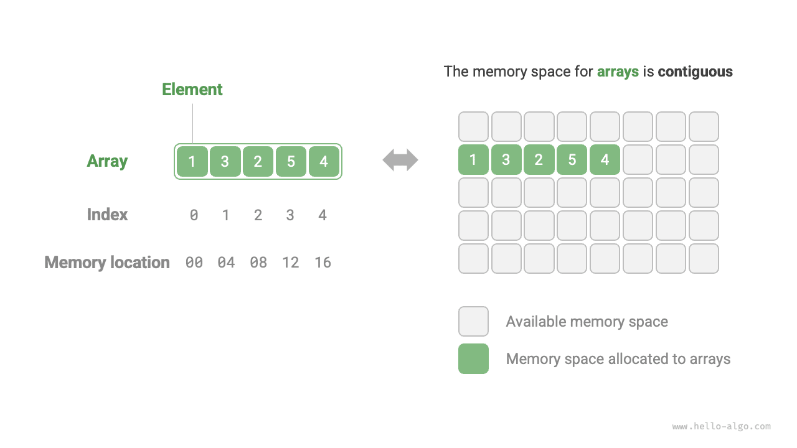
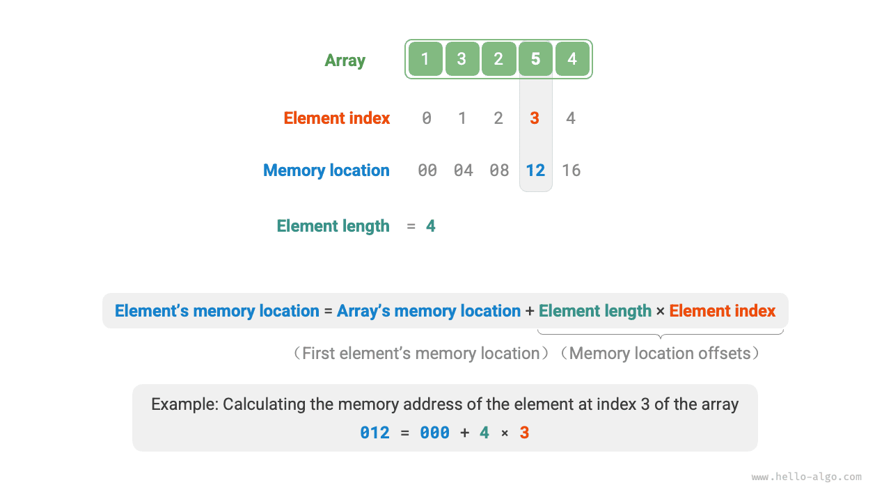
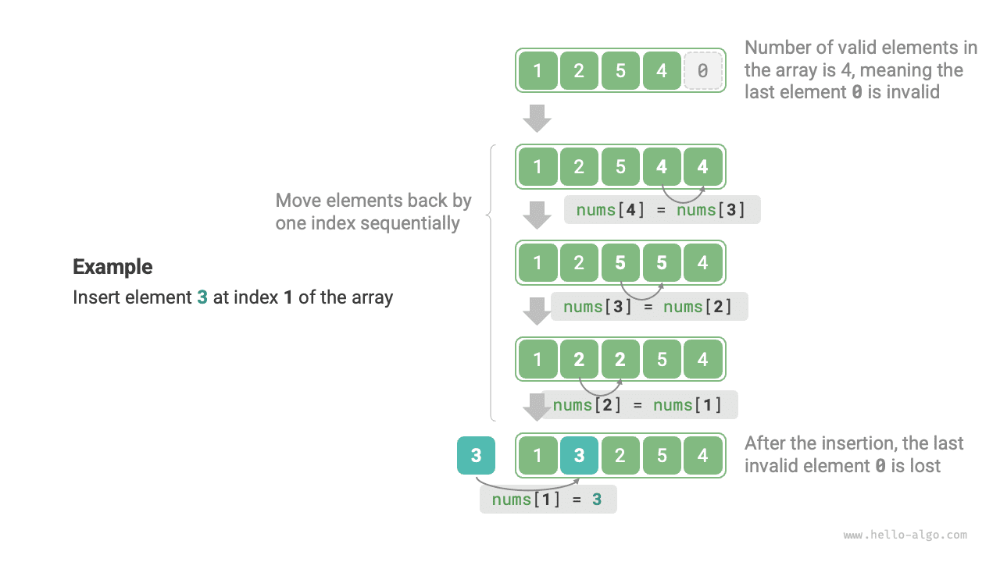

# Tömb

A <u>tömb</u> egy lineáris adatstruktúra, amely azonos típusú elemeket tárol összefüggő memóriaterületen. Az elem tömbön belüli helyzetét az elem <u>indexének</u> nevezzük. Az alábbi ábra a tömbök fő fogalmait és tárolási módszerét szemlélteti.



## A Tömb Általános Műveletei

### Tömbök Inicializálása

Az igényeink szerint két inicializálási módszer közül választhatunk: kezdőértékek nélkül vagy megadott kezdőértékekkel. Ha nem adunk meg kezdőértékeket, a legtöbb programozási nyelv a tömbeleméket $0$-ra inicializálja:

=== "Python"

    ```python title="array.py"
    # Tömb inicializálása
    arr: list[int] = [0] * 5  # [ 0, 0, 0, 0, 0 ]
    nums: list[int] = [1, 3, 2, 5, 4]
    ```

=== "C++"

    ```cpp title="array.cpp"
    /* Tömb inicializálása */
    // Veremtárolón tárolva
    int arr[5];
    int nums[5] = { 1, 3, 2, 5, 4 };
    // Halomtárolón tárolva (manuális memóriafelszabadítás szükséges)
    int* arr1 = new int[5];
    int* nums1 = new int[5] { 1, 3, 2, 5, 4 };
    ```

=== "Java"

    ```java title="array.java"
    /* Tömb inicializálása */
    int[] arr = new int[5]; // { 0, 0, 0, 0, 0 }
    int[] nums = { 1, 3, 2, 5, 4 };
    ```

=== "C#"

    ```csharp title="array.cs"
    /* Tömb inicializálása */
    int[] arr = new int[5]; // [ 0, 0, 0, 0, 0 ]
    int[] nums = [1, 3, 2, 5, 4];
    ```

=== "Go"

    ```go title="array.go"
    /* Tömb inicializálása */
    var arr [5]int
    // Go-ban a hossz megadása ([5]int) tömböt, a hossz elhagyása ([]int) szeletet hoz létre
    // Mivel a Go tömbjeinek hosszát fordítási időben kell meghatározni, csak konstansok használhatók a hossz megadásához
    // Az extend() metódus megvalósításának egyszerűsítése érdekében alább szeleteket tömbként kezelünk
    nums := []int{1, 3, 2, 5, 4}
    ```

=== "Swift"

    ```swift title="array.swift"
    /* Tömb inicializálása */
    let arr = Array(repeating: 0, count: 5) // [0, 0, 0, 0, 0]
    let nums = [1, 3, 2, 5, 4]
    ```

=== "JS"

    ```javascript title="array.js"
    /* Tömb inicializálása */
    var arr = new Array(5).fill(0);
    var nums = [1, 3, 2, 5, 4];
    ```

=== "TS"

    ```typescript title="array.ts"
    /* Tömb inicializálása */
    let arr: number[] = new Array(5).fill(0);
    let nums: number[] = [1, 3, 2, 5, 4];
    ```

=== "Dart"

    ```dart title="array.dart"
    /* Tömb inicializálása */
    List<int> arr = List.filled(5, 0); // [0, 0, 0, 0, 0]
    List<int> nums = [1, 3, 2, 5, 4];
    ```

=== "Rust"

    ```rust title="array.rs"
    /* Tömb inicializálása */
    let arr: [i32; 5] = [0; 5]; // [0, 0, 0, 0, 0]
    let slice: &[i32] = &[0; 5];
    // Rustban a hossz megadása ([i32; 5]) tömböt, a hossz elhagyása (&[i32]) szeletet hoz létre
    // Mivel a Rust tömbjeinek hosszát fordítási időben kell meghatározni, csak konstansok használhatók a hossz megadásához
    // A Vector az általánosan használt dinamikus tömb típus Rustban
    // Az extend() metódus megvalósításának egyszerűsítése érdekében alább vektorokat tömbként kezelünk
    let nums: Vec<i32> = vec![1, 3, 2, 5, 4];
    ```

=== "C"

    ```c title="array.c"
    /* Tömb inicializálása */
    int arr[5] = { 0 }; // { 0, 0, 0, 0, 0 }
    int nums[5] = { 1, 3, 2, 5, 4 };
    ```

=== "Kotlin"

    ```kotlin title="array.kt"
    /* Tömb inicializálása */
    var arr = IntArray(5) // { 0, 0, 0, 0, 0 }
    var nums = intArrayOf(1, 3, 2, 5, 4)
    ```

=== "Ruby"

    ```ruby title="array.rb"
    # Tömb inicializálása
    arr = Array.new(5, 0)
    nums = [1, 3, 2, 5, 4]
    ```

??? pythontutor "Kód Vizualizáció"

    https://pythontutor.com/render.html#code=%23%20%E5%88%9D%E5%A7%8B%E5%8C%96%E6%95%B0%E7%BB%84%0Aarr%20%3D%20%5B0%5D%20*%205%20%20%23%20%5B%200,%200,%200,%200,%200%20%5D%0Anums%20%3D%20%5B1,%203,%202,%205,%204%5D&cumulative=false&curInstr=0&heapPrimitives=nevernest&mode=display&origin=opt-frontend.js&py=311&rawInputLstJSON=%5B%5D&textReferences=false

### Elemek Elérése

A tömbelemek összefüggő memóriaterületen tárolódnak, ami azt jelenti, hogy a tömbelemek memóriacímének kiszámítása nagyon egyszerű. A tömb memóriacímét (az első elem memóriacímét) és egy elem indexét ismerve az alábbi ábrán látható képlettel kiszámítható az elem memóriacíme, és közvetlenül hozzáférhetünk ahhoz az elemhez.



A fenti ábrát megvizsgálva megfigyeljük, hogy a tömb első elemének indexe $0$, ami elsőre talán nem tűnik természetesnek, hiszen $1$-től számolni természetesebb lenne. Azonban a címkiszámítási képlet szempontjából **az index lényegében egy eltolás a memóriacímtől**. Az első elem címeltolása $0$, ezért indokolt, hogy indexe is $0$ legyen.

A tömbben lévő elemek elérése rendkívül hatékony; bármely elem véletlenszerűen elérhető $O(1)$ idő alatt.

```src
[file]{array}-[class]{}-[func]{random_access}
```

### Elemek Beszúrása

A tömbelemek memóriában "szorosan egymás mellett" tárolódnak, köztük nincs hely további adatok tárolására. Ahogy az alábbi ábra mutatja, ha egy elemet szeretnénk a tömb közepébe szúrni, az adott pozíció utáni összes elemet egy pozícióval hátra kell tolni, majd az értéket hozzá kell rendelni az adott indexhez.



Érdemes megjegyezni, hogy mivel a tömb hossza rögzített, egy elem beszúrása elkerülhetetlenül a tömb végén lévő elem "elvesztéséhez" vezet. Ennek a problémának a megoldását a "Lista" fejezetnél tárgyaljuk majd.

```src
[file]{array}-[class]{}-[func]{insert}
```

### Elemek Törlése

Hasonlóképpen, ahogy az alábbi ábra mutatja, a $i$ indexű elem törléséhez az összes $i$ index utáni elemet egy pozícióval előre kell tolni.


Vegyük észre, hogy a törlés befejezése után az eredetileg utolsó elem "értelmetlenné" válik, így azt nem szükséges kifejezetten módosítani.

```src
[file]{array}-[class]{}-[func]{remove}
```

Összességében a tömb beszúrási és törlési műveleteinek a következő hátrányai vannak:

- **Magas időbonyolultság**: A tömbben végzett beszúrás és törlés átlagos időbonyolultsága $O(n)$, ahol $n$ a tömb hossza.
- **Elemvesztés**: Mivel a tömb hossza nem változtatható, egy elem beszúrása után a tömb hosszát meghaladó elemek elvesznek.
- **Memória-pazarlás**: Inicializálhatunk egy viszonylag hosszú tömböt, és csak az első részét használjuk, így az adatok beszúrásakor az elveszett elemek a végén "értelmetlenek", de ez némi memóriaterület-pazarlást okoz.

### Tömbök Bejárása

A legtöbb programozási nyelvben a tömböt index szerint vagy közvetlenül az elemek iterálásával is bejárhatjuk:

```src
[file]{array}-[class]{}-[func]{traverse}
```

### Elemek Keresése

Egy adott elem megkeresése a tömbben a tömb bejárását és minden iterációban az elemérték egyezésének ellenőrzését igényli; egyezés esetén kiírjuk a megfelelő indexet.

Mivel a tömb lineáris adatstruktúra, a fenti keresési művelet "lineáris keresésnek" nevezzük.

```src
[file]{array}-[class]{}-[func]{find}
```

### Tömbök Bővítése

Összetett rendszerkörnyezetekben a programok nem garantálhatják, hogy a tömb utáni memóriaterület szabad, így a tömb kapacitásának bővítése nem biztonságos. Ezért a legtöbb programozási nyelvben **a tömb hossza nem változtatható**.

Ha bővíteni szeretnénk egy tömböt, létre kell hoznunk egy új, nagyobb tömböt, majd az eredeti tömb elemeit egyenként át kell másolnunk az új tömbbe. Ez egy $O(n)$ műveleti bonyolultságú folyamat, amely nagy tömbök esetén nagyon időigényes. Az alábbi kód szemlélteti ezt:

```src
[file]{array}-[class]{}-[func]{extend}
```

## A Tömbök Előnyei és Korlátai

A tömbök összefüggő memóriaterületen tárolódnak, azonos típusú elemekkel. Ez a megközelítés gazdag előzetes információkat tartalmaz, amelyeket a rendszer felhasználhat az adatstruktúra-műveletek hatékonyságának optimalizálásához.

- **Magas tárhelyhatékonyság**: A tömbök összefüggő memóriablokkokat foglalnak az adatok számára, további strukturális többletterhelés nélkül.
- **Véletlenszerű hozzáférés támogatása**: A tömbök lehetővé teszik bármely elem $O(1)$ idő alatt való elérését.
- **Gyorsítótár-lokalitás**: Tömbelemek elérésekor a számítógép nemcsak az elemet tölti be, hanem a közeli adatokat is gyorsítótárba helyezi, ezáltal kihasználva a gyorsítótárat a következő műveletek végrehajtási sebességének javítása érdekében.

Az összefüggő tárhelytárolás kétélű kard, a következő korlátokkal:

- **Alacsony beszúrási és törlési hatékonyság**: Ha egy tömbnek sok eleme van, a beszúrási és törlési műveletek nagyszámú elem eltolását igénylik.
- **Változtathatatlan hossz**: Egy tömb inicializálása után annak hossza rögzített. A tömb bővítése az összes adat új tömbbe való másolását igényli, ami nagyon költséges.
- **Tárhelypazarlás**: Ha egy tömb lefoglalt mérete meghaladja a ténylegesen szükségeset, a felesleges hely elpazarolódik.

## A Tömbök Tipikus Alkalmazásai

A tömbök alapvető és elterjedt adatstruktúrák, amelyeket különféle algoritmusokban és összetett adatstruktúrák megvalósítására is rendszeresen alkalmaznak.

- **Véletlenszerű hozzáférés**: Ha véletlenszerűen szeretnénk mintát venni néhány elemből, tömbben tárolhatjuk őket, és egy véletlenszám-sorozatot generálhatunk a véletlenszerű mintavételhez indexek alapján.
- **Rendezés és keresés**: A tömbök a leggyakrabban használt adatstruktúrák rendezési és keresési algoritmusokhoz. A gyorsrendezés, összefésüléses rendezés, bináris keresés és más algoritmusok elsősorban tömbökön végzik a műveleteket.
- **Keresési táblák**: Ha gyorsan kell megtalálni egy elemet vagy annak megfelelő kapcsolatát, tömböt használhatunk keresési táblaként. Például ha karakterek ASCII-kódokra való leképezését szeretnénk megvalósítani, a karakter ASCII-kódértékét használhatjuk indexként, a tömb adott pozícióján a megfelelő elemet tárolva.
- **Gépi tanulás**: A neurális hálók kiterjedten használnak lineáris algebrai műveleteket vektorok, mátrixok és tenzorok között, amelyek mindegyike tömb formájában van felépítve. A tömbök a leggyakrabban használt adatstruktúrák a neurális hálók programozásában.
- **Adatstruktúrák megvalósítása**: A tömbök segítségével veremek, sorok, hasítótáblák, kupacok, gráfok és egyéb adatstruktúrák valósíthatók meg. Például egy gráf szomszédsági mátrixos ábrázolása lényegében egy kétdimenziós tömb.
