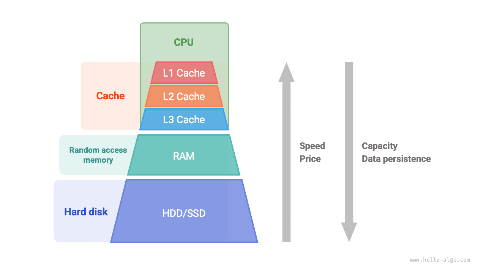
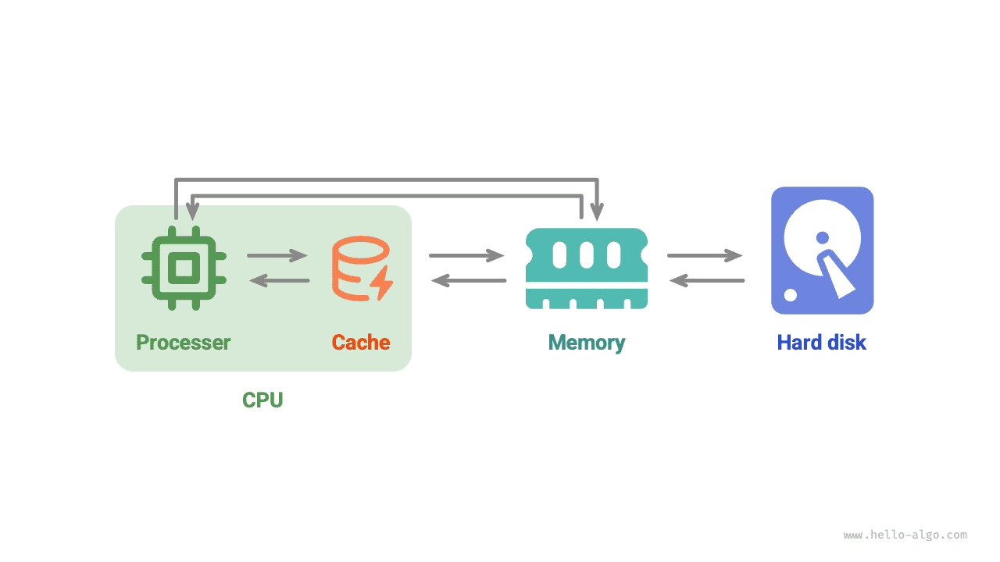

# Véletlen hozzáférésű memória és gyorsítótár *

E fejezet első két szakaszában megvizsgáltuk a tömböket és a láncolt listákat, két alapvető és fontos adatstruktúrát, amelyek az "összefüggő tárolás" és az "elosztott tárolás" két fizikai struktúráját képviselik.

Valójában **a fizikai struktúra nagymértékben meghatározza a programok memória- és gyorsítótár-kihasználásának hatékonyságát**, ami viszont befolyásolja az algoritmusos programok általános teljesítményét.

## Számítógépes Tárolóeszközök

A számítógépek három típusú tárolóeszközt tartalmaznak: <u>merevlemez</u>, <u>véletlen hozzáférésű memória (RAM)</u> és <u>gyorsítótár-memória</u>. Az alábbi táblázat mutatja be különböző szerepüket és teljesítményjellemzőiket a számítógépes rendszerben.

 Table <id> &nbsp; Számítógépes Tárolóeszközök 

|                | Merevlemez                                                    | RAM                                              | Gyorsítótár                                                    |
| -------------- | ------------------------------------------------------------- | ------------------------------------------------ | -------------------------------------------------------------- |
| Rendeltetés    | Nagy mennyiségű adat hosszú távú tárolása, beleértve az operációs rendszereket, programokat és fájlokat | Az éppen futó programok és a feldolgozás alatt álló adatok ideiglenes tárolása | A gyakran hozzáférendő adatok és utasítások tárolása a CPU memória-hozzáférésének csökkentése érdekében |
| Adatvesztés    | Az adatok kikapcsolás után nem vesznek el                     | Az adatok kikapcsolás után elvesznek             | Az adatok kikapcsolás után elvesznek                          |
| Kapacitás      | Nagy, terabájt (TB) nagyságrendű                              | Kis, gigabájt (GB) nagyságrendű                 | Nagyon kis, megabájt (MB) nagyságrendű                        |
| Sebesség       | Lassú, száz-ezer MB/s                                         | Gyors, tíz GB/s                                 | Nagyon gyors, tíz-száz GB/s                                   |
| Ár (USD/GB)    | Olcsó, töredék dollártól néhány dollárig GB-onként            | Drága, tíz-száz dollár GB-onként                | Nagyon drága, a CPU csomag részeként árazzák                  |

A számítógépes tárolórendszert az alábbi ábrán látható piramisszerű struktúraként képzelhetjük el. A piramis tetejéhez közelebb elhelyezkedő tárolóeszközök gyorsabbak, kisebb kapacitásúak és drágábbak. Ez a többrétegű kialakítás nem véletlen, hanem a számítástechnikai tudósok és mérnökök gondos mérlegelésének eredménye.

- **A merevlemezt nem könnyű RAM-mal helyettesíteni**. Először is, a memóriában lévő adatok kikapcsolás után elvesznek, ami alkalmatlanná teszi hosszú távú adattárolásra. Másodszor, a memória tíxszer drágább a merevlemeznél, ami megnehezíti a fogyasztói piacon való elterjedését.
- **A gyorsítótár nem tud egyszerre nagy kapacitású és nagy sebességű lenni**. Az L1, L2 és L3 gyorsítótárak kapacitásának növekedésével fizikai méretük is nagyobb lesz, és a köztük és a CPU-mag között lévő fizikai távolság nő, ami hosszabb adatátviteli időt és nagyobb elemhozzáférési késleltetést eredményez. A jelenlegi technológiával a többrétegű gyorsítótár-struktúra képviseli a legjobb egyensúlyi pontot a kapacitás, sebesség és ár között.

!!! tip

    A számítógépek tárolóhierarchiája finom egyensúlyt testesít meg a sebesség, a kapacitás és a ár között. Valójában az ilyen kompromisszumok minden ipari területen gyakoriak, és megkövetelünk tőlünk, hogy megtaláljuk az optimális egyensúlyi pontot a különböző előnyök és korlátok között.

Összefoglalva, **a merevlemezt nagy mennyiségű adat hosszú távú tárolására, a RAM-ot a program végrehajtása során feldolgozásra kerülő adatok ideiglenes tárolására, a gyorsítótárat pedig a gyakran hozzáférendő adatok és utasítások tárolására** használjuk a program végrehajtási hatékonyságának javítása érdekében. A három együtt biztosítja a számítógépes rendszer hatékony működését.

Ahogy az alábbi ábra mutatja, a program végrehajtása során az adatok a merevlemezről a RAM-ba kerülnek a CPU-számításhoz. A gyorsítótár a CPU részének tekinthető, **intelligensen tölti be az adatokat a RAM-ból**, nagy sebességű adatolvasást biztosítva a CPU számára, ezáltal jelentősen javítva a program végrehajtási hatékonyságát és csökkentve a lassabb RAM-ra való támaszkodást.

## Adatstruktúrák Memóriahatékonysága

A memóriaterület-kihasználás szempontjából a tömböknek és a láncolt listáknak egyaránt vannak előnyei és korlátai.

Egyrészt **a memória korlátozott, és ugyanazt a memóriát több program nem oszthatja meg**, ezért azt szeretnénk, hogy az adatstruktúrák a lehető leghatékonyabban használják fel a helyet. A tömbelemek szorosan egymás mellett vannak, és nincs szükség további helyre a láncolt lista csomópontjai közötti hivatkozások (mutatók) tárolásához, ezért nagyobb tárhelyhatékonyságuk van. A tömböknek azonban egyszerre kell elegendő összefüggő memóriaterületet lefoglalniuk, ami memória-pazarláshoz vezethet, és a tömb bővítése további idő- és tárhelyköltségeket igényel. Összehasonlításképpen, a láncolt listák "csomópont" alapon végeznek dinamikus memóriafoglalást és -felszabadítást, nagyobb rugalmasságot biztosítva.

Másrészt a program végrehajtása során **a memória ismételt lefoglalása és felszabadítása következtében a szabad memória töredezettsége egyre súlyosabbá válik**, ami csökkenti a memória kihasználási hatékonyságát. A tömbök, összefüggő tárolási megközelítésük miatt, viszonylag kevésbé hajlamosak a memória-töredezettségre. Ezzel szemben a láncolt lista elemei szétszórtan tárolódnak, és a gyakori beszúrási és törlési műveletek valószínűbben okoznak memória-töredezettséget.

## Adatstruktúrák Gyorsítótár-hatékonysága

Bár a gyorsítótár sokkal kisebb tárterülettel rendelkezik, mint a memória, sokkal gyorsabb annál, és döntő szerepet játszik a program végrehajtási sebességében. Mivel a gyorsítótár kapacitása korlátozott, és csak a gyakran hozzáférendő adatok kis részét tudja tárolni, amikor a CPU olyan adathoz próbál hozzáférni, amely nem szerepel a gyorsítótárban, <u>gyorsítótár-kihagyás</u> következik be, és a CPU-nak be kell töltenie a szükséges adatokat a lassabb memóriából.

Nyilvánvalóan **minél kevesebb "gyorsítótár-kihagyás" történik, annál nagyobb a CPU adatolvasásának és -írásának hatékonysága**, és annál jobb a program teljesítménye. Azt az arányt, amellyel a CPU sikeresen szerez adatot a gyorsítótárból, <u>gyorsítótár-találati aránynak</u> nevezzük, ez egy általánosan használt metrika a gyorsítótár hatékonyságának mérésére.

A lehető legnagyobb hatékonyság elérése érdekében a gyorsítótár a következő adatbetöltési mechanizmusokat alkalmazza.

- **Gyorsítótár-sorok**: A gyorsítótár nem bájtonként tárolja és tölti be az adatokat, hanem gyorsítótár-soronként. A bájtonkénti átvitelhez képest a gyorsítótár-soros átvitel hatékonyabb.
- **Előolvasási mechanizmus**: A processzor megpróbálja megjósolni az adathozzáférési mintákat (pl. szekvenciális hozzáférés, rögzített lépésközű ugrás stb.), és meghatározott minták szerint tölti be az adatokat a gyorsítótárba, ezáltal javítva a találati arányt.
- **Térbeli lokalitás**: Ha egy adathoz hozzáférnek, a közeli adatokhoz is valószínűleg hozzá fognak férni a közeljövőben. Ezért amikor a gyorsítótár betölt egy adott adatot, a közeli adatokat is betölti a találati arány javítása érdekében.
- **Időbeli lokalitás**: Ha egy adathoz hozzáférnek, valószínűleg a közeljövőben ismét hozzá fognak férni. A gyorsítótár ezt az elvet kihasználva megőrzi a nemrégiben elért adatokat a találati arány javítása érdekében.

Valójában **a tömbök és a láncolt listák különböző hatékonysággal használják a gyorsítótárat**, amelyek a következő szempontokban nyilvánulnak meg.

- **Elfoglalt hely**: A láncolt lista elemei több helyet foglalnak el, mint a tömbelemek, ami kevesebb érvényes adatot eredményez a gyorsítótárban.
- **Gyorsítótár-sorok**: A láncolt lista adatai szétszórtan helyezkednek el a memóriában, míg a gyorsítótár "soronként" tölt be, ezért a betöltött érvénytelen adatok aránya magasabb.
- **Előolvasási mechanizmus**: A tömbök "kiszámíthatóbb" adathozzáférési mintákkal rendelkeznek, mint a láncolt listák, ami megkönnyíti a rendszer számára annak kitalálását, hogy melyik adatot kell legközelebb betölteni.
- **Térbeli lokalitás**: A tömbök összpontosított memóriaterületen tárolódnak, így a betöltött adatok közelében lévő adatokat valószínűbben érik el hamarosan.

Összességében **a tömböknek magasabb a gyorsítótár-találati arányuk, ezért általában hatékonyabbak a láncolt listáknál a műveleti hatékonyság tekintetében**. Ez teszi a tömbök alapján megvalósított adatstruktúrákat népszerűbbé algoritmusos feladatok megoldásakor.

Fontos megjegyezni, hogy **a magas gyorsítótár-hatékonyság nem jelenti azt, hogy a tömbök minden esetben jobbak a láncolt listáknál**. A gyakorlati alkalmazásokban a használandó adatstruktúrát az adott követelmények alapján kell meghatározni. Például mind a tömbök, mind a láncolt listák megvalósíthatják a "verem" adatstruktúrát (amelyet a következő fejezetben részletesen tárgyalunk), de különböző forgatókönyvekre alkalmasak.

- Algoritmusos feladatok megoldásakor hajlamosak vagyunk a tömbök alapján megvalósított veremeket részesíteni előnyben, mivel azok nagyobb műveleti hatékonyságot és véletlenszerű hozzáférési képességet biztosítanak, azzal a költséggel, hogy előre le kell foglalni egy bizonyos mennyiségű memóriaterületet a tömbhöz.
- Ha az adatmennyiség nagyon nagy, a dinamikus jelleg magas, és a verem várható mérete nehezen becsülhető, akkor a láncolt listán alapuló verem megvalósítás alkalmasabb. A láncolt listák képesek nagy mennyiségű adatot elosztani a memória különböző részein, és elkerülni a tömbbővítés által okozott többletterhelést.
