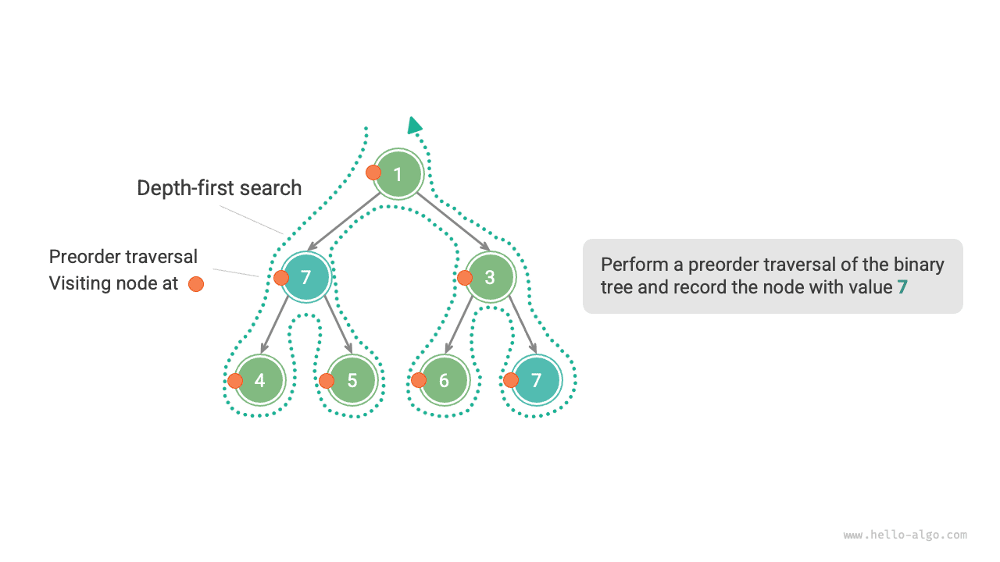
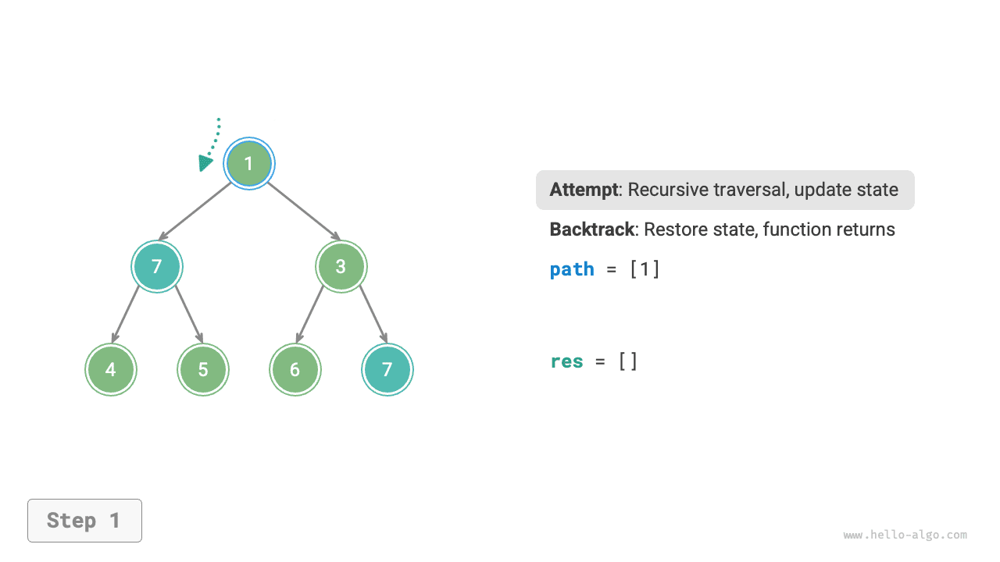
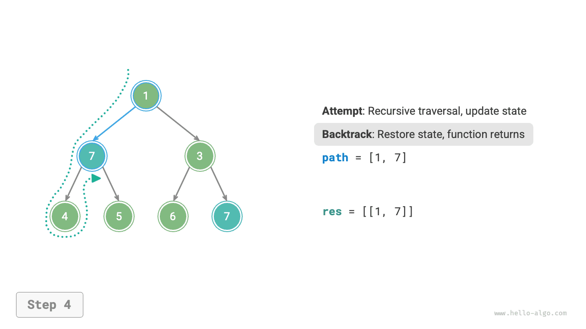
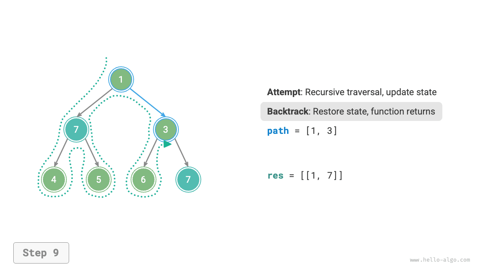

# Visszalépéses keresési algoritmus

<u>A visszalépéses keresési algoritmus</u> egy kimerítő keresésen alapuló problémamegoldó módszer. Alapgondolata az, hogy egy kezdeti állapotból kiindulva kimerítően keresi az összes lehetséges megoldást. Ha helyes megoldást talál, rögzíti azt. Ez a folyamat addig folytatódik, amíg megoldást nem talál, vagy az összes lehetséges választást ki nem próbálta megoldás nélkül.

A visszalépéses keresési algoritmus általában „mélységi keresést" alkalmaz a megoldástér bejárásához. A „Bináris fa" fejezetben megemlítettük, hogy az előrendű, a közbülső rendű és az utórendű bejárás mind a mélységi kereséshez tartozik. Ezután egy visszalépéses keresési feladatot fogunk felépíteni az előrendű bejárás segítségével, hogy fokozatosan megértsük a visszalépéses keresési algoritmus működését.

!!! question "1. példa"

    Adott egy bináris fa. Keressük meg és jegyezzük fel az összes $7$ értékű csomópontot, majd adjuk vissza ezeknek a csomópontoknak a listáját.

Ehhez a feladathoz előrendű bejárást végzünk a fán, és ellenőrizzük, hogy az aktuális csomópont értéke $7$-e. Ha igen, hozzáadjuk a csomópontot a `res` eredménylistához. A kapcsolódó megvalósítás az alábbi ábrán és kódban látható:

```src
[file]{preorder_traversal_i_compact}-[class]{}-[func]{pre_order}
```



## Próbálkozás és visszalépés

**Az algoritmust azért nevezzük visszalépéses keresési algoritmusnak, mert „próbálkozás" és „visszalépés" stratégiákat alkalmaz a megoldástér keresése során**. Amikor az algoritmus olyan állapotba kerül, amelyből nem tud tovább haladni, vagy nem talál a feltételeket kielégítő megoldást, visszavonja az előző választást, visszatér egy korábbi állapotba, és más lehetséges választásokat próbál ki.

Az 1. példában minden egyes csomópont meglátogatása egy „próbálkozást" jelent, míg egy levélcsomópontnál való megállás, vagy a szülő csomópontból való `return` egy „visszalépést" jelent.

Érdemes megjegyezni, hogy **a visszalépés nem korlátozódik csupán a függvény visszatérésére**. Ennek szemléltetéséhez bővítsük ki kissé az 1. példát.

!!! question "2. példa"

    Egy bináris fában keressen minden $7$ értékű csomópontot, **és adja vissza a gyökércsomóponttól ezen csomópontokig vezető utakat**.

Az 1. példa kódjára alapozva szükségünk van egy `path` listára a meglátogatott csomópontok útjának rögzítéséhez. Amikor elérünk egy $7$ értékű csomópontot, lemásoljuk a `path`-t és hozzáadjuk a `res` eredménylistához. A bejárás befejezése után a `res` tartalmazza az összes megoldást. A kód a következő:

```src
[file]{preorder_traversal_ii_compact}-[class]{}-[func]{pre_order}
```

Minden „próbálkozásnál" az aktuális csomópontot hozzáadjuk a `path`-hoz, hogy rögzítsük az utat; a „visszalépés" előtt el kell távolítani a csomópontot a `path`-ból, **hogy visszaállítsuk az állapotot a próbálkozás előttre**.

Az alábbi ábrán látható folyamatot megfigyelve **a próbálkozást és visszalépést „előrehaladásként" és „visszavonásként" érthetjük**, amelyek két egymással ellentétes művelet.

=== "<1>"
    

=== "<2>"
    

=== "<3>"
    

=== "<4>"
    

=== "<5>"
    

=== "<6>"
    

=== "<7>"
    

=== "<8>"
    

=== "<9>"
    

=== "<10>"
    

=== "<11>"
    

## Metszés

Az összetett visszalépéses keresési feladatok általában egy vagy több feltételt tartalmaznak. **A feltételek általában „metszésre" használhatók**.

!!! question "3. példa"

    Egy bináris fában keressen minden $7$ értékű csomópontot, és adja vissza a gyökércsomóponttól ezen csomópontokig vezető utakat, **de azzal a követelménnyel, hogy az utak ne tartalmazzanak $3$ értékű csomópontokat**.

A fenti feltételek teljesítéséhez **metszési műveleteket kell hozzáadnunk**: a keresési folyamat során, ha $3$ értékű csomóponttal találkozunk, korán visszatérünk, és nem folytatjuk a keresést. A kód a következő:

```src
[file]{preorder_traversal_iii_compact}-[class]{}-[func]{pre_order}
```

A „metszés" egy szemléletes kifejezés. Ahogy az alábbi ábrán látható, a keresési folyamat során **„lenyessük" azokat a keresési ágakat, amelyek nem felelnek meg a feltételeknek**, elkerülve ezzel sok értelmetlen próbálkozást, és így javítva a keresési hatékonyságot.


## Keretrendszer kód

Következőként megpróbáljuk kinyerni a visszalépéses keresés „próbálkozás, visszalépés és metszés" főbb keretrendszerét, hogy javítsuk a kód általánosíthatóságát.

Az alábbi keretrendszer kódban a `state` a feladat jelenlegi állapotát jelöli, a `choices` pedig az aktuális állapotban elérhető választásokat:

=== "Python"

    ```python title=""
    def backtrack(state: State, choices: list[choice], res: list[state]):
        """Visszalépéses keresési algoritmus keretrendszere"""
        # Ellenőrzés, hogy ez megoldás-e
        if is_solution(state):
            # A megoldás rögzítése
            record_solution(state, res)
            # Keresés leállítása
            return
        # Az összes választás bejárása
        for choice in choices:
            # Metszés: ellenőrzés, hogy a választás érvényes-e
            if is_valid(state, choice):
                # Próbálkozás: választás megtétele és állapot frissítése
                make_choice(state, choice)
                backtrack(state, choices, res)
                # Visszalépés: a választás visszavonása és visszaállítás az előző állapotra
                undo_choice(state, choice)
    ```

=== "C++"

    ```cpp title=""
    /* Visszalépéses keresési algoritmus keretrendszere */
    void backtrack(State *state, vector<Choice *> &choices, vector<State *> &res) {
        // Ellenőrzés, hogy ez megoldás-e
        if (isSolution(state)) {
            // A megoldás rögzítése
            recordSolution(state, res);
            // Keresés leállítása
            return;
        }
        // Az összes választás bejárása
        for (Choice choice : choices) {
            // Metszés: ellenőrzés, hogy a választás érvényes-e
            if (isValid(state, choice)) {
                // Próbálkozás: választás megtétele és állapot frissítése
                makeChoice(state, choice);
                backtrack(state, choices, res);
                // Visszalépés: a választás visszavonása és visszaállítás az előző állapotra
                undoChoice(state, choice);
            }
        }
    }
    ```

=== "Java"

    ```java title=""
    /* Visszalépéses keresési algoritmus keretrendszere */
    void backtrack(State state, List<Choice> choices, List<State> res) {
        // Ellenőrzés, hogy ez megoldás-e
        if (isSolution(state)) {
            // A megoldás rögzítése
            recordSolution(state, res);
            // Keresés leállítása
            return;
        }
        // Az összes választás bejárása
        for (Choice choice : choices) {
            // Metszés: ellenőrzés, hogy a választás érvényes-e
            if (isValid(state, choice)) {
                // Próbálkozás: választás megtétele és állapot frissítése
                makeChoice(state, choice);
                backtrack(state, choices, res);
                // Visszalépés: a választás visszavonása és visszaállítás az előző állapotra
                undoChoice(state, choice);
            }
        }
    }
    ```

=== "C#"

    ```csharp title=""
    /* Visszalépéses keresési algoritmus keretrendszere */
    void Backtrack(State state, List<Choice> choices, List<State> res) {
        // Ellenőrzés, hogy ez megoldás-e
        if (IsSolution(state)) {
            // A megoldás rögzítése
            RecordSolution(state, res);
            // Keresés leállítása
            return;
        }
        // Az összes választás bejárása
        foreach (Choice choice in choices) {
            // Metszés: ellenőrzés, hogy a választás érvényes-e
            if (IsValid(state, choice)) {
                // Próbálkozás: választás megtétele és állapot frissítése
                MakeChoice(state, choice);
                Backtrack(state, choices, res);
                // Visszalépés: a választás visszavonása és visszaállítás az előző állapotra
                UndoChoice(state, choice);
            }
        }
    }
    ```

=== "Go"

    ```go title=""
    /* Visszalépéses keresési algoritmus keretrendszere */
    func backtrack(state *State, choices []Choice, res *[]State) {
        // Ellenőrzés, hogy ez megoldás-e
        if isSolution(state) {
            // A megoldás rögzítése
            recordSolution(state, res)
            // Keresés leállítása
            return
        }
        // Az összes választás bejárása
        for _, choice := range choices {
            // Metszés: ellenőrzés, hogy a választás érvényes-e
            if isValid(state, choice) {
                // Próbálkozás: választás megtétele és állapot frissítése
                makeChoice(state, choice)
                backtrack(state, choices, res)
                // Visszalépés: a választás visszavonása és visszaállítás az előző állapotra
                undoChoice(state, choice)
            }
        }
    }
    ```

=== "Swift"

    ```swift title=""
    /* Visszalépéses keresési algoritmus keretrendszere */
    func backtrack(state: inout State, choices: [Choice], res: inout [State]) {
        // Ellenőrzés, hogy ez megoldás-e
        if isSolution(state: state) {
            // A megoldás rögzítése
            recordSolution(state: state, res: &res)
            // Keresés leállítása
            return
        }
        // Az összes választás bejárása
        for choice in choices {
            // Metszés: ellenőrzés, hogy a választás érvényes-e
            if isValid(state: state, choice: choice) {
                // Próbálkozás: választás megtétele és állapot frissítése
                makeChoice(state: &state, choice: choice)
                backtrack(state: &state, choices: choices, res: &res)
                // Visszalépés: a választás visszavonása és visszaállítás az előző állapotra
                undoChoice(state: &state, choice: choice)
            }
        }
    }
    ```

=== "JS"

    ```javascript title=""
    /* Visszalépéses keresési algoritmus keretrendszere */
    function backtrack(state, choices, res) {
        // Ellenőrzés, hogy ez megoldás-e
        if (isSolution(state)) {
            // A megoldás rögzítése
            recordSolution(state, res);
            // Keresés leállítása
            return;
        }
        // Az összes választás bejárása
        for (let choice of choices) {
            // Metszés: ellenőrzés, hogy a választás érvényes-e
            if (isValid(state, choice)) {
                // Próbálkozás: választás megtétele és állapot frissítése
                makeChoice(state, choice);
                backtrack(state, choices, res);
                // Visszalépés: a választás visszavonása és visszaállítás az előző állapotra
                undoChoice(state, choice);
            }
        }
    }
    ```

=== "TS"

    ```typescript title=""
    /* Visszalépéses keresési algoritmus keretrendszere */
    function backtrack(state: State, choices: Choice[], res: State[]): void {
        // Ellenőrzés, hogy ez megoldás-e
        if (isSolution(state)) {
            // A megoldás rögzítése
            recordSolution(state, res);
            // Keresés leállítása
            return;
        }
        // Az összes választás bejárása
        for (let choice of choices) {
            // Metszés: ellenőrzés, hogy a választás érvényes-e
            if (isValid(state, choice)) {
                // Próbálkozás: választás megtétele és állapot frissítése
                makeChoice(state, choice);
                backtrack(state, choices, res);
                // Visszalépés: a választás visszavonása és visszaállítás az előző állapotra
                undoChoice(state, choice);
            }
        }
    }
    ```

=== "Dart"

    ```dart title=""
    /* Visszalépéses keresési algoritmus keretrendszere */
    void backtrack(State state, List<Choice>, List<State> res) {
      // Ellenőrzés, hogy ez megoldás-e
      if (isSolution(state)) {
        // A megoldás rögzítése
        recordSolution(state, res);
        // Keresés leállítása
        return;
      }
      // Az összes választás bejárása
      for (Choice choice in choices) {
        // Metszés: ellenőrzés, hogy a választás érvényes-e
        if (isValid(state, choice)) {
          // Próbálkozás: választás megtétele és állapot frissítése
          makeChoice(state, choice);
          backtrack(state, choices, res);
          // Visszalépés: a választás visszavonása és visszaállítás az előző állapotra
          undoChoice(state, choice);
        }
      }
    }
    ```

=== "Rust"

    ```rust title=""
    /* Visszalépéses keresési algoritmus keretrendszere */
    fn backtrack(state: &mut State, choices: &Vec<Choice>, res: &mut Vec<State>) {
        // Ellenőrzés, hogy ez megoldás-e
        if is_solution(state) {
            // A megoldás rögzítése
            record_solution(state, res);
            // Keresés leállítása
            return;
        }
        // Az összes választás bejárása
        for choice in choices {
            // Metszés: ellenőrzés, hogy a választás érvényes-e
            if is_valid(state, choice) {
                // Próbálkozás: választás megtétele és állapot frissítése
                make_choice(state, choice);
                backtrack(state, choices, res);
                // Visszalépés: a választás visszavonása és visszaállítás az előző állapotra
                undo_choice(state, choice);
            }
        }
    }
    ```

=== "C"

    ```c title=""
    /* Visszalépéses keresési algoritmus keretrendszere */
    void backtrack(State *state, Choice *choices, int numChoices, State *res, int numRes) {
        // Ellenőrzés, hogy ez megoldás-e
        if (isSolution(state)) {
            // A megoldás rögzítése
            recordSolution(state, res, numRes);
            // Keresés leállítása
            return;
        }
        // Az összes választás bejárása
        for (int i = 0; i < numChoices; i++) {
            // Metszés: ellenőrzés, hogy a választás érvényes-e
            if (isValid(state, &choices[i])) {
                // Próbálkozás: választás megtétele és állapot frissítése
                makeChoice(state, &choices[i]);
                backtrack(state, choices, numChoices, res, numRes);
                // Visszalépés: a választás visszavonása és visszaállítás az előző állapotra
                undoChoice(state, &choices[i]);
            }
        }
    }
    ```

=== "Kotlin"

    ```kotlin title=""
    /* Visszalépéses keresési algoritmus keretrendszere */
    fun backtrack(state: State?, choices: List<Choice?>, res: List<State?>?) {
        // Ellenőrzés, hogy ez megoldás-e
        if (isSolution(state)) {
            // A megoldás rögzítése
            recordSolution(state, res)
            // Keresés leállítása
            return
        }
        // Az összes választás bejárása
        for (choice in choices) {
            // Metszés: ellenőrzés, hogy a választás érvényes-e
            if (isValid(state, choice)) {
                // Próbálkozás: választás megtétele és állapot frissítése
                makeChoice(state, choice)
                backtrack(state, choices, res)
                // Visszalépés: a választás visszavonása és visszaállítás az előző állapotra
                undoChoice(state, choice)
            }
        }
    }
    ```

=== "Ruby"

    ```ruby title=""
    ### Visszalépéses keresési algoritmus keretrendszere ###
    def backtrack(state, choices, res)
        # Ellenőrzés, hogy ez megoldás-e
        if is_solution?(state)
            # A megoldás rögzítése
            record_solution(state, res)
            return
        end

        # Az összes választás bejárása
        for choice in choices
            # Metszés: ellenőrzés, hogy a választás érvényes-e
            if is_valid?(state, choice)
                # Próbálkozás: választás megtétele és állapot frissítése
                make_choice(state, choice)
                backtrack(state, choices, res)
                # Visszalépés: a választás visszavonása és visszaállítás az előző állapotra
                undo_choice(state, choice)
            end
        end
    end
    ```

Ezután a keretrendszer kód alapján megoldjuk a 3. példát. Az állapot `state` a csomópontok bejárási útja, a választások `choices` az aktuális csomópont bal és jobb gyermek csomópontjai, az eredmény `res` pedig az utak listája:

```src
[file]{preorder_traversal_iii_template}-[class]{}-[func]{backtrack}
```

A feladat leírása szerint a $7$ értékű csomópont megtalálása után folytatni kell a keresést. **Ezért el kell távolítanunk a `return` utasítást a megoldás rögzítése után**. Az alábbi ábra összehasonlítja a `return` utasítással és anélküli keresési folyamatot.


Az előrendű bejáráson alapuló kódhoz képest a visszalépéses keresési algoritmus keretrendszerén alapuló kód részletesebb, de jobb általánosíthatósággal rendelkezik. Valójában **sok visszalépéses keresési feladat megoldható ezen keretrendszeren belül**. Csak az adott feladathoz kell meghatároznunk az `state`-t és a `choices`-t, és meg kell valósítanunk a keretrendszer egyes metódusait.

## Általános terminológia

Az algoritmikus feladatok világosabb elemzéséhez összefoglaljuk a visszalépéses keresési algoritmusokban használt általános terminológia jelentéseit, és a 3. példából megfelelő példákat adunk, ahogy az alábbi táblázatban látható.

<p align="center"> Táblázat <id> &nbsp; A visszalépéses keresési algoritmus általános terminológiája </p>

| Kifejezés                     | Definíció                                                                                                                    | 3. példa                                                                           |
| ----------------------------- | ---------------------------------------------------------------------------------------------------------------------------- | ---------------------------------------------------------------------------------- |
| Megoldás (solution)           | A megoldás egy olyan válasz, amely kielégíti a feladat meghatározott feltételeit; lehet egy vagy több megoldás               | Minden gyökértől a $7$ értékű csomópontokig vezető út, amely kielégíti a feltételt |
| Feltétel (constraint)         | A feltétel a feladatban szereplő olyan kikötés, amely korlátozza a megoldások megvalósíthatóságát, általában metszésre használják | Az utak nem tartalmaznak $3$ értékű csomópontokat                              |
| Állapot (state)               | Az állapot a feladat egy adott pillanatbeli helyzetét jelöli, beleértve az eddig meghozott választásokat                     | A jelenleg meglátogatott csomópontok útja, azaz a `path` csomópontlista            |
| Próbálkozás (attempt)         | A próbálkozás a megoldástér felfedezésének folyamata az elérhető választások alapján, beleértve a választások megtételét, az állapot frissítését és annak ellenőrzését, hogy ez megoldás-e | Rekurzívan meglátogatjuk a bal (jobb) gyermek csomópontokat, hozzáadjuk a csomópontokat a `path`-hoz, ellenőrizzük, hogy a csomópont értéke $7$-e |
| Visszalépés (backtracking)    | A visszalépés az előző választások visszavonására és egy korábbi állapotba való visszatérésre vonatkozik, amikor olyan állapottal találkozunk, amely nem elégíti ki a feltételeket | Leállítjuk a keresést, amikor áthaladunk a levélcsomópontokon, befejezzük a csomópontok meglátogatását, vagy $3$ értékű csomópontokkal találkozunk; a függvény visszatér |
| Metszés (pruning)             | A metszés egy módszer az értelmetlen keresési utak elkerülésére a feladat jellemzői és feltételei alapján, amely javíthatja a keresési hatékonyságot | Amikor $3$ értékű csomóponttal találkozunk, nem folytatjuk a keresést             |

!!! tip

    A feladat, megoldás, állapot stb. fogalmai univerzálisak, és a divide-and-conquer (oszd meg és uralkodj), visszalépéses keresés, dinamikus programozás, mohó és más algoritmusokban egyaránt megjelennek.

## Előnyök és korlátok

A visszalépéses keresési algoritmus lényegében egy mélységi keresési algoritmus, amely az összes lehetséges megoldást kipróbálja, amíg meg nem talál egyet, amely kielégíti a feltételeket. Ennek a megközelítésnek az az előnye, hogy megtalálja az összes lehetséges megoldást, és megfelelő metszési műveletekkel magas hatékonyságot ér el.

Azonban nagy méretű vagy összetett feladatok esetén **a visszalépéses keresési algoritmus futási hatékonysága elfogadhatatlan lehet**.

- **Idő**: A visszalépéses keresési algoritmusnak általában be kell járnia a megoldástér összes lehetőségét, és az időbonyolultság exponenciális vagy faktoriális rendet érhet el.
- **Tér**: A rekurzív hívások során el kell menteni az aktuális állapotot (például az utakat, a metszéshez használt segédváltozókat stb.), és ha a mélység nagy, a tárhely-igény nagyon megnőhet.

Mindazonáltal **a visszalépéses keresési algoritmus még mindig a legjobb megoldás bizonyos keresési feladatokra és feltétel-kielégítési feladatokra**. Ezeknél a feladatoknál, mivel nem tudjuk előre megjósolni, hogy melyik választások generálnak érvényes megoldásokat, be kell járnunk az összes lehetséges választást. Ebben az esetben **a kulcs az, hogyan optimalizáljuk a hatékonyságot**. Két általánosan alkalmazott hatékonyság-optimalizálási módszer van.

- **Metszés**: Kerüljük el azoknak az utaknak a keresését, amelyekről garantált, hogy nem termelnek megoldásokat, ezáltal időt és tárhelyet takarítva meg.
- **Heurisztikus keresés**: Vezessünk be bizonyos stratégiákat vagy becslési értékeket a keresési folyamat során, hogy elsőbbséget adjunk azoknak az utaknak, amelyek a legvalószínűbben érvényes megoldásokat termelnek.

## Jellemző visszalépéses keresési példák

A visszalépéses keresési algoritmus számos keresési feladat, feltétel-kielégítési feladat és kombinatorikus optimalizálási feladat megoldásához használható.

**Keresési feladatok**: Ezeknek a feladatoknak a célja, hogy meghatározott feltételeknek megfelelő megoldásokat találjunk.

- Permutációs feladat: Adott egy halmaz, keressd meg az összes lehetséges permutációt és kombinációt.
- Részösszeg feladat: Adott egy halmaz és egy célösszeg, keressd meg a halmaz összes olyan részhalmazát, amelynek elemei összege egyenlő a céllal.
- Hanoi-tornyok: Adott három cölöp és különböző méretű korongok sorozata, mozgasd az összes korongot az egyik cölöpről a másikra, egyszerre csak egy korongot mozgatva, és soha ne helyezz nagyobb korongot kisebbre.

**Feltétel-kielégítési feladatok**: Ezeknek a feladatoknak a célja, hogy az összes feltételt kielégítő megoldásokat találjunk.

- N-királynő: Helyezz $n$ királynőt egy $n \times n$-es sakktáblára úgy, hogy ne támadhassák meg egymást.
- Sudoku: Töltsd ki az $1$-től $9$-ig terjedő számokkal a $9 \times 9$-es rácsot úgy, hogy minden sor, oszlop és $3 \times 3$-as alrács ne tartalmazzon ismétlődő számjegyeket.
- Gráfszínezés: Adott egy irányítatlan gráf, színezd ki az összes csúcsot a minimális számú színnel úgy, hogy a szomszédos csúcsoknak különböző színük legyen.

**Kombinatorikus optimalizálási feladatok**: Ezeknek a feladatoknak a célja, hogy egy kombinatorikus térben bizonyos feltételeket kielégítő optimális megoldást találjunk.

- 0-1 Hátizsák: Adott tárgyak halmaza és egy hátizsák, minden tárgynak van értéke és súlya. A hátizsák kapacitásának korlátja alatt válassz tárgyakat az összérték maximalizálásához.
- Utazó ügynök probléma: Egy gráf egy pontjából kiindulva látogasd meg az összes többi pontot pontosan egyszer, és térj vissza a kiindulási pontba, megkeresve a legrövidebb utat.
- Maximális klikk: Adott egy irányítatlan gráf, keressd meg a legnagyobb teljes részgráfot, azaz azt a részgráfot, amelyben bármely két csúcs össze van kötve egy éllel.

Megjegyzendő, hogy sok kombinatorikus optimalizálási feladatnál a visszalépéses keresés nem az optimális megoldás.

- A 0-1 hátizsák feladatot általában dinamikus programozással oldják meg a nagyobb időhatékonyság érdekében.
- Az utazó ügynök probléma egy ismert NP-nehéz feladat; általánosan alkalmazott megoldások közé tartoznak a genetikus algoritmusok és a hangyakolónia algoritmusok.
- A maximális klikk feladat egy klasszikus gráfelméleti feladat, amely mohó algoritmusokhoz hasonló heurisztikus algoritmusokkal oldható meg.
