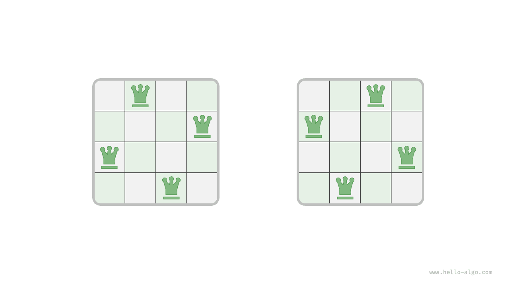
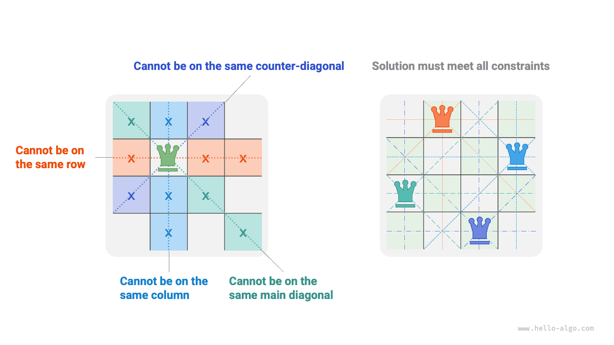
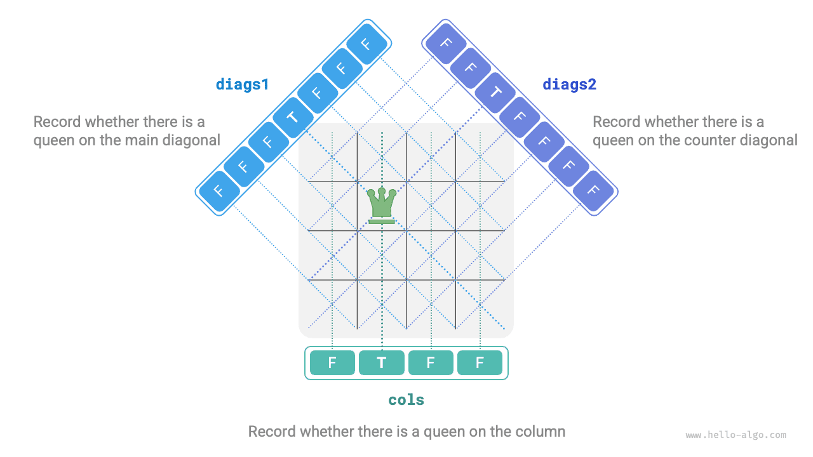

# N-királynő feladat

!!! question

    A sakk szabályai szerint a királynő megtámadhatja azokat a bábukat, amelyek ugyanabban a sorban, oszlopban vagy átlós irányban találhatók. Adott $n$ királynő és egy $n \times n$-es sakktábla, keressd meg azt az elhelyezési sémát, amelynél egy sem tudja megtámadni a másikat.

Ahogy az alábbi ábrán látható, amikor $n = 4$, két megoldás található. A visszalépéses keresési algoritmus szemszögéből, egy $n \times n$-es sakktáblának $n^2$ mezője van, amelyek az összes lehetséges választást `choices` biztosítják. A királynők egyenkénti elhelyezésének folyamata során a sakktábla állapota folyamatosan változik, és az egyes pillanatokban a sakktábla az állapotot `state` jelöli.



Az alábbi ábra mutatja a feladat három feltételét: **több királynő nem lehet ugyanabban a sorban, ugyanabban az oszlopban vagy ugyanazon az átlón**. Érdemes megjegyezni, hogy az átlók két típusra oszthatók: a főátlóra `\` és a mellékátlóra `/`.



### Soronkénti elhelyezési stratégia

Mivel mind a királynők száma, mind a sakktábla sorainak száma $n$, könnyen levonhatjuk a következtetést: **a sakktábla minden sora pontosan egy királynő elhelyezését engedi meg és követeli meg**.

Ez azt jelenti, hogy soronkénti elhelyezési stratégiát fogadhatunk el: az első sortól kezdve helyezzünk el egy királynőt minden sorban, amíg az utolsó sor be nem fejeződik.

Az alábbi ábra mutatja a 4-királynő feladat soronkénti elhelyezési folyamatát. A hely korlátai miatt az ábra csak az első sor egy keresési ágát bontja ki, és az összes olyan séma metszésre kerül, amely nem teljesíti az oszlop- és átlóbeliség-feltételeket.


Lényegében **a soronkénti elhelyezési stratégia metszési funkciót tölt be**, mivel elkerüli az összes olyan keresési ágat, ahol több királynő ugyanabban a sorban jelenik meg.

### Oszlop és átló metszése

Az oszlopfeltétel teljesítéséhez használhatunk egy $n$ hosszúságú `cols` logikai tömböt, amely rögzíti, hogy minden oszlopban van-e királynő. Minden elhelyezési döntés előtt a `cols` segítségével metszük azokat az oszlopokat, amelyekben már van királynő, és dinamikusan frissítjük a `cols` állapotát a visszalépés során.

!!! tip

    Kérjük, vegyük figyelembe, hogy a mátrix origója a bal felső sarokban van, ahol a sor index felülről lefelé nő, az oszlop index pedig balról jobbra nő.

Hogyan kezeljük az átlós feltételeket? Vegyünk egy $(row, col)$ sor- és oszlopindexű mezőt a sakktáblán. Ha kiválasztunk egy adott főátlót a mátrixban, azt tapasztaljuk, hogy az ezen az átlón lévő összes mezőnek azonos a különbsége a sor- és oszlopindexük között, **azaz a $row - col$ értéke állandó a főátló összes mezőjére**.

Más szóval, ha két mező teljesíti a $row_1 - col_1 = row_2 - col_2$ feltételt, akkor biztosan ugyanazon a főátlón vannak. Ezt a mintát felhasználva az alábbi ábrán látható `diags1` tömbbel rögzíthetjük, hogy van-e királynő minden főátlón.

Hasonlóképpen, **egy mellékátlón lévő összes mező esetén a $row + col$ összeg állandó értékű**. Ugyanúgy használhatjuk a `diags2` tömböt a mellékátlós feltételek kezelésére.



### Kód megvalósítás

Vegyük figyelembe, hogy egy $n$-dimenziós négyzetes mátrixban a $row - col$ értéktartománya $[-n + 1, n - 1]$, a $row + col$ értéktartománya $[0, 2n - 2]$. Ezért a főátlók és mellékátlók száma egyaránt $2n - 1$, ami azt jelenti, hogy mind a `diags1`, mind a `diags2` tömb hossza $2n - 1$.

```src
[file]{n_queens}-[class]{}-[func]{n_queens}
```

$n$ királynő soronkénti elhelyezése az oszlopfeltétel figyelembevételével, az első sortól az utolsóig $n$, $n-1$, $\dots$, $2$, $1$ lehetséges választást kínál, ami $O(n!)$ időt vesz igénybe. Egy megoldás rögzítésekor szükséges az `state` mátrix másolása és hozzáadása a `res`-hez, a másolási művelet $O(n^2)$ időt vesz igénybe. Ezért **az összesített időbonyolultság $O(n! \cdot n^2)$**. A gyakorlatban az átlóbeliség-feltételeken alapuló metszés is jelentősen csökkentheti a keresési teret, így a keresési hatékonyság gyakran jobb a fent említett időbonyolultságnál.

Az `state` tömb $O(n^2)$ tárhelyet használ, a `cols`, `diags1` és `diags2` tömbök mindegyike $O(n)$ tárhelyet használ. A maximális rekurziós mélység $n$, ami $O(n)$ veremkeret tárhelyet vesz igénybe. Ezért **a térbonyolultság $O(n^2)$**.
