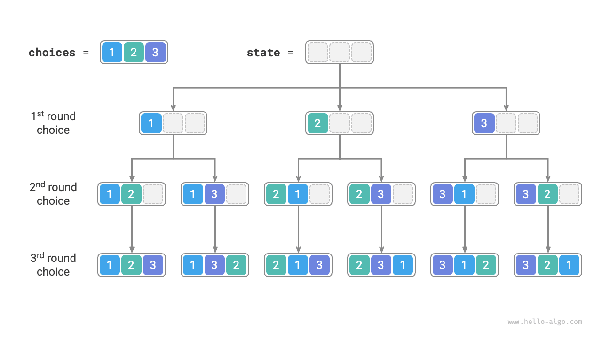
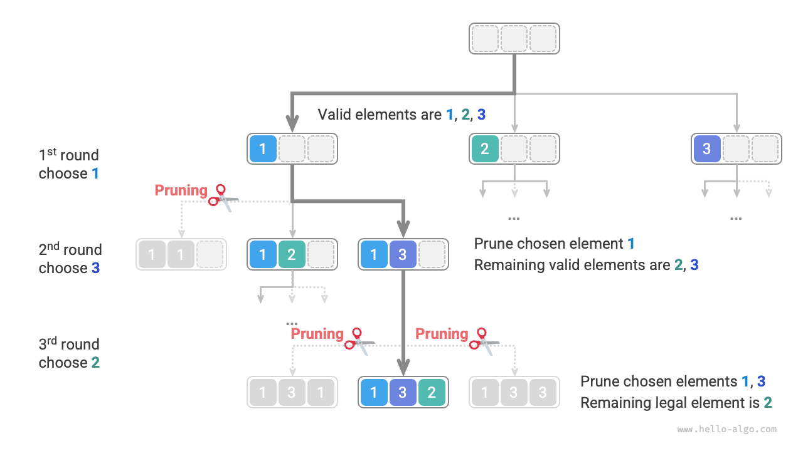
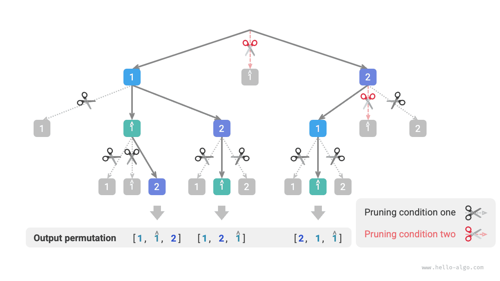

# Permutációs feladat

A permutációs feladat a visszalépéses keresési algoritmusok klasszikus alkalmazása. Úgy van meghatározva, mint egy adott gyűjtemény (például tömb vagy karakterlánc) elemeinek összes lehetséges elrendezésének megkeresése.

Az alábbi táblázat néhány példa adathalmazt mutat, beleértve a bemeneti tömböket és a megfelelő permutációkat.

<p align="center"> Táblázat <id> &nbsp; Permutációs példák </p>

| Bemeneti tömb | Összes permutáció                                                  |
| :------------ | :----------------------------------------------------------------- |
| $[1]$         | $[1]$                                                              |
| $[1, 2]$      | $[1, 2], [2, 1]$                                                   |
| $[1, 2, 3]$   | $[1, 2, 3], [1, 3, 2], [2, 1, 3], [2, 3, 1], [3, 1, 2], [3, 2, 1]$ |

## Eset különálló elemekkel

!!! question

    Adott egy egész számokból álló tömb, amely nem tartalmaz ismétlődő elemeket. Adja vissza az összes lehetséges permutációt.

A visszalépéses keresési algoritmus szemszögéből **a permutációk generálásának folyamatát egy sor választás eredményeként képzelhetjük el**. Tegyük fel, hogy a bemeneti tömb $[1, 2, 3]$. Ha először $1$-et választunk, majd $3$-at, és végül $2$-t, megkapjuk a $[1, 3, 2]$ permutációt. A visszalépés a választás visszavonását, majd más választások kipróbálását jelenti.

A visszalépéses keresési kód szemszögéből a jelöltek halmaza `choices` a bemeneti tömb összes eleméből áll, az állapot `state` pedig az eddig kiválasztott elemek. Megjegyzendő, hogy minden elem csak egyszer választható ki, **ezért a `state`-ben lévő összes elemnek egyedinek kell lennie**.

Ahogy az alábbi ábrán látható, a keresési folyamatot kibonthatjuk egy rekurziós fává, ahol a fa minden csomópontja az aktuális állapotot `state` jelöli. A gyökércsomóponttól kiindulva három forduló választás után elérjük a levélcsomópontokat, és minden levélcsomópont egy permutációnak felel meg.



### Ismétlődő választások metszése

Annak biztosítására, hogy minden elemet csak egyszer válasszunk ki, fontoljuk meg egy `selected` logikai tömb bevezetését, ahol a `selected[i]` jelzi, hogy a `choices[i]` ki lett-e választva. Erre alapozva a következő metszési műveletet valósítjuk meg.

- Miután megtettük a `choice[i]` választást, a `selected[i]`-t $\text{True}$ értékre állítjuk, jelezve, hogy ki lett választva.
- A `choices` jelöltek listájának bejárásakor kihagyjuk az összes már kiválasztott csomópontot, ami a metszés.

Ahogy az alábbi ábrán látható, tegyük fel, hogy az első fordulóban $1$-et, a második fordulóban $3$-at, a harmadik fordulóban $2$-t választunk. Ekkor a második fordulóban meg kell metszeni az $1$ elem ágát, és a harmadik fordulóban meg kell metszeni az $1$ és $3$ elemek ágait.



A fenti ábrát megfigyelve megállapítjuk, hogy ez a metszési művelet csökkenti a keresési tér méretét $O(n^n)$-ről $O(n!)$-re.

### Kód megvalósítás

A fenti információk megértése után kitölthetjük a sablon kód hiányos részeit. Az összesített kód rövidítése érdekében nem valósítjuk meg külön a sablon egyes függvényeit, hanem kibontjuk őket a `backtrack()` függvényen belül:

```src
[file]{permutations_i}-[class]{}-[func]{permutations_i}
```

## Eset ismétlődő elemekkel

!!! question

    Adott egy egész számokból álló tömb, amely **tartalmazhat ismétlődő elemeket**. Adja vissza az összes egyedi permutációt.

Tegyük fel, hogy a bemeneti tömb $[1, 1, 2]$. Az ismétlődő $1$ elemek megkülönböztetéséhez a második $1$-et $\hat{1}$-nek jelöljük.

Ahogy az alábbi ábrán látható, a fent leírt módszer olyan permutációkat generál, amelyek fele ismétlődés.


Tehát hogyan távolítsuk el az ismétlődő permutációkat? A legközvetlenebb megközelítés egy hash-halmaz használata a permutációs eredmények közvetlen deduplikálásához. Azonban ez nem elegáns, mert **azok a keresési ágak, amelyek ismétlődő permutációkat generálnak, szükségtelenek, és korán azonosítani és megmetszeni kell őket**, ami tovább javíthatja az algoritmus hatékonyságát.

### Ismétlődő elemek metszése

Figyeljük meg az alábbi ábrát. Az első fordulóban $1$ vagy $\hat{1}$ kiválasztása egyenértékű. A két választás alatt generált összes permutáció ismétlődő. Ezért meg kell metszeni a $\hat{1}$-et.

Hasonlóképpen, miután az első fordulóban $2$-t választottunk, a második forduló $1$-e és $\hat{1}$-je szintén ismétlődő ágakat produkál, ezért a második forduló $\hat{1}$-jét is meg kell metszeni.

Lényegében **célunk annak biztosítása, hogy több egyenlő elemet csak egyszer válasszanak ki egy bizonyos választási fordulóban**.


### Kód megvalósítás

Az előző feladat kódjára építve fontolóra vesszük egy `duplicated` hash-halmaz megnyitását minden választási fordulóban, hogy nyomon kövessük, melyik elemeket próbálták ki ebben a fordulóban, és metszük az ismétlődő elemeket:

```src
[file]{permutations_ii}-[class]{}-[func]{permutations_ii}
```

Feltéve, hogy az elemek páronként különbözők, $n$ elem esetén $n!$ (faktoriális) permutáció létezik. Az eredmények rögzítésekor egy $n$ hosszúságú lista másolatát kell készíteni, ami $O(n)$ időt vesz igénybe. **Ezért az időbonyolultság $O(n! \cdot n)$**.

A maximális rekurziós mélység $n$, ami $O(n)$ veremkeret tárhelyet használ. A `selected` $O(n)$ tárhelyet használ. Legfeljebb $n$ `duplicated` halmaz létezik egyidejűleg, ami $O(n^2)$ tárhelyet vesz igénybe. **Ezért a térbonyolultság $O(n^2)$**.

### A két metszési módszer összehasonlítása

Megjegyzendő, hogy bár mind a `selected`, mind a `duplicated` metszésre használatos, különböző céljaik vannak.

- **Ismétlődő választások metszése**: Az egész keresési folyamat során csak egy `selected` létezik. Nyomon követi, hogy mely elemek szerepelnek az aktuális állapotban, és célja, hogy megakadályozza egy elem ismételt megjelenését az `state`-ben.
- **Ismétlődő elemek metszése**: Minden választási forduló (minden `backtrack` függvényhívás) tartalmaz egy `duplicated` halmazt. Nyomon követi, hogy melyik elemeket választották ki ebben a forduló iterációjában (a `for` ciklusban), és célja, hogy az egyenlő elemeket csak egyszer válasszák ki.

Az alábbi ábra mutatja a két metszési feltétel hatókörét. Megjegyezzük, hogy a fa minden csomópontja egy választást jelöl, és a gyökértől egy levélcsomópontig vezető úton lévő csomópontok egy permutációt alkotnak.


