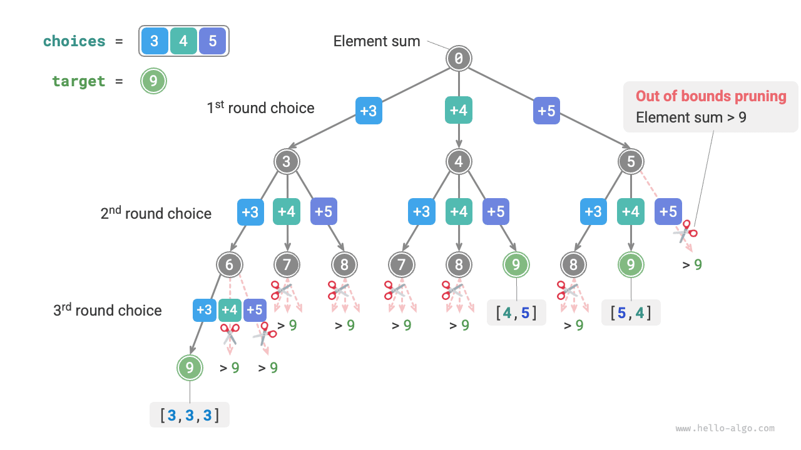

# Részösszeg feladat

## Ismétlődő elemek nélkül

!!! question

    Adott egy pozitív egész számokból álló `nums` tömb és egy `target` célértékként megadott pozitív egész szám. Keressd meg az összes lehetséges kombinációt, amelyben a kombináció elemeinek összege egyenlő `target`-tel. Az adott tömbben nincsenek ismétlődő elemek, és minden elem többször is kiválasztható. Ezeket a kombinációkat listában adja vissza, ahol a lista nem tartalmazhat ismétlődő kombinációkat.

Például adott a $\{3, 4, 5\}$ halmaz és a $9$ célszám, a megoldások $\{3, 3, 3\}, \{4, 5\}$. Megjegyzendő a következő két pont:

- A bemeneti halmaz elemei korlátlanul kiválaszthatók ismételten.
- A részhalmazok nem tesznek különbséget az elem sorrendje között; például a $\{4, 5\}$ és a $\{5, 4\}$ ugyanaz a részhalmaz.

### Hivatkozás a teljes permutáció megoldásra

A teljes permutáció feladathoz hasonlóan elképzelhetjük a részhalmazok generálásának folyamatát egy sor választásként, és a kiválasztási folyamat során valós időben frissíthetjük az „elemek összegét". Amikor az összeg egyenlő `target`-tel, rögzítjük a részhalmazt az eredménylistába.

A teljes permutáció feladattól eltérően **ebben a feladatban a halmaz elemei korlátlanul kiválaszthatók**, ezért nem kell `selected` logikai listát használni annak nyomon követéséhez, hogy egy elem ki lett-e választva. Kisebb módosításokat végezhetünk a teljes permutáció kódon, és kezdetben megkapjuk a megoldást:

```src
[file]{subset_sum_i_naive}-[class]{}-[func]{subset_sum_i_naive}
```

Amikor a $[3, 4, 5]$ tömböt és a $9$ célelemet adjuk a fenti kódnak, a kimenet $[3, 3, 3], [4, 5], [5, 4]$. **Bár sikeresen megtaláljuk az összes $9$-re összeadódó részhalmazt, vannak ismétlődő részhalmazok $[4, 5]$ és $[5, 4]$**.

Ennek az az oka, hogy a keresési folyamat különbséget tesz a kiválasztások sorrendje között, de a részhalmazok nem tesznek különbséget a kiválasztási sorrendben. Ahogy az alábbi ábrán látható, a $4$ előbb és a $5$ utóbb kiválasztása, illetve a $5$ előbb és a $4$ utóbb kiválasztása különböző ágak, de ugyanannak a részhalmaznak felelnek meg.



Az ismétlődő részhalmazok kiküszöböléséhez **egy egyenes megközelítés az eredménylista deduplikálása**. Ez a megközelítés azonban két okból nagyon nem hatékony:

- Ha sok tömbelem van, különösen ha `target` nagy, a keresési folyamat sok ismétlődő részhalmazt generál.
- A részhalmazok (tömbök) összehasonlítása nagyon időigényes, ami először a tömbök rendezését, majd az egyes elemek összehasonlítását igényli.

### Ismétlődő részhalmazok metszése

**A keresési folyamat során metszéssel végzünk deduplikálást**. Az alábbi ábrát megfigyelve ismétlődő részhalmazok akkor fordulnak elő, amikor a tömb elemeit különböző sorrendben választják ki, ahogy az alábbi esetekben:

1. Amikor az első és a második forduló rendre $3$-at és $4$-et választ, generálódnak az ezeket a két elemet tartalmazó összes részhalmaz, jelölve $[3, 4, \dots]$-ként.
2. Ezt követően, amikor az első forduló $4$-et választ, **a második fordulónak át kell ugornia $3$-at**, mert a $[4, 3, \dots]$ részhalmaz, amelyet ez a választás generál, teljesen ismétlődő az `1.` lépésben generált részhalmazhoz képest.

A keresési folyamatban minden szint választásai balról jobbra próbáltatnak, így a jobb oldali ágak többet metszenek.

1. Az első két forduló rendre $3$-at és $5$-öt választ, generálva a $[3, 5, \dots]$ részhalmazt.
2. Az első két forduló rendre $4$-et és $5$-öt választ, generálva a $[4, 5, \dots]$ részhalmazt.
3. Ha az első forduló $5$-öt választ, **a második fordulónak át kell ugornia $3$-at és $4$-et**, mert a $[5, 3, \dots]$ és $[5, 4, \dots]$ részhalmazok teljesen ismétlődők az `1.` és `2.` lépésekben leírt részhalmazokhoz képest.


Összefoglalva, adott egy $[x_1, x_2, \dots, x_n]$ bemeneti tömb, legyen a keresési folyamat kiválasztási sorozata $[x_{i_1}, x_{i_2}, \dots, x_{i_m}]$. Ennek a kiválasztási sorozatnak teljesítenie kell az $i_1 \leq i_2 \leq \dots \leq i_m$ feltételt; **minden kiválasztási sorozat, amely nem teljesíti ezt a feltételt, ismétlődést okoz, és meg kell metszeni**.

### Kód megvalósítás

Ennek a metszésnek a megvalósításához inicializálunk egy `start` változót a bejárás kiindulópontjának jelzésére. **Az $x_{i}$ választás megtétele után állítsuk be a következő fordulót, hogy $i$ indextől kezdje a bejárást**. Ez biztosítja, hogy a kiválasztási sorozat teljesíti az $i_1 \leq i_2 \leq \dots \leq i_m$ feltételt, garantálva a részhalmaz egyediségét.

Ezen kívül a kódon a következő két optimalizálást hajtottuk végre:

- A keresés megkezdése előtt először rendezzük a `nums` tömböt. Az összes választás bejárásakor **azonnal fejezzük be a ciklust, ha a részhalmaz összege meghaladja a `target`-et**, mert a következő elemek nagyobbak, és a részhalmaz összegük bizonyosan meghaladja a `target`-et.
- Hagyjuk el a `total` elemösszeg változót, és **vonjunk le a `target`-ből az elemek összegének nyomon követéséhez**. Rögzítsük a megoldást, amikor a `target` egyenlő $0$-val.

```src
[file]{subset_sum_i}-[class]{}-[func]{subset_sum_i}
```

Az alábbi ábra a teljes visszalépéses keresési folyamatot mutatja be, amikor a $[3, 4, 5]$ tömböt és a $9$ célelemet adjuk a fenti kódnak.


## Ismétlődő elemekkel rendelkező tömbhöz

!!! question

    Adott egy pozitív egész számokból álló `nums` tömb és egy `target` célértékként megadott pozitív egész szám. Keressd meg az összes lehetséges kombinációt, amelyben a kombináció elemeinek összege egyenlő `target`-tel. **Az adott tömb tartalmazhat ismétlődő elemeket, és minden elem legfeljebb egyszer választható ki**. Ezeket a kombinációkat listában adja vissza, ahol a lista nem tartalmazhat ismétlődő kombinációkat.

Az előző feladathoz képest **ebben a feladatban a bemeneti tömb tartalmazhat ismétlődő elemeket**, ami új kihívásokat vezet be. Például adott a $[4, \hat{4}, 5]$ tömb és a $9$ célelem, a meglévő kód kimenete $[4, 5], [\hat{4}, 5]$, amely ismétlődő részhalmazokat tartalmaz.

**Az ismétlődés oka az, hogy egyenlő elemeket többször választanak ki egy bizonyos fordulóban**. Az alábbi ábrán az első fordulóban három választás van, amelyek közül kettő $4$, létrehozva két ismétlődő keresési ágat, amelyek ismétlődő részhalmazokat adnak ki. Hasonlóképpen a második forduló két $4$-e is ismétlődő részhalmazokat produkál.


### Egyenlő elemek metszése

Ennek a feladatnak a megoldásához **korlátozni kell az egyenlő elemek kiválasztását minden fordulóban egyszerekre**. A megvalósítás elég elegáns: mivel a tömb már rendezett, az egyenlő elemek egymás mellett vannak. Ez azt jelenti, hogy egy bizonyos kiválasztási fordulóban, ha az aktuális elem egyenlő a tőle balra lévő elemmel, az azt jelenti, hogy ez az elem már ki lett választva, ezért közvetlenül átugorjuk az aktuális elemet.

Ugyanakkor **ez a feladat azt határozza meg, hogy minden tömbelemet csak egyszer lehet kiválasztani**. Szerencsére a `start` változót is használhatjuk ennek a feltételnek a teljesítéséhez: az $x_{i}$ választás megtétele után állítsuk be a következő fordulót, hogy $i + 1$ indextől kezdje a bejárást. Ez egyszerre küszöböli ki az ismétlődő részhalmazokat és kerüli az elemek többszöri kiválasztását.

### Kód megvalósítás

```src
[file]{subset_sum_ii}-[class]{}-[func]{subset_sum_ii}
```

Az alábbi ábra a $[4, 4, 5]$ tömb és a $9$ célelem visszalépéses keresési folyamatát mutatja, amely négyféle metszési műveletet tartalmaz. Kombinálja az illusztrációt a kód megjegyzéseivel a teljes keresési folyamat és az egyes metszési műveletek működésének megértéséhez.


