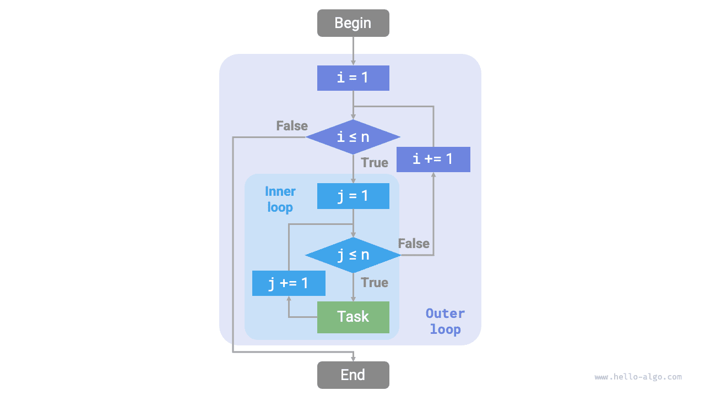

# Iteráció és rekurzió

Az algoritmusokban egy feladat ismételt végrehajtása nagyon gyakori, és szorosan kapcsolódik a bonyolultságelemzéshez. Ezért mielőtt bevezetjük az időbonyolultságot és a térbonyolultságot, először értsük meg, hogyan valósítható meg az ismételt feladat-végrehajtás a programokban, vagyis a két alapvető programvezérlési struktúrát: az iterációt és a rekurziót.

## Iteráció

Az <u>iteráció</u> egy vezérlési struktúra, amely egy feladatot ismételten hajt végre. Az iteráció során a program bizonyos feltételek teljesülése esetén ismételten végrehajt egy kódrészletet, egészen addig, amíg ezek a feltételek már nem teljesülnek.

### For ciklus

A `for` ciklus az iteráció egyik leggyakoribb formája, **amely akkor alkalmas, ha az iterációk száma előre ismert**.

Az alábbi függvény egy `for` ciklus alapján valósítja meg az $1 + 2 + \dots + n$ összeadást, az összeget a `res` változóban tárolja. Megjegyzendő, hogy Pythonban a `range(a, b)` egy "balról zárt, jobbról nyílt" intervallumnak felel meg, a bejárási tartomány $a, a + 1, \dots, b-1$:

```src
[file]{iteration}-[class]{}-[func]{for_loop}
```

Az alábbi ábra ennek az összeadó függvénynek a folyamatábráját mutatja.


Az összeadó függvényben a műveletek száma arányos az $n$ bemeneti adatmérettel, vagyis "lineáris kapcsolatban" áll vele. Valójában **az időbonyolultság pontosan ezt a "lineáris kapcsolatot" írja le**. A kapcsolódó tartalmakat a következő szakaszban részletesen bemutatjuk.

### While ciklus

A `for` ciklushoz hasonlóan a `while` ciklus is az iteráció megvalósításának egyik módja. Egy `while` ciklusban a program minden fordulóban először ellenőrzi a feltételt; ha a feltétel igaz, folytatja a végrehajtást, egyébként befejezi a ciklust.

Az alábbiakban egy `while` ciklussal valósítjuk meg az $1 + 2 + \dots + n$ összeadást:

```src
[file]{iteration}-[class]{}-[func]{while_loop}
```

**A `while` ciklus rugalmasabb, mint a `for` ciklus**. Egy `while` ciklusban szabadon tervezhetjük a feltételváltozó inicializálási és frissítési lépéseit.

Például az alábbi kódban a $i$ feltételváltozó fordulónként kétszer frissül, amit `for` ciklussal nem kényelmes megvalósítani:

```src
[file]{iteration}-[class]{}-[func]{while_loop_ii}
```

Összességében **a `for` ciklusok tömörebb kódot, míg a `while` ciklusok nagyobb rugalmasságot biztosítanak**; mindkettő megvalósíthat iteratív struktúrákat. A választás az adott feladat követelményeitől függ.

### Egymásba ágyazott ciklusok

Egy ciklusstruktúrát egy másikba ágyazhatunk. Az alábbiakban egy példa `for` ciklusok használatával:

```src
[file]{iteration}-[class]{}-[func]{nested_for_loop}
```

Az alábbi ábra ennek az egymásba ágyazott ciklusnak a folyamatábráját mutatja.



Ebben az esetben a függvény műveleteinek száma $n^2$-tel arányos, vagyis az algoritmus futási ideje "négyzetes kapcsolatban" áll az $n$ bemeneti adatmérettel.

Tovább bővíthetjük az egymásba ágyazott ciklusokat, ahol minden egyes beágyazás egy "dimenzióbővítést" jelent, az időbonyolultságot "köbös kapcsolatra", "negyedik fokú kapcsolatra" stb. emelve.

## Rekurzió

A <u>rekurzió</u> egy algoritmikus stratégia, amely úgy old meg problémákat, hogy egy függvény saját magát hívja meg. Főként két fázisból áll.

1. **Leszállás**: A program folyamatosan mélyebbre hívja saját magát, általában kisebb vagy egyszerűsített paramétereket adva át, egészen a "leállítási feltétel" eléréséig.
2. **Felemelkedés**: A "leállítási feltétel" kiváltása után a program rétegről rétegre tér vissza a legmélyebb rekurzív függvénytől, aggregálva az egyes rétegek eredményét.

Megvalósítási szempontból a rekurzív kód főként három elemből áll.

1. **Leállítási feltétel**: Annak meghatározására szolgál, mikor kell áttérni a "leszállásból" a "felemelkedésbe".
2. **Rekurzív hívás**: A "leszállásnak" felel meg, ahol a függvény meghívja saját magát, általában kisebb vagy egyszerűsített paraméterekkel.
3. **Eredmény visszaadása**: A "felemelkedésnek" felel meg, az aktuális rekurzió szintjének eredményét visszaadja az előző rétegnek.

Figyeljük meg az alábbi kódot. Csak a `recur(n)` függvényt kell meghívnunk az $1 + 2 + \dots + n$ számítás elvégzéséhez:

```src
[file]{recursion}-[class]{}-[func]{recur}
```

Az alábbi ábra ennek a függvénynek a rekurzív folyamatát mutatja.


Bár számítási szempontból az iteráció és a rekurzió azonos eredményeket érhetnek el, **két teljesen különböző gondolkodási és problémamegoldó paradigmát képviselnek**.

- **Iteráció**: "Alulról felfelé" old meg problémákat. A legalapvetőbb lépésektől kiindulva ezeket a lépéseket ismételten végre kell hajtani vagy összegyűjteni, egészen a feladat befejezéséig.
- **Rekurzió**: "Felülről lefelé" old meg problémákat. Az eredeti problémát kisebb részproblémákra bontja, amelyek azonos formájúak az eredeti problémával. Ezek a részproblémák tovább bontódnak még kisebb részproblémákra, egészen az alapesetig (ahol a megoldás ismert).

Vegyük példaként a fenti összeadó függvényt, ahol a probléma $f(n) = 1 + 2 + \dots + n$.

- **Iteráció**: Szimulálja az összeadási folyamatot egy ciklusban, $1$-től $n$-ig bejárva, minden fordulóban elvégezve az összeadási műveletet az $f(n)$ megkapásához.
- **Rekurzió**: A problémát a $f(n) = n + f(n-1)$ részproblémára bontja, folyamatosan bontva (rekurzívan), egészen az $f(1) = 1$ alapeset leállításáig.

### Hívási verem

Minden alkalommal, amikor egy rekurzív függvény meghívja önmagát, a rendszer memóriát foglal az újonnan megnyitott függvénynek a lokális változók, hívási címek és egyéb információk tárolásához. Ez két következménnyel jár.

- A függvény kontextusadatait egy "veremkeret-tér" nevű memóriaterületen tárolják, amely nem szabadul fel, amíg a függvény vissza nem tér. Ezért **a rekurzió általában több memóriaterületet fogyaszt, mint az iteráció**.
- A rekurzív függvényhívások további terhelést okoznak. **Ezért a rekurzió általában időhatékonyság szempontjából kisebb, mint a ciklusok**.

Az alábbi ábrán látható, hogy a leállítási feltétel kiváltása előtt $n$ vissza nem tért rekurzív függvény létezik egyidejűleg, **a rekurzió mélysége $n$**.


A gyakorlatban a programozási nyelvek által megengedett rekurzió mélysége általában korlátozott, és a túlzottan mély rekurzió veremtúlcsordulási hibákhoz vezethet.

### Farokrekurzió

Érdekes módon, **ha egy függvény a rekurzív hívást teszi meg az utolsó lépésként visszatérés előtt**, a függvényt a fordítóprogram vagy az értelmező optimalizálhatja, hogy az iterációhoz hasonló térbeli hatékonyságot érjen el. Ezt az esetet <u>farokrekurziónak</u> nevezik.

- **Szabályos rekurzió**: Amikor egy függvény visszatér az előző szintre, folytatnia kell a kód végrehajtását, így a rendszernek el kell mentenie az előző réteg hívásának kontextusát.
- **Farokrekurzió**: A rekurzív hívás az utolsó művelet a függvény visszatérése előtt, ami azt jelenti, hogy az előző szintre való visszatérés után nincs szükség más műveletek folytatására, ezért a rendszernek nem kell elmentenie az előző réteg függvénykontextusát.

Az $1 + 2 + \dots + n$ számítását példaként véve a `res` eredményváltozót függvényparaméterként állíthatjuk be a farokrekurzió megvalósításához:

```src
[file]{recursion}-[class]{}-[func]{tail_recur}
```

A farokrekurzió végrehajtási folyamata az alábbi ábrán látható. A szabályos rekurzió és a farokrekurzió összehasonlításakor az összeadási művelet végrehajtási pontja különböző.

- **Szabályos rekurzió**: Az összeadási művelet a "felemelkedési" folyamat során hajtódik végre, minden réteg visszatérése után egy további összeadási műveletet igényelve.
- **Farokrekurzió**: Az összeadási művelet a "leszállási" folyamat során hajtódik végre; a "felemelkedési" folyamatnak csak rétegről rétegre kell visszatérnie.


!!! tip

    Kérjük, vegye figyelembe, hogy sok fordítóprogram vagy értelmező nem támogatja a farokrekurzió optimalizálást. Például a Python alapértelmezés szerint nem támogatja a farokrekurzió optimalizálást, ezért még ha egy függvény farokrekurzív formában is van, akkor is találkozhat veremtúlcsordulási problémákkal.

### Rekurziós fa

"Oszd meg és uralkodj" problémákkal kapcsolatos algoritmikus feladatok megoldásakor a rekurzió gyakran intuitívabb megközelítést és olvashatóbb kódot kínál, mint az iteráció. Vegyük példaként a "Fibonacci-sorozatot".

!!! question

    Adott egy $0, 1, 1, 2, 3, 5, 8, 13, \dots$ Fibonacci-sorozat, találjuk meg a sorozat $n$-edik számát.

Legyen a Fibonacci-sorozat $n$-edik száma $f(n)$. Két következtetés könnyen levezethető.

- A sorozat első két száma $f(1) = 0$ és $f(2) = 1$.
- A sorozat minden száma az előző két szám összege, azaz $f(n) = f(n - 1) + f(n - 2)$.

A rekurrencia-reláció alapján rekurzív hívásokat hajtva végre, az első két számot leállítási feltételként használva megírhatjuk a rekurzív kódot. Az `fib(n)` meghívása megadja a Fibonacci-sorozat $n$-edik számát:

```src
[file]{recursion}-[class]{}-[func]{fib}
```

A fenti kódot megfigyelve, a függvényen belül két függvényt hívunk meg rekurzívan, **ami azt jelenti, hogy egy hívás két hívási ágat hoz létre**. Az alábbi ábrán látható, hogy az ilyen folyamatos rekurzív hívás végül egy $n$ szintű <u>rekurziós fát</u> hoz létre.


Alapvetően a rekurzió magában foglalja a "probléma kisebb részproblémákra bontásának" paradigmáját, és ez az oszd meg és uralkodj stratégia döntő fontosságú.

- Algoritmikus szempontból sok fontos algoritmikus stratégia, mint a keresés, rendezés, visszalépés, oszd meg és uralkodj, és dinamikus programozás közvetlenül vagy közvetve alkalmazza ezt a gondolkodásmódot.
- Adatszerkezetek szempontjából a rekurzió természetesen alkalmas láncolt listákkal, fákkal és gráfokkal kapcsolatos problémák kezelésére, mivel ezek jól alkalmasak az oszd meg és uralkodj gondolkodással történő elemzésre.

## A kettő összehasonlítása

A fenti tartalom összefoglalásként, az alábbi táblázatban látható módon, az iteráció és a rekurzió megvalósításban, teljesítményben és alkalmazhatóságban különböznek egymástól.

<p align="center"> Táblázat <id> &nbsp; Az iteráció és a rekurzió jellemzőinek összehasonlítása </p>

|                | Iteráció                                                  | Rekurzió                                                                                   |
| -------------- | --------------------------------------------------------- | ------------------------------------------------------------------------------------------ |
| Megvalósítás   | Ciklusstruktúra                                           | Függvény meghívja önmagát                                                                  |
| Időhatékonyság | Általában hatékonyabb, nincs függvényhívási terhelés      | Minden függvényhívás terhelést okoz                                                        |
| Memóriahasználat | Általában fix mennyiségű memóriaterületet használ       | Összegyűlt függvényhívások nagy mennyiségű veremkeret-teret használhatnak                  |
| Alkalmas feladatok | Egyszerű ciklusos feladatokhoz alkalmas, intuitív és olvasható kóddal | Részproblémák felbontásához alkalmas, például fák, gráfok, oszd meg és uralkodj, visszalépés stb., tömör és áttekinthető kódszerkezettel |

!!! tip

    Ha az alábbi tartalom nehezen érthető, újra áttekintheti a "Verem" fejezet elolvasása után.

Mi az iteráció és a rekurzió belső kapcsolata? A fenti rekurzív függvényt példaként véve az összeadási műveletet a rekurzió "felemelkedési" fázisában hajtják végre. Ez azt jelenti, hogy az elsőként meghívott függvény valójában utoljára fejezi be az összeadási műveletet, **és ez a munkamechanizmus hasonlít a veremek "utoljára be, először ki" elvéhez**.

Valójában az olyan rekurzív terminológia, mint a "hívási verem" és a "veremkeret-tér", már utal a rekurzió és a veremek szoros kapcsolatára.

1. **Leszállás**: Amikor egy függvényt meghívnak, a rendszer egy új veremkeretet hoz létre a "hívási veremben" az adott függvény számára a függvény lokális változóinak, paramétereinek, visszatérési címének és egyéb adatainak tárolásához.
2. **Felemelkedés**: Amikor a függvény befejezi a végrehajtást és visszatér, a megfelelő veremkeretet eltávolítják a "hívási veremből", visszaállítva az előző függvény végrehajtási környezetét.

Ezért **explicit verem segítségével szimulálhatjuk a hívási verem viselkedését**, így a rekurziót iteratív formává alakítva:

```src
[file]{recursion}-[class]{}-[func]{for_loop_recur}
```

A fenti kódot megfigyelve, amikor a rekurziót iterációvá alakítjuk, a kód összetettebbé válik. Bár az iteráció és a rekurzió sok esetben egymásba alakítható, az alábbi két ok miatt ez nem mindig érdemes.

- Az átalakított kód nehezebben érthető és kevésbé olvasható lehet.
- Bizonyos összetett problémáknál a rendszer hívási veremének viselkedésének szimulálása nagyon nehéz lehet.

Összefoglalva, **az iteráció és a rekurzió közötti választás az adott probléma természetétől függ**. A programozási gyakorlatban döntő fontosságú mindkettő előnyeit és hátrányait mérlegelni, és a kontextus alapján kiválasztani a megfelelő módszert.
