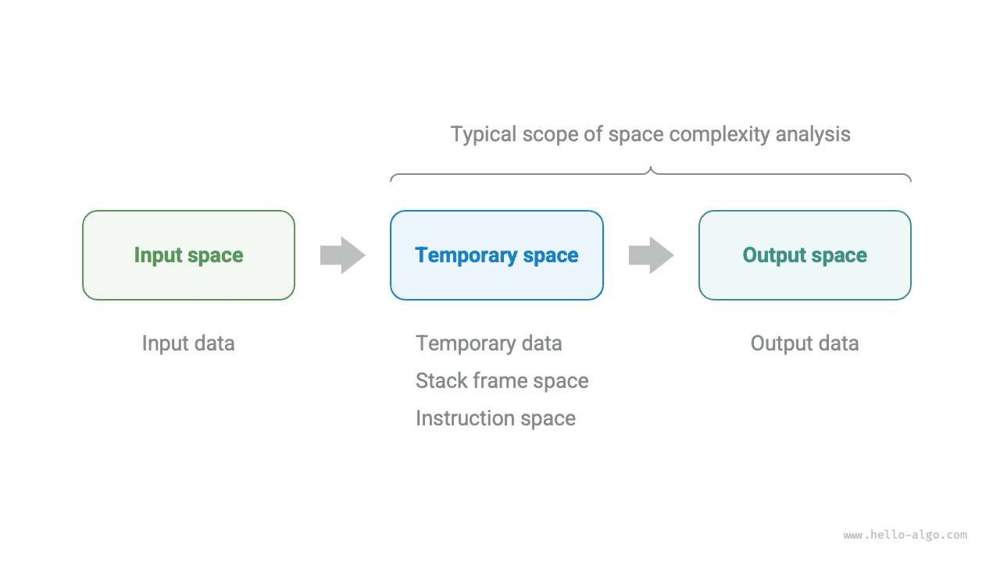

# Térbonyolultság

A <u>térbonyolultság</u> azt a növekedési trendet méri, ahogyan egy algoritmus által elfoglalt memóriaterület növekszik az adatméret növekedésével. Ez a fogalom nagyon hasonló az időbonyolultsághoz, azzal a különbséggel, hogy a "futási idő" helyett a "foglalt memóriaterület" szerepel.

## Az algoritmushoz kapcsolódó tér

Az algoritmus végrehajtása során felhasznált memóriaterület főként a következő típusokat foglalja magában.

- **Bemeneti tér**: Az algoritmus bemeneti adatainak tárolására szolgál.
- **Ideiglenes tér**: Az algoritmus végrehajtása során felhasznált változók, objektumok, függvénykontextusok és egyéb adatok tárolására szolgál.
- **Kimeneti tér**: Az algoritmus kimeneti adatainak tárolására szolgál.

Általában a térbonyolultság statisztikájának hatóköre az "ideiglenes tér" plusz a "kimeneti tér".

Az ideiglenes tér tovább osztható három részre.

- **Ideiglenes adatok**: Az algoritmus végrehajtása során különböző konstansok, változók, objektumok stb. mentésére szolgál.
- **Veremkeret-tér**: A meghívott függvények kontextusadatainak mentésére szolgál. A rendszer minden függvényhíváskor egy veremkeretet hoz létre a verem tetején, és a veremkeret-tér felszabadul, amikor a függvény visszatér.
- **Utasítástér**: A lefordított programutasítások mentésére szolgál, amelyeket a tényleges statisztikákban általában figyelmen kívül hagynak.

Egy program térbonyolultságának elemzésekor **általában három részt számolunk: az ideiglenes adatokat, a veremkeret-teret és a kimeneti adatokat**, ahogyan az az alábbi ábrán látható.



A kapcsolódó kód a következő:

=== "Python"

    ```python title=""
    class Node:
        """Osztály"""
        def __init__(self, x: int):
            self.val: int = x              # Csomópont értéke
            self.next: Node | None = None  # Hivatkozás a következő csomópontra

    def function() -> int:
        """Függvény"""
        # Néhány művelet elvégzése...
        return 0

    def algorithm(n) -> int:  # Bemeneti adat
        A = 0                 # Ideiglenes adat (konstans, általában nagybetűvel jelöljük)
        b = 0                 # Ideiglenes adat (változó)
        node = Node(0)        # Ideiglenes adat (objektum)
        c = function()        # Veremkeret-tér (függvényhívás)
        return A + b + c      # Kimeneti adat
    ```

=== "C++"

    ```cpp title=""
    /* Struktúra */
    struct Node {
        int val;
        Node *next;
        Node(int x) : val(x), next(nullptr) {}
    };

    /* Függvény */
    int func() {
        // Néhány művelet elvégzése...
        return 0;
    }

    int algorithm(int n) {        // Bemeneti adat
        const int a = 0;          // Ideiglenes adat (konstans)
        int b = 0;                // Ideiglenes adat (változó)
        Node* node = new Node(0); // Ideiglenes adat (objektum)
        int c = func();           // Veremkeret-tér (függvényhívás)
        return a + b + c;         // Kimeneti adat
    }
    ```

=== "Java"

    ```java title=""
    /* Osztály */
    class Node {
        int val;
        Node next;
        Node(int x) { val = x; }
    }

    /* Függvény */
    int function() {
        // Néhány művelet elvégzése...
        return 0;
    }

    int algorithm(int n) {        // Bemeneti adat
        final int a = 0;          // Ideiglenes adat (konstans)
        int b = 0;                // Ideiglenes adat (változó)
        Node node = new Node(0);  // Ideiglenes adat (objektum)
        int c = function();       // Veremkeret-tér (függvényhívás)
        return a + b + c;         // Kimeneti adat
    }
    ```

=== "C#"

    ```csharp title=""
    /* Osztály */
    class Node(int x) {
        int val = x;
        Node next;
    }

    /* Függvény */
    int Function() {
        // Néhány művelet elvégzése...
        return 0;
    }

    int Algorithm(int n) {        // Bemeneti adat
        const int a = 0;          // Ideiglenes adat (konstans)
        int b = 0;                // Ideiglenes adat (változó)
        Node node = new(0);       // Ideiglenes adat (objektum)
        int c = Function();       // Veremkeret-tér (függvényhívás)
        return a + b + c;         // Kimeneti adat
    }
    ```

=== "Go"

    ```go title=""
    /* Struktúra */
    type node struct {
        val  int
        next *node
    }

    /* Csomópont struktúra létrehozása */
    func newNode(val int) *node {
        return &node{val: val}
    }

    /* Függvény */
    func function() int {
        // Néhány művelet elvégzése...
        return 0
    }

    func algorithm(n int) int { // Bemeneti adat
        const a = 0             // Ideiglenes adat (konstans)
        b := 0                  // Ideiglenes adat (változó)
        newNode(0)              // Ideiglenes adat (objektum)
        c := function()         // Veremkeret-tér (függvényhívás)
        return a + b + c        // Kimeneti adat
    }
    ```

=== "Swift"

    ```swift title=""
    /* Osztály */
    class Node {
        var val: Int
        var next: Node?

        init(x: Int) {
            val = x
        }
    }

    /* Függvény */
    func function() -> Int {
        // Néhány művelet elvégzése...
        return 0
    }

    func algorithm(n: Int) -> Int { // Bemeneti adat
        let a = 0             // Ideiglenes adat (konstans)
        var b = 0             // Ideiglenes adat (változó)
        let node = Node(x: 0) // Ideiglenes adat (objektum)
        let c = function()    // Veremkeret-tér (függvényhívás)
        return a + b + c      // Kimeneti adat
    }
    ```

=== "JS"

    ```javascript title=""
    /* Osztály */
    class Node {
        val;
        next;
        constructor(val) {
            this.val = val === undefined ? 0 : val; // Csomópont értéke
            this.next = null;                       // Hivatkozás a következő csomópontra
        }
    }

    /* Függvény */
    function constFunc() {
        // Néhány művelet elvégzése
        return 0;
    }

    function algorithm(n) {       // Bemeneti adat
        const a = 0;              // Ideiglenes adat (konstans)
        let b = 0;                // Ideiglenes adat (változó)
        const node = new Node(0); // Ideiglenes adat (objektum)
        const c = constFunc();    // Veremkeret-tér (függvényhívás)
        return a + b + c;         // Kimeneti adat
    }
    ```

=== "TS"

    ```typescript title=""
    /* Osztály */
    class Node {
        val: number;
        next: Node | null;
        constructor(val?: number) {
            this.val = val === undefined ? 0 : val; // Csomópont értéke
            this.next = null;                       // Hivatkozás a következő csomópontra
        }
    }

    /* Függvény */
    function constFunc(): number {
        // Néhány művelet elvégzése
        return 0;
    }

    function algorithm(n: number): number { // Bemeneti adat
        const a = 0;                        // Ideiglenes adat (konstans)
        let b = 0;                          // Ideiglenes adat (változó)
        const node = new Node(0);           // Ideiglenes adat (objektum)
        const c = constFunc();              // Veremkeret-tér (függvényhívás)
        return a + b + c;                   // Kimeneti adat
    }
    ```

=== "Dart"

    ```dart title=""
    /* Osztály */
    class Node {
      int val;
      Node next;
      Node(this.val, [this.next]);
    }

    /* Függvény */
    int function() {
      // Néhány művelet elvégzése...
      return 0;
    }

    int algorithm(int n) {  // Bemeneti adat
      const int a = 0;      // Ideiglenes adat (konstans)
      int b = 0;            // Ideiglenes adat (változó)
      Node node = Node(0);  // Ideiglenes adat (objektum)
      int c = function();   // Veremkeret-tér (függvényhívás)
      return a + b + c;     // Kimeneti adat
    }
    ```

=== "Rust"

    ```rust title=""
    use std::rc::Rc;
    use std::cell::RefCell;

    /* Struktúra */
    struct Node {
        val: i32,
        next: Option<Rc<RefCell<Node>>>,
    }

    /* Node struktúra létrehozása */
    impl Node {
        fn new(val: i32) -> Self {
            Self { val: val, next: None }
        }
    }

    /* Függvény */
    fn function() -> i32 {
        // Néhány művelet elvégzése...
        return 0;
    }

    fn algorithm(n: i32) -> i32 {       // Bemeneti adat
        const a: i32 = 0;               // Ideiglenes adat (konstans)
        let mut b = 0;                  // Ideiglenes adat (változó)
        let node = Node::new(0);        // Ideiglenes adat (objektum)
        let c = function();             // Veremkeret-tér (függvényhívás)
        return a + b + c;               // Kimeneti adat
    }
    ```

=== "C"

    ```c title=""
    /* Függvény */
    int func() {
        // Néhány művelet elvégzése...
        return 0;
    }

    int algorithm(int n) { // Bemeneti adat
        const int a = 0;   // Ideiglenes adat (konstans)
        int b = 0;         // Ideiglenes adat (változó)
        int c = func();    // Veremkeret-tér (függvényhívás)
        return a + b + c;  // Kimeneti adat
    }
    ```

=== "Kotlin"

    ```kotlin title=""
    /* Osztály */
    class Node(var _val: Int) {
        var next: Node? = null
    }

    /* Függvény */
    fun function(): Int {
        // Néhány művelet elvégzése...
        return 0
    }

    fun algorithm(n: Int): Int { // Bemeneti adat
        val a = 0                // Ideiglenes adat (konstans)
        var b = 0                // Ideiglenes adat (változó)
        val node = Node(0)       // Ideiglenes adat (objektum)
        val c = function()       // Veremkeret-tér (függvényhívás)
        return a + b + c         // Kimeneti adat
    }
    ```

=== "Ruby"

    ```ruby title=""
    ### Osztály ###
    class Node
        attr_accessor :val      # Csomópont értéke
        attr_accessor :next     # Hivatkozás a következő csomópontra

        def initialize(x)
            @val = x
        end
    end

    ### Függvény ###
    def function
        # Néhány művelet elvégzése...
        0
    end

    ### Algoritmus ###
    def algorithm(n)        # Bemeneti adat
        a = 0               # Ideiglenes adat (konstans)
        b = 0               # Ideiglenes adat (változó)
        node = Node.new(0)  # Ideiglenes adat (objektum)
        c = function        # Veremkeret-tér (függvényhívás)
        a + b + c           # Kimeneti adat
    end
    ```

## Számítási módszer

A térbonyolultság számítási módszere nagyjából megegyezik az időbonyolultságéval, azzal a különbséggel, hogy a statisztikai objektum a "műveletek számáról" a "felhasznált tér méretére" változik.

Az időbonyolultsággal ellentétben **általában csak a legrosszabb esetű térbonyolultságra koncentrálunk**. Ez azért van, mert a memóriaterület kemény követelmény, és biztosítanunk kell, hogy elegendő memóriaterületet tartalékoljunk az összes bemeneti adathoz.

Figyeljük meg az alábbi kódot. A legrosszabb esetű térbonyolultságban a "legrosszabb eset" két jelentéssel bír.

1. **A legrosszabb bemeneti adatok alapján**: Ha $n < 10$, a térbonyolultság $O(1)$; de ha $n > 10$, az inicializált `nums` tömb $O(n)$ teret foglal, ezért a legrosszabb esetű térbonyolultság $O(n)$.
2. **Az algoritmus végrehajtása során a csúcsmemória alapján**: Például az utolsó sor végrehajtása előtt a program $O(1)$ teret foglal; a `nums` tömb inicializálásakor a program $O(n)$ teret foglal, ezért a legrosszabb esetű térbonyolultság $O(n)$.

=== "Python"

    ```python title=""
    def algorithm(n: int):
        a = 0               # O(1)
        b = [0] * 10000     # O(1)
        if n > 10:
            nums = [0] * n  # O(n)
    ```

=== "C++"

    ```cpp title=""
    void algorithm(int n) {
        int a = 0;               // O(1)
        vector<int> b(10000);    // O(1)
        if (n > 10)
            vector<int> nums(n); // O(n)
    }
    ```

=== "Java"

    ```java title=""
    void algorithm(int n) {
        int a = 0;                   // O(1)
        int[] b = new int[10000];    // O(1)
        if (n > 10)
            int[] nums = new int[n]; // O(n)
    }
    ```

=== "C#"

    ```csharp title=""
    void Algorithm(int n) {
        int a = 0;                   // O(1)
        int[] b = new int[10000];    // O(1)
        if (n > 10) {
            int[] nums = new int[n]; // O(n)
        }
    }
    ```

=== "Go"

    ```go title=""
    func algorithm(n int) {
        a := 0                      // O(1)
        b := make([]int, 10000)     // O(1)
        var nums []int
        if n > 10 {
            nums := make([]int, n)  // O(n)
        }
        fmt.Println(a, b, nums)
    }
    ```

=== "Swift"

    ```swift title=""
    func algorithm(n: Int) {
        let a = 0 // O(1)
        let b = Array(repeating: 0, count: 10000) // O(1)
        if n > 10 {
            let nums = Array(repeating: 0, count: n) // O(n)
        }
    }
    ```

=== "JS"

    ```javascript title=""
    function algorithm(n) {
        const a = 0;                   // O(1)
        const b = new Array(10000);    // O(1)
        if (n > 10) {
            const nums = new Array(n); // O(n)
        }
    }
    ```

=== "TS"

    ```typescript title=""
    function algorithm(n: number): void {
        const a = 0;                   // O(1)
        const b = new Array(10000);    // O(1)
        if (n > 10) {
            const nums = new Array(n); // O(n)
        }
    }
    ```

=== "Dart"

    ```dart title=""
    void algorithm(int n) {
      int a = 0;                            // O(1)
      List<int> b = List.filled(10000, 0);  // O(1)
      if (n > 10) {
        List<int> nums = List.filled(n, 0); // O(n)
      }
    }
    ```

=== "Rust"

    ```rust title=""
    fn algorithm(n: i32) {
        let a = 0;                              // O(1)
        let b = [0; 10000];                     // O(1)
        if n > 10 {
            let nums = vec![0; n as usize];     // O(n)
        }
    }
    ```

=== "C"

    ```c title=""
    void algorithm(int n) {
        int a = 0;               // O(1)
        int b[10000];            // O(1)
        if (n > 10)
            int nums[n] = {0};   // O(n)
    }
    ```

=== "Kotlin"

    ```kotlin title=""
    fun algorithm(n: Int) {
        val a = 0                    // O(1)
        val b = IntArray(10000)      // O(1)
        if (n > 10) {
            val nums = IntArray(n)   // O(n)
        }
    }
    ```

=== "Ruby"

    ```ruby title=""
    def algorithm(n)
        a = 0                           # O(1)
        b = Array.new(10000)            # O(1)
        nums = Array.new(n) if n > 10   # O(n)
    end
    ```

**Rekurzív függvényeknél szükséges a veremkeret-tér számítása**. Figyeljük meg az alábbi kódot:

=== "Python"

    ```python title=""
    def function() -> int:
        # Néhány művelet elvégzése
        return 0

    def loop(n: int):
        """A ciklus térbonyolultsága O(1)"""
        for _ in range(n):
            function()

    def recur(n: int):
        """A rekurzió térbonyolultsága O(n)"""
        if n == 1:
            return
        return recur(n - 1)
    ```

=== "C++"

    ```cpp title=""
    int func() {
        // Néhány művelet elvégzése
        return 0;
    }
    /* A ciklus térbonyolultsága O(1) */
    void loop(int n) {
        for (int i = 0; i < n; i++) {
            func();
        }
    }
    /* A rekurzió térbonyolultsága O(n) */
    void recur(int n) {
        if (n == 1) return;
        recur(n - 1);
    }
    ```

=== "Java"

    ```java title=""
    int function() {
        // Néhány művelet elvégzése
        return 0;
    }
    /* A ciklus térbonyolultsága O(1) */
    void loop(int n) {
        for (int i = 0; i < n; i++) {
            function();
        }
    }
    /* A rekurzió térbonyolultsága O(n) */
    void recur(int n) {
        if (n == 1) return;
        recur(n - 1);
    }
    ```

=== "C#"

    ```csharp title=""
    int Function() {
        // Néhány művelet elvégzése
        return 0;
    }
    /* A ciklus térbonyolultsága O(1) */
    void Loop(int n) {
        for (int i = 0; i < n; i++) {
            Function();
        }
    }
    /* A rekurzió térbonyolultsága O(n) */
    int Recur(int n) {
        if (n == 1) return 1;
        return Recur(n - 1);
    }
    ```

=== "Go"

    ```go title=""
    func function() int {
        // Néhány művelet elvégzése
        return 0
    }

    /* A ciklus térbonyolultsága O(1) */
    func loop(n int) {
        for i := 0; i < n; i++ {
            function()
        }
    }

    /* A rekurzió térbonyolultsága O(n) */
    func recur(n int) {
        if n == 1 {
            return
        }
        recur(n - 1)
    }
    ```

=== "Swift"

    ```swift title=""
    @discardableResult
    func function() -> Int {
        // Néhány művelet elvégzése
        return 0
    }

    /* A ciklus térbonyolultsága O(1) */
    func loop(n: Int) {
        for _ in 0 ..< n {
            function()
        }
    }

    /* A rekurzió térbonyolultsága O(n) */
    func recur(n: Int) {
        if n == 1 {
            return
        }
        recur(n: n - 1)
    }
    ```

=== "JS"

    ```javascript title=""
    function constFunc() {
        // Néhány művelet elvégzése
        return 0;
    }
    /* A ciklus térbonyolultsága O(1) */
    function loop(n) {
        for (let i = 0; i < n; i++) {
            constFunc();
        }
    }
    /* A rekurzió térbonyolultsága O(n) */
    function recur(n) {
        if (n === 1) return;
        return recur(n - 1);
    }
    ```

=== "TS"

    ```typescript title=""
    function constFunc(): number {
        // Néhány művelet elvégzése
        return 0;
    }
    /* A ciklus térbonyolultsága O(1) */
    function loop(n: number): void {
        for (let i = 0; i < n; i++) {
            constFunc();
        }
    }
    /* A rekurzió térbonyolultsága O(n) */
    function recur(n: number): void {
        if (n === 1) return;
        return recur(n - 1);
    }
    ```

=== "Dart"

    ```dart title=""
    int function() {
      // Néhány művelet elvégzése
      return 0;
    }
    /* A ciklus térbonyolultsága O(1) */
    void loop(int n) {
      for (int i = 0; i < n; i++) {
        function();
      }
    }
    /* A rekurzió térbonyolultsága O(n) */
    void recur(int n) {
      if (n == 1) return;
      recur(n - 1);
    }
    ```

=== "Rust"

    ```rust title=""
    fn function() -> i32 {
        // Néhány művelet elvégzése
        return 0;
    }
    /* A ciklus térbonyolultsága O(1) */
    fn loop(n: i32) {
        for i in 0..n {
            function();
        }
    }
    /* A rekurzió térbonyolultsága O(n) */
    fn recur(n: i32) {
        if n == 1 {
            return;
        }
        recur(n - 1);
    }
    ```

=== "C"

    ```c title=""
    int func() {
        // Néhány művelet elvégzése
        return 0;
    }
    /* A ciklus térbonyolultsága O(1) */
    void loop(int n) {
        for (int i = 0; i < n; i++) {
            func();
        }
    }
    /* A rekurzió térbonyolultsága O(n) */
    void recur(int n) {
        if (n == 1) return;
        recur(n - 1);
    }
    ```

=== "Kotlin"

    ```kotlin title=""
    fun function(): Int {
        // Néhány művelet elvégzése
        return 0
    }
    /* A ciklus térbonyolultsága O(1) */
    fun loop(n: Int) {
        for (i in 0..<n) {
            function()
        }
    }
    /* A rekurzió térbonyolultsága O(n) */
    fun recur(n: Int) {
        if (n == 1) return
        return recur(n - 1)
    }
    ```

=== "Ruby"

    ```ruby title=""
    def function
        # Néhány művelet elvégzése
        0
    end

    ### A ciklus térbonyolultsága O(1) ###
    def loop(n)
        (0...n).each { function }
    end

    ### A rekurzió térbonyolultsága O(n) ###
    def recur(n)
        return if n == 1
        recur(n - 1)
    end
    ```

A `loop()` és a `recur()` függvények időbonyolultsága egyaránt $O(n)$, de térbonyolultságuk különböző.

- A `loop()` függvény $n$-szer hívja meg a `function()`-t egy ciklusban. Minden iterációban a `function()` visszatér és felszabadítja a veremkeret-terét, így a térbonyolultság $O(1)$ marad.
- A rekurzív `recur()` függvénynek $n$ vissza nem tért `recur()` példánya létezik egyidejűleg a végrehajtás során, ezáltal $O(n)$ veremkeret-teret foglalva.

## Általános típusok

Legyen a bemeneti adatméret $n$. Az alábbi ábra a térbonyolultság általános típusait mutatja (növekvő sorrendben rendezve).

$$
\begin{aligned}
O(1) < O(\log n) < O(n) < O(n^2) < O(2^n) \newline
\text{Konstans} < \text{Logaritmikus} < \text{Lineáris} < \text{Négyzetes} < \text{Exponenciális}
\end{aligned}
$$


### Konstans rend $O(1)$

A konstans rend olyan konstansokban, változókban és objektumokban fordul elő, amelyek mennyisége független az $n$ bemeneti adatmérettől.

Megjegyzendő, hogy a változók inicializálásával vagy a függvények ciklusban történő meghívásával elfoglalt memória felszabadul, amikor a következő iterációra lépünk, így nem halmozódik fel a tér, és a térbonyolultság $O(1)$ marad:

```src
[file]{space_complexity}-[class]{}-[func]{constant}
```

### Lineáris rend $O(n)$

A lineáris rend tömbökben, láncolt listákban, veremekben, sorokban stb. fordul elő, ahol az elemek száma $n$-nel arányos:

```src
[file]{space_complexity}-[class]{}-[func]{linear}
```

Ahogyan az alábbi ábrán látható, ennek a függvénynek a rekurzióméлysége $n$, ami azt jelenti, hogy $n$ vissza nem tért `linear_recur()` függvény létezik egyidejűleg, $O(n)$ veremkeret-teret használva:

```src
[file]{space_complexity}-[class]{}-[func]{linear_recur}
```


### Négyzetes rend $O(n^2)$

A négyzetes rend mátrixokban és gráfokban fordul elő, ahol az elemek száma négyzetesen kapcsolódik $n$-hez:

```src
[file]{space_complexity}-[class]{}-[func]{quadratic}
```

Ahogyan az alábbi ábrán látható, ennek a függvénynek a rekurzióméлysége $n$, és minden rekurzív függvényben egy tömböt inicializálnak, amelynek hossza $n$, $n-1$, $\dots$, $2$, $1$, átlagos hossza $n / 2$, így összességében $O(n^2)$ teret foglalva:

```src
[file]{space_complexity}-[class]{}-[func]{quadratic_recur}
```


### Exponenciális rend $O(2^n)$

Az exponenciális rend bináris fákban fordul elő. Figyeljük meg az alábbi ábrát: egy $n$ szintű "teljes bináris fa" $2^n - 1$ csomópontot tartalmaz, $O(2^n)$ teret foglalva:

```src
[file]{space_complexity}-[class]{}-[func]{build_tree}
```


### Logaritmikus rend $O(\log n)$

A logaritmikus rend oszd meg és uralkodj algoritmusokban fordul elő. Például összefésüléses rendezésnél: egy $n$ hosszúságú bemeneti tömb esetén minden rekurzió felezi a tömböt a középponttól, $\log n$ magasságú rekurziós fát alkotva, $O(\log n)$ veremkeret-teret felhasználva.

Egy másik példa egy szám karakterlánccá való átalakítása. Egy pozitív egész $n$ esetén $\lfloor \log_{10} n \rfloor + 1$ számjegye van, azaz a megfelelő karakterlánc hossza $\lfloor \log_{10} n \rfloor + 1$, így a térbonyolultság $O(\log_{10} n + 1) = O(\log n)$.

## Tér és idő cseréje

Ideális esetben azt szeretnénk, hogy egy algoritmus időbonyolultsága és térbonyolultsága egyaránt optimális legyen. A gyakorlatban azonban mindkét bonyolultság egyidejű optimalizálása általában nagyon nehéz.

**Az időbonyolultság csökkentése általában a térbonyolultság növekedésének árán jár, és fordítva**. A memóriatér feláldozásának az algoritmus végrehajtási sebességének javítása érdekében való megközelítést "tér az időért cserébe" stratégiának nevezzük; fordítva, "idő a térért cserébe" stratégiának.

A választás attól függ, melyik szempontot értékeljük többre. A legtöbb esetben az idő értékesebb, mint a tér, ezért a "tér az időért cserébe" általában a leggyakoribb stratégia. Természetesen, ha az adatmennyiség nagyon nagy, a térbonyolultság szabályozása is nagyon fontos.
