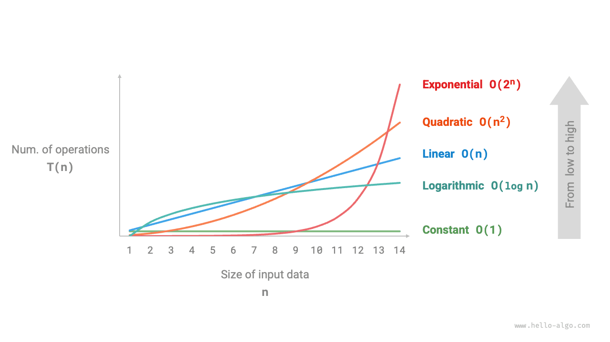

# Időbonyolultság

A futási idő szemléletesen és pontosan tükrözi egy algoritmus hatékonyságát. Ha pontosan meg szeretnénk becsülni egy kódrészlet futási idejét, hogyan kell eljárni?

1. **Meghatározni a futtatási platformot**, beleértve a hardveres konfigurációt, a programozási nyelvet, a rendszerkörnyezetet stb., mivel ezek a tényezők mind befolyásolják a kód végrehajtási hatékonyságát.
2. **Megbecsülni a különböző számítási műveletek futási idejét**, például egy összeadási művelet `+` 1 ns, egy szorzási művelet `*` 10 ns, egy kiírási művelet `print()` 5 ns stb.
3. **Megszámlálni a kódban lévő összes számítási műveletet**, és összesíteni az összes művelet végrehajtási idejét a futási idő megkapásához.

Például az alábbi kódban a bemeneti adatméret $n$:

=== "Python"

    ```python title=""
    # Egy bizonyos futtatási platformon
    def algorithm(n: int):
        a = 2      # 1 ns
        a = a + 1  # 1 ns
        a = a * 2  # 10 ns
        # n-szer ciklusozva
        for _ in range(n):  # 1 ns
            print(0)        # 5 ns
    ```

=== "C++"

    ```cpp title=""
    // Egy bizonyos futtatási platformon
    void algorithm(int n) {
        int a = 2;  // 1 ns
        a = a + 1;  // 1 ns
        a = a * 2;  // 10 ns
        // n-szer ciklusozva
        for (int i = 0; i < n; i++) {  // 1 ns
            cout << 0 << endl;         // 5 ns
        }
    }
    ```

=== "Java"

    ```java title=""
    // Egy bizonyos futtatási platformon
    void algorithm(int n) {
        int a = 2;  // 1 ns
        a = a + 1;  // 1 ns
        a = a * 2;  // 10 ns
        // n-szer ciklusozva
        for (int i = 0; i < n; i++) {  // 1 ns
            System.out.println(0);     // 5 ns
        }
    }
    ```

=== "C#"

    ```csharp title=""
    // Egy bizonyos futtatási platformon
    void Algorithm(int n) {
        int a = 2;  // 1 ns
        a = a + 1;  // 1 ns
        a = a * 2;  // 10 ns
        // n-szer ciklusozva
        for (int i = 0; i < n; i++) {  // 1 ns
            Console.WriteLine(0);      // 5 ns
        }
    }
    ```

=== "Go"

    ```go title=""
    // Egy bizonyos futtatási platformon
    func algorithm(n int) {
        a := 2     // 1 ns
        a = a + 1  // 1 ns
        a = a * 2  // 10 ns
        // n-szer ciklusozva
        for i := 0; i < n; i++ {  // 1 ns
            fmt.Println(a)        // 5 ns
        }
    }
    ```

=== "Swift"

    ```swift title=""
    // Egy bizonyos futtatási platformon
    func algorithm(n: Int) {
        var a = 2 // 1 ns
        a = a + 1 // 1 ns
        a = a * 2 // 10 ns
        // n-szer ciklusozva
        for _ in 0 ..< n { // 1 ns
            print(0) // 5 ns
        }
    }
    ```

=== "JS"

    ```javascript title=""
    // Egy bizonyos futtatási platformon
    function algorithm(n) {
        var a = 2; // 1 ns
        a = a + 1; // 1 ns
        a = a * 2; // 10 ns
        // n-szer ciklusozva
        for(let i = 0; i < n; i++) { // 1 ns
            console.log(0); // 5 ns
        }
    }
    ```

=== "TS"

    ```typescript title=""
    // Egy bizonyos futtatási platformon
    function algorithm(n: number): void {
        var a: number = 2; // 1 ns
        a = a + 1; // 1 ns
        a = a * 2; // 10 ns
        // n-szer ciklusozva
        for(let i = 0; i < n; i++) { // 1 ns
            console.log(0); // 5 ns
        }
    }
    ```

=== "Dart"

    ```dart title=""
    // Egy bizonyos futtatási platformon
    void algorithm(int n) {
      int a = 2; // 1 ns
      a = a + 1; // 1 ns
      a = a * 2; // 10 ns
      // n-szer ciklusozva
      for (int i = 0; i < n; i++) { // 1 ns
        print(0); // 5 ns
      }
    }
    ```

=== "Rust"

    ```rust title=""
    // Egy bizonyos futtatási platformon
    fn algorithm(n: i32) {
        let mut a = 2;      // 1 ns
        a = a + 1;          // 1 ns
        a = a * 2;          // 10 ns
        // n-szer ciklusozva
        for _ in 0..n {     // 1 ns
            println!("{}", 0);  // 5 ns
        }
    }
    ```

=== "C"

    ```c title=""
    // Egy bizonyos futtatási platformon
    void algorithm(int n) {
        int a = 2;  // 1 ns
        a = a + 1;  // 1 ns
        a = a * 2;  // 10 ns
        // n-szer ciklusozva
        for (int i = 0; i < n; i++) {   // 1 ns
            printf("%d", 0);            // 5 ns
        }
    }
    ```

=== "Kotlin"

    ```kotlin title=""
    // Egy bizonyos futtatási platformon
    fun algorithm(n: Int) {
        var a = 2 // 1 ns
        a = a + 1 // 1 ns
        a = a * 2 // 10 ns
        // n-szer ciklusozva
        for (i in 0..<n) {  // 1 ns
            println(0)      // 5 ns
        }
    }
    ```

=== "Ruby"

    ```ruby title=""
    # Egy bizonyos futtatási platformon
    def algorithm(n)
        a = 2       # 1 ns
        a = a + 1   # 1 ns
        a = a * 2   # 10 ns
        # n-szer ciklusozva
        (0...n).each do # 1 ns
            puts 0      # 5 ns
        end
    end
    ```

A fenti módszer alapján az algoritmus futási ideje $(6n + 12)$ ns:

$$
1 + 1 + 10 + (1 + 5) \times n = 6n + 12
$$

A valóságban azonban **egy algoritmus futási idejének megszámlálása sem ésszerű, sem reális**. Egyrészt nem szeretnénk a becsült időt a futtatási platformhoz kötni, mivel az algoritmusoknak különböző platformokon kell futniuk. Másrészt nehéz megismerni az egyes típusú műveletek futási idejét, ami nagy nehézséget okoz a becslési folyamatban.

## Az időnövekedési trendek megszámlálása

Az időbonyolultság-elemzés nem az algoritmus futási idejét számolja meg, **hanem az algoritmus futási ideje növekedési trendjét az adatmennyiség növekedésével**.

Az "időnövekedési trend" fogalma meglehetősen elvont; egy példán keresztül érthetjük meg. Tegyük fel, hogy a bemeneti adatméret $n$, és adott három algoritmus `A`, `B` és `C`:

=== "Python"

    ```python title=""
    # Az A algoritmus időbonyolultsága: konstans rend
    def algorithm_A(n: int):
        print(0)
    # A B algoritmus időbonyolultsága: lineáris rend
    def algorithm_B(n: int):
        for _ in range(n):
            print(0)
    # A C algoritmus időbonyolultsága: konstans rend
    def algorithm_C(n: int):
        for _ in range(1000000):
            print(0)
    ```

=== "C++"

    ```cpp title=""
    // Az A algoritmus időbonyolultsága: konstans rend
    void algorithm_A(int n) {
        cout << 0 << endl;
    }
    // A B algoritmus időbonyolultsága: lineáris rend
    void algorithm_B(int n) {
        for (int i = 0; i < n; i++) {
            cout << 0 << endl;
        }
    }
    // A C algoritmus időbonyolultsága: konstans rend
    void algorithm_C(int n) {
        for (int i = 0; i < 1000000; i++) {
            cout << 0 << endl;
        }
    }
    ```

=== "Java"

    ```java title=""
    // Az A algoritmus időbonyolultsága: konstans rend
    void algorithm_A(int n) {
        System.out.println(0);
    }
    // A B algoritmus időbonyolultsága: lineáris rend
    void algorithm_B(int n) {
        for (int i = 0; i < n; i++) {
            System.out.println(0);
        }
    }
    // A C algoritmus időbonyolultsága: konstans rend
    void algorithm_C(int n) {
        for (int i = 0; i < 1000000; i++) {
            System.out.println(0);
        }
    }
    ```

=== "C#"

    ```csharp title=""
    // Az A algoritmus időbonyolultsága: konstans rend
    void AlgorithmA(int n) {
        Console.WriteLine(0);
    }
    // A B algoritmus időbonyolultsága: lineáris rend
    void AlgorithmB(int n) {
        for (int i = 0; i < n; i++) {
            Console.WriteLine(0);
        }
    }
    // A C algoritmus időbonyolultsága: konstans rend
    void AlgorithmC(int n) {
        for (int i = 0; i < 1000000; i++) {
            Console.WriteLine(0);
        }
    }
    ```

=== "Go"

    ```go title=""
    // Az A algoritmus időbonyolultsága: konstans rend
    func algorithm_A(n int) {
        fmt.Println(0)
    }
    // A B algoritmus időbonyolultsága: lineáris rend
    func algorithm_B(n int) {
        for i := 0; i < n; i++ {
            fmt.Println(0)
        }
    }
    // A C algoritmus időbonyolultsága: konstans rend
    func algorithm_C(n int) {
        for i := 0; i < 1000000; i++ {
            fmt.Println(0)
        }
    }
    ```

=== "Swift"

    ```swift title=""
    // Az A algoritmus időbonyolultsága: konstans rend
    func algorithmA(n: Int) {
        print(0)
    }

    // A B algoritmus időbonyolultsága: lineáris rend
    func algorithmB(n: Int) {
        for _ in 0 ..< n {
            print(0)
        }
    }

    // A C algoritmus időbonyolultsága: konstans rend
    func algorithmC(n: Int) {
        for _ in 0 ..< 1_000_000 {
            print(0)
        }
    }
    ```

=== "JS"

    ```javascript title=""
    // Az A algoritmus időbonyolultsága: konstans rend
    function algorithm_A(n) {
        console.log(0);
    }
    // A B algoritmus időbonyolultsága: lineáris rend
    function algorithm_B(n) {
        for (let i = 0; i < n; i++) {
            console.log(0);
        }
    }
    // A C algoritmus időbonyolultsága: konstans rend
    function algorithm_C(n) {
        for (let i = 0; i < 1000000; i++) {
            console.log(0);
        }
    }

    ```

=== "TS"

    ```typescript title=""
    // Az A algoritmus időbonyolultsága: konstans rend
    function algorithm_A(n: number): void {
        console.log(0);
    }
    // A B algoritmus időbonyolultsága: lineáris rend
    function algorithm_B(n: number): void {
        for (let i = 0; i < n; i++) {
            console.log(0);
        }
    }
    // A C algoritmus időbonyolultsága: konstans rend
    function algorithm_C(n: number): void {
        for (let i = 0; i < 1000000; i++) {
            console.log(0);
        }
    }
    ```

=== "Dart"

    ```dart title=""
    // Az A algoritmus időbonyolultsága: konstans rend
    void algorithmA(int n) {
      print(0);
    }
    // A B algoritmus időbonyolultsága: lineáris rend
    void algorithmB(int n) {
      for (int i = 0; i < n; i++) {
        print(0);
      }
    }
    // A C algoritmus időbonyolultsága: konstans rend
    void algorithmC(int n) {
      for (int i = 0; i < 1000000; i++) {
        print(0);
      }
    }
    ```

=== "Rust"

    ```rust title=""
    // Az A algoritmus időbonyolultsága: konstans rend
    fn algorithm_A(n: i32) {
        println!("{}", 0);
    }
    // A B algoritmus időbonyolultsága: lineáris rend
    fn algorithm_B(n: i32) {
        for _ in 0..n {
            println!("{}", 0);
        }
    }
    // A C algoritmus időbonyolultsága: konstans rend
    fn algorithm_C(n: i32) {
        for _ in 0..1000000 {
            println!("{}", 0);
        }
    }
    ```

=== "C"

    ```c title=""
    // Az A algoritmus időbonyolultsága: konstans rend
    void algorithm_A(int n) {
        printf("%d", 0);
    }
    // A B algoritmus időbonyolultsága: lineáris rend
    void algorithm_B(int n) {
        for (int i = 0; i < n; i++) {
            printf("%d", 0);
        }
    }
    // A C algoritmus időbonyolultsága: konstans rend
    void algorithm_C(int n) {
        for (int i = 0; i < 1000000; i++) {
            printf("%d", 0);
        }
    }
    ```

=== "Kotlin"

    ```kotlin title=""
    // Az A algoritmus időbonyolultsága: konstans rend
    fun algoritm_A(n: Int) {
        println(0)
    }
    // A B algoritmus időbonyolultsága: lineáris rend
    fun algorithm_B(n: Int) {
        for (i in 0..<n){
            println(0)
        }
    }
    // A C algoritmus időbonyolultsága: konstans rend
    fun algorithm_C(n: Int) {
        for (i in 0..<1000000) {
            println(0)
        }
    }
    ```

=== "Ruby"

    ```ruby title=""
    # Az A algoritmus időbonyolultsága: konstans rend
    def algorithm_A(n)
        puts 0
    end

    # A B algoritmus időbonyolultsága: lineáris rend
    def algorithm_B(n)
        (0...n).each { puts 0 }
    end

    # A C algoritmus időbonyolultsága: konstans rend
    def algorithm_C(n)
        (0...1_000_000).each { puts 0 }
    end
    ```

Az alábbi ábra a fenti három algoritmusfüggvény időbonyolultságát mutatja.

- Az `A` algoritmusnak csak $1$ kiírási művelete van, és az algoritmus futási ideje nem növekszik az $n$ növekedésével. Ezt az algoritmust "konstans rendű" időbonyolultságúnak nevezzük.
- A `B` algoritmusban a kiírási műveletnek $n$-szer kell ciklusoznia, és az algoritmus futási ideje lineárisan növekszik az $n$ növekedésével. Ennek az algoritmusnak az időbonyolultságát "lineáris rendűnek" nevezzük.
- A `C` algoritmusban a kiírási műveletnek $1000000$-szor kell ciklusoznia. Bár a futási idő nagyon hosszú, független az $n$ bemeneti adatmérettől. Ezért a `C` időbonyolultsága megegyezik az `A`-éval, és még mindig "konstans rendű".


Összehasonlítva az algoritmus futási idejének közvetlen megszámlálásával, melyek az időbonyolultság-elemzés jellemzői?

- **Az időbonyolultság hatékonyan értékeli az algoritmus hatékonyságát**. Például a `B` algoritmus futási ideje lineárisan növekszik; $n > 1$ esetén lassabb az `A` algoritmusnál, és $n > 1000000$ esetén lassabb a `C` algoritmusnál. Valójában, amíg a bemeneti adatméret $n$ kellően nagy, a "konstans rendű" bonyolultságú algoritmus mindig jobb lesz a "lineáris rendű" bonyolultságúnál, ami pontosan az időnövekedési trend jelentése.
- **Az időbonyolultság levezetési módszere egyszerűbb**. Nyilvánvalóan a futtatási platform és a számítási műveletek típusai egyaránt nem kapcsolódnak az algoritmus futási ideje növekedési trendjéhez. Ezért az időbonyolultság-elemzésben egyszerűen kezelhetjük az összes számítási művelet végrehajtási idejét ugyanolyan "egységidőként", így a "számítási műveletek futási idejének megszámlálásától" a "számítási műveletek számának megszámlálásáig" egyszerűsítve, ami nagymértékben csökkenti a becslés nehézségét.
- **Az időbonyolultságnak bizonyos korlátai is vannak**. Például, bár az `A` és a `C` algoritmusok időbonyolultsága azonos, tényleges futási idejük jelentősen különbözik. Hasonlóképpen, bár a `B` algoritmus magasabb időbonyolultságú, mint a `C`, ha a bemeneti adatméret $n$ kicsi, a `B` algoritmus egyértelműen jobb a `C`-nél. Ilyen esetekben az algoritmusok hatékonyságát csak az időbonyolultság alapján nehéz megítélni. Természetesen, az előbbi problémák ellenére a bonyolultságelemzés marad az algoritmus hatékonyságának értékelésére szolgáló leghatékonyabb és leggyakrabban használt módszer.

## Függvények aszimptotikus felső korlátja

Adott egy $n$ bemeneti méretű függvény:

=== "Python"

    ```python title=""
    def algorithm(n: int):
        a = 1      # +1
        a = a + 1  # +1
        a = a * 2  # +1
        # n-szer ciklusozva
        for i in range(n):  # +1
            print(0)        # +1
    ```

=== "C++"

    ```cpp title=""
    void algorithm(int n) {
        int a = 1;  // +1
        a = a + 1;  // +1
        a = a * 2;  // +1
        // n-szer ciklusozva
        for (int i = 0; i < n; i++) { // +1 (i++ minden körben végrehajtódik)
            cout << 0 << endl;    // +1
        }
    }
    ```

=== "Java"

    ```java title=""
    void algorithm(int n) {
        int a = 1;  // +1
        a = a + 1;  // +1
        a = a * 2;  // +1
        // n-szer ciklusozva
        for (int i = 0; i < n; i++) { // +1 (i++ minden körben végrehajtódik)
            System.out.println(0);    // +1
        }
    }
    ```

=== "C#"

    ```csharp title=""
    void Algorithm(int n) {
        int a = 1;  // +1
        a = a + 1;  // +1
        a = a * 2;  // +1
        // n-szer ciklusozva
        for (int i = 0; i < n; i++) {   // +1 (i++ minden körben végrehajtódik)
            Console.WriteLine(0);   // +1
        }
    }
    ```

=== "Go"

    ```go title=""
    func algorithm(n int) {
        a := 1      // +1
        a = a + 1   // +1
        a = a * 2   // +1
        // n-szer ciklusozva
        for i := 0; i < n; i++ {   // +1
            fmt.Println(a)         // +1
        }
    }
    ```

=== "Swift"

    ```swift title=""
    func algorithm(n: Int) {
        var a = 1 // +1
        a = a + 1 // +1
        a = a * 2 // +1
        // n-szer ciklusozva
        for _ in 0 ..< n { // +1
            print(0) // +1
        }
    }
    ```

=== "JS"

    ```javascript title=""
    function algorithm(n) {
        var a = 1; // +1
        a += 1; // +1
        a *= 2; // +1
        // n-szer ciklusozva
        for(let i = 0; i < n; i++){ // +1 (i++ minden körben végrehajtódik)
            console.log(0); // +1
        }
    }
    ```

=== "TS"

    ```typescript title=""
    function algorithm(n: number): void{
        var a: number = 1; // +1
        a += 1; // +1
        a *= 2; // +1
        // n-szer ciklusozva
        for(let i = 0; i < n; i++){ // +1 (i++ minden körben végrehajtódik)
            console.log(0); // +1
        }
    }
    ```

=== "Dart"

    ```dart title=""
    void algorithm(int n) {
      int a = 1; // +1
      a = a + 1; // +1
      a = a * 2; // +1
      // n-szer ciklusozva
      for (int i = 0; i < n; i++) { // +1 (i++ minden körben végrehajtódik)
        print(0); // +1
      }
    }
    ```

=== "Rust"

    ```rust title=""
    fn algorithm(n: i32) {
        let mut a = 1;   // +1
        a = a + 1;      // +1
        a = a * 2;      // +1

        // n-szer ciklusozva
        for _ in 0..n { // +1 (i++ minden körben végrehajtódik)
            println!("{}", 0); // +1
        }
    }
    ```

=== "C"

    ```c title=""
    void algorithm(int n) {
        int a = 1;  // +1
        a = a + 1;  // +1
        a = a * 2;  // +1
        // n-szer ciklusozva
        for (int i = 0; i < n; i++) {   // +1 (i++ minden körben végrehajtódik)
            printf("%d", 0);            // +1
        }
    }
    ```

=== "Kotlin"

    ```kotlin title=""
    fun algorithm(n: Int) {
        var a = 1 // +1
        a = a + 1 // +1
        a = a * 2 // +1
        // n-szer ciklusozva
        for (i in 0..<n) { // +1 (i++ minden körben végrehajtódik)
            println(0) // +1
        }
    }
    ```

=== "Ruby"

    ```ruby title=""
    def algorithm(n)
        a = 1       # +1
        a = a + 1   # +1
        a = a * 2   # +1
        # n-szer ciklusozva
        (0...n).each do # +1
            puts 0      # +1
        end
    end
    ```

Legyen az algoritmus műveleteinek száma az $n$ bemeneti adatméret függvénye, amelyet $T(n)$-nel jelölünk. Ekkor a fenti függvény műveleteinek száma:

$$
T(n) = 3 + 2n
$$

$T(n)$ lineáris függvény, ami azt jelzi, hogy futási ideje növekedési trendje lineáris, ezért időbonyolultsága lineáris rend.

A lineáris rend időbonyolultságát $O(n)$-nel jelöljük. Ez a matematikai szimbólum <u>nagy-$O$ jelölésnek</u> nevezik, amely a $T(n)$ függvény <u>aszimptotikus felső korlátját</u> jelöli.

Az időbonyolultság-elemzés lényegében a "műveletek száma $T(n)$" aszimptotikus felső korlátját számítja, amelynek egyértelmű matematikai definíciója van.

!!! note "Függvények aszimptotikus felső korlátja"

    Ha léteznek pozitív valós számok $c$ és $n_0$, amelyekre minden $n > n_0$ esetén $T(n) \leq c \cdot f(n)$ teljesül, akkor $f(n)$ $T(n)$ aszimptotikus felső korlátjának tekinthető, amelyet $T(n) = O(f(n))$-nel jelölünk.

Ahogyan az alábbi ábrán látható, az aszimptotikus felső korlát kiszámítása egy $f(n)$ függvény megtalálását jelenti, amelyre $n$ végtelenhez tartásakor $T(n)$ és $f(n)$ azonos növekedési szinten van, csak egy $c$ konstans együtthatóban különböznek.


## Levezetési módszer

Az aszimptotikus felső korlátnak van egy kis matematikai íze. Ha úgy érzi, hogy nem értette meg teljesen, ne aggódjon. Először elsajátíthatjuk a levezetési módszert, és folyamatos gyakorlás révén fokozatosan megérthetjük a matematikai jelentését.

A definíció szerint $f(n)$ meghatározása után megkaphatjuk az $O(f(n))$ időbonyolultságot. Hogyan határozzuk meg az $f(n)$ aszimptotikus felső korlátot? Összességében két lépésre osztható: először megszámoljuk a műveletek számát, majd meghatározzuk az aszimptotikus felső korlátot.

### 1. lépés: A műveletek számának megszámlálása

A kód esetén felülről lefelé haladva sorról sorra számoljunk. Azonban mivel a fenti $c \cdot f(n)$-ben lévő $c$ konstans együttható bármilyen nagy lehet, **a műveletek száma $T(n)$-ben lévő együtthatók és konstans tagok mind figyelmen kívül hagyhatók**. E szerint az elv szerint az alábbi megszámlálási egyszerűsítési technikák foglalhatók össze.

1. **Hagyja figyelmen kívül a $T(n)$-beli konstansokat**. Mivel mindegyik független $n$-től, nem befolyásolják az időbonyolultságot.
2. **Hagyja el az összes együtthatót**. Például $2n$-szer, $5n + 1$-szer stb. ciklusozni, mind egyszerűsíthető $n$-szerre, mivel az $n$ előtti együttható nem befolyásolja az időbonyolultságot.
3. **Egymásba ágyazott ciklusok esetén szorzást használjon**. A műveletek teljes száma egyenlő a külső és belső ciklusok műveleteinek számának szorzatával, ahol minden ciklus réteg külön-külön alkalmazhatja az `1.` és `2.` technikákat.

Adott egy függvény, a fenti technikák segítségével megszámolhatjuk a műveletek számát:

=== "Python"

    ```python title=""
    def algorithm(n: int):
        a = 1      # +0 (1. technika)
        a = a + n  # +0 (1. technika)
        # +n (2. technika)
        for i in range(5 * n + 1):
            print(0)
        # +n*n (3. technika)
        for i in range(2 * n):
            for j in range(n + 1):
                print(0)
    ```

=== "C++"

    ```cpp title=""
    void algorithm(int n) {
        int a = 1;  // +0 (1. technika)
        a = a + n;  // +0 (1. technika)
        // +n (2. technika)
        for (int i = 0; i < 5 * n + 1; i++) {
            cout << 0 << endl;
        }
        // +n*n (3. technika)
        for (int i = 0; i < 2 * n; i++) {
            for (int j = 0; j < n + 1; j++) {
                cout << 0 << endl;
            }
        }
    }
    ```

=== "Java"

    ```java title=""
    void algorithm(int n) {
        int a = 1;  // +0 (1. technika)
        a = a + n;  // +0 (1. technika)
        // +n (2. technika)
        for (int i = 0; i < 5 * n + 1; i++) {
            System.out.println(0);
        }
        // +n*n (3. technika)
        for (int i = 0; i < 2 * n; i++) {
            for (int j = 0; j < n + 1; j++) {
                System.out.println(0);
            }
        }
    }
    ```

=== "C#"

    ```csharp title=""
    void Algorithm(int n) {
        int a = 1;  // +0 (1. technika)
        a = a + n;  // +0 (1. technika)
        // +n (2. technika)
        for (int i = 0; i < 5 * n + 1; i++) {
            Console.WriteLine(0);
        }
        // +n*n (3. technika)
        for (int i = 0; i < 2 * n; i++) {
            for (int j = 0; j < n + 1; j++) {
                Console.WriteLine(0);
            }
        }
    }
    ```

=== "Go"

    ```go title=""
    func algorithm(n int) {
        a := 1     // +0 (1. technika)
        a = a + n  // +0 (1. technika)
        // +n (2. technika)
        for i := 0; i < 5 * n + 1; i++ {
            fmt.Println(0)
        }
        // +n*n (3. technika)
        for i := 0; i < 2 * n; i++ {
            for j := 0; j < n + 1; j++ {
                fmt.Println(0)
            }
        }
    }
    ```

=== "Swift"

    ```swift title=""
    func algorithm(n: Int) {
        var a = 1 // +0 (1. technika)
        a = a + n // +0 (1. technika)
        // +n (2. technika)
        for _ in 0 ..< (5 * n + 1) {
            print(0)
        }
        // +n*n (3. technika)
        for _ in 0 ..< (2 * n) {
            for _ in 0 ..< (n + 1) {
                print(0)
            }
        }
    }
    ```

=== "JS"

    ```javascript title=""
    function algorithm(n) {
        let a = 1;  // +0 (1. technika)
        a = a + n;  // +0 (1. technika)
        // +n (2. technika)
        for (let i = 0; i < 5 * n + 1; i++) {
            console.log(0);
        }
        // +n*n (3. technika)
        for (let i = 0; i < 2 * n; i++) {
            for (let j = 0; j < n + 1; j++) {
                console.log(0);
            }
        }
    }
    ```

=== "TS"

    ```typescript title=""
    function algorithm(n: number): void {
        let a = 1;  // +0 (1. technika)
        a = a + n;  // +0 (1. technika)
        // +n (2. technika)
        for (let i = 0; i < 5 * n + 1; i++) {
            console.log(0);
        }
        // +n*n (3. technika)
        for (let i = 0; i < 2 * n; i++) {
            for (let j = 0; j < n + 1; j++) {
                console.log(0);
            }
        }
    }
    ```

=== "Dart"

    ```dart title=""
    void algorithm(int n) {
      int a = 1; // +0 (1. technika)
      a = a + n; // +0 (1. technika)
      // +n (2. technika)
      for (int i = 0; i < 5 * n + 1; i++) {
        print(0);
      }
      // +n*n (3. technika)
      for (int i = 0; i < 2 * n; i++) {
        for (int j = 0; j < n + 1; j++) {
          print(0);
        }
      }
    }
    ```

=== "Rust"

    ```rust title=""
    fn algorithm(n: i32) {
        let mut a = 1;     // +0 (1. technika)
        a = a + n;        // +0 (1. technika)

        // +n (2. technika)
        for i in 0..(5 * n + 1) {
            println!("{}", 0);
        }

        // +n*n (3. technika)
        for i in 0..(2 * n) {
            for j in 0..(n + 1) {
                println!("{}", 0);
            }
        }
    }
    ```

=== "C"

    ```c title=""
    void algorithm(int n) {
        int a = 1;  // +0 (1. technika)
        a = a + n;  // +0 (1. technika)
        // +n (2. technika)
        for (int i = 0; i < 5 * n + 1; i++) {
            printf("%d", 0);
        }
        // +n*n (3. technika)
        for (int i = 0; i < 2 * n; i++) {
            for (int j = 0; j < n + 1; j++) {
                printf("%d", 0);
            }
        }
    }
    ```

=== "Kotlin"

    ```kotlin title=""
    fun algorithm(n: Int) {
        var a = 1   // +0 (1. technika)
        a = a + n   // +0 (1. technika)
        // +n (2. technika)
        for (i in 0..<5 * n + 1) {
            println(0)
        }
        // +n*n (3. technika)
        for (i in 0..<2 * n) {
            for (j in 0..<n + 1) {
                println(0)
            }
        }
    }
    ```

=== "Ruby"

    ```ruby title=""
    def algorithm(n)
        a = 1       # +0 (1. technika)
        a = a + n   # +0 (1. technika)
        # +n (2. technika)
        (0...(5 * n + 1)).each do { puts 0 }
        # +n*n (3. technika)
        (0...(2 * n)).each do
            (0...(n + 1)).each do { puts 0 }
        end
    end
    ```

Az alábbi képlet a fenti technikák előtti és utáni megszámlálási eredményeket mutatja; mindkettő $O(n^2)$ időbonyolultságot vezet le.

$$
\begin{aligned}
T(n) & = 2n(n + 1) + (5n + 1) + 2 & \text{Teljes megszámlálás (-.-|||)} \newline
& = 2n^2 + 7n + 3 \newline
T(n) & = n^2 + n & \text{Egyszerűsített megszámlálás (o.O)}
\end{aligned}
$$

### 2. lépés: Az aszimptotikus felső korlát meghatározása

**Az időbonyolultságot a $T(n)$-beli legmagasabb rendű tag határozza meg**. Ez azért van, mert ahogy $n$ végtelenhez tart, a legmagasabb rendű tag meghatározó szerepet tölt be, és a többi tag hatása elhanyagolható.

Az alábbi táblázat néhány példát mutat, ahol eltúlzott értékeket használnak annak hangsúlyozására, hogy "az együtthatók nem változtathatják meg a rendet". Amikor $n$ végtelenhez tart, ezek a konstansok jelentéktelenné válnak.

<p align="center"> Táblázat <id> &nbsp; A különböző műveletek számához tartozó időbonyolultságok </p>

| Műveletek száma $T(n)$      | Időbonyolultság $O(f(n))$ |
| ---------------------- | -------------------- |
| $100000$               | $O(1)$               |
| $3n + 2$               | $O(n)$               |
| $2n^2 + 3n + 2$        | $O(n^2)$             |
| $n^3 + 10000n^2$       | $O(n^3)$             |
| $2^n + 10000n^{10000}$ | $O(2^n)$             |

## Általános típusok

Legyen a bemeneti adatméret $n$. Az általános időbonyolultság típusai az alábbi ábrán láthatók (növekvő sorrendben rendezve).

$$
\begin{aligned}
O(1) < O(\log n) < O(n) < O(n \log n) < O(n^2) < O(2^n) < O(n!) \newline
\text{Konstans rend} < \text{Logaritmikus rend} < \text{Lineáris rend} < \text{Lineáris-logaritmikus rend} < \text{Négyzetes rend} < \text{Exponenciális rend} < \text{Faktoriális rend}
\end{aligned}
$$



### Konstans rend $O(1)$

A konstans rendű műveletek száma független az $n$ bemeneti adatmérettől, vagyis nem változik az $n$ változásával.

Az alábbi függvényben, bár a műveletek száma `size` nagy lehet, mivel független az $n$ bemeneti adatmérettől, az időbonyolultság $O(1)$ marad:

```src
[file]{time_complexity}-[class]{}-[func]{constant}
```

### Lineáris rend $O(n)$

A lineáris rendű műveletek száma lineárisan növekszik az $n$ bemeneti adatmérethez képest. A lineáris rend általában egyrétegű ciklusokban jelenik meg:

```src
[file]{time_complexity}-[class]{}-[func]{linear}
```

Olyan műveletek, mint a tömbök bejárása és a láncolt listák bejárása, $O(n)$ időbonyolultságúak, ahol $n$ a tömb vagy a láncolt lista hossza:

```src
[file]{time_complexity}-[class]{}-[func]{array_traversal}
```

Érdemes megjegyezni, hogy **az $n$ bemeneti adatméretet a bemeneti adat típusa szerint kell meghatározni**. Például az első példában az $n$ változó a bemeneti adatméret; a második példában az $n$ tömbhossz az adatméret.

### Négyzetes rend $O(n^2)$

A négyzetes rendű műveletek száma négyzetesen növekszik az $n$ bemeneti adatmérethez képest. A négyzetes rend általában egymásba ágyazott ciklusokban jelenik meg, ahol a külső és a belső ciklusok időbonyolultsága egyaránt $O(n)$, ami összességében $O(n^2)$ időbonyolultságot eredményez:

```src
[file]{time_complexity}-[class]{}-[func]{quadratic}
```

Az alábbi ábra összehasonlítja a konstans rendű, a lineáris rendű és a négyzetes rendű időbonyolultságokat.


A buborékos rendezést példaként véve, a külső ciklus $n - 1$-szer hajtódik végre, a belső ciklus $n-1$, $n-2$, $\dots$, $2$, $1$-szer hajtódik végre, átlagosan $n / 2$-szer, ami $O((n - 1) n / 2) = O(n^2)$ időbonyolultságot eredményez:

```src
[file]{time_complexity}-[class]{}-[func]{bubble_sort}
```

### Exponenciális rend $O(2^n)$

A biológiai "sejtoszlás" az exponenciális rendű növekedés tipikus példája: a kezdeti állapot $1$ sejt, egy osztódási kör után $2$ lesz, két kör után $4$, és így tovább; $n$ osztódási kör után $2^n$ sejt van.

Az alábbi ábra és a következő kód a sejtoszlási folyamatot szimulálja, $O(2^n)$ időbonyolultsággal. Megjegyzendő, hogy az $n$ bemenet az osztódási körök számát jelöli, és a visszatérési érték `count` az osztódások teljes számát jelöli.

```src
[file]{time_complexity}-[class]{}-[func]{exponential}
```


A tényleges algoritmusokban az exponenciális rend gyakran rekurzív függvényekben jelenik meg. Például az alábbi kódban rekurzívan két részre osztódik, $n$ osztódás után megállva:

```src
[file]{time_complexity}-[class]{}-[func]{exp_recur}
```

Az exponenciális rendű növekedés nagyon gyors, és kimerítő módszerekben (nyers erő keresés, visszalépés stb.) fordul elő. Nagy adatméretű problémák esetén az exponenciális rend elfogadhatatlan, és általában dinamikus programozással vagy mohó algoritmusokkal kell megoldani.

### Logaritmikus rend $O(\log n)$

Az exponenciális renddel ellentétben a logaritmikus rend a "minden fordulóban felezés" helyzetét tükrözi. Legyen a bemeneti adatméret $n$. Mivel minden fordulóban felére csökken, a ciklusok száma $\log_2 n$, ami a $2^n$ inverz függvénye.

Az alábbi ábra és a következő kód a "minden fordulóban felezés" folyamatát szimulálja, $O(\log_2 n)$ időbonyolultsággal, amelyet rövidítve $O(\log n)$-nel jelölünk:

```src
[file]{time_complexity}-[class]{}-[func]{logarithmic}
```


Az exponenciális rendhez hasonlóan a logaritmikus rend is általánosan megjelenik rekurzív függvényekben. Az alábbi kód $\log_2 n$ magasságú rekurziós fát alkot:

```src
[file]{time_complexity}-[class]{}-[func]{log_recur}
```

A logaritmikus rend általánosan megjelenik az oszd meg és uralkodj stratégián alapuló algoritmusokban, megtestesítve a "sokra osztás" és a "bonyolultság egyszerűsítése" algoritmikus gondolkodásmódot. Lassan növekszik, és a konstans rend után a második ideális időbonyolultság.

!!! tip "Mi az $O(\log n)$ alapja?"

    Pontosabban fogalmazva, az "$m$ részre osztás" $O(\log_m n)$ időbonyolultságnak felel meg. A logaritmusalap-csere képlettel különböző alapú időbonyolultságokat kaphatunk, amelyek egyenlők:

    $$
    O(\log_m n) = O(\log_k n / \log_k m) = O(\log_k n)
    $$

    Vagyis az $m$ alap konvertálható a bonyolultság befolyásolása nélkül. Ezért általában elhagyjuk az $m$ alapot, és a logaritmikus rendet egyszerűen $O(\log n)$-nel jelöljük.

### Lineáris-logaritmikus rend $O(n \log n)$

A lineáris-logaritmikus rend általánosan megjelenik egymásba ágyazott ciklusokban, ahol a két ciklus réteg időbonyolultsága $O(\log n)$ és $O(n)$. A kapcsolódó kód a következő:

```src
[file]{time_complexity}-[class]{}-[func]{linear_log_recur}
```

Az alábbi ábra bemutatja, hogyan keletkezik a lineáris-logaritmikus rend. A bináris fa minden szintjén összesen $n$ művelet van, a fa $\log_2 n + 1$ szinttel rendelkezik, ami $O(n \log n)$ időbonyolultságot eredményez.


A főáramú rendezési algoritmusok általában $O(n \log n)$ időbonyolultságúak, például a gyorsrendezés, az összefésüléses rendezés és a kupacrendezés.

### Faktoriális rend $O(n!)$

A faktoriális rend a matematikai "permutáció" problémájának felel meg. Adott $n$ különböző elem, az összes lehetséges permutációs séma megtalálása; a sémák száma:

$$
n! = n \times (n - 1) \times (n - 2) \times \dots \times 2 \times 1
$$

A faktoriálisokat általában rekurzióval valósítják meg. Ahogyan az alábbi ábrán és a következő kódban látható, az első szint $n$ ágra osztódik, a második szint $n - 1$ ágra osztódik, és így tovább, egészen az $n$-edik szintig, ahol az osztódás megáll:

```src
[file]{time_complexity}-[class]{}-[func]{factorial_recur}
```


Megjegyzendő, hogy mivel $n \geq 4$ esetén mindig $n! > 2^n$ teljesül, a faktoriális rend gyorsabban növekszik, mint az exponenciális rend, és nagy $n$ esetén szintén elfogadhatatlan.

## Legrosszabb, legjobb és átlagos időbonyolultságok

**Egy algoritmus időhatékonysága gyakran nem rögzített, hanem kapcsolódik a bemeneti adatok eloszlásához**. Tegyük fel, hogy egy $n$ hosszúságú `nums` tömböt adunk be, ahol a `nums` $1$-től $n$-ig terjedő számokból áll, minden szám pontosan egyszer szerepel, de az elemek sorrendje véletlenszerűen összekeverve van. A feladat az $1$ elem indexének visszaadása. A következő következtetéseket vonhatjuk le.

- Ha `nums = [?, ?, ..., 1]`, azaz az utolsó elem $1$, a tömb teljes bejárását igényli, **elérve a legrosszabb esetű időbonyolultságot $O(n)$**.
- Ha `nums = [1, ?, ?, ...]`, azaz az első elem $1$, a tömb hosszától függetlenül nincs szükség a bejárás folytatására, **elérve a legjobb esetű időbonyolultságot $\Omega(1)$**.

A "legrosszabb esetű időbonyolultság" a függvény aszimptotikus felső korlátjának felel meg, amelyet Nagy-$O$ jelöléssel jelölnek. Megfelelően, a "legjobb esetű időbonyolultság" a függvény aszimptotikus alsó korlátjának felel meg, amelyet $\Omega$ jelöléssel jelölnek:

```src
[file]{worst_best_time_complexity}-[class]{}-[func]{find_one}
```

Érdemes megjegyezni, hogy ritkán használjuk a legjobb esetű időbonyolultságot a gyakorlatban, mivel általában csak nagyon kis valószínűséggel érhető el, és némileg félrevezető lehet. **A legrosszabb esetű időbonyolultság praktikusabb, mivel biztonsági értéket ad a hatékonyságra**, lehetővé téve számunkra az algoritmus biztonságos használatát.

A fenti példából látható, hogy mind a legrosszabb, mind a legjobb esetű időbonyolultságok csak "speciális adateloszlások" esetén fordulnak elő, amelyek nagyon kis valószínűséggel fordulhatnak elő, és nem feltétlenül tükrözik valóban az algoritmus futási hatékonyságát. Ezzel szemben **az átlagos időbonyolultság tükrözi az algoritmus futási hatékonyságát véletlenszerű bemeneti adatok esetén**, amelyet a $\Theta$ jelöléssel jelölnek.

Egyes algoritmusoknál egyszerűen levezethetjük az átlagos esetet véletlenszerű adateloszlás esetén. Például a fenti példában, mivel a bemeneti tömb összekeverve van, az $1$ elem bármelyik indexen való megjelenési valószínűsége egyenlő, ezért az algoritmus átlagos ciklusszáma a tömbhossz fele $n / 2$, az átlagos időbonyolultság $\Theta(n / 2) = \Theta(n)$.

De bonyolultabb algoritmusok esetén az átlagos időbonyolultság kiszámítása gyakran meglehetősen nehéz, mivel nehéz elemezni az adateloszlás alatti összesített matematikai várható értéket. Ilyen esetben általában a legrosszabb esetű időbonyolultságot használjuk az algoritmus hatékonyságának értékelési kritériumaként.

!!! question "Miért látható ritkán a $\Theta$ szimbólum?"

    Ennek oka talán az, hogy az $O$ szimbólum túl szembeötlő, ezért gyakran az átlagos időbonyolultság jelölésére is alkalmazzák. Szigorúan véve azonban ez a gyakorlat nem szabványos. Ebben a könyvben és más forrásokban, ha olyan kifejezésekkel találkozunk, mint "átlagos időbonyolultság $O(n)$", kérjük, közvetlenül $\Theta(n)$-ként értelmezze.
