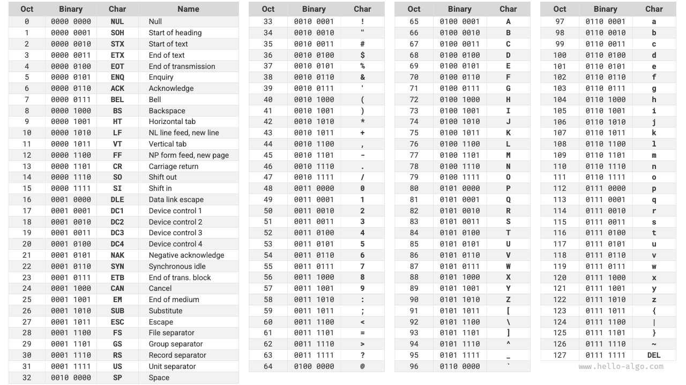
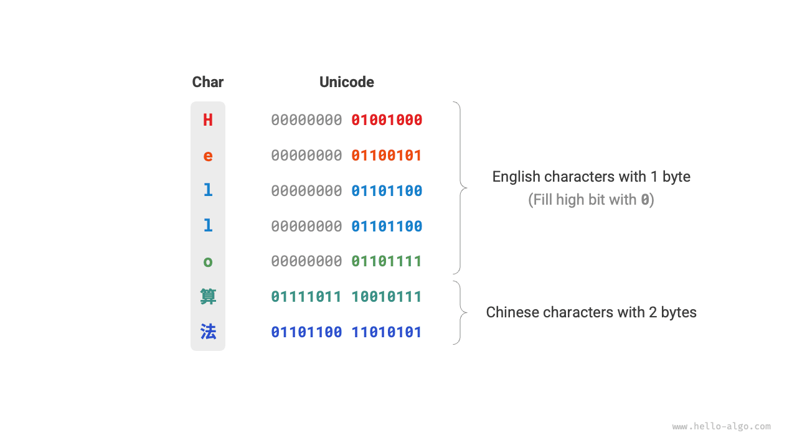
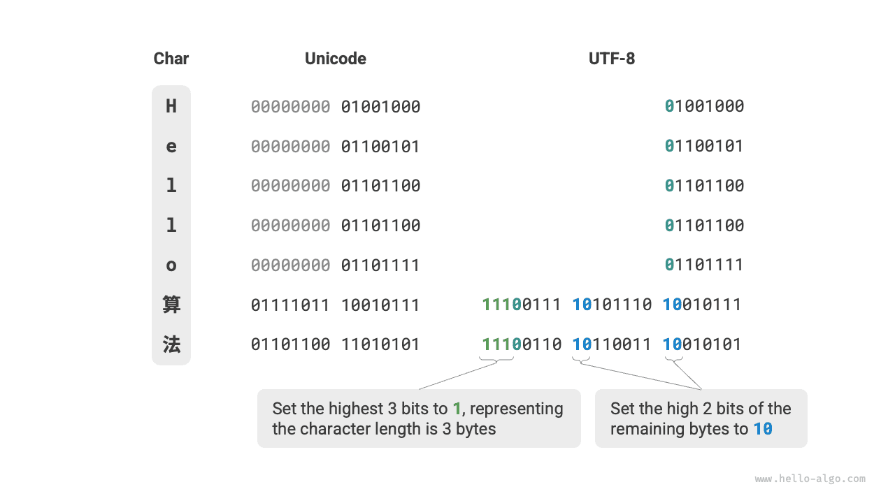

# Karakterkódolás *

A számítógépekben minden adat bináris formában tárolódik, és a `char` karakter sem kivétel. A karakterek ábrázolásához egy „karakterkészletet" kell kialakítani, amely egyértelmű megfeleltetést határoz meg az egyes karakterek és a bináris számok között. Egy karakterkészlettel a számítógépek a bináris számokat táblázatban való keresés segítségével karakterekké tudják alakítani.

## ASCII karakterkészlet

Az <u>ASCII kód</u> a legkorábbi karakterkészlet, teljes neve American Standard Code for Information Interchange (Amerikai Szabványos Kódolás Információcserére). 7 bináris bitet (egy bájt alsó 7 bitjét) használ egy karakter ábrázolásához, és legfeljebb 128 különböző karaktert tud megjeleníteni. Ahogy az alábbi ábra mutatja, az ASCII kód tartalmaz nagybetűs és kisbetűs angol betűket, 0-tól 9-ig terjedő számjegyeket, egyes írásjeleket és bizonyos vezérlőkaraktereket (például sortörés és tabulátor).

Azonban **az ASCII kód csak az angolt tudja ábrázolni**. A számítógépek globalizálódásával megjelent egy <u>EASCII</u> nevű karakterkészlet, amely több nyelvet is képes megjeleníteni. Az ASCII 7 bites alapjáról 8 bitre bővül, és 256 különböző karaktert tud ábrázolni.

Világszerte egymás után jelentek meg a különböző régiókhoz alkalmazkodó EASCII karakterkészletek. E karakterkészletek első 128 karaktere egységesen az ASCII kódra épül, az utolsó 128 karakter pedig különbözőképpen van meghatározva az egyes nyelvek igényeinek megfelelően.

## GBK karakterkészlet

Később kiderült, hogy **az EASCII kód sem tud eleget tenni sok nyelv karaktermennyiségi igényeinek**. Például a kínai jelekből közel százezer létezik, és naponta több ezret használnak. 1980-ban a Kínai Nemzeti Szabványügyi Hivatal közzétette a <u>GB2312</u> karakterkészletet, amely 6763 kínai karaktert tartalmazott, alapvetően kielégítve a kínai karakterek számítógépes feldolgozásának igényeit.

A GB2312 azonban nem tudott kezelni bizonyos ritka és hagyományos kínai karaktereket. A <u>GBK</u> karakterkészlet a GB2312 alapján bővített változat, összesen 21 886 kínai karaktert tartalmaz. A GBK kódolási sémában az ASCII karakterek egy bájttal, a kínai karakterek két bájttal vannak ábrázolva.

## Unicode karakterkészlet

A számítógépes technológia dinamikus fejlődésével a karakterkészletek és kódolási szabványok elburjánzottak, ami sok problémát okozott. Egyrészt ezek a karakterkészletek általában csak adott nyelvek karaktereit határozzák meg, és többnyelvű környezetben nem működnek rendesen. Másrészt ugyanahhoz a nyelvhez is több karakterkészlet-szabvány létezik, és ha két számítógép különböző kódolási szabványt alkalmaz, az információcsere során torz karakterek (mojibake) jelennek meg.

Az akkori kutatók gondolkodásának lényege ez volt: **Ha kiadnak egy kellően átfogó karakterkészletet, amely a világ összes nyelvét és szimbólumát tartalmazza, vajon nem oldhatók-e meg ezzel a többnyelvű környezeti problémák és a torz karakterek?** Ettől az ötlettől hajtva megszületett egy nagy és átfogó karakterkészlet: a Unicode.

A <u>Unicode</u>-ot magyarban „Egységes kódolásnak" nevezhetjük, és elméletben egymillió karakternél is többet képes befogadni. Célja, hogy a világ összes nyelvének karakterét egységes karakterkészletbe foglalja, és egy általános karakterkészletet biztosítson a különböző nyelvű szövegek kezeléséhez és megjelenítéséhez, csökkentve a különböző kódolási szabványok által okozott torz karakterek problémáját.

1991-es kiadása óta a Unicode folyamatosan bővül, új nyelveket és karaktereket foglal magába. 2022 szeptemberétől a Unicode 149 186 karaktert tartalmazott, köztük különböző nyelvek karaktereit, szimbólumait és még emojikat is. A hatalmas Unicode karakterkészletben a közhasználatú karakterek 2 bájtot, egyes ritka karakterek 3 vagy akár 4 bájtot foglalnak el.

A Unicode egy általános karakterkészlet, amely lényegében minden karakterhez hozzárendel egy számot (ezt „kódpontnak" nevezzük), **de nem határozza meg, hogyan kell ezeket a karakterkódpontokat a számítógépekben tárolni**. Felvetődik a kérdés: ha egy szövegben különböző hosszúságú Unicode kódpontok jelennek meg egyszerre, hogyan értelmezi a rendszer a karaktereket? Például egy 2 bájt hosszú kódolás esetén hogyan határozza meg a rendszer, hogy az egy 2 bájtos karakter-e vagy két 1 bájtos karakter?

A fenti problémára **egy egyszerű megoldás az összes karakter azonos hosszúságú kódolásban való tárolása**. Ahogy az alábbi ábra mutatja, a „Hello" minden karaktere 1 bájtot foglal el, az „算法" (algoritmus) minden karaktere pedig 2 bájtot. A „Hello 算法" összes karakterét 2 bájt hosszúságú kódolásra hozhatjuk azáltal, hogy a magas biteket nullákkal töltjük ki. Így a rendszer minden 2 bájtot egy karakterként értelmezhet, és visszaállíthatja az összetétel tartalmát.

Az ASCII kód azonban már bebizonyította, hogy az angol kódolásához elegendő 1 bájt. Ha a fenti sémát alkalmazzuk, az angol szöveg mérete kétszerese lenne az ASCII kódoláshoz képest, ami nagy memóriapazarlást jelent. Ezért hatékonyabb Unicode kódolási módszerre van szükségünk.

## UTF-8 kódolás

Jelenleg az UTF-8 a legelterjedtebb Unicode kódolási módszer nemzetközileg. **Ez egy változó hosszúságú kódolás**, amely 1-től 4 bájtot használ egy karakter ábrázolásához, a karakter összetettségétől függően. Az ASCII karakterekhez csak 1 bájt szükséges, a latin és görög betűkhöz 2 bájt, a közhasználatú kínai karakterekhez 3 bájt, egyes más ritka karakterekhez pedig 4 bájt.

Az UTF-8 kódolási szabályai nem bonyolultak, és a következő két esetre bonthatók.

- Az 1 bájtos karakterek esetén a legmagasabb bitet $0$-ra kell állítani, a maradék 7 bitet pedig a Unicode kódpontra. Érdemes megjegyezni, hogy az ASCII karakterek a Unicode karakterkészlet első 128 kódpontját foglalják el. Vagyis **az UTF-8 kódolás visszafelé kompatibilis az ASCII kóddal**. Ez azt jelenti, hogy UTF-8-cal régi ASCII kódolású szövegeket is értelmezhetünk.
- Az $n$ bájt hosszúságú karakterek esetén (ahol $n > 1$) az első bájt legmagasabb $n$ bitjét $1$-re kell állítani, az $(n + 1)$-edik bitet $0$-ra; a második bájttól kezdve minden bájt legmagasabb 2 bitjét $10$-re kell állítani; a fennmaradó összes bitet a karakter Unicode kódpontjának kitöltésére használjuk.

Az alábbi ábra a „Hello算法" UTF-8 kódolását mutatja. Megfigyelhető, hogy mivel a legmagasabb $n$ bit mind $1$-re van állítva, a rendszer az $1$-es legmagasabb bitek számának olvasásával meg tudja határozni a karakter $n$ hosszát.

De miért kell minden más bájt legmagasabb 2 bitjét $10$-re állítani? Valójában ez a $10$ ellenőrző szimbólumként szolgál. Tegyük fel, hogy a rendszer egy helytelen bájtból kezdi a szöveg értelmezését; a bájt elején lévő $10$ segít a rendszernek gyorsan felismerni a rendellenességet.

A $10$ ellenőrző szimbólumként való alkalmazásának oka az, hogy az UTF-8 kódolási szabályok szerint lehetetlen, hogy egy karakter legmagasabb két bitje $10$ legyen. Ez az állítás ellentmondással igazolható: feltételezve, hogy egy karakter legmagasabb két bitje $10$, ez azt jelenti, hogy a karakter hossza $1$, ami ASCII kódnak felel meg. Az ASCII kód legmagasabb bitje azonban $0$ kellene legyen, ami ellentmond a feltételezésnek.

Az UTF-8-on kívül a közismert kódolási módszerek közé tartozik még a következő kettő.

- **UTF-16 kódolás**: 2 vagy 4 bájtot használ egy karakter ábrázolásához. Az összes ASCII karakter és a közhasználatú nem-angol karakterek 2 bájttal vannak ábrázolva; néhány karakterhez 4 bájt szükséges. A 2 bájtos karakterek esetén az UTF-16 kódolás egyenlő a Unicode kódponttal.
- **UTF-32 kódolás**: Minden karakter 4 bájtot használ. Ez azt jelenti, hogy az UTF-32 több helyet foglal el, mint az UTF-8 és az UTF-16, különösen az ASCII karaktereket nagy arányban tartalmazó szövegek esetén.

A tárolt hely szempontjából az UTF-8 nagyon hatékony az angol karakterek ábrázolásához, mivel csak 1 bájt szükséges; az UTF-16 kódolás bizonyos nem-angol karakterek (például kínai) esetén hatékonyabb, mivel csak 2 bájt szükséges, míg az UTF-8 esetleg 3 bájtot igényel.

Kompatibilitás szempontjából az UTF-8 rendelkezik a legjobb általánossággal, és sok eszköz és könyvtár elsődlegesen az UTF-8-at támogatja.

## Karakterkódolás a programozási nyelvekben

A legtöbb korábbi programozási nyelvben a programfutás közbeni karakterláncok rögzített hosszúságú kódolást, például UTF-16-ot vagy UTF-32-t alkalmaznak. Rögzített hosszúságú kódolás esetén a karakterláncokat tömbként kezelhetjük a feldolgozáshoz, és ennek a megközelítésnek a következő előnyei vannak.

- **Véletlenszerű hozzáférés**: Az UTF-16 kódolású karakterláncokhoz könnyen lehet véletlenszerűen hozzáférni. Az UTF-8 változó hosszúságú kódolás. Az $i$-edik karakter megkereséséhez a karakterlánc elejétől az $i$-edik karakterig kell bejárni, ami $O(n)$ időt igényel.
- **Karakterszámlálás**: A véletlenszerű hozzáféréshez hasonlóan egy UTF-16 kódolású karakterlánc hosszának kiszámítása is $O(1)$ műveleti idejű. Egy UTF-8 kódolású karakterlánc hosszának kiszámításához azonban az egész karakterláncot be kell járni.
- **Karakterlánc-műveletek**: Sok karakterlánc-művelet (például felosztás, összefűzés, beillesztés, törlés stb.) az UTF-16 kódolású karakterláncokkal könnyebben elvégezhető. Az UTF-8 kódolású karakterláncokon végzett ilyen műveletek általában további számításokat igényelnek, hogy biztosítsák, ne keletkezzen érvénytelen UTF-8 kódolás.

Valójában a programozási nyelvek karakterkódolási sémáinak tervezése nagyon érdekes téma, sok tényezőt érint.

- A Java `String` típusa UTF-16 kódolást alkalmaz, minden karakter 2 bájtot foglal el. Ennek oka, hogy a Java nyelv tervezésekor úgy gondolták, hogy 16 bit elegendő az összes lehetséges karakter ábrázolásához. Ez azonban helytelen ítélet volt. Később a Unicode specifikáció meghaladta a 16 bitet, így a Java karakterei most „helyettesítő párok" formájában is megjelenhetnek (16 bites értékek párja).
- A JavaScript és TypeScript karakterláncai UTF-16 kódolást alkalmaznak, hasonló okokból mint a Java. Amikor a Netscape 1995-ben bevezette a JavaScript nyelvet, a Unicode még fejlesztés korai szakaszában volt, és akkoriban a 16 bites kódolás elegendő volt az összes Unicode karakter ábrázolásához.
- A C# UTF-16 kódolást alkalmaz főként azért, mert a .NET platformot a Microsoft tervezte, és a Microsoft technológiái (köztük a Windows operációs rendszer) széles körben használják az UTF-16 kódolást.

A fenti programozási nyelvek karaktermennyiségre vonatkozó alábecsülése miatt „helyettesítő párok" módszerét kellett alkalmazni a 16 bitet meghaladó hosszúságú Unicode karakterek ábrázolásához. Ez egy kényszer kompromisszum. Egyrészt helyettesítő párokat tartalmazó karakterláncokban egy karakter 2 bájtot vagy 4 bájtot is elfoglalhat, elveszítve ezzel a rögzített hosszúságú kódolás előnyét. Másrészt a helyettesítő párok kezelése további kódot igényel, ami növeli a programozás összetettségét és a hibakeresés nehézségét.

A fentiek miatt egyes programozási nyelvek különböző kódolási sémákat javasoltak.

- A Python `str` típusa Unicode kódolást alkalmaz, és rugalmas karakterlánc-ábrázolást valósít meg, ahol a tárolt karakterek hossza a karakterláncban lévő legnagyobb Unicode kódponttól függ. Ha a karakterlánc összes karaktere ASCII karakter, minden karakter 1 bájtot foglal el; ha vannak az ASCII tartományon túli, de az Alapvető Többnyelvű Síkon (BMP) belüli karakterek, minden karakter 2 bájtot foglal el; ha vannak a BMP-t meghaladó karakterek, minden karakter 4 bájtot foglal el.
- A Go nyelv `string` típusa belsőleg UTF-8 kódolást alkalmaz. A Go nyelv biztosítja a `rune` típust is, amely egy egyedi Unicode kódpont ábrázolására szolgál.
- A Rust nyelv `str` és `String` típusai belsőleg UTF-8 kódolást alkalmaznak. A Rust biztosítja a `char` típust is egy egyedi Unicode kódpont ábrázolásához.

Megjegyzendő, hogy a fenti megbeszélés arról szól, hogyan tárolódnak a karakterláncok a programozási nyelvekben, **ami különbözik attól, ahogy a karakterláncok fájlokban tárolódnak vagy hálózaton keresztül kerülnek átvitelre**. Fájltárolás vagy hálózati átvitel esetén a karakterláncokat általában UTF-8 formátumba kódoljuk az optimális kompatibilitás és tárhelyek hatékonysága érdekében.
