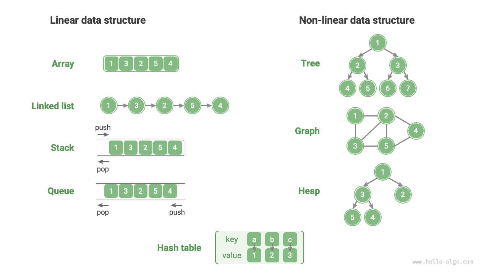
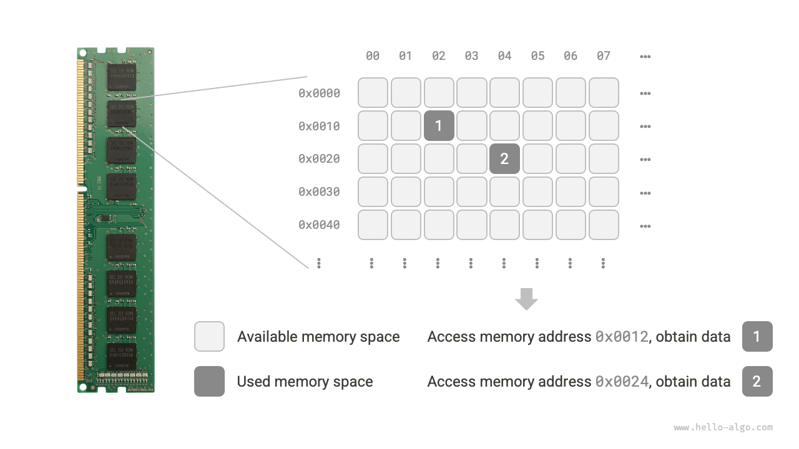

# Az adatszerkezetek osztályozása

A közismert adatszerkezetek közé tartoznak a tömbök, a láncolt listák, veremek, sorok, hasítótáblák, fák, kupacok és gráfok. Ezek két dimenzió szerint osztályozhatók: „logikai szerkezet" és „fizikai szerkezet".

## Logikai szerkezet: lineáris és nemlineáris

**A logikai szerkezet feltárja az adatelemek közötti logikai kapcsolatokat**. A tömbökben és a láncolt listákban az adatok bizonyos sorrendben vannak elrendezve, megtestesítve az adatok lineáris viszonyát; míg a fákban az adatok felülről lefelé hierarchikusan rendeződnek, megmutatva az „ősök" és „leszármazottak" közötti levezetési kapcsolatot; a gráfok csomópontokból és élekből épülnek fel, tükrözve az összetett hálózati kapcsolatokat.

Ahogy az alábbi ábra mutatja, a logikai szerkezetek két fő kategóriába sorolhatók: „lineáris" és „nemlineáris". A lineáris szerkezetek szemléletesebbek, azt jelzik, hogy az adatok logikai kapcsolataikban lineárisan rendeződnek el; a nemlineáris szerkezetek ezzel szemben nemlineárisan rendeződnek.

- **Lineáris adatszerkezetek**: Tömbök, láncolt listák, veremek, sorok, hasítótáblák, ahol az elemek egy-egy sorrendi kapcsolatban állnak egymással.
- **Nemlineáris adatszerkezetek**: Fák, kupacok, gráfok, hasítótáblák.

A nemlineáris adatszerkezetek tovább bonthatók faszerkezetekre és hálózati szerkezetekre.

- **Faszerkezetek**: Fák, kupacok, hasítótáblák, ahol az elemek egy-sok kapcsolatban állnak egymással.
- **Hálózati szerkezetek**: Gráfok, ahol az elemek sok-sok kapcsolatban állnak egymással.

## Fizikai szerkezet: összefüggő és szétszórt

**Amikor egy algoritmusprogram fut, a feldolgozandó adatok főként a memóriában tárolódnak**. Az alábbi ábra egy számítógépes memóriamodult mutat, ahol minden fekete négyzet egy memóriahelyet tartalmaz. A memóriát egy hatalmas Excel-táblázatnak képzelhetjük el, ahol minden cella bizonyos mennyiségű adatot tud tárolni.

**A rendszer memóriacímek segítségével fér hozzá az adatokhoz a célhelyen**. Ahogy az alábbi ábra mutatja, a számítógép meghatározott szabályok szerint számot rendel a táblázat minden cellájához, biztosítva, hogy minden memóriahely egyedi memóriacímmel rendelkezzen. E címek segítségével a program hozzáférhet a memóriában lévő adatokhoz.

!!! tip

    Érdemes megjegyezni, hogy a memória Excel-táblázathoz való hasonlítása egyszerűsített analógia. A memória tényleges működési mechanizmusa sokkal összetettebb, olyan fogalmakat érint, mint a címtér, a memóriakezelés, a gyorsítótárazási mechanizmusok, a virtuális memória és a fizikai memória.

A memória az összes program közös erőforrása. Amikor egy memóriablokk el van foglalva egy program által, általában nem használható egyidejűleg más programok által. **Ezért az adatszerkezetek és algoritmusok tervezésekor a memória-erőforrások fontos szempontok**. Például egy algoritmus által elfoglalt csúcsmemória nem lépheti túl a rendszer fennmaradó szabad memóriáját; ha nincs elegendő összefüggő nagy memóriablokk, akkor a kiválasztott adatszerkezetnek szétszórt memóriaterületeken is tárolhatónak kell lennie.

Ahogy az alábbi ábra mutatja, **a fizikai szerkezet azt tükrözi, hogyan tárolódnak az adatok a számítógép memóriájában**, és két részre osztható: összefüggő tárterület-tárolás (tömbök) és szétszórt tárterület-tárolás (láncolt listák). A két fizikai szerkezet az időbeli hatékonyság és a térbeli hatékonyság tekintetében kiegészítő jellemzőket mutat.

Érdemes megjegyezni, hogy **minden adatszerkezet tömbök, láncolt listák alapján vagy mindkettő kombinációján valósul meg**. Például a veremek és sorok megvalósíthatók tömbökkel és láncolt listákkal egyaránt; a hasítótáblák megvalósítása tartalmazhat tömböket és láncolt listákat is.

- **Tömbök alapján megvalósítható**: Veremek, sorok, hasítótáblák, fák, kupacok, gráfok, mátrixok, tenzorok (legalább $3$ dimenziós tömbök) stb.
- **Láncolt listák alapján megvalósítható**: Veremek, sorok, hasítótáblák, fák, kupacok, gráfok stb.

Az inicializálás után a láncolt listák a programfutás közben is módosíthatják hosszukat, ezért „dinamikus adatszerkezeteknek" is nevezzük őket. Az inicializálás után a tömbök hossza nem változtatható meg, ezért „statikus adatszerkezeteknek" is nevezzük őket. Érdemes megjegyezni, hogy a tömbök memória-átfoglalással képesek hosszváltoztatásra, így bizonyos fokú „dinamizmust" tesznek lehetővé.

!!! tip

    Ha nehéznek találja a fizikai szerkezet megértését, javasolt először elolvasni a következő fejezetet, majd visszatérni erre a részre.
