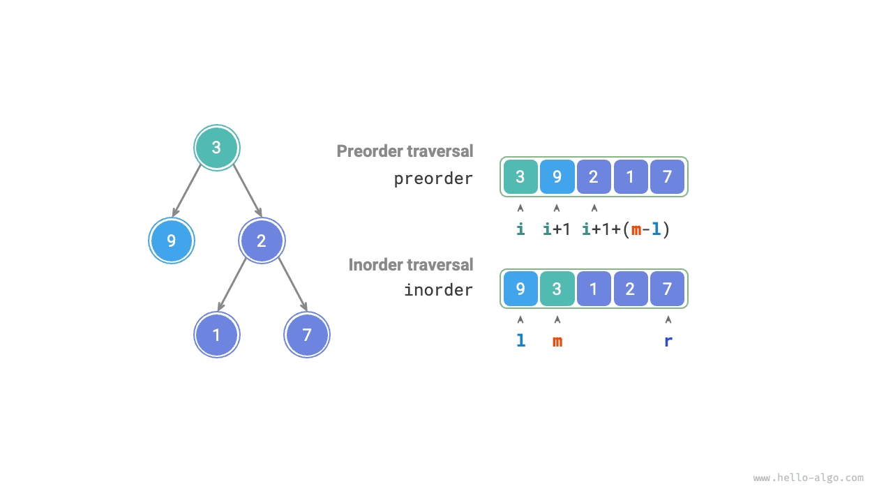
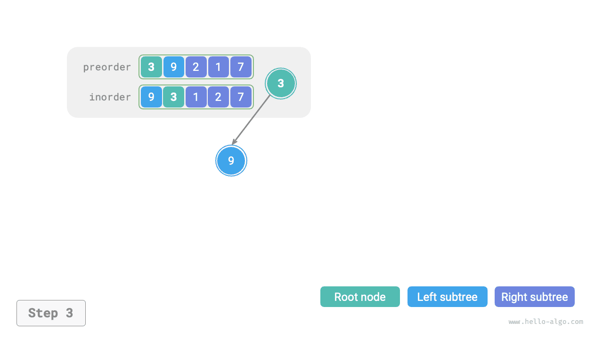
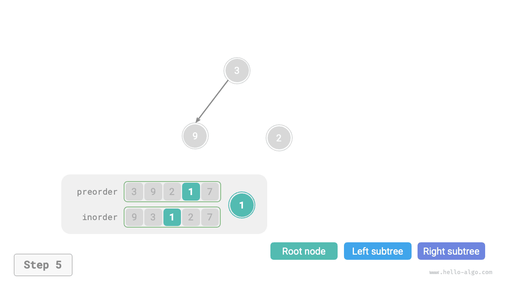
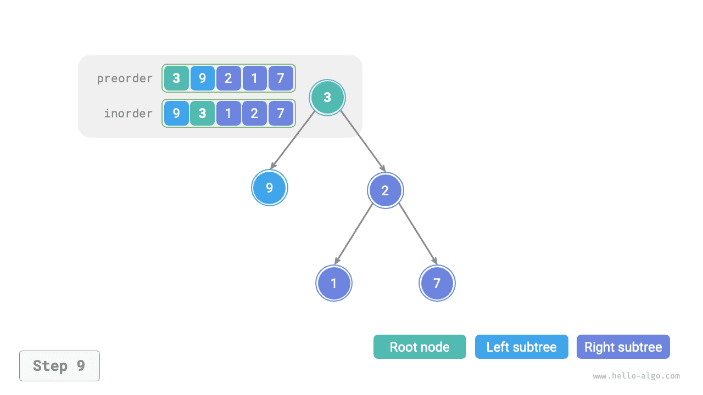

# Bináris fa felépítése probléma

!!! question

    Adott egy bináris fa előrendű bejárása `preorder` és középrendű bejárása `inorder`. Építse fel a bináris fát és adja vissza a gyökércsomópontját. Feltételezzük, hogy a bináris fában nincsenek ismétlődő csomópontértékek (ahogy az alábbi ábra mutatja).


### Annak meghatározása, hogy oszd meg és uralkodj probléma-e

Az eredeti probléma bináris fa felépítése a `preorder` és `inorder` alapján, ami egy tipikus oszd meg és uralkodj probléma.

- **A probléma lebontható**: Az oszd meg és uralkodj szemszögéből az eredeti problémát két részproblémára oszthatjuk: a bal részfa és a jobb részfa felépítésére, plusz egy művelet: a gyökércsomópont inicializálása. Minden részfa (részprobléma) esetén ugyanezt az osztási módszert alkalmazhatjuk, kisebb részfákra (részproblémákra) osztva, amíg el nem érjük a legkisebb részproblémát (üres részfa).
- **A részproblémák függetlenek**: A bal és jobb részfa egymástól független; nincs köztük átfedés. A bal részfa felépítésekor csak a bal részfának megfelelő középrendű és előrendű bejárás részekre kell összpontosítani. Ugyanez érvényes a jobb részfára.
- **A részproblémák megoldásai összefésülhetők**: Ha megvannak a bal és jobb részfák (részproblémák megoldásai), a gyökércsomóponthoz kapcsolhatjuk őket, hogy megkapjuk az eredeti probléma megoldását.

### Hogyan osszuk fel a részfákat

A fenti elemzés alapján ez a probléma oszd meg és uralkodj módszerrel megoldható, **de hogyan osztjuk fel a bal és jobb részfákat az előrendű bejárás `preorder` és a középrendű bejárás `inorder` alapján**?

A definíció szerint mind a `preorder`, mind az `inorder` három részre osztható.

- Előrendű bejárás: `[ Gyökércsomópont | Bal részfa | Jobb részfa ]`, például a fenti ábrán lévő fa esetén: `[ 3 | 9 | 2 1 7 ]`.
- Középrendű bejárás: `[ Bal részfa | Gyökércsomópont ｜ Jobb részfa ]`, például a fenti ábrán lévő fa esetén: `[ 9 | 3 | 1 2 7 ]`.

A fenti ábra adatait felhasználva az alábbi ábrán bemutatott lépésekkel kapjuk meg a felosztás eredményeit.

1. Az előrendű bejárás első eleme, 3, a gyökércsomópont értéke.
2. Megkeressük a 3-as gyökércsomópont indexét az `inorder`-ben, és ezzel az indexszel az `inorder`-t `[ 9 | 3 ｜ 1 2 7 ]` részekre osztjuk.
3. Az `inorder` felosztásának eredménye alapján könnyen meghatározható, hogy a bal és jobb részfának rendre 1 és 3 csomópontja van, ami lehetővé teszi a `preorder` felosztását `[ 3 | 9 | 2 1 7 ]` részekre.


### Részfa-intervallumok leírása változókkal

A fenti felosztási módszer alapján **megkaptuk a gyökércsomópont, a bal részfa és a jobb részfa indexintervallumait a `preorder`-ben és az `inorder`-ben**. Ezeknek az indexintervallumoknak a leírásához több mutatóváltozóra van szükségünk.

- Jelöljük az aktuális fa gyökércsomópontjának indexét a `preorder`-ben $i$-vel.
- Jelöljük az aktuális fa gyökércsomópontjának indexét az `inorder`-ben $m$-mel.
- Jelöljük az aktuális fa indexintervallumát az `inorder`-ben $[l, r]$-rel.

Ahogy az alábbi táblázat mutatja, ezekkel a változókkal le tudjuk írni a gyökércsomópont indexét a `preorder`-ben és a részfák indexintervallumait az `inorder`-ben.

<p align="center"> Table <id> &nbsp; A gyökércsomópont és részfák indexei az előrendű és középrendű bejárásokban </p>

|              | Gyökércsomópont indexe a `preorder`-ben | Részfa indexintervalluma az `inorder`-ben |
| ------------ | --------------------------------------- | ----------------------------------------- |
| Aktuális fa  | $i$                                     | $[l, r]$                                  |
| Bal részfa   | $i + 1$                                 | $[l, m-1]$                                |
| Jobb részfa  | $i + 1 + (m - l)$                       | $[m+1, r]$                                |

Vegyük figyelembe, hogy $(m-l)$ a jobb részfa gyökércsomópontjának indexében „a bal részfa csomópontjainak számát" jelenti. Ajánlott ezt az alábbi ábrával együtt értelmezni.



### Kód megvalósítása

Az $m$ lekérdezésének hatékonyabbá tételéhez egy `hmap` hash táblát használunk az `inorder` tömb elemeinek indexeire mutató leképezés tárolásához:

```src
[file]{build_tree}-[class]{}-[func]{build_tree}
```

Az alábbi ábra a bináris fa rekurzív felépítési folyamatát mutatja be. Minden csomópontot a lefelé irányuló „rekurzió" folyamat során hozunk létre, míg minden élt (referenciát) a felfelé irányuló „visszatérés" folyamat során hozunk létre.

=== "<1>"
    

=== "<2>"
    

=== "<3>"
    

=== "<4>"
    

=== "<5>"
    

=== "<6>"
    

=== "<7>"
    

=== "<8>"
    

=== "<9>"
    

Az előrendű bejárás `preorder` és középrendű bejárás `inorder` felosztásának eredményei minden rekurzív függvényen belül az alábbi ábrán láthatók.


Legyen a fában lévő csomópontok száma $n$. Minden csomópont inicializálása (egy `dfs()` rekurzív függvény végrehajtása) $O(1)$ időt vesz igénybe. **Ezért az összesített időbonyolultság $O(n)$**.

A hash tábla az `inorder` elemeiről az indexeikre mutató leképezést tárolja, amelynek tárhelybonyolultsága $O(n)$. A legrosszabb esetben, amikor a bináris fa láncolt listává fajul, a rekurzió mélysége eléri az $n$-t, $O(n)$ veremkeret tárhelyet használva. **Ezért az összesített tárhelybonyolultság $O(n)$**.
