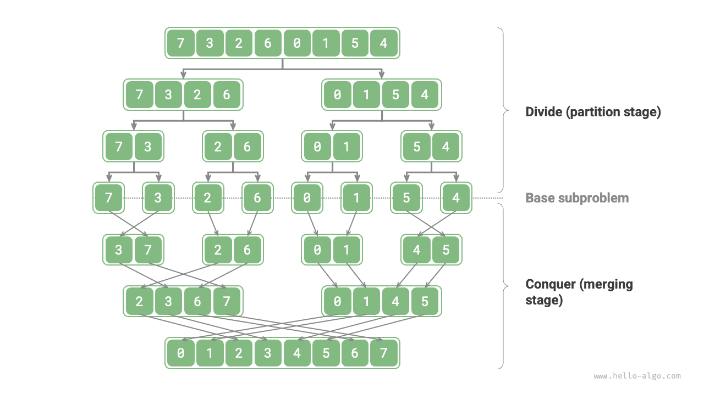
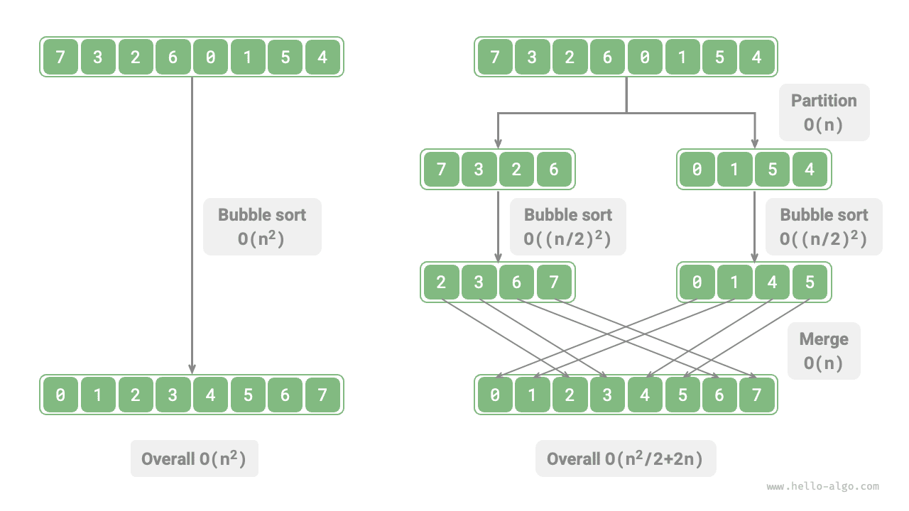
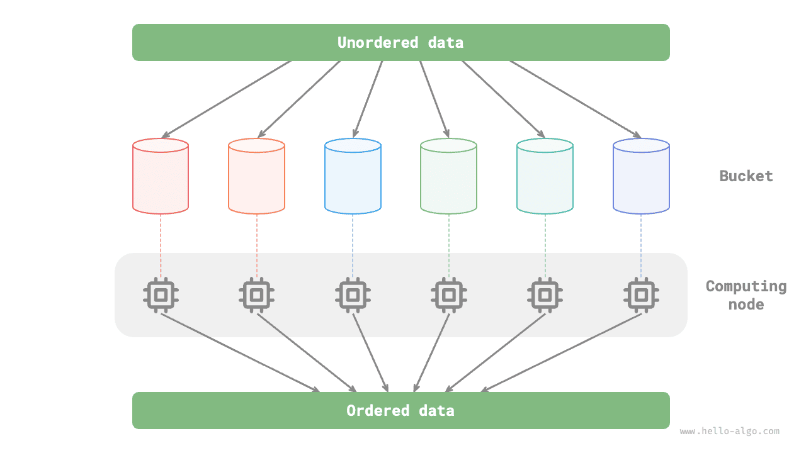

# Oszd meg és uralkodj algoritmusok

Az <u>oszd meg és uralkodj</u> egy nagyon fontos és elterjedt algoritmus-stratégia. Az oszd meg és uralkodj jellemzően rekurzión alapul, és két lépésből áll: „felosztás" és „meghódítás".

1. **Felosztás (particionálási fázis)**: Az eredeti problémát rekurzívan két vagy több részproblémára osztjuk, amíg el nem érjük a legkisebb részproblémát.
2. **Meghódítás (összefésülési fázis)**: Az ismert megoldással rendelkező legkisebb részproblémáktól kezdve alulról felfelé összefésüljük a részproblémák megoldásait, hogy megkapjuk az eredeti probléma megoldását.

Ahogy az alábbi ábra is mutatja, az „összefésüléses rendezés" az oszd meg és uralkodj stratégia egyik tipikus alkalmazása.

1. **Felosztás**: Az eredeti tömböt (eredeti probléma) rekurzívan két résztömbre (részprobléma) osztjuk, amíg a résztömb csak egy elemet tartalmaz (legkisebb részprobléma).
2. **Meghódítás**: Az alulról felfelé összefésüljük a rendezett résztömböket (részproblémák megoldásait), hogy megkapjuk a rendezett eredeti tömböt (az eredeti probléma megoldását).

## Hogyan azonosítsuk az oszd meg és uralkodj problémákat

Azt, hogy egy probléma megoldható-e az oszd meg és uralkodj módszerrel, általában az alábbi szempontok alapján lehet meghatározni.

1. **A probléma lebontható**: Az eredeti probléma kisebb, hasonló részproblémákra osztható, és ugyanúgy rekurzívan tovább osztható.
2. **A részproblémák függetlenek**: A részproblémák között nincs átfedés, egymástól függetlenek és önállóan megoldhatók.
3. **A részproblémák megoldásai összefésülhetők**: Az eredeti probléma megoldása a részproblémák megoldásainak összefésülésével kapható meg.

Nyilvánvaló, hogy az összefésüléses rendezés megfelel mindhárom feltételnek.

1. **A probléma lebontható**: A tömböt (eredeti probléma) rekurzívan két résztömbre (részprobléma) osztjuk.
2. **A részproblémák függetlenek**: Minden résztömb önállóan rendezhető (a részproblémák egymástól függetlenül megoldhatók).
3. **A részproblémák megoldásai összefésülhetők**: Két rendezett résztömb (részproblémák megoldásai) összefésülhető egyetlen rendezett tömbbé (az eredeti probléma megoldása).

## Hatékonyság javítása oszd meg és uralkodj segítségével

**Az oszd meg és uralkodj nemcsak hatékonyan oldja meg az algoritmikus problémákat, hanem gyakran javítja az algoritmus hatékonyságát is**. A rendezési algoritmusok között a gyors rendezés, az összefésüléses rendezés és a kupacrendezés gyorsabb, mint a kiválasztásos, buborékos és beillesztéses rendezés, mert az oszd meg és uralkodj stratégiát alkalmazzák.

Ez felveti a kérdést: **Miért javítja az oszd meg és uralkodj az algoritmus hatékonyságát, és mi az alapvető logika?** Más szóval, miért hatékonyabb egy nagy problémát több részproblémára osztani, megoldani azokat, majd összefésülni a megoldásokat, mint közvetlenül megoldani az eredeti problémát? Ezt a kérdést két szempontból lehet megközelíteni: a műveletek számától és a párhuzamos számítástól.

### Műveletek számának optimalizálása

Vegyük példaként a „buborékos rendezést": egy $n$ hosszúságú tömb feldolgozása $O(n^2)$ időt igényel. Tegyük fel, hogy a tömböt a középponttól két résztömbre osztjuk, ahogy az alábbi ábra mutatja: a felosztás $O(n)$ időt vesz igénybe, minden résztömb rendezése $O((n / 2)^2)$ időt, a két résztömb összefésülése $O(n)$ időt, és az összesített időbonyolultság:

$$
O(n + (\frac{n}{2})^2 \times 2 + n) = O(\frac{n^2}{2} + 2n)
$$

Ezután kiszámítjuk az alábbi egyenlőtlenséget, ahol a bal és jobb oldal a felosztás előtti és utáni összes műveletek számát jelenti:

$$
\begin{aligned}
n^2 & > \frac{n^2}{2} + 2n \newline
n^2 - \frac{n^2}{2} - 2n & > 0 \newline
n(n - 4) & > 0
\end{aligned}
$$

**Ez azt jelenti, hogy ha $n > 4$, a felosztás utáni műveletek száma kisebb, és a rendezés hatékonysága magasabb**. Megjegyzendő, hogy a felosztás utáni időbonyolultság még mindig négyzetes $O(n^2)$, de a bonyolultságban szereplő konstans tag kisebb lett.

Tovább gondolva, **mi történik, ha a résztömböket folyamatosan a középponttól kettéosztjuk**, amíg csak egyetlen elem marad? Ez valójában az „összefésüléses rendezés", amelynek időbonyolultsága $O(n \log n)$.

Tovább gondolkodva, **mi van, ha több felosztási pontot állítunk be** és az eredeti tömböt egyenletesen $k$ résztömbre osztjuk? Ez a helyzet nagyon hasonlít a „vödör rendezéshez", amely jól alkalmazható hatalmas mennyiségű adat rendezésére, elméleti időbonyolultsága $O(n + k)$.

### Párhuzamos számítás optimalizálása

Tudjuk, hogy az oszd meg és uralkodj által generált részproblémák egymástól függetlenek, **ezért általában párhuzamosan oldhatók meg**. Ez azt jelenti, hogy az oszd meg és uralkodj nemcsak az algoritmusok időbonyolultságát csökkenti, **hanem párhuzamos optimalizálás előnyeit is élvezi az operációs rendszerek részéről**.

A párhuzamos optimalizálás különösen hatékony többmagos vagy többprocesszoros környezetekben, ahol a rendszer egyszerre képes több részproblémát kezelni, teljesebben kihasználva a számítási erőforrásokat és jelentősen csökkentve az összesített futási időt.

Például az alábbi ábrán bemutatott „vödör rendezés" esetén hatalmas mennyiségű adatot egyenletesen osztunk el különböző vödrök között, és az összes vödör rendezési feladata kiosztható különböző számítási egységekre. A befejezés után az eredmények összefésülésre kerülnek.

## Az oszd meg és uralkodj közönséges alkalmazásai

Egyrészt az oszd meg és uralkodj számos klasszikus algoritmikus probléma megoldására használható.

- **A legközelebbi pontpár megkeresése**: Ez az algoritmus először két részre osztja a ponthalmazt, majd mindkét részben külön-külön megkeresi a legközelebbi pontpárt, végül megkeresi a mindkét részt átívelő legközelebbi pontpárt.
- **Nagy egész számok szorzása**: Például a Karatsuba-algoritmus, amely a nagy egész számok szorzását kisebb egész számok szorzásaira és összeadásaira bontja le.
- **Mátrixszorzás**: Például a Strassen-algoritmus, amely a nagy mátrixszorzást több kisebb mátrixszorzásra és összeadásra bontja le.
- **Hanoi-probléma**: A Hanoi-probléma rekurzióval megoldható, ami az oszd meg és uralkodj stratégia tipikus alkalmazása.
- **Inverzió-párok meghatározása**: Egy sorozatban, ha egy korábbi szám nagyobb egy következőnél, ez a két szám inverzió-párt alkot. Az inverzió-párok meghatározása felhasználhatja az oszd meg és uralkodj megközelítést az összefésüléses rendezés segítségével.

Másrészt az oszd meg és uralkodj széles körben alkalmazható algoritmusok és adatstruktúrák tervezésében.

- **Bináris keresés**: A bináris keresés egy rendezett tömböt a középső index alapján két részre oszt, majd az eredmény összehasonlítása alapján (célérték és a középső elem értéke között) dönt arról, melyik felét zárja ki, és ugyanezt a bináris műveletet végzi el a megmaradó intervallumon.
- **Összefésüléses rendezés**: Már bemutatásra került a fejezet elején, nem szükséges részletezni.
- **Gyors rendezés**: A gyors rendezés kiválaszt egy pivot értéket, majd a tömböt két résztömbre osztja – az egyikben a pivotnál kisebb, a másikban a pivotnál nagyobb elemek vannak –, majd ugyanezt az osztási műveletet végzi el mindkét részen, amíg a résztömbök csak egy elemet tartalmaznak.
- **Vödör rendezés**: A vödör rendezés alapötlete az, hogy az adatokat több vödörbe szórjuk szét, majd minden vödörben rendezzük az elemeket, és végül minden vödörből sorban kiszedve megkapjuk a rendezett tömböt.
- **Fák**: Például bináris keresési fák, AVL-fák, piros-fekete fák, B-fák, B+-fák stb. Keresési, beillesztési és törlési műveleteik mind az oszd meg és uralkodj stratégia alkalmazásainak tekinthetők.
- **Kupacok**: A kupac egy speciális teljes bináris fa, és különböző műveletei, mint a beillesztés, törlés és kupacosítás, valójában az oszd meg és uralkodj gondolatát tükrözik.
- **Hash táblák**: Bár a hash táblák nem alkalmazzák közvetlenül az oszd meg és uralkodj stratégiát, néhány hash-ütközés-feloldási megoldás közvetve alkalmazza azt. Például a láncolásban lévő hosszú láncolt listák piros-fekete fákká alakíthatók a lekérdezési hatékonyság javítása érdekében.

Látható, hogy **az oszd meg és uralkodj egy „finoman mindenhol jelen lévő" algoritmikus gondolat**, amely beépül különböző algoritmusokba és adatstruktúrákba.
