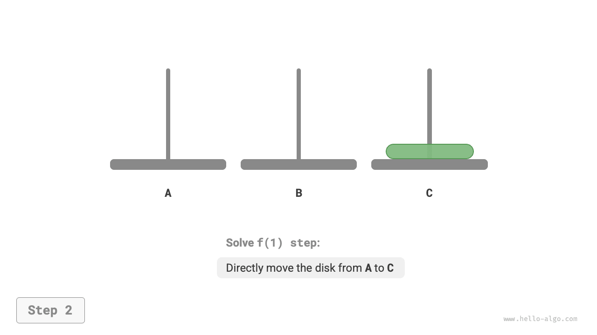
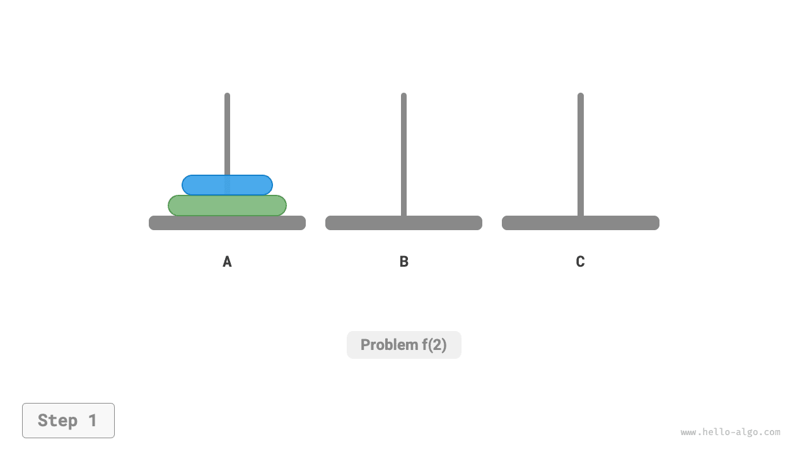
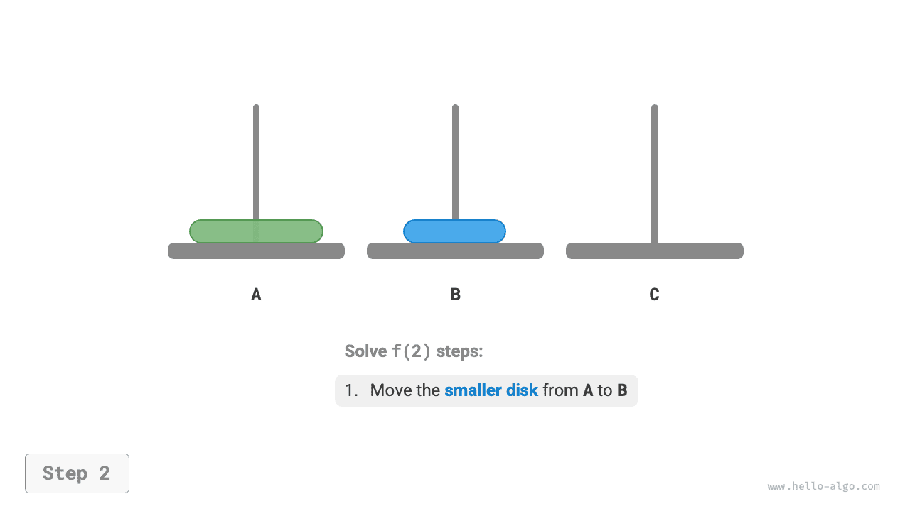
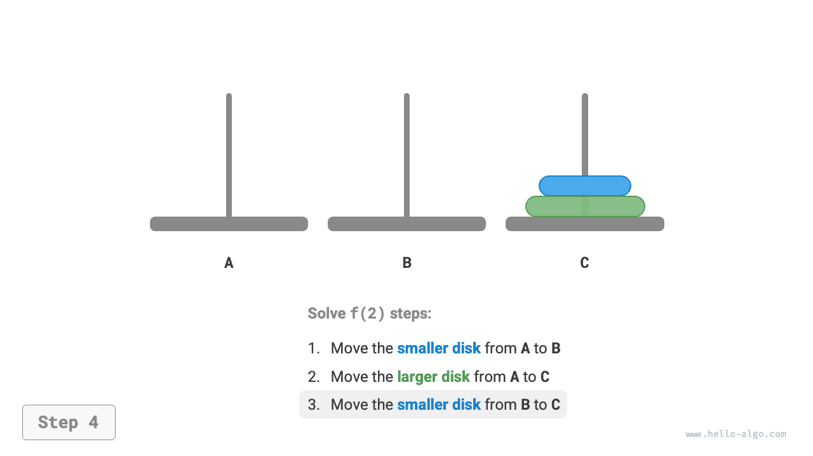
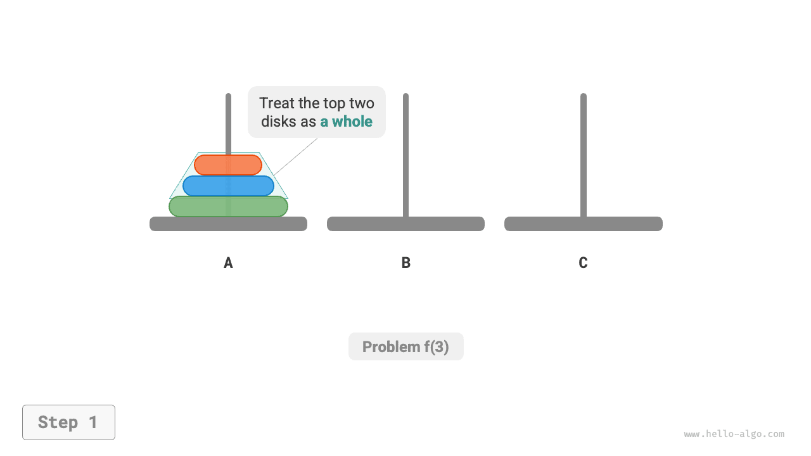
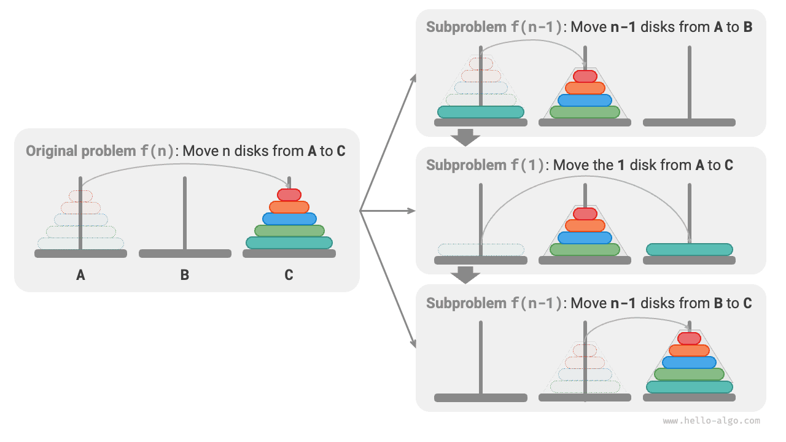

# Hanoi-probléma

Az összefésüléses rendezésnél és a bináris fák felépítésénél az eredeti problémát két, az eredeti probléma méretének felével rendelkező részproblémára bontottuk. A Hanoi-problémánál azonban egy eltérő lebontási stratégiát alkalmazunk.

!!! question

    Adott három oszlop, amelyeket `A`, `B` és `C`-vel jelölünk. Kezdetben az `A` oszlopon $n$ korong van egymásra rakva, méret szerint növekvő sorrendben alulról fölfelé. Feladatunk, hogy ezt az $n$ korongot az `A` oszlopról a `C` oszlopra helyezzük át, az eredeti sorrendjüket megőrizve (ahogy az alábbi ábra mutatja). A korongok mozgatásakor a következő szabályokat kell betartani.

    1. Egy korongot csak egy oszlop tetejéről lehet levenni és egy másik oszlop tetejére helyezni.
    2. Egyszerre csak egy korongot lehet mozgatni.
    3. Egy kisebb korongnak mindig egy nagyobb korong tetején kell lennie.


**A $i$ méretű Hanoi-problémát $f(i)$-vel jelöljük**. Például $f(3)$ jelöli azt, hogy $3$ korongot kell áthelyezni az `A`-ról a `C`-re.

### Az alapesetek vizsgálata

Ahogy az alábbi ábra mutatja, az $f(1)$ problémánál, amikor csak egy korong van, közvetlenül átmozdíthatjuk az `A`-ról a `C`-re.

=== "<1>"
    

=== "<2>"
    

Ahogy az alábbi ábra mutatja, az $f(2)$ problémánál, amikor két korong van, **mivel mindig ügyelni kell arra, hogy a kisebb korong a nagyobb felett legyen, a mozgatáshoz `B`-t kell segítségül hívnunk**.

1. Először mozgassuk a kisebb korongot az `A`-ról a `B`-re.
2. Majd mozgassuk a nagyobb korongot az `A`-ról a `C`-re.
3. Végül mozgassuk a kisebb korongot a `B`-ről a `C`-re.

=== "<1>"
    

=== "<2>"
    

=== "<3>"
    

=== "<4>"
    

Az $f(2)$ megoldásának folyamata így foglalható össze: **két korong átmozgatása az `A`-ról a `C`-re a `B` segítségével**. Itt `C` a céloszlop, `B` pedig a pufferoszlop.

### Részprobléma-lebontás

Az $f(3)$ problémánál, amikor három korong van, a helyzet kissé bonyolultabb.

Mivel már ismerjük az $f(1)$ és $f(2)$ megoldásait, az oszd meg és uralkodj szemszögéből gondolkodhatunk, **az `A`-n lévő felső két korongot egységként kezelve**, és az alábbi ábrán bemutatott lépéseket végrehajtva. Így sikeresen átmozgatjuk a három korongot az `A`-ról a `C`-re.

1. Legyen `B` a céloszlop és `C` a pufferoszlop, és mozgassuk a két korongot az `A`-ról a `B`-re.
2. Mozgassuk a maradék korongot közvetlenül az `A`-ról a `C`-re.
3. Legyen `C` a céloszlop és `A` a pufferoszlop, és mozgassuk a két korongot a `B`-ről a `C`-re.

=== "<1>"
    

=== "<2>"
    

=== "<3>"
    

=== "<4>"
    

Lényegében **az $f(3)$ problémát két $f(2)$ részproblémára és egy $f(1)$ részproblémára bontottuk**. A három részprobléma sorban megoldva az eredeti problémát megoldjuk. Ez mutatja, hogy a részproblémák függetlenek és megoldásaik összefésülhetők.

Ebből levezethető a Hanoi-probléma megoldásához szükséges oszd meg és uralkodj stratégia, ahogy az alábbi ábra mutatja: az eredeti $f(n)$ problémát két $f(n-1)$ részproblémára és egy $f(1)$ részproblémára bontjuk, és a három részproblémát a következő sorrendben oldjuk meg.

1. Mozgassuk az $n-1$ korongot az `A`-ról a `B`-re a `C` segítségével.
2. Mozgassuk a maradék $1$ korongot közvetlenül az `A`-ról a `C`-re.
3. Mozgassuk az $n-1$ korongot a `B`-ről a `C`-re az `A` segítségével.

A két $f(n-1)$ részproblémánál **ugyanígy rekurzívan oszthatjuk tovább**, amíg el nem érjük a legkisebb $f(1)$ részproblémát. Az $f(1)$ megoldása ismert, és csak egyetlen mozgatási műveletet igényel.



### Kód megvalósítása

A kódban egy `dfs(i, src, buf, tar)` rekurzív függvényt deklarálunk, amelynek célja, hogy a felső $i$ korongot a `src` oszlopról a `tar` céloszlopra mozgassa a `buf` pufferoszlop segítségével:

```src
[file]{hanota}-[class]{}-[func]{solve_hanota}
```

Ahogy az alábbi ábra mutatja, a Hanoi-probléma $n$ magasságú rekurziós fát alkot, ahol minden csomópont egy részproblémát képvisel, amely megfelel egy `dfs()` függvényhívásnak, **ezért az időbonyolultság $O(2^n)$ és a tárhelybonyolultság $O(n)$**.


!!! quote

    A Hanoi-probléma egy ősi legendából ered. Az ókori Indiában egy templomban a szerzeteseknek három magas gyémántoszlopuk és $64$ különböző méretű aranylap-korongjuk volt. A szerzetesek folyamatosan mozgatták a korongokat, abban a hitben, hogy amikor az utolsó korongot helyesen helyezik el, a világ véget ér.

    Azonban még ha a szerzetesek másodpercenként egy korongot mozgattak volna is, körülbelül $2^{64} \approx 1.84 \times 10^{19}$ másodpercre lett volna szükségük, ami körülbelül $5850$ milliárd év, jóval meghaladva az univerzum becsült korát. Ezért ha ez a legenda igaz, nem kell aggódnunk a világ végétől.
