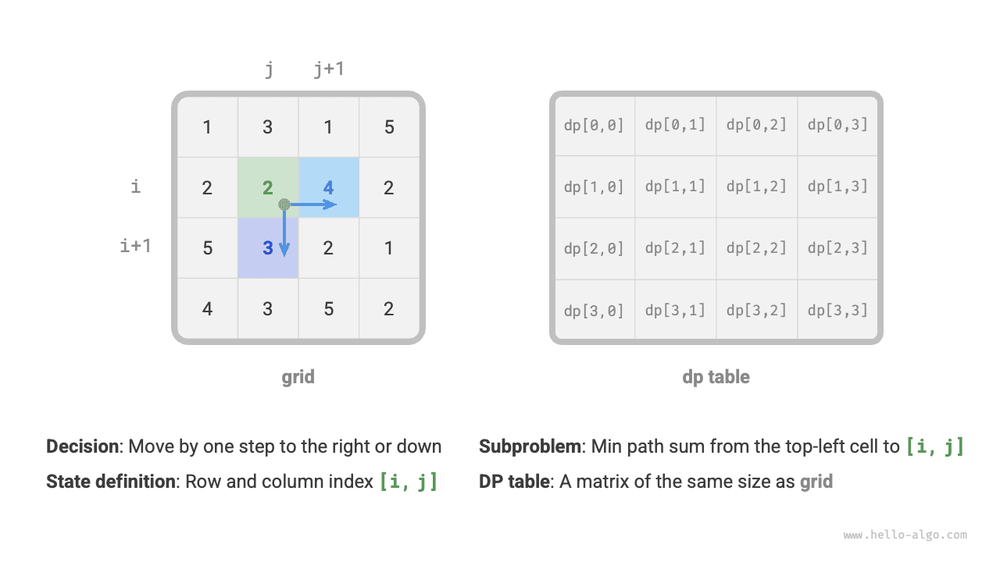
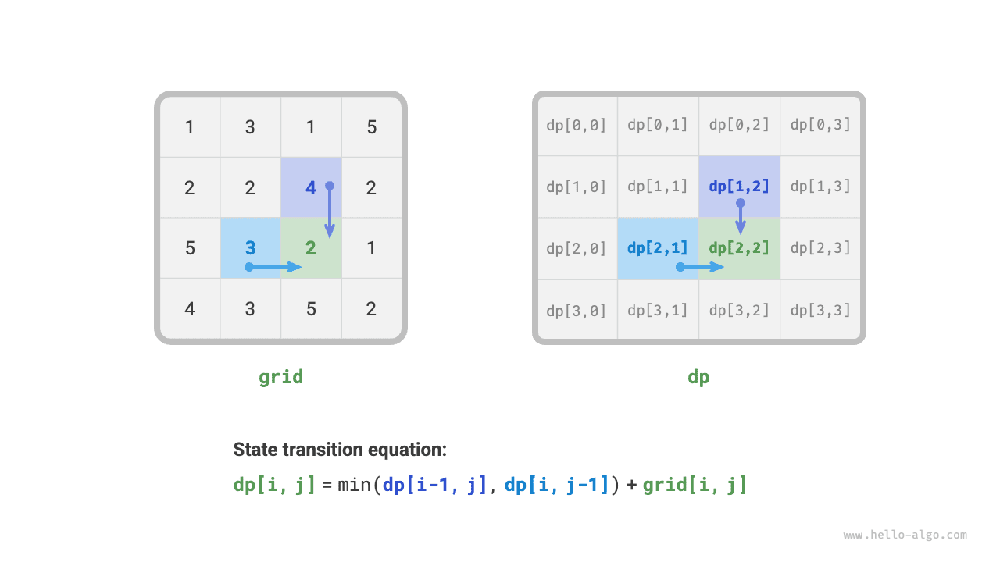
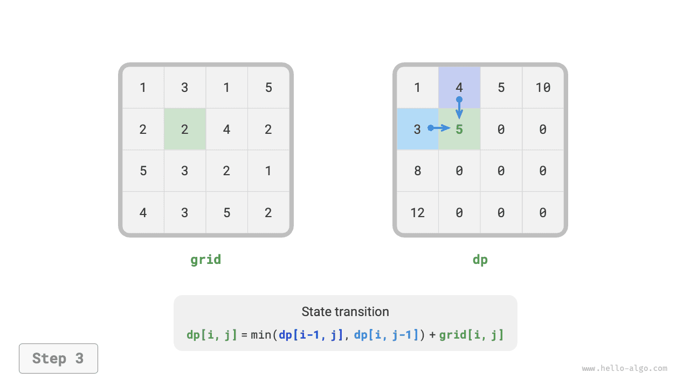
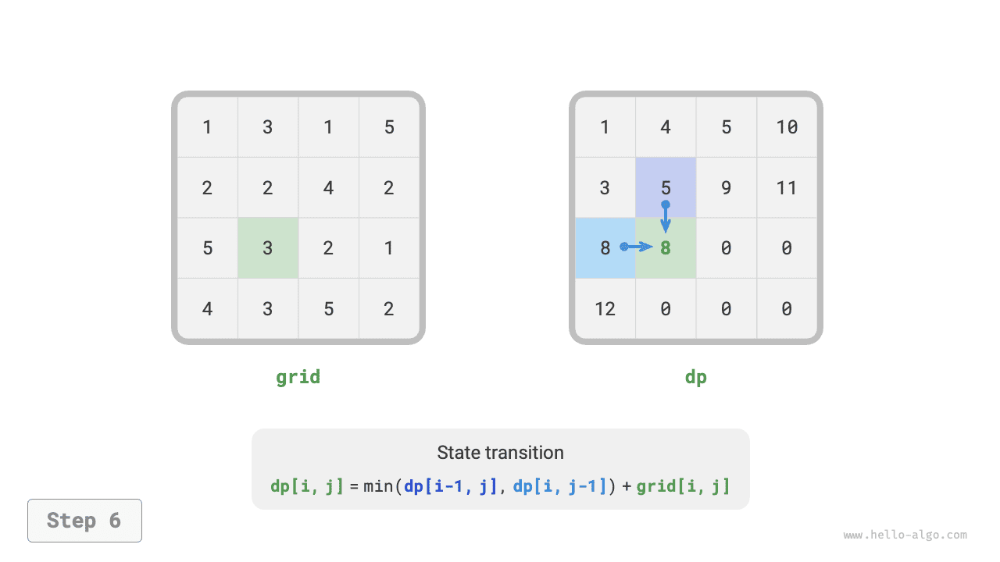
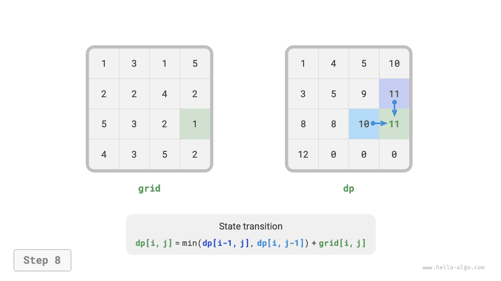
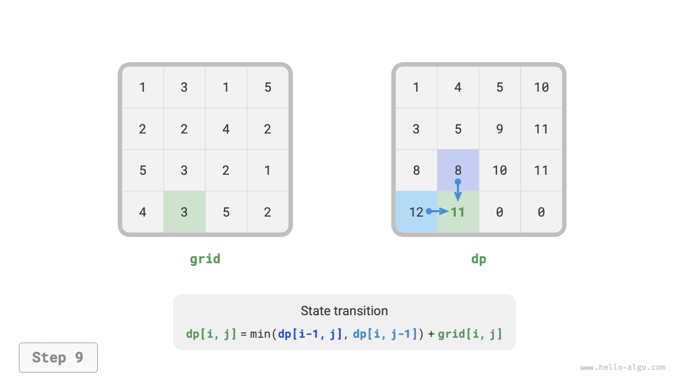
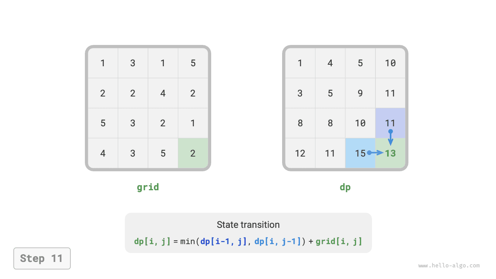

# Dinamikus programozási feladatok megoldási megközelítése

Az előző két szakasz a dinamikus programozási feladatok főbb jellemzőit mutatta be. Most vizsgáljunk meg együtt két további gyakorlati kérdést.

1. Hogyan állapítható meg, hogy egy feladat dinamikus programozási feladat-e?
2. Mi a teljes folyamata egy dinamikus programozási feladat megoldásának, és hol kezdjük?

## A feladat azonosítása

Általánosságban elmondható, hogy ha egy feladat átfedő részproblémákat, optimális részstruktúrát tartalmaz, és teljesíti az utóhatás-mentességet, akkor általában dinamikus programozással megoldható. Azonban nehéz közvetlenül kinyerni ezeket a jellemzőket a feladat leírásából. Ezért általában lazítunk a feltételeken, és **először megvizsgáljuk, hogy a feladat alkalmas-e visszalépéssel (kimerítő kereséssel) való megoldásra**.

**A visszalépéssel megoldható feladatok általában teljesítik a "döntési fa modellt"**, ami azt jelenti, hogy a feladat leírható fa struktúrával, ahol minden csomópont egy döntést, minden útvonal pedig döntések sorozatát jelöli.

Más szóval, ha egy feladat tartalmaz explicit döntési fogalmat, és a megoldás döntések sorozatán keresztül generálódik, akkor teljesíti a döntési fa modellt, és általában visszalépéssel megoldható.

Ezen az alapon a dinamikus programozási feladatoknak van néhány "bónuszpontja" az azonosításhoz.

- A feladat olyan leírásokat tartalmaz, mint maximális (minimális) vagy legtöbb (legkevesebb), ami optimalizálást jelez.
- A feladat állapota lista, többdimenziós mátrix vagy fa segítségével ábrázolható, és az állapot rekurzív összefüggésben van a szomszédos állapotokkal.

Ezzel szemben vannak "büntetőpontok" is.

- A feladat célja az összes lehetséges megoldás megtalálása, nem az optimális megoldás megtalálása.
- A feladat leírásának nyilvánvaló permutációs és kombinatorikus jellemzői vannak, amelyek meghatározott több megoldás visszaadását igénylik.

Ha egy feladat teljesíti a döntési fa modellt, és viszonylag nyilvánvaló "bónuszpontokkal" rendelkezik, feltételezhetjük, hogy dinamikus programozási feladat, és ezt a megoldási folyamat során ellenőrizhetjük.

## Megoldási lépések

A dinamikus programozás megoldási folyamata a feladat természetétől és nehézségétől függően változik, de általában a következő lépéseket követi: döntések leírása, állapotok definiálása, a $dp$ tábla meghatározása, az állapot-átmeneti egyenlet levezetése, határfeltételek meghatározása stb.

A megoldási lépések szemléltetéséhez a klasszikus "minimális úthossz" feladatot használjuk példaként.

!!! question

    Adott egy $n \times m$ méretű kétdimenziós rács `grid`, ahol minden cella nemnegatív egész számot tartalmaz, amely az adott cella költségét jelöli. Egy robot a bal felső cellától indul, és minden lépésben csak lefelé vagy jobbra haladhat, amíg el nem éri a jobb alsó cellát. Adja vissza a bal felső saroktól a jobb alsó sarokig vezető minimális útköltséget.

Az alábbi ábra egy példát mutat, ahol az adott rács minimális útköltsége $13$.


**1. lépés: Gondolja végig az egyes körök döntéseit, definiálja az állapotot, és így kapja meg a $dp$ táblát**

Ebben a feladatban minden kör döntése az, hogy az aktuális cellából egy lépéssel lefelé vagy jobbra haladunk. Legyen az aktuális cella sor- és oszlopindexe $[i, j]$. Lefelé vagy jobbra haladás után az indexek $[i+1, j]$ vagy $[i, j+1]$ lesznek. Ezért az állapotnak két változót kell tartalmaznia: a sorindexet és az oszlopindexet, amelyeket $[i, j]$-vel jelölünk.

Az $[i, j]$ állapot a következő részproblémának felel meg: **a $[0, 0]$ kiindulóponttól $[i, j]$-ig vezető minimális útköltség**, amelyet $dp[i, j]$-vel jelölünk.

Ebből megkapjuk az alábbi ábrán látható kétdimenziós $dp$ mátrixot, amelynek mérete megegyezik a bemeneti `grid` ráccsal.



!!! note

    A dinamikus programozás és a visszalépéses folyamatok döntések sorozataként írhatók le, az állapot pedig az összes döntési változóból áll. Tartalmaznia kell az összes változót, amely leírja a problémamegoldás előrehaladását, és elegendő információt kell tartalmaznia a következő állapot levezetéséhez.

    Minden állapot egy részproblémának felel meg, és definiálunk egy $dp$ táblát az összes részprobléma megoldásának tárolásához. Az állapot minden független változója a $dp$ tábla egy dimenziója. Lényegében a $dp$ tábla egy leképezés az állapotok és a részproblémák megoldásai között.

**2. lépés: Azonosítsa az optimális részstruktúrát, majd vezesse le az állapot-átmeneti egyenletet**

Az $[i, j]$ állapot csak a felette lévő $[i-1, j]$ cellából vagy a tőle balra lévő $[i, j-1]$ cellából vezethető át. Ezért az optimális részstruktúra: az $[i, j]$-re vezető minimális útköltséget az $[i, j-1]$ és $[i-1, j]$ minimális útköltségeinek kisebbike határozza meg.

A fenti elemzés alapján az alábbi ábrán látható állapot-átmeneti egyenlet vezethető le:

$$
dp[i, j] = \min(dp[i-1, j], dp[i, j-1]) + grid[i, j]
$$



!!! note

    A definiált $dp$ tábla alapján gondolja át az eredeti probléma és a részproblémák kapcsolatát, és találja meg azt a módszert, amellyel az eredeti probléma optimális megoldása felépíthető a részproblémák optimális megoldásaiból — ez az optimális részstruktúra.

    Ha azonosítottuk az optimális részstruktúrát, felhasználhatjuk az állapot-átmeneti egyenlet megalkotásához.

**3. lépés: Határozza meg a határfeltételeket és az állapot-átmeneti sorrendet**

Ebben a feladatban az első sor állapotai csak a tőlük balra lévő állapotból eredhetnek, az első oszlop állapotai csak a felettük lévő állapotból eredhetnek. Ezért az első sor $i = 0$ és az első oszlop $j = 0$ a határfeltételek.

Az alábbi ábrán látható, hogy mivel minden cellát a tőle balra és felette lévő cellából vezetünk át, ciklusokkal járjuk be a mátrixot, ahol a külső ciklus a sorokat, a belső ciklus az oszlopokat járja be.


!!! note

    A dinamikus programozásban a határfeltételek a $dp$ tábla inicializálására, keresésnél metszésre szolgálnak.

    Az állapot-átmeneti sorrend lényege annak biztosítása, hogy az aktuális probléma megoldásának kiszámításakor az összes kisebb részprobléma, amelytől függ, már helyesen ki lett számítva.

A fenti elemzés alapján közvetlenül megírhatjuk a dinamikus programozási kódot. Mivel azonban a részprobléma-felbontás felülről lefelé haladó megközelítés, a "nyers erő keresés $\rightarrow$ memoizálás $\rightarrow$ dinamikus programozás" sorrendben való megvalósítás jobban illeszkedik a gondolkodási szokásokhoz.

### 1. módszer: Nyers erő keresés

Az $[i, j]$ állapotból kiindulva folyamatosan bontjuk kisebb $[i-1, j]$ és $[i, j-1]$ állapotokra. A rekurzív függvény a következő elemeket tartalmazza.

- **Rekurzív paraméterek**: $[i, j]$ állapot.
- **Visszatérési érték**: $[0, 0]$-tól $[i, j]$-ig vezető minimális útköltség, vagyis $dp[i, j]$.
- **Leállítási feltétel**: ha $i = 0$ és $j = 0$, visszaadjuk a $grid[0, 0]$ költséget.
- **Metszés**: ha $i < 0$ vagy $j < 0$, az index túlmegy a határokon, visszaadjuk a $+\infty$ költséget, ami megvalósíthatatlanságot jelez.

A megvalósítási kód a következő:

```src
[file]{min_path_sum}-[class]{}-[func]{min_path_sum_dfs}
```

Az alábbi ábra a $dp[2, 1]$ gyökerű rekurziós fát mutatja, amely néhány átfedő részproblémát tartalmaz, amelyek száma élesebben nő, ahogy a `grid` rács mérete növekszik.

Lényegében az átfedő részproblémák oka: **több útvonal vezet a bal felső sarokból egy adott cellába**.


Minden állapotnak két választása van, le és jobbra, ezért a bal felső saroktól a jobb alsó sarokig vezető lépések teljes száma $m + n - 2$, a legrosszabb esetben $O(2^{m + n})$ időbonyolultságot adva, ahol $n$ és $m$ a rács sorainak és oszlopainak száma. Megjegyezzük, hogy ez a számítás nem veszi figyelembe a rács határai közelében lévő helyzeteket, ahol a rács határának elérésekor csak egy választás marad, ezért az utak tényleges száma valamivel kevesebb lesz.

### 2. módszer: Memoizálás

Bevezetünk egy, a `grid` ráccsal azonos méretű `mem` memo listát, amely rögzíti a részproblémák megoldásait és metszi az átfedő részproblémákat:

```src
[file]{min_path_sum}-[class]{}-[func]{min_path_sum_dfs_mem}
```

Az alábbi ábrán látható, hogy a memoizálás bevezetése után minden részprobléma megoldását csak egyszer kell kiszámítani, ezért az időbonyolultság az állapotok teljes számától függ, ami a rács mérete $O(nm)$.


### 3. módszer: Dinamikus programozás

A dinamikus programozásos megoldást iteráció alapján valósítjuk meg, ahogyan az alábbi kód mutatja:

```src
[file]{min_path_sum}-[class]{}-[func]{min_path_sum_dp}
```

Az alábbi ábra a minimális útköltség állapot-átmeneti folyamatát mutatja, amely az egész rácsot bejárja, **ezért az időbonyolultság $O(nm)$**.

A `dp` tömb mérete $n \times m$, **ezért a tárkomplexitás $O(nm)$**.

=== "<1>"
    

=== "<2>"
    

=== "<3>"
    

=== "<4>"
    

=== "<5>"
    

=== "<6>"
    

=== "<7>"
    

=== "<8>"
    

=== "<9>"
    

=== "<10>"
    

=== "<11>"
    

=== "<12>"
    

### Tárhelyoptimalizálás

Mivel minden cella csak a tőle balra és felette lévő cellával függ össze, egyetlen egysoros tömbben valósíthatjuk meg a $dp$ táblát.

Megjegyezzük, hogy mivel a `dp` tömb csak egy sor állapotát tudja ábrázolni, az első oszlop állapotát nem inicializálhatjuk előre, hanem minden sor bejárásakor frissítjük:

```src
[file]{min_path_sum}-[class]{}-[func]{min_path_sum_dp_comp}
```
