# Szerkesztési távolság feladat

A szerkesztési távolság, más néven Levenshtein-távolság, az egyik karakterlánc a másikká alakításához szükséges minimális szerkesztések számát jelöli, és általánosan használják az információkeresésben és a természetes nyelvfeldolgozásban két sorozat hasonlóságának mérésére.

!!! question

    Adott két $s$ és $t$ karakterlánc, adja vissza az $s$ $t$-vé alakításához szükséges minimális szerkesztések számát.

    Egy karakterláncon háromféle szerkesztési műveletet hajthat végre: karaktert szúr be, karaktert töröl, vagy egy karaktert bármely más karakterre cserél.

Az alábbi ábrán látható, hogy a `kitten` `sitting`-gé alakítása $3$ szerkesztést igényel, köztük $2$ cserét és $1$ beillesztést; a `hello` `algo`-vá alakítása $3$ lépést igényel, köztük $2$ cserét és $1$ törlést.

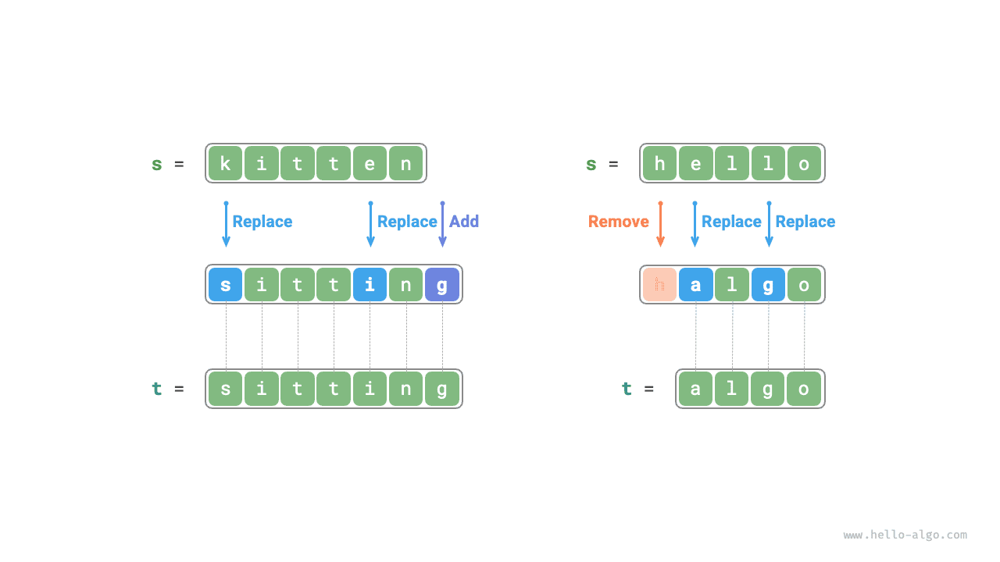

**A szerkesztési távolság feladat természetesen magyarázható a döntési fa modellel**. A karakterláncok a fa csomópontjainak, egy kör döntése (egy szerkesztési művelet) a fa élének felel meg.

Az alábbi ábrán látható, hogy a műveletek korlátozása nélkül minden csomópont sok élbe ágazhat, és minden él egy műveletnek felel meg, ami azt jelenti, hogy sok lehetséges útvonal vezet a `hello` `algo`-vá alakításához.

A döntési fa szempontjából ennek a feladatnak a célja a `hello` és az `algo` csomópontok közötti legrövidebb útvonal megtalálása.


### Dinamikus programozásos megközelítés

**1. lépés: Gondolja végig az egyes körök döntéseit, definiálja az állapotot, és így kapja meg a $dp$ táblát**

Minden kör döntése egy szerkesztési művelet végrehajtása az $s$ karakterláncon.

Szeretnénk, ha a feladat léptéke fokozatosan csökkenne a szerkesztési folyamat során, ami lehetővé teszi részproblémák felépítését. Legyenek az $s$ és $t$ karakterláncok hossza rendre $n$ és $m$. Először a két karakterlánc utolsó karaktereit, $s[n-1]$-et és $t[m-1]$-et vizsgáljuk.

- Ha $s[n-1]$ és $t[m-1]$ azonosak, kihagyhatjuk őket, és közvetlenül $s[n-2]$-t és $t[m-2]$-t vizsgálhatjuk.
- Ha $s[n-1]$ és $t[m-1]$ különbözők, egy szerkesztést kell végrehajtanunk $s$-en (beillesztés, törlés vagy csere), hogy a két karakterlánc utolsó karakterei azonosak legyenek, lehetővé téve azok kihagyását és egy kisebb léptékű probléma vizsgálatát.

Más szóval, minden kör döntésünk (szerkesztési művelet), amelyet az $s$ karakterláncon hajtunk végre, megváltoztatja az $s$-ben és $t$-ben még párosítandó karakterek számát. Ezért az állapot az $s$-ben és $t$-ben aktuálisan vizsgált $i$-edik és $j$-edik karakter, amelyet $[i, j]$-vel jelölünk.

Az $[i, j]$ állapot a következő részproblémának felel meg: **az $s$ első $i$ karakterét $t$ első $j$ karakterévé alakításához szükséges minimális szerkesztések száma**.

Ebből $(i+1) \times (j+1)$ méretű kétdimenziós $dp$ táblát kapunk.

**2. lépés: Azonosítsa az optimális részstruktúrát, majd vezesse le az állapot-átmeneti egyenletet**

Vizsgáljuk a $dp[i, j]$ részproblémát, ahol a megfelelő két karakterlánc utolsó karakterei $s[i-1]$ és $t[j-1]$, amelyek az alábbi ábrán látható három eset valamelyikébe sorolhatók a különböző szerkesztési műveletek alapján.

1. $t[j-1]$ beillesztése $s[i-1]$ után, ekkor a fennmaradó részprobléma $dp[i, j-1]$.
2. $s[i-1]$ törlése, ekkor a fennmaradó részprobléma $dp[i-1, j]$.
3. $s[i-1]$ $t[j-1]$-re cserélése, ekkor a fennmaradó részprobléma $dp[i-1, j-1]$.


A fenti elemzés alapján az optimális részstruktúra megkapható: $dp[i, j]$ minimális szerkesztéseinek száma egyenlő $dp[i, j-1]$, $dp[i-1, j]$ és $dp[i-1, j-1]$ minimális szerkesztési lépéseinek minimuma, plusz az aktuális $1$ szerkesztési lépés. A megfelelő állapot-átmeneti egyenlet:

$$
dp[i, j] = \min(dp[i, j-1], dp[i-1, j], dp[i-1, j-1]) + 1
$$

Megjegyezzük, hogy **ha $s[i-1]$ és $t[j-1]$ azonosak, az aktuális karakterhez nem szükséges szerkesztés**, ebben az esetben az állapot-átmeneti egyenlet:

$$
dp[i, j] = dp[i-1, j-1]
$$

**3. lépés: Határozza meg a határfeltételeket és az állapot-átmeneti sorrendet**

Ha mindkét karakterlánc üres, a szerkesztési lépések száma $0$, azaz $dp[0, 0] = 0$. Ha $s$ üres, de $t$ nem, a minimális szerkesztési lépések száma egyenlő $t$ hosszával, azaz az első sor $dp[0, j] = j$. Ha $s$ nem üres, de $t$ üres, a minimális szerkesztési lépések száma egyenlő $s$ hosszával, azaz az első oszlop $dp[i, 0] = i$.

Az állapot-átmeneti egyenletet megfigyelve a $dp[i, j]$ megoldás a bal oldali, a felső és a bal felső megoldásoktól függ, ezért az egész $dp$ tábla sorrendben bejárható két egymásba ágyazott ciklussal.

### Kódmegvalósítás

```src
[file]{edit_distance}-[class]{}-[func]{edit_distance_dp}
```

Az alábbi ábrán látható, hogy a szerkesztési távolság feladat állapot-átmeneti folyamata nagyon hasonló a hátizsák-feladathoz, és mindkettő kétdimenziós rács kitöltési folyamataként tekinthető.

=== "<1>"
    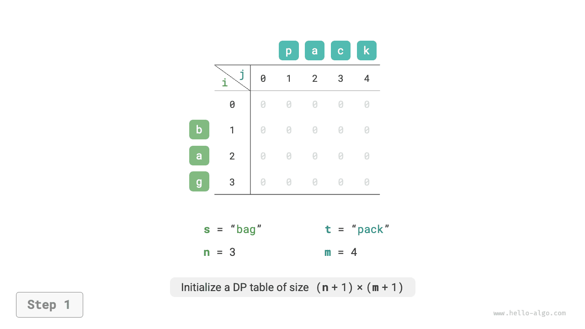

=== "<2>"
    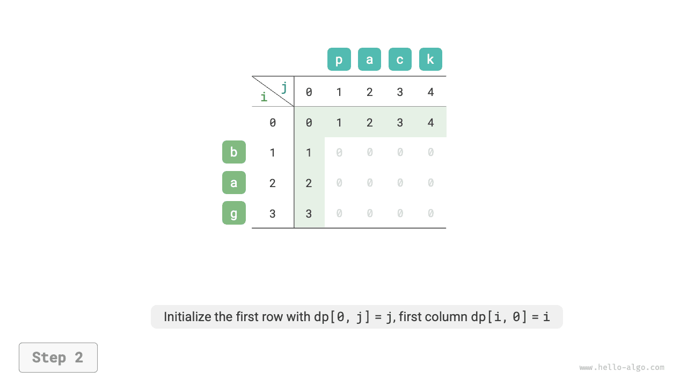

=== "<3>"
    

=== "<4>"
    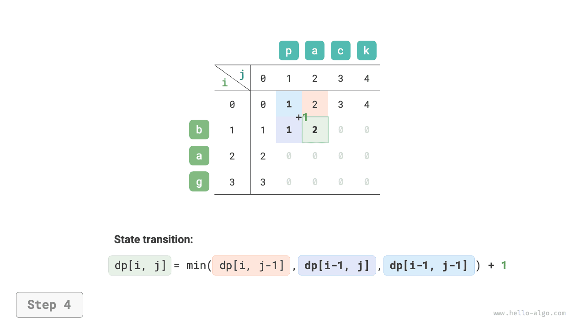

=== "<5>"
    

=== "<6>"
    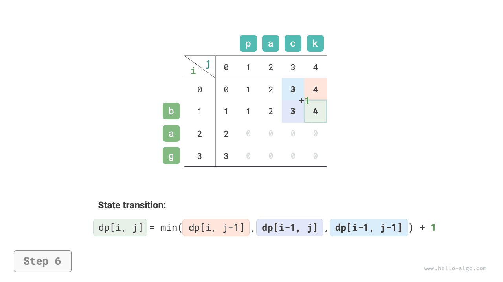

=== "<7>"
    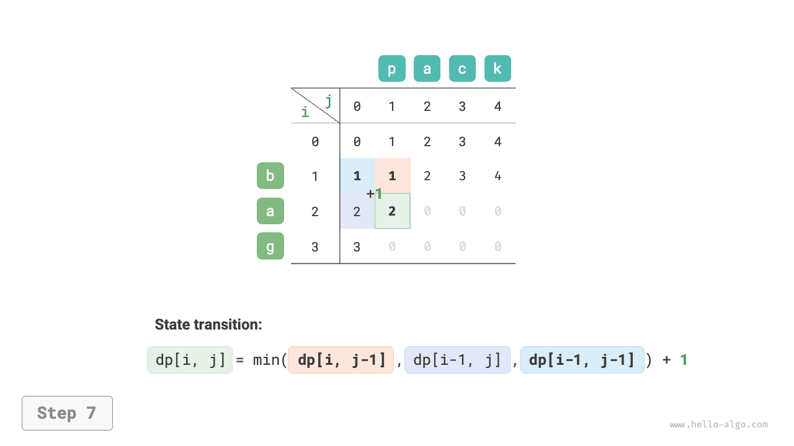

=== "<8>"
    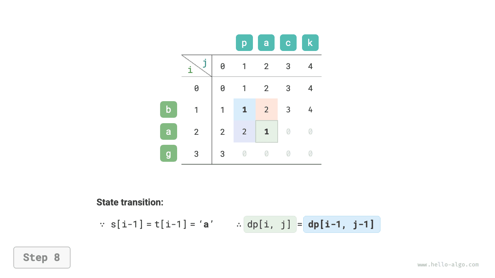

=== "<9>"
    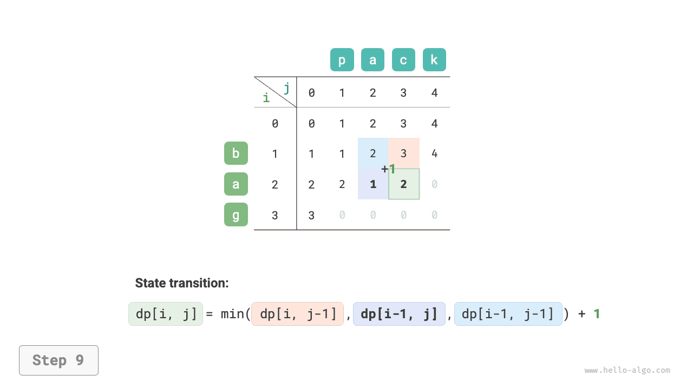

=== "<10>"
    

=== "<11>"
    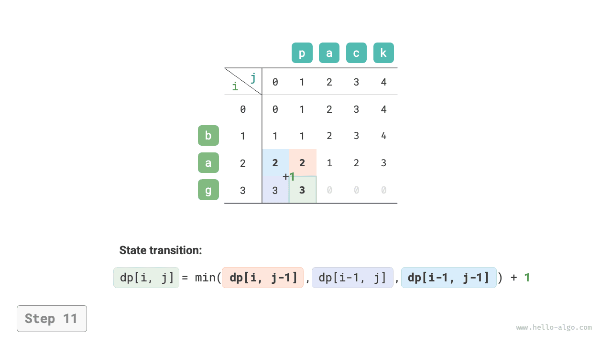

=== "<12>"
    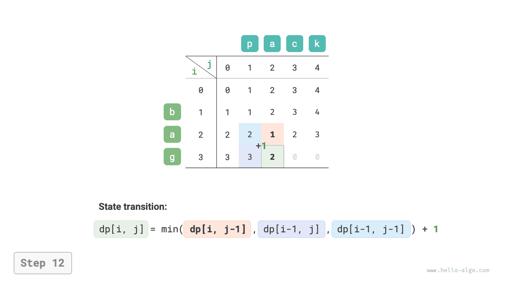

=== "<13>"
    

=== "<14>"
    

=== "<15>"
    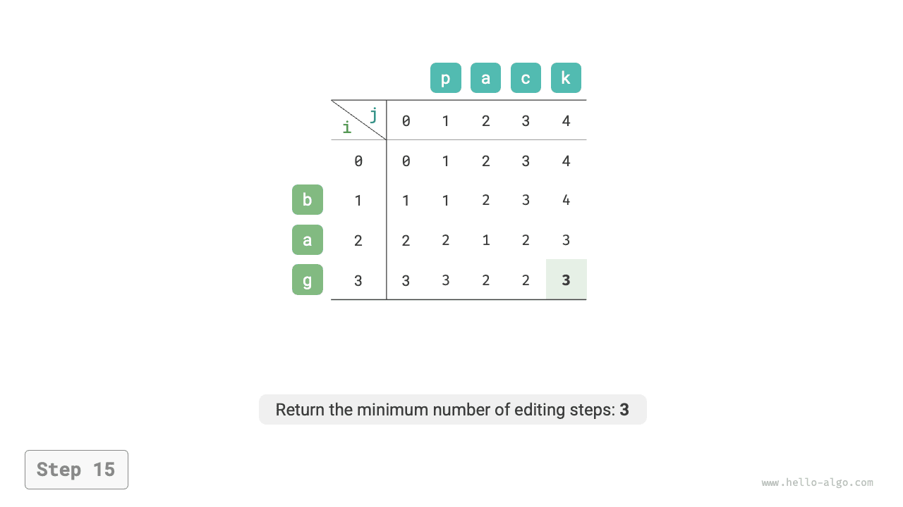

### Tárhelyoptimalizálás

Mivel $dp[i, j]$ a felső $dp[i-1, j]$, a bal oldali $dp[i, j-1]$ és a bal felső $dp[i-1, j-1]$ megoldásokból vezethető át, az előre haladó bejárás elveszíti a bal felső $dp[i-1, j-1]$ megoldást, a fordított bejárás pedig nem tudja előre felépíteni $dp[i, j-1]$-t, ezért egyik bejárási sorrend sem alkalmazható.

Emiatt egy `leftup` változót használhatunk a bal felső $dp[i-1, j-1]$ megoldás ideiglenes tárolásához, így csak a bal oldali és a felső megoldásokat kell figyelembe venni. Ez a helyzet megegyezik a korlátlan hátizsák-feladattal, lehetővé téve az előre haladó bejárást. A kód a következő:

```src
[file]{edit_distance}-[class]{}-[func]{edit_distance_dp_comp}
```
