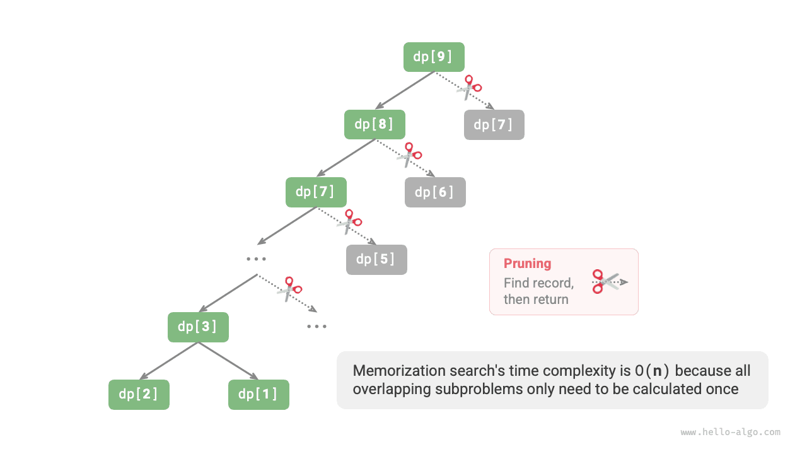
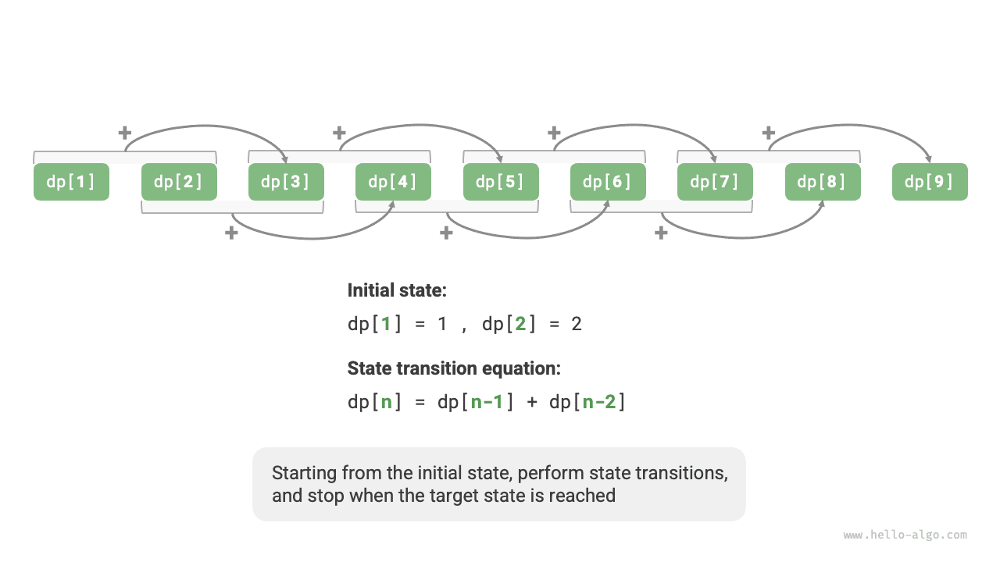

# Bevezetés a dinamikus programozásba

A <u>dinamikus programozás</u> egy fontos algoritmikus paradigma, amely egy problémát kisebb részproblémák sorozatára bont, és a részproblémák megoldásait tárolva elkerüli a redundáns számításokat, ezzel jelentősen javítva az időhatékonyságot.

Ebben a szakaszban egy klasszikus példával kezdünk: először bemutatjuk a nyers erőn alapuló visszalépéses megoldást, megvizsgáljuk az átfedő részproblémákat, majd fokozatosan levezetjük a hatékonyabb dinamikus programozásos megoldást.

!!! question "Lépcsőmászás"

    Adott egy $n$ lépcsőfokból álló lépcső, ahol egyszerre $1$ vagy $2$ fokot lehet lépni. Hányféleképpen lehet felérni a tetejére?

Az alábbi ábrán látható, hogy egy $3$ fokos lépcsőnél $3$ különböző módon lehet elérni a tetejét.


A feladat célja az utak számának meghatározása. **Visszalépéssel felsorolhatjuk az összes lehetőséget**. Konkrétan képzeljük el a lépcsőmászást egy többkörös kiválasztási folyamatként: a földről indulva minden körben $1$ vagy $2$ fokot lépünk fel, a számlálót $1$-gyel növeljük, ha elértük a lépcső tetejét, és megállunk, ha túlléptük. A kód a következő:

```src
[file]{climbing_stairs_backtrack}-[class]{}-[func]{climbing_stairs_backtrack}
```

## 1. módszer: Nyers erő keresés

A visszalépéses algoritmusok általában nem bontják fel expliciten a problémákat, hanem a megoldást döntési lépések sorozataként kezelik, és próbálkozással és metszéssel keresik az összes lehetséges megoldást.

Megpróbálhatjuk elemezni a problémát a részproblémákra bontás szemszögéből. Legyen $dp[i]$ az $i$-edik fokra vezető utak száma. Ekkor $dp[i]$ az eredeti probléma, és a részproblémái a következők:

$$
dp[i-1], dp[i-2], \dots, dp[2], dp[1]
$$

Mivel minden körben csak $1$ vagy $2$ fokot lehet lépni, az $i$-edik fokon állva az előző körben csak az $i-1$-edik vagy az $i-2$-edik fokon lehettünk. Más szóval, az $i$-edik fokra csak az $i-1$-edikről vagy az $i-2$-edikről lehet eljutni.

Ez egy fontos következtetéshez vezet: **az $i-1$-edik fokra vezető utak száma plusz az $i-2$-edik fokra vezető utak száma egyenlő az $i$-edik fokra vezető utak számával**. A képlet a következő:

$$
dp[i] = dp[i-1] + dp[i-2]
$$

Ez azt jelenti, hogy a lépcsőmászási feladatban a részproblémák között rekurzív összefüggés áll fenn: **az eredeti probléma megoldása felépíthető a részproblémák megoldásaiból**. Az alábbi ábra szemlélteti ezt a rekurzív összefüggést.


A rekurzív képlet alapján nyers erő keresési megoldást kaphatunk. A $dp[n]$-től kezdve **rekurzívan bontjuk a nagyobb problémát két kisebb probléma összegére**, amíg el nem érjük a legkisebb részproblémákat, $dp[1]$-et és $dp[2]$-t, és visszatérünk. Ezek megoldásai ismertek: $dp[1] = 1$ és $dp[2] = 2$, ami az $1$. és $2$. fokra vezető $1$, illetve $2$ utat jelenti.

Az alábbi kód, akárcsak a szokásos visszalépéses kód, mélységi kereséshez tartozik, de tömörebb:

```src
[file]{climbing_stairs_dfs}-[class]{}-[func]{climbing_stairs_dfs}
```

Az alábbi ábra a nyers erő kereséssel kialakított rekurziós fát mutatja. A $dp[n]$ probléma rekurziós fájának mélysége $n$, az időbonyolultság $O(2^n)$. Az exponenciális rend robbanásszerű növekedést jelent; ha viszonylag nagy $n$-t adunk meg, hosszú várakozásba futunk.


A fenti ábrát megfigyelve láthatjuk, hogy **az exponenciális időbonyolultságot az "átfedő részproblémák" okozzák**. Például $dp[9]$ felbomlik $dp[8]$-ra és $dp[7]$-re, $dp[8]$ felbomlik $dp[7]$-re és $dp[6]$-ra, mindkettő tartalmazza a $dp[7]$ részproblémát.

Így tovább, a részproblémák kisebb átfedő részproblémákat tartalmaznak, a végtelenségig. A számítási erőforrások nagy része ezekre az átfedő részproblémákra pazarlódik.

## 2. módszer: Memoizálás

Az algoritmus hatékonyságának javítása érdekében **szeretnénk, ha minden átfedő részproblémát csak egyszer számítanánk ki**. Ehhez egy `mem` tömböt deklarálunk, amely rögzíti az egyes részproblémák megoldásait, és a keresési folyamat során metszünk az átfedő részproblémákon.

1. Amikor először számítjuk ki $dp[i]$-t, feljegyezzük `mem[i]`-be a későbbi felhasználáshoz.
2. Amikor ismét szükségünk van $dp[i]$-re, közvetlenül lekérdezhetjük az eredményt `mem[i]`-ből, ezzel elkerülve az adott részprobléma redundáns számítását.

A kód a következő:

```src
[file]{climbing_stairs_dfs_mem}-[class]{}-[func]{climbing_stairs_dfs_mem}
```

Az alábbi ábrán látható, hogy **memoizálás után minden átfedő részproblémát csak egyszer kell kiszámítani, az időbonyolultságot $O(n)$-re optimalizálva**, ami óriási ugrás.



## 3. módszer: Dinamikus programozás

**A memoizálás egy "felülről lefelé" haladó módszer**: az eredeti problémából (gyökércsomópontból) indulunk ki, rekurzívan bontjuk a nagyobb részproblémákat kisebbekre, amíg el nem érjük a legkisebb ismert részproblémákat (levélcsomópontokat). Ezután visszalépéssel rétegről rétegre összegyűjtjük a részproblémák megoldásait, hogy felépítsük az eredeti probléma megoldását.

Ezzel szemben **a dinamikus programozás egy "alulról felfelé" haladó módszer**: a legkisebb részproblémák megoldásaitól kezdve iteratívan épít fel nagyobb részproblémák megoldásait, amíg meg nem kapja az eredeti probléma megoldását.

Mivel a dinamikus programozás nem tartalmaz visszalépési folyamatot, csak ciklus-iterációra van szükség a megvalósításhoz, rekurzióra nincs szükség. A következő kódban inicializálunk egy `dp` tömböt a részproblémák megoldásainak tárolásához, amely ugyanazt a feljegyzési funkciót tölti be, mint a memoizálásban a `mem` tömb:

```src
[file]{climbing_stairs_dp}-[class]{}-[func]{climbing_stairs_dp}
```

Az alábbi ábra a fenti kód végrehajtási folyamatát szimulálja.



A visszalépéses algoritmusokhoz hasonlóan a dinamikus programozás is az "állapot" fogalmát használja a problémamegoldás egyes szakaszainak jelölésére, ahol minden állapot egy részproblémának és a megfelelő lokálisan optimális megoldásnak felel meg. Például a lépcsőmászási feladatban az állapot az aktuális lépcsőfok sorszáma $i$.

A fentiek alapján összefoglalhatjuk a dinamikus programozásban általánosan használt terminológiát.

- A `dp` tömböt <u>dp táblának</u> nevezzük, ahol $dp[i]$ az $i$ állapotnak megfelelő részprobléma megoldását jelöli.
- A legkisebb részproblémáknak megfelelő állapotokat (az $1$. és $2$. fokot) <u>kezdeti állapotoknak</u> nevezzük.
- A $dp[i] = dp[i-1] + dp[i-2]$ rekurzív képletet <u>állapot-átmeneti egyenletnek</u> nevezzük.

## Tárhelyoptimalizálás

Az éles szemű olvasók észrevehették, hogy **mivel $dp[i]$ csak $dp[i-1]$-től és $dp[i-2]$-től függ, nem kell `dp` tömböt használnunk az összes részprobléma megoldásának tárolásához**, hanem egyszerűen két változóval gördíthetünk előre. A kód a következő:

```src
[file]{climbing_stairs_dp}-[class]{}-[func]{climbing_stairs_dp_comp}
```

A fenti kódot megfigyelve láthatjuk, hogy mivel a `dp` tömb által elfoglalt tér megspórolódik, a tárkomplexitás $O(n)$-ről $O(1)$-re csökken.

A dinamikus programozási feladatokban az aktuális állapot általában csak korlátozott számú előző állapottól függ, ami lehetővé teszi, hogy csak a szükséges állapotokat tároljuk, és memóriát takarítsunk meg "dimenziócsökkentéssel". **Ezt a tárhelyoptimalizálási technikát "gördülő változónak" vagy "gördülő tömbnek" nevezzük**.
