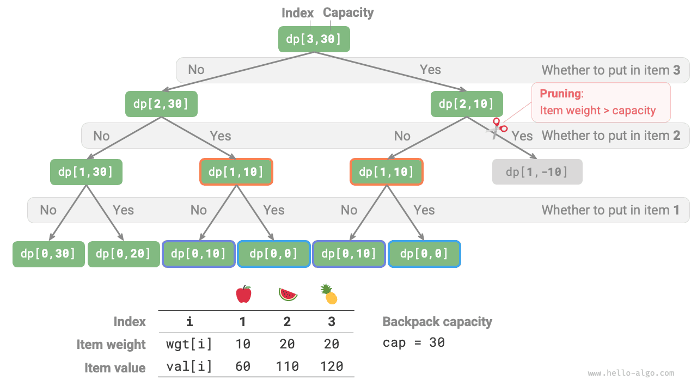
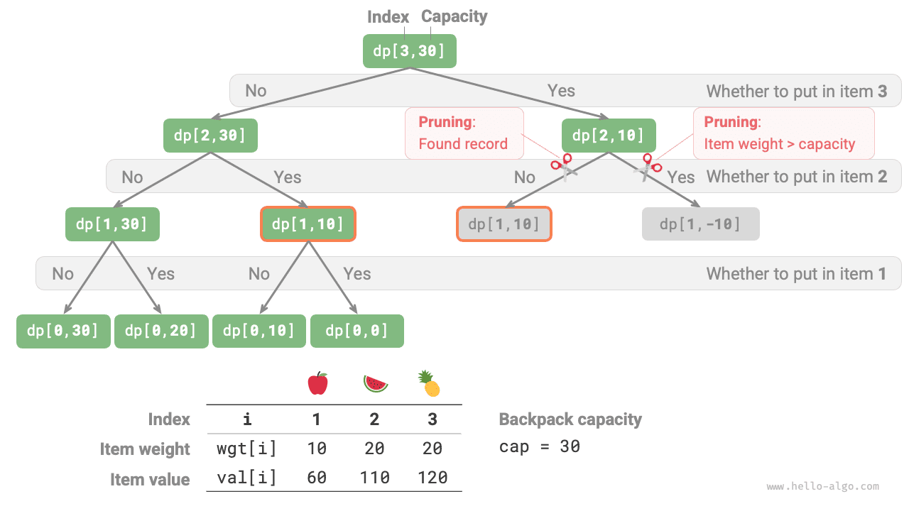
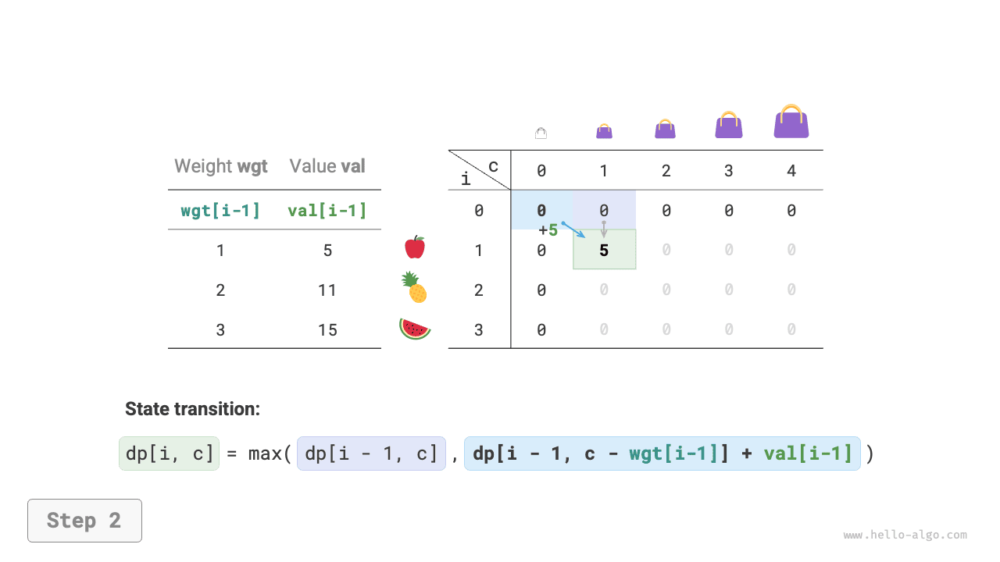
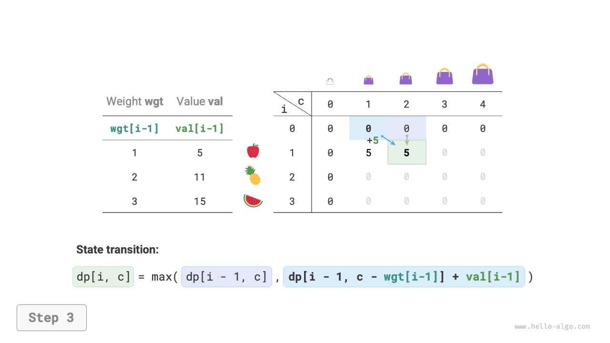
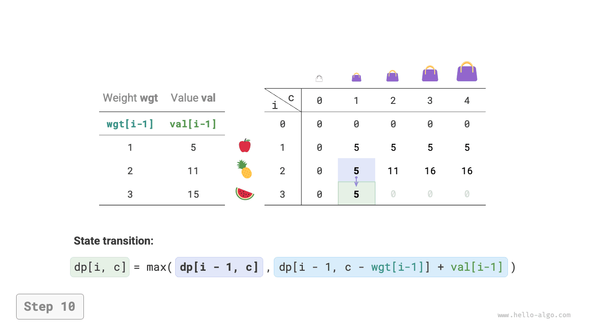
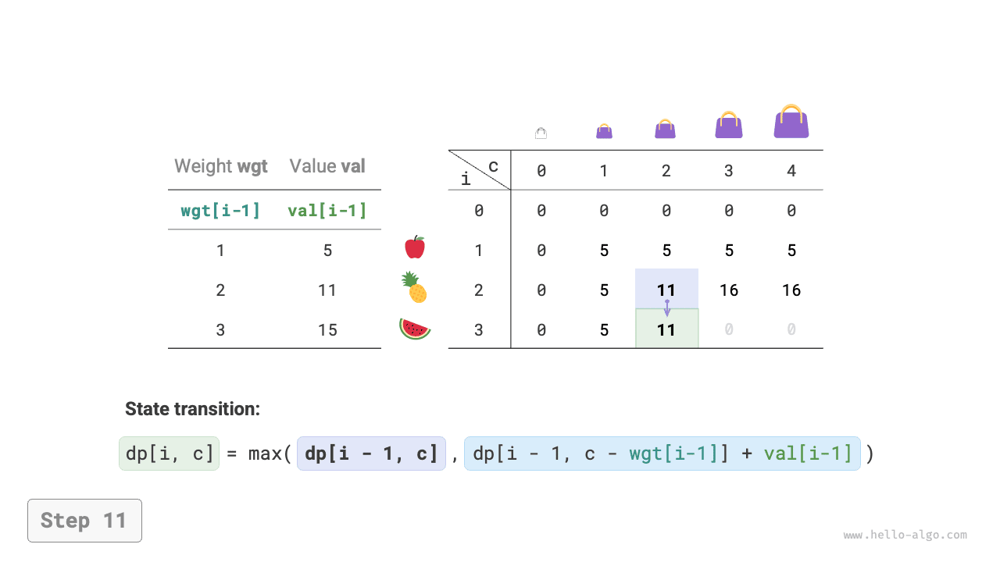
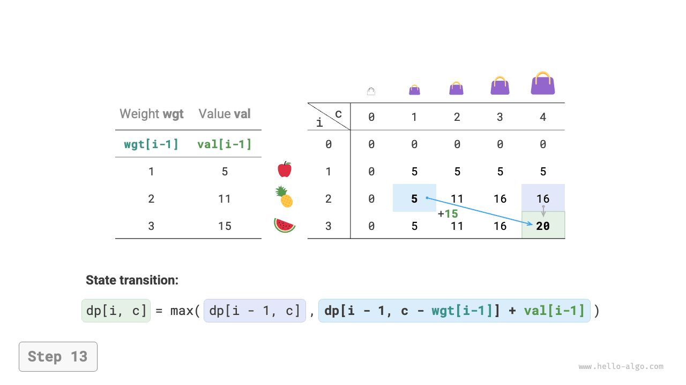
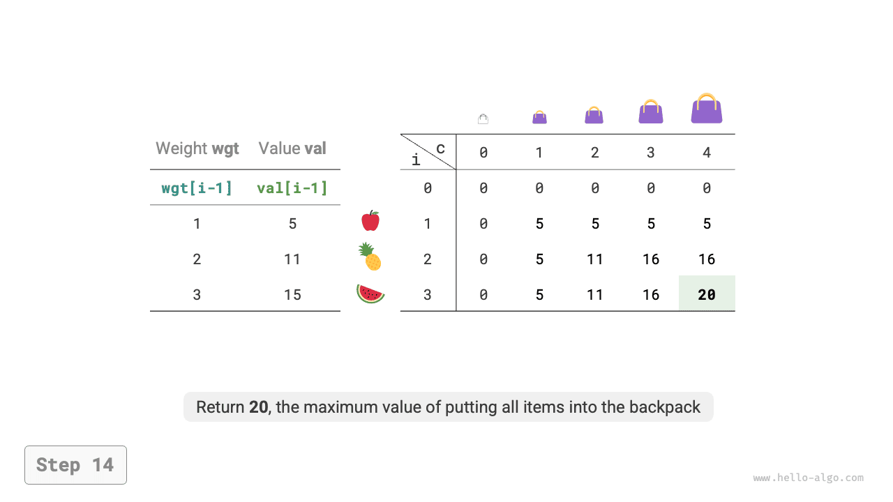
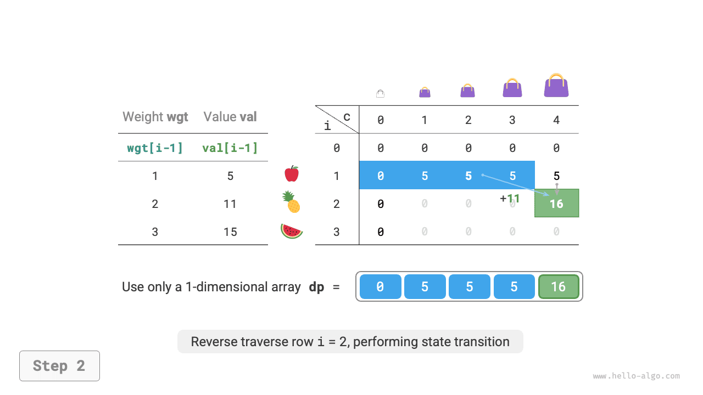
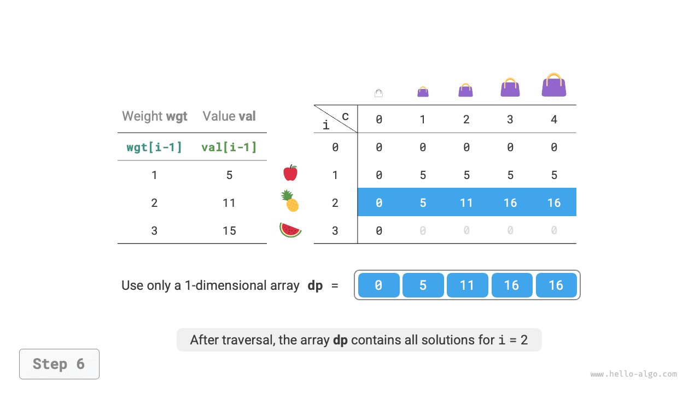

# 0-1 hátizsák-feladat

A hátizsák-feladat kiváló bevezető feladat a dinamikus programozáshoz, és az egyik leggyakoribb feladattípus a dinamikus programozásban. Sok változata létezik, például a 0-1 hátizsák-feladat, a korlátlan hátizsák-feladat és a többszörös hátizsák-feladat.

Ebben a szakaszban először a leggyakoribb 0-1 hátizsák-feladatot oldjuk meg.

!!! question

    Adott $n$ tárgy, ahol az $i$-edik tárgy súlya $wgt[i-1]$, értéke $val[i-1]$, és egy $cap$ kapacitású hátizsák. Minden tárgy csak egyszer választható ki. Mi az a maximális érték, amelyet a kapacitáskorláton belül a hátizsákba lehet helyezni?

Az alábbi ábrán látható, hogy az $i$ tárgy sorszáma $1$-től kezdődik, míg a tömbindexek $0$-tól, ezért az $i$ tárgy $wgt[i-1]$ súlynak és $val[i-1]$ értéknek felel meg.


A 0-1 hátizsák-feladatot $n$ körös döntési folyamatként tekinthetjük, ahol minden tárgyhoz két döntés tartozik: nem rakjuk be és berakjuk, ezért a feladat teljesíti a döntési fa modellt.

Ennek a feladatnak a célja "a kapacitáskorláton belül a hátizsákba helyezhető maximális érték" megtalálása, ezért valószínűbben dinamikus programozási feladatról van szó.

**1. lépés: Gondolja végig az egyes körök döntéseit, definiálja az állapotot, és így kapja meg a $dp$ táblát**

Minden tárgy esetén, ha nem tesszük a hátizsákba, a hátizsák kapacitása változatlan marad; ha berakjuk, a hátizsák kapacitása csökken. Ebből levezethetjük az állapotdefiníciót: az aktuális tárgy sorszáma $i$ és a hátizsák kapacitása $c$, amelyet $[i, c]$-vel jelölünk.

Az $[i, c]$ állapot a következő részproblémának felel meg: **az első $i$ tárgy közül $c$ kapacitású hátizsákban elérhető maximális érték**, amelyet $dp[i, c]$-vel jelölünk.

Amit meg kell találnunk, az $dp[n, cap]$, ezért $(n+1) \times (cap+1)$ méretű kétdimenziós $dp$ táblára van szükségünk.

**2. lépés: Azonosítsa az optimális részstruktúrát, majd vezesse le az állapot-átmeneti egyenletet**

Az $i$ tárgy döntésének meghozatala után az első $i-1$ tárgy részproblémája marad, amely a következő két esetbe sorolható.

- **Nem rakjuk be az $i$ tárgyat**: A hátizsák kapacitása változatlan marad, az állapot $[i-1, c]$-re változik.
- **Berakjuk az $i$ tárgyat**: A hátizsák kapacitása $wgt[i-1]$-gyel csökken, az érték $val[i-1]$-gyel növekszik, az állapot $[i-1, c-wgt[i-1]]$-re változik.

A fenti elemzés feltárja a feladat optimális részstruktúráját: **a maximális érték $dp[i, c]$ egyenlő az $i$ tárgy be nem rakásának és berakásának nagyobb értékével**. Ebből az állapot-átmeneti egyenlet levezethető:

$$
dp[i, c] = \max(dp[i-1, c], dp[i-1, c - wgt[i-1]] + val[i-1])
$$

Megjegyezzük, hogy ha az aktuális tárgy $wgt[i - 1]$ súlya meghaladja a fennmaradó $c$ hátizsák-kapacitást, akkor az egyetlen lehetőség, hogy nem rakjuk be a hátizsákba.

**3. lépés: Határozza meg a határfeltételeket és az állapot-átmeneti sorrendet**

Ha nincsenek tárgyak vagy a hátizsák kapacitása $0$, a maximális érték $0$, azaz az első oszlop $dp[i, 0]$ és az első sor $dp[0, c]$ mind egyenlő $0$-val.

Az aktuális $[i, c]$ állapot a felette lévő $[i-1, c]$ állapotból és a bal felső $[i-1, c-wgt[i-1]]$ állapotból vezethető át, ezért az egész $dp$ táblát sorrendben bejárjuk két egymásba ágyazott ciklussal.

A fenti elemzés alapján a nyers erő keresési, memoizálási és dinamikus programozási megoldásokat sorban valósítjuk meg.

### 1. módszer: Nyers erő keresés

A keresési kód a következő elemeket tartalmazza.

- **Rekurzív paraméterek**: $[i, c]$ állapot.
- **Visszatérési érték**: a $dp[i, c]$ részprobléma megoldása.
- **Leállítási feltétel**: ha a tárgy sorszáma túlmegy a határokon $i = 0$ vagy a fennmaradó hátizsák-kapacitás $0$, befejezi a rekurziót és $0$ értéket ad vissza.
- **Metszés**: ha az aktuális tárgy súlya meghaladja a fennmaradó hátizsák-kapacitást, csak a be nem rakás opció áll rendelkezésre.

```src
[file]{knapsack}-[class]{}-[func]{knapsack_dfs}
```

Az alábbi ábrán látható, hogy minden tárgy két keresési ágat generál: a nem kiválasztást és a kiválasztást, ezért az időbonyolultság $O(2^n)$.

A rekurziós fát megfigyelve könnyen láthatók az átfedő részproblémák, például $dp[1, 10]$. Sok tárgy, nagy hátizsák-kapacitás, és különösen azonos súlyú tárgyak esetén az átfedő részproblémák száma jelentősen nő.



### 2. módszer: Memoizálás

Annak biztosítása érdekében, hogy az átfedő részproblémákat csak egyszer számítsuk ki, egy `mem` memo listát használunk a részproblémák megoldásainak rögzítésére, ahol `mem[i][c]` a $dp[i, c]$-nek felel meg.

A memoizálás bevezetése után **az időbonyolultság a részproblémák számától függ**, ami $O(n \times cap)$. A megvalósítási kód a következő:

```src
[file]{knapsack}-[class]{}-[func]{knapsack_dfs_mem}
```

Az alábbi ábra a memoizálásban metszett keresési ágakat mutatja.



### 3. módszer: Dinamikus programozás

A dinamikus programozás lényegében a $dp$ tábla kitöltési folyamata az állapot-átmenetek során. A kód a következő:

```src
[file]{knapsack}-[class]{}-[func]{knapsack_dp}
```

Az alábbi ábrán látható, hogy mind az időbonyolultság, mind a tárkomplexitás a `dp` tömb méretétől függ, ami $O(n \times cap)$.

=== "<1>"
    

=== "<2>"
    

=== "<3>"
    

=== "<4>"
    

=== "<5>"
    

=== "<6>"
    

=== "<7>"
    

=== "<8>"
    

=== "<9>"
    

=== "<10>"
    

=== "<11>"
    

=== "<12>"
    

=== "<13>"
    

=== "<14>"
    

### Tárhelyoptimalizálás

Mivel minden állapot csak a felette lévő sor állapotával függ össze, két gördülő tömbben csökkenthetjük a tárkomplexitást $O(n^2)$-ről $O(n)$-re.

Gondolkodva tovább: egyetlen tömbbel is megvalósítható-e a tárhelyoptimalizálás? Megfigyeljük, hogy minden állapot közvetlenül felülről vagy a bal felső cellából vezethető át. Ha csak egy tömb van, az $i$ sor bejárásakor a tömb még az $i-1$ sor állapotát tárolja.

- Ha előre haladó bejárást használunk, akkor $dp[i, j]$ bejárásakor a bal felső $dp[i-1, 1]$ ~ $dp[i-1, j-1]$ értékek már felülírhatók, megakadályozva a helyes állapot-átmenetet.
- Ha fordított bejárást használunk, nem lesz felülírási probléma, és az állapot-átmenet helyesen hajtható végre.

Az alábbi ábra az $i = 1$ sorról az $i = 2$ sorra való átmenet folyamatát mutatja egyetlen tömbben. Kérjük, fontolja meg az előre haladó és a fordított bejárás különbségét.

=== "<1>"
    

=== "<2>"
    

=== "<3>"
    

=== "<4>"
    

=== "<5>"
    

=== "<6>"
    

A kód megvalósításában csak törölnünk kell a `dp` tömb első $i$ dimenzióját, és a belső ciklust fordított bejárásra kell változtatni:

```src
[file]{knapsack}-[class]{}-[func]{knapsack_dp_comp}
```
