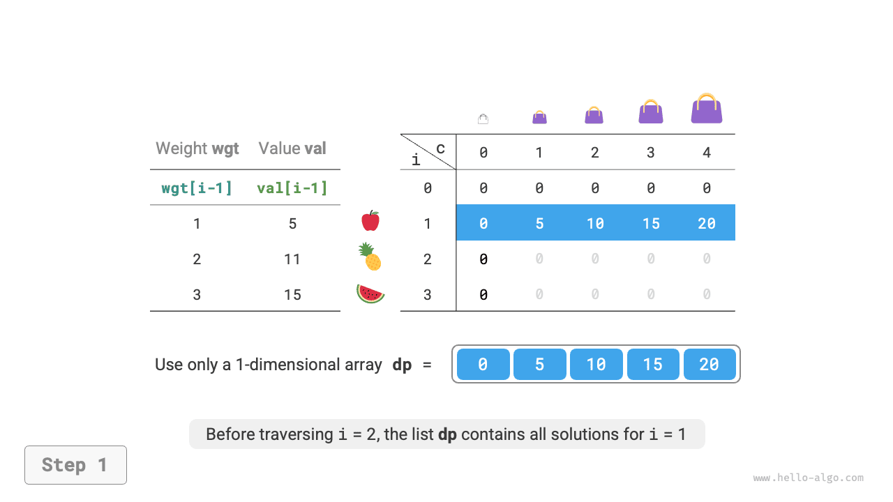
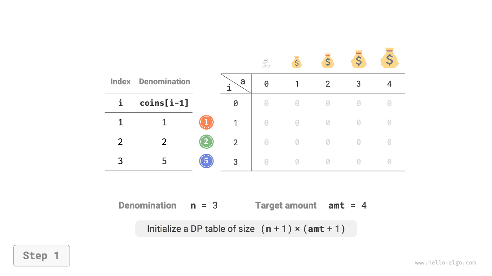
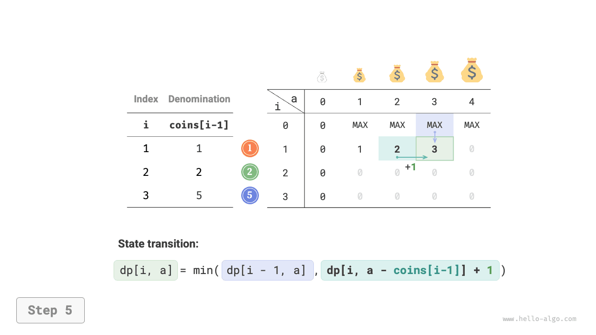
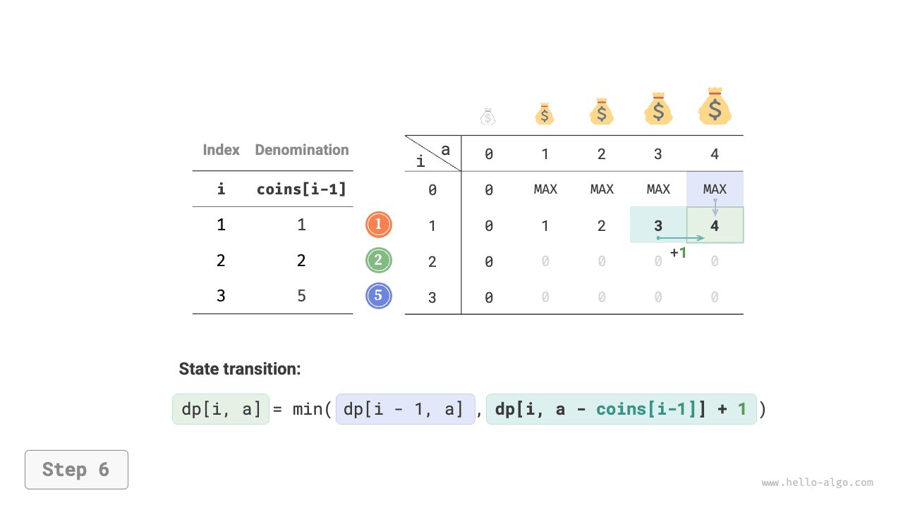
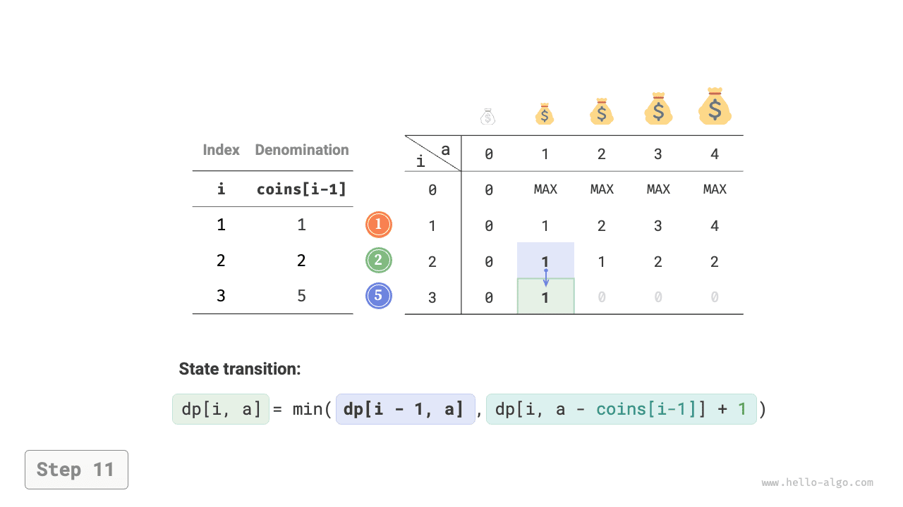

# Korlátlan hátizsák-feladat

Ebben a szakaszban először egy másik gyakori hátizsák-feladatot oldunk meg: a korlátlan hátizsák-feladatot, majd megvizsgálunk egy speciális esetét: az érmecserélési feladatot.

## Korlátlan hátizsák-feladat

!!! question

    Adott $n$ tárgy, ahol az $i$-edik tárgy súlya $wgt[i-1]$, értéke $val[i-1]$, és egy $cap$ kapacitású hátizsák. **Minden tárgy többször is kiválasztható**. Mi az a maximális érték, amelyet a kapacitáskorláton belül a hátizsákba lehet helyezni? Egy példa az alábbi ábrán látható.


### Dinamikus programozásos megközelítés

A korlátlan hátizsák-feladat nagyon hasonló a 0-1 hátizsák-feladathoz, **csupán abban különbözik, hogy nincs korlátozás arra, hogy hányszor lehet kiválasztani egy tárgyat**.

- A 0-1 hátizsák-feladatban minden típusból csak egy tárgy van, ezért az $i$ tárgy hátizsákba helyezése után csak az első $i-1$ tárgyból választhatunk.
- A korlátlan hátizsák-feladatban minden tárgy mennyisége korlátlan, ezért az $i$ tárgy hátizsákba helyezése után **még mindig az első $i$ tárgyból választhatunk**.

A korlátlan hátizsák-feladat szabályai alatt az $[i, c]$ állapot változásai két esetre oszthatók.

- **Nem rakjuk be az $i$ tárgyat**: Ugyanúgy, mint a 0-1 hátizsák-feladatban, $[i-1, c]$-re vezet át.
- **Berakjuk az $i$ tárgyat**: A 0-1 hátizsák-feladattól eltérően, $[i, c-wgt[i-1]]$-re vezet át.

Az állapot-átmeneti egyenlet ezáltal:

$$
dp[i, c] = \max(dp[i-1, c], dp[i, c - wgt[i-1]] + val[i-1])
$$

### Kódmegvalósítás

A két feladat kódjának összehasonlításakor az állapot-átmenetben egy változás van: $i-1$-ről $i$-re, minden más azonos:

```src
[file]{unbounded_knapsack}-[class]{}-[func]{unbounded_knapsack_dp}
```

### Tárhelyoptimalizálás

Mivel az aktuális állapot a bal oldali és a felső állapotokból vezethető át, **tárhelyoptimalizálás után a $dp$ tábla minden sorát előre haladó sorrendben kell bejárni**.

Ez a bejárási sorrend pontosan ellentétes a 0-1 hátizsák-feladatéval. Kérjük, tekintse meg az alábbi ábrát a kettő közötti különbség megértéséhez.

=== "<1>"
    

=== "<2>"
    

=== "<3>"
    

=== "<4>"
    

=== "<5>"
    

=== "<6>"
    

A kód megvalósítása viszonylag egyszerű, csak töröljük a `dp` tömb első dimenzióját:

```src
[file]{unbounded_knapsack}-[class]{}-[func]{unbounded_knapsack_dp_comp}
```

## Érmecserélési feladat

A hátizsák-feladat dinamikus programozási feladatok egy nagy osztályát képviseli, és sok változata van, például az érmecserélési feladat.

!!! question

    Adott $n$ típusú érme, ahol az $i$-edik típusú érme névértéke $coins[i - 1]$, és a célösszeg $amt$. **Minden típusú érme többször is kiválasztható**. Mi az a minimális érmeszám, amellyel a célösszeget ki lehet fizetni? Ha a célösszeget nem lehet kifizetni, adjunk vissza $-1$-et. Egy példa az alábbi ábrán látható.


### Dinamikus programozásos megközelítés

**Az érmecserélési feladat a korlátlan hátizsák-feladat speciális eseteként tekinthető**, a következő kapcsolatokkal és különbségekkel.

- A két feladat egymásba alakítható: a "tárgy" a "érmének", a "tárgy súlya" a "érme névértékének", a "hátizsák kapacitása" a "célösszegnek" felel meg.
- Az optimalizálási célok ellentétesek: a korlátlan hátizsák-feladat a tárgyak értékének maximalizálására törekszik, míg az érmecserélési feladat az érmék számának minimalizálására.
- A korlátlan hátizsák-feladat olyan megoldásokat keres, amelyek "nem haladják meg" a hátizsák kapacitását, míg az érmecserélési feladat olyan megoldásokat keres, amelyek "pontosan" kifizetik a célösszeget.

**1. lépés: Gondolja végig az egyes körök döntéseit, definiálja az állapotot, és így kapja meg a $dp$ táblát**

Az $[i, a]$ állapot a következő részproblémának felel meg: **az első $i$ típusú érmék közül az $a$ összeg kifizetéséhez szükséges minimális érmeszám**, amelyet $dp[i, a]$-val jelölünk.

A kétdimenziós $dp$ tábla mérete $(n+1) \times (amt+1)$.

**2. lépés: Azonosítsa az optimális részstruktúrát, majd vezesse le az állapot-átmeneti egyenletet**

Ez a feladat két szempontból különbözik a korlátlan hátizsák-feladattól az állapot-átmeneti egyenletet illetően.

- Ez a feladat a minimális értéket keresi, ezért a $\max()$ operátort $\min()$-re kell cserélni.
- Az optimalizálási cél az érmék száma, nem a tárgyak értéke, ezért egy érme kiválasztásakor egyszerűen $+1$-et hajtunk végre.

$$
dp[i, a] = \min(dp[i-1, a], dp[i, a - coins[i-1]] + 1)
$$

**3. lépés: Határozza meg a határfeltételeket és az állapot-átmeneti sorrendet**

Ha a célösszeg $0$, a kifizetéshez szükséges minimális érmeszám $0$, ezért az első oszlop összes $dp[i, 0]$ értéke $0$.

Ha nincsenek érmék, **egyetlen $> 0$ összeg sem fizethető ki**, ami érvénytelen megoldás. Az állapot-átmeneti egyenlet $\min()$ függvényének lehetővé tétele érdekében az érvénytelen megoldások azonosításához és kiszűréséhez $+ \infty$ értéket használunk ezek jelölésére, azaz az első sor összes $dp[0, a]$ értékét $+ \infty$-re állítjuk.

### Kódmegvalósítás

A legtöbb programozási nyelv nem biztosít $+ \infty$ változót, és csak az egész típus `int` maximális értékét lehet helyettesítőként használni. Ez azonban nagy szám túlcsorduláshoz vezethet: az állapot-átmeneti egyenletben szereplő $+ 1$ művelet túlcsordulást okozhat.

Emiatt az $amt + 1$ számot használjuk az érvénytelen megoldások jelölésére, mert az $amt$ kifizetéséhez szükséges érmék maximális száma legfeljebb $amt$. Visszatérés előtt ellenőrizzük, hogy $dp[n, amt]$ egyenlő-e $amt + 1$-gyel; ha igen, $-1$-et adunk vissza, jelezve, hogy a célösszeg nem fizethető ki. A kód a következő:

```src
[file]{coin_change}-[class]{}-[func]{coin_change_dp}
```

Az alábbi ábra az érmecserélési feladat dinamikus programozási folyamatát mutatja, amely nagyon hasonló a korlátlan hátizsák-feladathoz.

=== "<1>"
    

=== "<2>"
    

=== "<3>"
    

=== "<4>"
    

=== "<5>"
    

=== "<6>"
    

=== "<7>"
    

=== "<8>"
    

=== "<9>"
    

=== "<10>"
    

=== "<11>"
    

=== "<12>"
    

=== "<13>"
    

=== "<14>"
    

=== "<15>"
    

### Tárhelyoptimalizálás

Az érmecserélési feladat tárhelyoptimalizálása ugyanúgy kezelhető, mint a korlátlan hátizsák-feladaté:

```src
[file]{coin_change}-[class]{}-[func]{coin_change_dp_comp}
```

## Érmecserélési feladat II

!!! question

    Adott $n$ típusú érme, ahol az $i$-edik típusú érme névértéke $coins[i - 1]$, és a célösszeg $amt$. Minden típusú érme többször is kiválasztható. **Hányféle érmekombinációval fizethető ki a célösszeg?** Egy példa az alábbi ábrán látható.


### Dinamikus programozásos megközelítés

Az előző feladathoz képest ennek a feladatnak a célja a kombinációk számának megtalálása, ezért a részprobléma: **az első $i$ típusú érmék közül az $a$ összeget kifizetni képes kombinációk száma**. A $dp$ tábla továbbra is $(n+1) \times (amt + 1)$ méretű kétdimenziós mátrix.

Az aktuális állapot kombinációinak száma egyenlő az aktuális érme ki nem választásából és kiválasztásából eredő kombinációk összegével. Az állapot-átmeneti egyenlet:

$$
dp[i, a] = dp[i-1, a] + dp[i, a - coins[i-1]]
$$

Ha a célösszeg $0$, nem kell érméket kiválasztani a célösszeg kifizetéséhez, ezért az első oszlop összes $dp[i, 0]$ értékét $1$-re kell inicializálni. Ha nincsenek érmék, egyetlen $>0$ összeg sem fizethető ki, ezért az első sor összes $dp[0, a]$ értéke $0$.

### Kódmegvalósítás

```src
[file]{coin_change_ii}-[class]{}-[func]{coin_change_ii_dp}
```

### Tárhelyoptimalizálás

A tárhelyoptimalizálás ugyanúgy kezelhető, csak töröljük az érme dimenzióját:

```src
[file]{coin_change_ii}-[class]{}-[func]{coin_change_ii_dp_comp}
```
