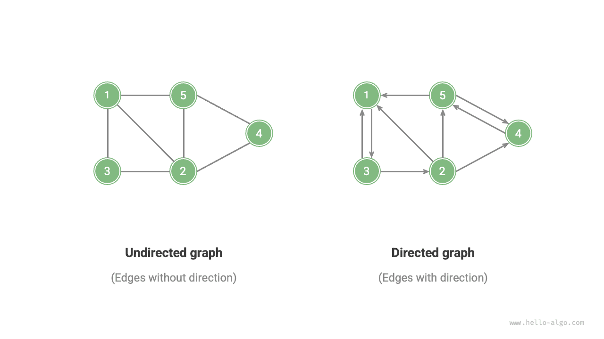

# Gráf

A <u>gráf</u> egy nemlineáris adatszerkezet, amely <u>csúcsokból</u> és <u>élekből</u> áll. Egy $G$ gráfot elvontan egy $V$ csúcshalmaz és egy $E$ élhalmaz segítségével ábrázolhatunk. Az alábbi példa egy 5 csúcsot és 7 élt tartalmazó gráfot mutat.

$$
\begin{aligned}
V & = \{ 1, 2, 3, 4, 5 \} \newline
E & = \{ (1,2), (1,3), (1,5), (2,3), (2,4), (2,5), (4,5) \} \newline
G & = \{ V, E \} \newline
\end{aligned}
$$

Ha a csúcsokat csomópontokként, az éleket pedig a csomópontokat összekötő hivatkozásokként (mutatókként) tekintjük, a gráfokat úgy szemlélhetjük, mint a láncolt listákból kibővített adatszerkezeteket. Ahogy az alábbi ábra mutatja, **a lineáris kapcsolatokhoz (láncolt listák) és az oszd meg és uralkodj kapcsolatokhoz (fák) képest a hálózati kapcsolatok (gráfok) magasabb fokú szabadsággal rendelkeznek, ezért összetettebbek**.

## Gráfok Típusai és Terminológiája

A gráfokat aszerint, hogy az élek rendelkeznek-e iránnyal, <u>irányítatlan gráfokra</u> és <u>irányított gráfokra</u> oszthatjuk, ahogy az alábbi ábra mutatja.

- Az irányítatlan gráfokban az élek két csúcs közötti „kétirányú" kapcsolatot jelölnek, például a WeChat vagy QQ „baráti kapcsolatait".
- Az irányított gráfokban az éleknek iránya van, vagyis az $A \rightarrow B$ és az $A \leftarrow B$ élek egymástól függetlenek, például a Weibón vagy a TikTokon a „követés" és a „követett" kapcsolatok.

A gráfokat aszerint, hogy az összes csúcs összefüggő-e, <u>összefüggő gráfokra</u> és <u>nem összefüggő gráfokra</u> oszthatjuk, ahogy az alábbi ábra mutatja.

- Az összefüggő gráfokban bármely csúcsból kiindulva az összes többi csúcs elérhető.
- A nem összefüggő gráfokban egy adott csúcsból kiindulva legalább egy csúcs nem érhető el.

Az élekhez „súly" változót is adhatunk, így <u>súlyozott gráfokat</u> kapunk, ahogy az alábbi ábra mutatja. Például az olyan mobilos játékokban, mint a „Királyok Becsülete", a rendszer a játékosok közötti közös játékidő alapján számítja ki a köztük lévő „közelséget", és az ilyen közelségi hálózatok súlyozott gráfokkal ábrázolhatók.

A gráf adatszerkezetek tartalmazzák az alábbi, gyakran használt fogalmakat.

- <u>Szomszédosság</u>: Amikor két csúcsot él köt össze, azt mondjuk, hogy a két csúcs „szomszédos". A fenti ábrán az 1-es csúcs szomszédjai a 2-es, 3-as és 5-ös csúcsok.
- <u>Út</u>: Az A csúcstól a B csúcsig vezető élek sorozatát „útnak" nevezzük A-tól B-ig. A fenti ábrán az 1-5-2-4 élsorozat egy út az 1-es csúcstól a 4-es csúcsig.
- <u>Fok</u>: Egy csúcshoz tartozó élek száma. Irányított gráfoknál a <u>befok</u> azt jelöli, hány él mutat a csúcsra, a <u>kifok</u> pedig azt, hány él indul ki a csúcsból.

## Gráfok Ábrázolása

A gráfok leggyakoribb ábrázolási módjai a „szomszédsági mátrix" és a „szomszédsági lista". A következőkben irányítatlan gráfokat használunk példaként.

### Szomszédsági Mátrix

Adott egy $n$ csúcsból álló gráf; a <u>szomszédsági mátrix</u> egy $n \times n$-es mátrixszal ábrázolja a gráfot, ahol minden sor (oszlop) egy-egy csúcsot jelöl, a mátrix elemei pedig az éleket jelölik: $1$ vagy $0$ értékkel jelzik, hogy két csúcs között van-e él.

Ahogy az alábbi ábra mutatja, legyen a szomszédsági mátrix $M$, a csúcslista pedig $V$. Ekkor az $M[i, j] = 1$ mátrixelem azt jelzi, hogy él van a $V[i]$ és a $V[j]$ csúcs között, míg az $M[i, j] = 0$ azt jelzi, hogy nincs él a két csúcs között.

A szomszédsági mátrixoknak az alábbi tulajdonságai vannak.

- Egyszerű gráfokban a csúcsok nem kapcsolódhatnak önmagukhoz, ezért a szomszédsági mátrix főátlójában lévő elemeknek nincs jelentőségük.
- Irányítatlan gráfokban mindkét irányú él egyenértékű, ezért a szomszédsági mátrix szimmetrikus a főátlóra.
- Ha a szomszédsági mátrix $1$ és $0$ elemeit súlyokra cseréljük, súlyozott gráfok is ábrázolhatók.

Amikor szomszédsági mátrixokkal ábrázolunk gráfokat, közvetlenül elérhetjük a mátrixelemeket az élek lekéréséhez, így a hozzáadás, törlés, keresés és módosítás műveletek rendkívül hatékonyak, és mindegyikük időbeli komplexitása $O(1)$. A mátrix térbeli komplexitása azonban $O(n^2)$, ami jelentős memóriafelhasználást jelent.

### Szomszédsági Lista

A <u>szomszédsági lista</u> $n$ láncolt listával ábrázolja a gráfot, ahol a listaelemek csúcsokat jelölnek. Az $i$-edik láncolt lista az $i$-edik csúcsnak felel meg, és az adott csúcs összes szomszédjára (az adott csúcshoz kapcsolódó csúcsokra) mutat. Az alábbi ábra egy szomszédsági listával tárolt gráfra mutat példát.

A szomszédsági lista csak a ténylegesen létező éleket tárolja, és az élek teljes száma általában jóval kevesebb $n^2$-nél, ezért hatékonyabban használja a tárhelyet. Az élek megtalálásához azonban a szomszédsági listában be kell járni a láncolt listát, ezért az időbeli hatékonysága alatta marad a szomszédsági mátrixénak.

A fenti ábra alapján **a szomszédsági lista szerkezete nagyon hasonlít a hash táblák „láncolás" módszeréhez, ezért hasonló megközelítésekkel optimalizálhatjuk a hatékonyságot**. Ha például a láncolt listák hosszúak, AVL-fákra vagy vörös-fekete fákra cserélhetők, ezzel az időbeli hatékonyságot $O(n)$-ről $O(\log n)$-re javítva; a láncolt listák hash táblákra is cserélhetők, így az időbeli komplexitás $O(1)$-re csökkenthető.

## Gráfok Általános Alkalmazásai

Ahogy az alábbi táblázat mutatja, számos valós rendszer modellezhető gráfokkal, és a megfelelő problémák gráfszámítási problémákra vezethetők vissza.

 Table <id> &nbsp; Mindennapi életből vett gráfok 

|                | Csúcsok           | Élek                                     | Gráfszámítási probléma           |
| -------------- | ----------------- | ---------------------------------------- | -------------------------------- |
| Közösségi háló | Felhasználók      | Baráti kapcsolatok                       | Potenciális barátok ajánlása     |
| Metróvonalak   | Állomások         | Állomások közötti összeköttetések        | Legrövidebb útvonal ajánlása     |
| Naprendszer    | Égitestek         | Égitestek közötti gravitációs erők       | Bolygópálya-számítás             |
