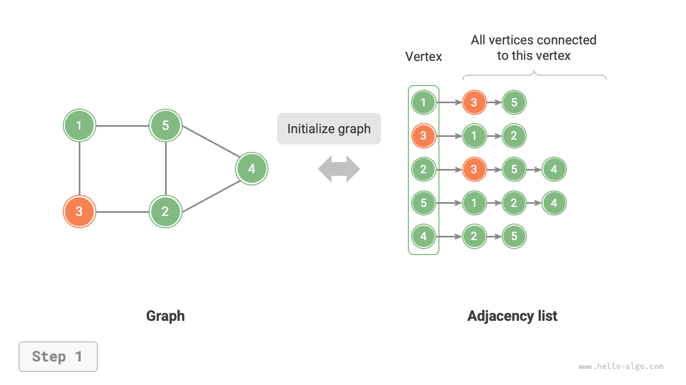
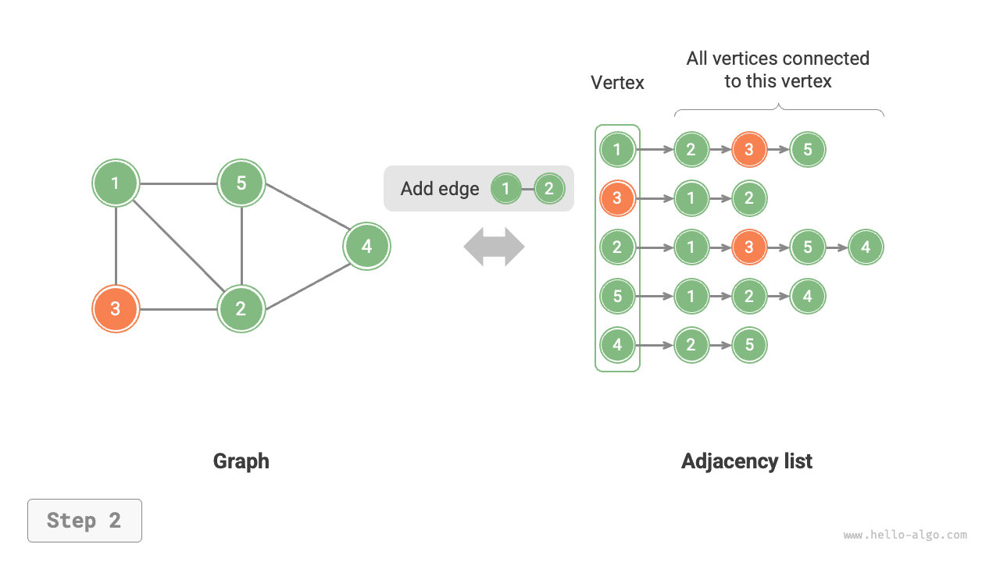

# Gráfok Alapműveletei

A gráfok alapműveletei „éleken" és „csúcsokon" végzett műveletekre bonthatók. A „szomszédsági mátrix" és a „szomszédsági lista" két ábrázolási módszernél az implementáció eltérő.

## Szomszédsági Mátrixon Alapuló Implementáció

Adott egy $n$ csúcsból álló irányítatlan gráf; a különféle műveletek az alábbi ábra szerint implementálhatók.

- **Él hozzáadása vagy törlése**: Közvetlenül módosítjuk a megadott élt a szomszédsági mátrixban, $O(1)$ időben. Mivel irányítatlan gráfról van szó, mindkét irányú élt egyszerre kell frissíteni.
- **Csúcs hozzáadása**: Egy sort és egy oszlopot adunk a szomszédsági mátrix végéhez, és $0$-kal töltjük fel, $O(n)$ időben.
- **Csúcs törlése**: Törlünk egy sort és egy oszlopot a szomszédsági mátrixból. A legrosszabb eset az első sor és oszlop törlésekor áll fenn, amikor $(n-1)^2$ elemet kell „felfelé és balra mozgatni", ezért az időbeli komplexitás $O(n^2)$.
- **Inicializálás**: $n$ csúcsot adunk át, inicializálunk egy $n$ hosszúságú `vertices` csúcslistát $O(n)$ időben; inicializálunk egy $n \times n$ méretű `adjMat` szomszédsági mátrixot $O(n^2)$ időben.

=== "<1>"
    

=== "<2>"
    

=== "<3>"
    

=== "<4>"
    

=== "<5>"
    

Az alábbiakban a szomszédsági mátrixszal ábrázolt gráfok implementációs kódja látható:

```src
[file]{graph_adjacency_matrix}-[class]{graph_adj_mat}-[func]{}
```

## Szomszédsági Listán Alapuló Implementáció

Adott egy irányítatlan gráf, amelynek összesen $n$ csúcsa és $m$ éle van; a különféle műveletek az alábbi ábra szerint implementálhatók.

- **Él hozzáadása**: Az élt a megfelelő csúcs láncolt listájának végéhez fűzzük, $O(1)$ időben. Mivel irányítatlan gráfról van szó, mindkét irányú élt egyszerre kell hozzáadni.
- **Él törlése**: Megkeressük és töröljük a megadott élt a megfelelő csúcs láncolt listájából, $O(m)$ időben. Irányítatlan gráfban mindkét irányú élt egyszerre kell törölni.
- **Csúcs hozzáadása**: Új láncolt listát adunk a szomszédsági listához, és az új csúcsot a lista fejcsomópontjaként állítjuk be, $O(1)$ időben.
- **Csúcs törlése**: Bejárjuk a teljes szomszédsági listát, és eltávolítjuk az adott csúcsot tartalmazó összes élt, $O(n + m)$ időben.
- **Inicializálás**: $n$ csúcsot és $2m$ élt hozunk létre a szomszédsági listában, $O(n + m)$ időben.

=== "<1>"
    

=== "<2>"
    

=== "<3>"
    

=== "<4>"
    

=== "<5>"
    

Az alábbiakban a szomszédsági lista implementációs kódja látható. A fenti ábrához képest a tényleges kód az alábbi eltéréseket mutatja.

- A csúcsok hozzáadásának és törlésének megkönnyítése, valamint a kód egyszerűsítése érdekében láncolt listák helyett listákat (dinamikus tömböket) használunk.
- A szomszédsági lista tárolásához hash táblát használunk, ahol a `key` a csúcs példánya, a `value` pedig az adott csúcs szomszédos csúcsainak listája (láncolt lista).

Emellett a szomszédsági listában a csúcsok jelölésére a `Vertex` osztályt használjuk. Ennek oka a következő: ha a szomszédsági mátrixhoz hasonlóan lista-indexeket alkalmaznánk a különböző csúcsok megkülönböztetésére, akkor az $i$-edik indexű csúcs törlésekor be kellene járni a teljes szomszédsági listát, és az összes $i$-nél nagyobb indexet $1$-gyel csökkenteni, ami nagyon nem hatékony. Ha azonban minden csúcs egyedi `Vertex` példány, a csúcs törlése nem igényli a többi csúcs módosítását.

```src
[file]{graph_adjacency_list}-[class]{graph_adj_list}-[func]{}
```

## Hatékonysági Összehasonlítás

Feltéve, hogy a gráfnak $n$ csúcsa és $m$ éle van, az alábbi táblázat összehasonlítja a szomszédsági mátrix és a szomszédsági lista időbeli és térbeli hatékonyságát. Megjegyzendő, hogy a szomszédsági lista (láncolt lista) ebben a szövegben ismertetett implementációnak felel meg, míg a szomszédsági lista (hash tábla) kifejezetten arra az implementációra utal, amelynél az összes láncolt listát hash táblákra cserélik.

<p align="center"> Table <id> &nbsp; Szomszédsági mátrix és szomszédsági lista összehasonlítása </p>

|                        | Szomszédsági mátrix | Szomszédsági lista (láncolt lista) | Szomszédsági lista (hash tábla) |
| ---------------------- | ------------------- | ---------------------------------- | ------------------------------- |
| Szomszédosság eldöntése | $O(1)$             | $O(n)$                             | $O(1)$                          |
| Él hozzáadása          | $O(1)$              | $O(1)$                             | $O(1)$                          |
| Él törlése             | $O(1)$              | $O(n)$                             | $O(1)$                          |
| Csúcs hozzáadása       | $O(n)$              | $O(1)$                             | $O(1)$                          |
| Csúcs törlése          | $O(n^2)$            | $O(n + m)$                         | $O(n)$                          |
| Memóriafelhasználás    | $O(n^2)$            | $O(n + m)$                         | $O(n + m)$                      |

A fenti táblázat alapján úgy tűnik, hogy a szomszédsági lista (hash tábla) rendelkezik a legjobb időbeli és térbeli hatékonysággal. A gyakorlatban azonban a szomszédsági mátrixon végzett élműveletek hatékonyabbak, mivel csupán egyetlen tömbelérési vagy -hozzárendelési műveletet igényelnek. Összességében a szomszédsági mátrix a „tér idő ellenében" elvét testesíti meg, míg a szomszédsági lista a „idő tér ellenében" elvét.
