# Gráfbejárás

A fák „egy-a-többhöz" kapcsolatokat jelölnek, míg a gráfok magasabb fokú szabadsággal rendelkeznek, és tetszőleges „több-a-többhöz" kapcsolatokat képesek ábrázolni. Ezért a fákat a gráfok speciális eseteiként tekinthetjük. Nyilvánvaló, hogy **a fabejárási műveletek is a gráfbejárási műveletek speciális esetei**.

Mind a gráfok, mind a fák esetén keresési algoritmusokra van szükség a bejárási műveletek megvalósításához. A gráfbejárási módszerek két típusra oszthatók: <u>szélességi bejárás</u> és <u>mélységi bejárás</u>.

## Szélességi Bejárás (BFS)

**A szélességi bejárás (BFS) egy közelitől távoliig haladó bejárási módszer, amely egy adott csomóponttól kiindulva mindig a legközelebbi csúcsok felkeresését részesíti előnyben, és rétegről rétegre terjeszkedik kifelé**. Ahogy az alábbi ábra mutatja, a bal felső csúcstól kiindulva először bejárjuk az adott csúcs összes szomszédját, majd a következő csúcs összes szomszédját, és így tovább, amíg az összes csúcsot meg nem látogattuk.


### Algoritmus Implementációja

A szélességi bejárást (BFS) általában sor (queue) segítségével valósítják meg, ahogy az alábbi kódban látható. A sornak „elsőnek be, elsőnek ki" tulajdonsága van, ami megfelel a szélességi bejárás „közelitől távoliig" megközelítésének.

1. A kezdő `startVet` csúcsot hozzáadjuk a sorhoz, és elkezdjük a ciklust.
2. A ciklus minden iterációjában kivesszük a sor elejéről lévő csúcsot, meglátogatottként rögzítjük, majd az adott csúcs összes szomszédját hozzáadjuk a sor végéhez.
3. Addig ismételjük a `2.` lépést, amíg az összes csúcsot meg nem látogattuk.

A csúcsok ismételt meglátogatásának elkerülése érdekében egy `visited` hash halmazt használunk a már meglátogatott csomópontok nyilvántartásához.

!!! tip

    A hash halmaz egy olyan hash táblaként tekinthető, amely csak `key` értékeket tárol `value` értékek nélkül. $O(1)$ időbeli komplexitással képes `key`-eken hozzáadási, törlési, keresési és módosítási műveleteket végezni. A `key` egyediségéből adódóan a hash halmazokat általában adatdeduplikálásra és hasonló feladatokra használják.

```src
[file]{graph_bfs}-[class]{}-[func]{graph_bfs}
```

A kód viszonylag elvont; az alábbi ábrára támaszkodva ajánlott mélyíteni a megértést.

=== "<1>"
    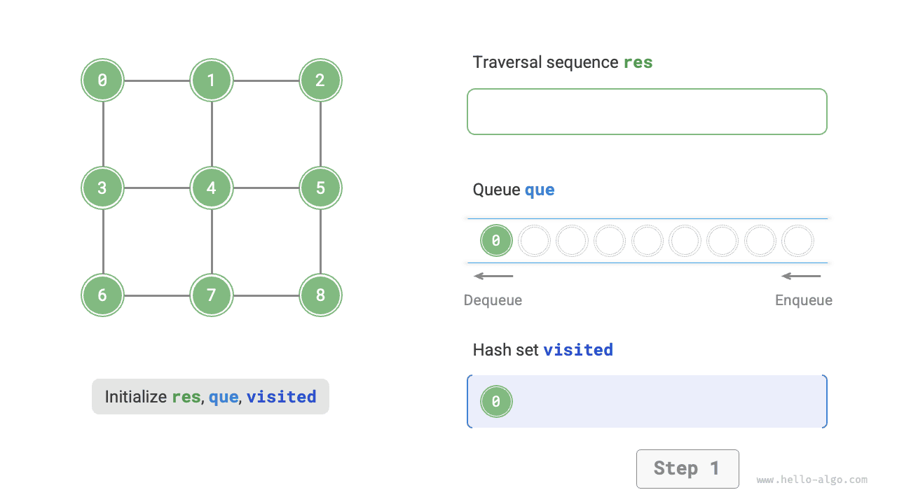

=== "<2>"
    

=== "<3>"
    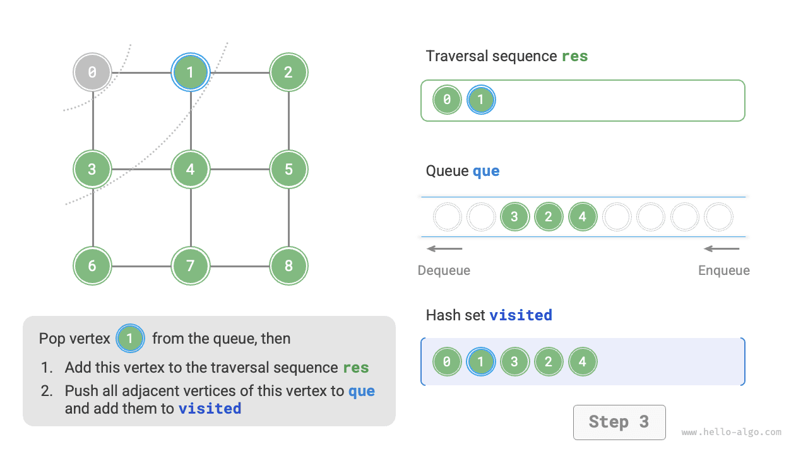

=== "<4>"
    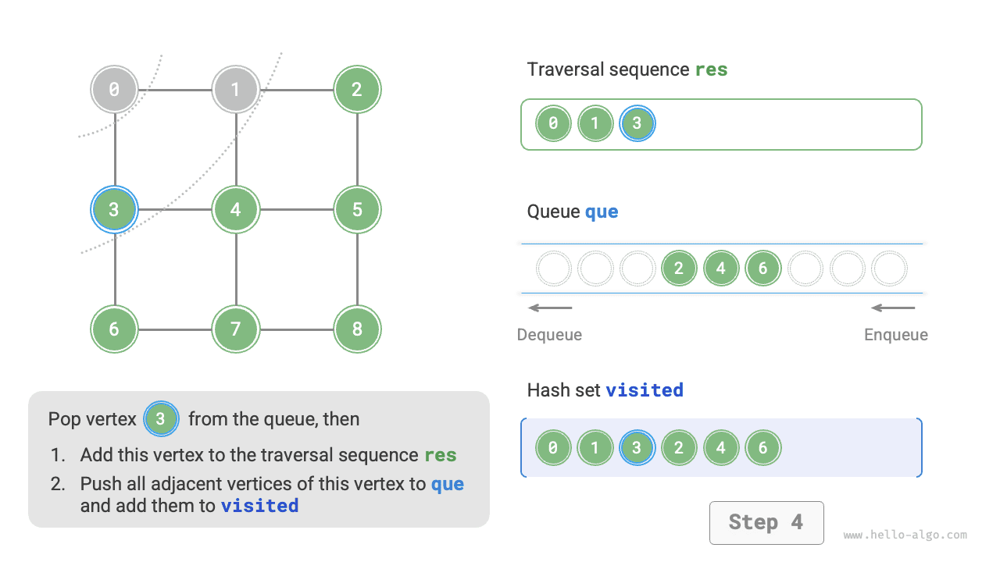

=== "<5>"
    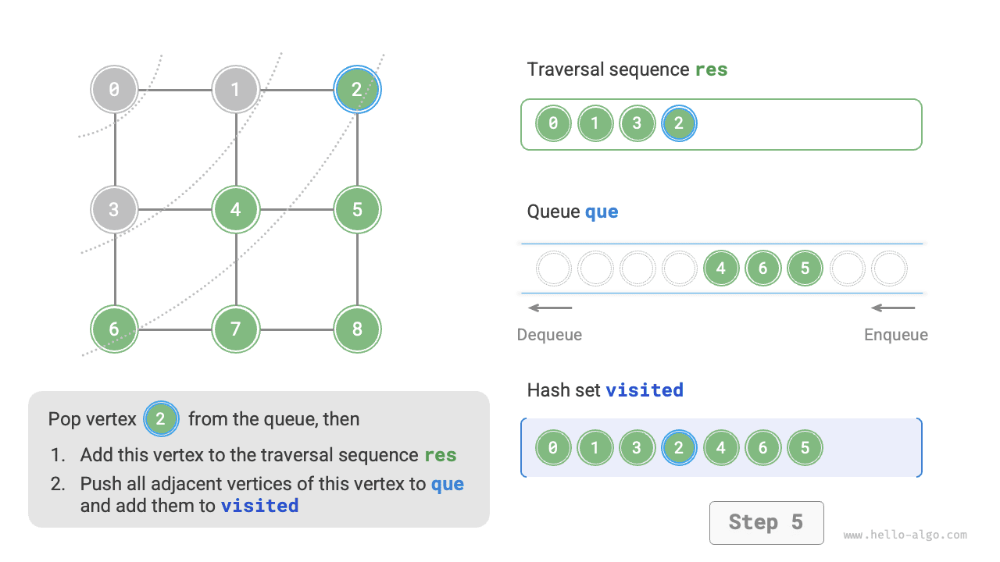

=== "<6>"
    

=== "<7>"
    

=== "<8>"
    

=== "<9>"
    

=== "<10>"
    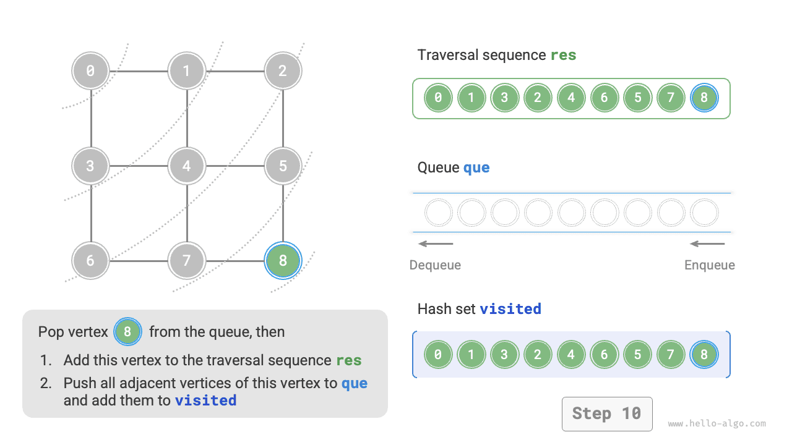

=== "<11>"
    

!!! question "Egyedi-e a szélességi bejárási sorrend?"

    Nem egyedi. A szélességi bejárás (BFS) csak azt követeli meg, hogy a bejárás „közelitől távoliig" sorrendben haladjon, **az azonos távolságra lévő csúcsok bejárási sorrendje tetszőlegesen megváltoztatható**. A fenti ábrát például véve az 1-es és 3-as csúcs meglátogatásának sorrendje felcserélhető, csakúgy, mint a 2-es, 4-es és 6-os csúcsoké.

### Komplexitáselemzés

**Időbeli komplexitás**: Az összes csúcsot egyszer sorba helyezzük és kivesszük a sorból, ami $O(|V|)$ időt igényel; a szomszédos csúcsok bejárásakor, mivel irányítatlan gráfról van szó, az összes élt $2$-szer látogatjuk meg, ami $O(2|E|)$ időt igényel; összességében $O(|V| + |E|)$ időt vesz igénybe.

**Térbeli komplexitás**: A `res` lista, a `visited` hash halmaz és a `que` sor legfeljebb $|V|$ csúcsot tartalmazhat, ami $O(|V|)$ tárhelyet igényel.

## Mélységi Bejárás (DFS)

**A mélységi bejárás (DFS) egy olyan bejárási módszer, amely az elérhető legmélyebb pontig halad, majd visszalép, ha nincs tovább vezető út**. Ahogy az alábbi ábra mutatja, a bal felső csúcstól kiindulva meglátogatjuk az aktuális csúcs egyik szomszédját, és folytatjuk egészen a zsákutcáig, majd visszamegyünk, és ismét olyan messzire haladunk, amennyire csak lehetséges, majd ismét visszatérünk, és így tovább, amíg az összes csúcsot be nem jártuk.

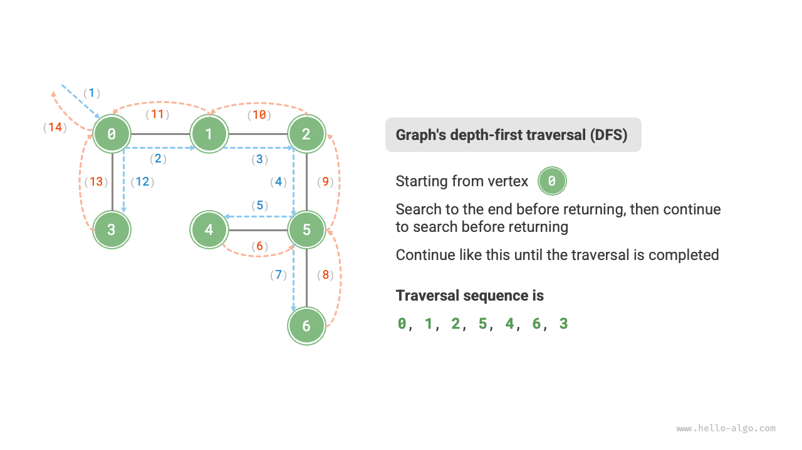

### Algoritmus Implementációja

Ez az „amilyen messzire csak lehetséges, majd visszatérés" algoritmikus paradigma általában rekurzióval valósítható meg. A szélességi bejáráshoz hasonlóan a mélységi bejárásban (DFS) is szükségünk van egy `visited` hash halmazra a meglátogatott csúcsok nyilvántartásához és az ismételt meglátogatás elkerüléséhez.

```src
[file]{graph_dfs}-[class]{}-[func]{graph_dfs}
```

A mélységi bejárás (DFS) algoritmikus folyamatát az alábbi ábra szemlélteti.

- **Az egyenes szaggatott vonalak lefelé irányuló rekurziót jelölnek**, ami azt mutatja, hogy egy új rekurzív hívás indult egy új csúcs meglátogatásához.
- **A görbe szaggatott vonalak felfelé irányuló visszalépést jelölnek**, ami azt jelzi, hogy ez a rekurzív hívás visszatért oda, ahol elindult.

A megértés elmélyítéséhez ajánlott az alábbi ábrát és a kódot összekapcsolva mentálisan szimulálni (vagy lerajzolni) a teljes mélységi bejárási (DFS) folyamatot, beleértve azt is, hogy az egyes rekurzív hívások mikor indulnak el és mikor térnek vissza.

=== "<1>"
    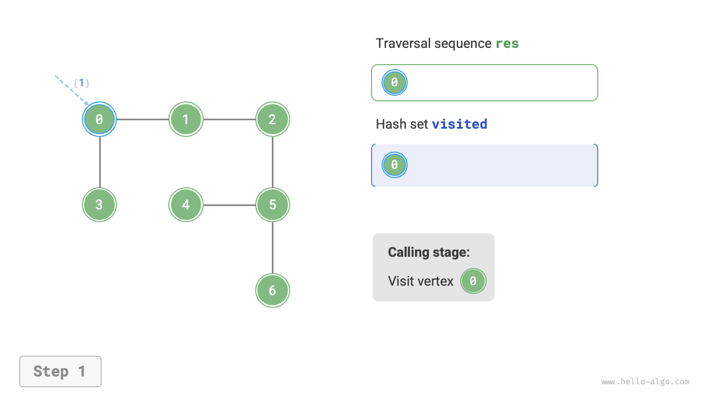

=== "<2>"
    

=== "<3>"
    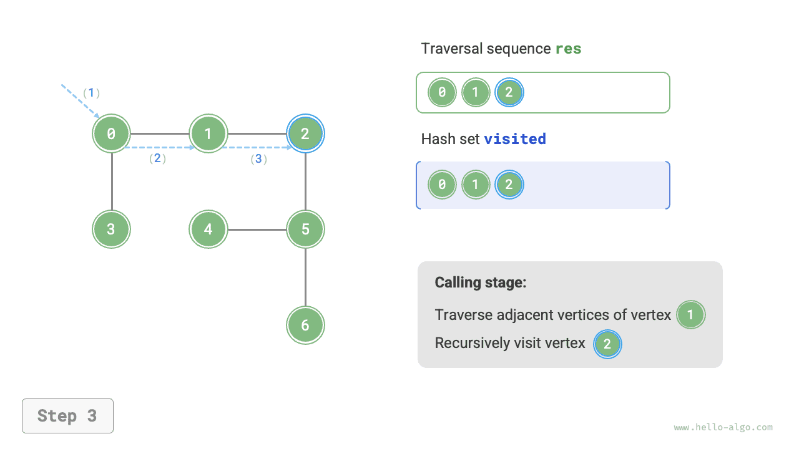

=== "<4>"
    

=== "<5>"
    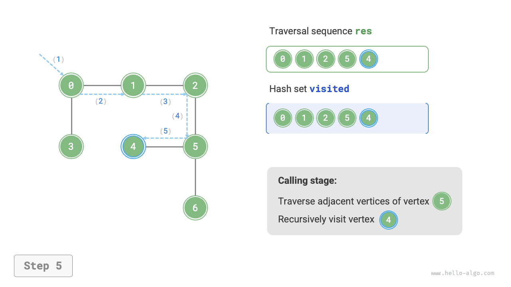

=== "<6>"
    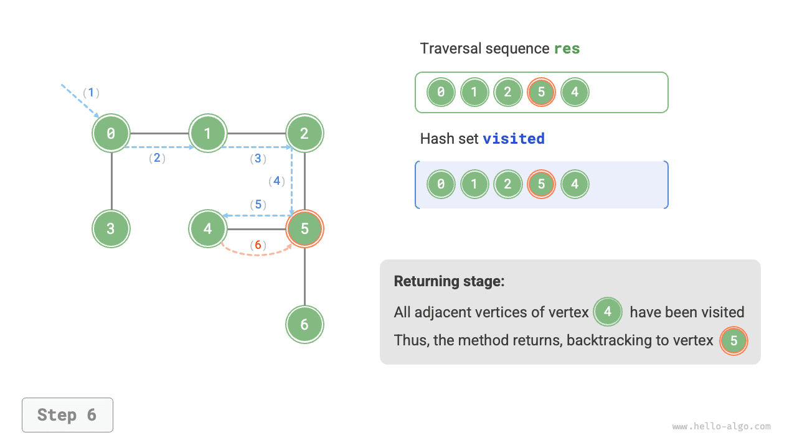

=== "<7>"
    

=== "<8>"
    

=== "<9>"
    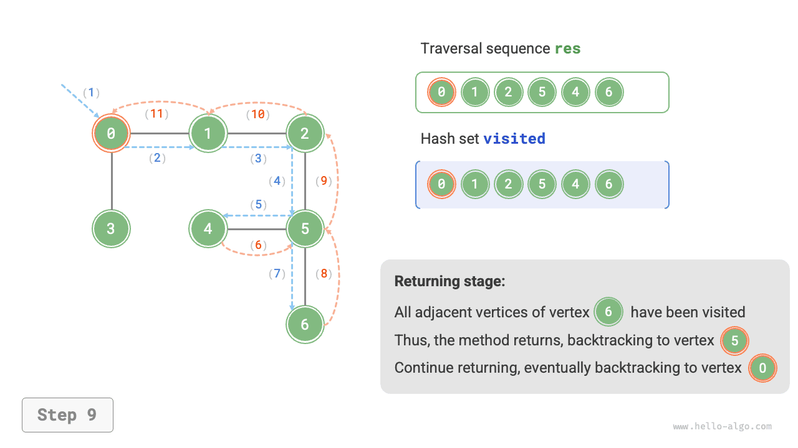

=== "<10>"
    

=== "<11>"
    

!!! question "Egyedi-e a mélységi bejárási sorrend?"

    A szélességi bejáráshoz hasonlóan a mélységi bejárási sorozat sorrendje sem egyedi. Adott csúcsnál bármely irányba elsőként való haladás érvényes, vagyis a szomszédos csúcsok sorrendje tetszőlegesen megváltoztatható – mindez mélységi bejárásnak számít.

    A fabejárást példaként véve a „gyökér $\rightarrow$ bal $\rightarrow$ jobb", a „bal $\rightarrow$ gyökér $\rightarrow$ jobb" és a „bal $\rightarrow$ jobb $\rightarrow$ gyökér" sorozatok rendre az előrendű, a középrendű és az utórendű bejárásnak felelnek meg. Ezek három különböző bejárási prioritást jelölnek, mégis mindhárom mélységi bejárásnak minősül.

### Komplexitáselemzés

**Időbeli komplexitás**: Az összes csúcsot $1$-szer látogatjuk meg, ami $O(|V|)$ időt igényel; az összes élt $2$-szer látogatjuk meg, ami $O(2|E|)$ időt igényel; összességében $O(|V| + |E|)$ időt vesz igénybe.

**Térbeli komplexitás**: A `res` lista és a `visited` hash halmaz legfeljebb $|V|$ csúcsot tartalmazhat, a maximális rekurziós mélység $|V|$, ezért a tárhelyigény $O(|V|)$.
