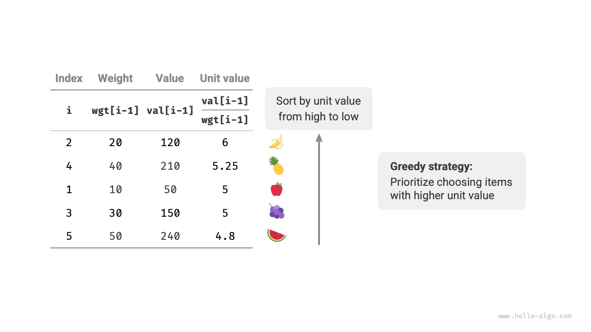

# Töredékes hátizsák probléma

!!! question

    Adott $n$ tárgy, ahol az $i$-edik tárgy súlya $wgt[i-1]$ és értéke $val[i-1]$, és egy $cap$ kapacitású hátizsák. Minden tárgy csak egyszer választható ki, **de egy tárgy egy része is kiválasztható, az értéket a kiválasztott súly arányában számítva**, mi a tárgyak maximális értéke a hátizsákban a korlátozott kapacitás mellett? Egy példa az alábbi ábrán látható.


A töredékes hátizsák probléma összességében nagyon hasonló a 0-1 hátizsák problémához, az állapotok közé tartozik az aktuális tárgy $i$ és a kapacitás $c$, és a cél az érték maximalizálása a korlátozott hátizsák-kapacitás mellett.

A különbség az, hogy ez a probléma lehetővé teszi egy tárgy egy részének kiválasztását. Ahogy az alábbi ábra mutatja, **a tárgyakat tetszőlegesen feldarabolhatjuk és a megfelelő értéket a súlyarány alapján számíthatjuk**.

1. A $i$-edik tárgy esetén az egységnyi súlyra jutó érték $val[i-1] / wgt[i-1]$, amelyet egységértéknek nevezünk.
2. Tegyük fel, hogy az $i$-edik tárgy egy $w$ súlyú részét betesszük a hátizsákba, akkor a hátizsákhoz hozzáadott érték $w \times val[i-1] / wgt[i-1]$.


### Mohó stratégia meghatározása

A hátizsákban lévő tárgyak összértékének maximalizálása **lényegében a tárgyak egységnyi súlyra jutó értékének maximalizálása**. Ebből levezethetjük az alábbi ábrán látható mohó stratégiát.

1. A tárgyakat egységérték szerint rendezzük csökkenő sorrendbe.
2. Iterálunk az összes tárgyon, **minden körben mohón kiválasztva a legnagyobb egységértékű tárgyat**.
3. Ha a maradék hátizsák-kapacitás nem elegendő, az aktuális tárgy egy részével töltjük meg a hátizsákot.



### Kód megvalósítása

Létrehoztunk egy `Item` osztályt a tárgyak egységérték szerinti rendezésének megkönnyítésére. Cikluson keresztül mohó választásokat teszünk, megszakítva, amikor a hátizsák megtelt, és visszaadjuk a megoldást:

```src
[file]{fractional_knapsack}-[class]{}-[func]{fractional_knapsack}
```

A beépített rendező algoritmusok időbonyolultsága általában $O(\log n)$, a térbonyolultság általában $O(\log n)$ vagy $O(n)$, a programozási nyelv konkrét megvalósításától függően.

A rendezésen kívül a legrosszabb esetben az egész tárgylista bejárására szükség van, **ezért az időbonyolultság $O(n)$**, ahol $n$ a tárgyak száma.

Mivel egy `Item` objektumlistát inicializálunk, **a térbonyolultság $O(n)$**.

### Helyességbizonyítás

Ellentmondásos bizonyítással. Tegyük fel, hogy az $x$ tárgynak van a legnagyobb egységértéke, és valamilyen algoritmus maximális értéket ad `res`, de ez a megoldás nem tartalmazza az $x$ tárgyat.

Most vegyünk ki egységnyi súlyt bármely tárgyból a hátizsákból, és cseréljük le egységnyi súlyú $x$ tárgyra. Mivel az $x$ tárgynak van a legnagyobb egységértéke, a csere utáni összérték biztosan nagyobb lesz, mint `res`. **Ez ellentmond annak a feltevésnek, hogy `res` az optimális megoldás, bizonyítva, hogy az optimális megoldásnak tartalmaznia kell az $x$ tárgyat**.

A megoldásban szereplő többi tárgyra vonatkozóan szintén felépíthetjük a fenti ellentmondást. Összefoglalva, **a nagyobb egységértékű tárgyak mindig jobb választások**, ami bizonyítja, hogy a mohó stratégia hatékony.

Ahogy az alábbi ábra mutatja, ha a tárgy súlyát és a tárgy egységértékét egy kétdimenziós diagram vízszintes és függőleges tengelyeként tekintjük, akkor a töredékes hátizsák probléma átalakítható „a korlátozott vízszintes tengelytartományon belül bekerített maximális terület megtalálásává". Ez az analógia segíthet megérteni a mohó stratégia hatékonyságát geometriai szempontból.


