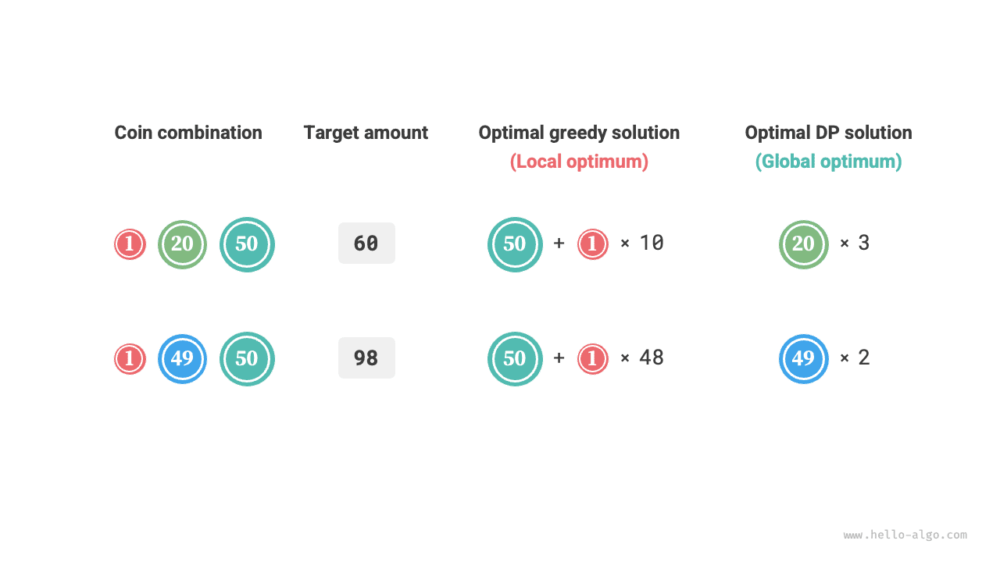

# Mohó algoritmus

<u>A mohó algoritmus</u> egy általánosan használt algoritmus optimalizálási problémák megoldására. Az alapötlete az, hogy a probléma minden döntési szakaszában a látszólag legjobb választást teszi, azaz mohón hoz lokálisan optimális döntéseket abban a reményben, hogy globálisan optimális megoldást kapjon. A mohó algoritmusok egyszerűek és hatékonyak, és számos gyakorlati problémában széles körben alkalmazzák őket.

A mohó algoritmusok és a dinamikus programozás egyaránt gyakran használatosak optimalizálási problémák megoldásában. Vannak köztük hasonlóságok, például mindkettő az optimális részstruktúra tulajdonságára támaszkodik, de eltérően működnek.

- A dinamikus programozás az aktuális döntés meghozatalakor figyelembe veszi az összes korábbi döntést, és a korábbi részproblémák megoldásait felhasználja az aktuális részprobléma megoldásának felépítéséhez.
- A mohó algoritmusok nem veszik figyelembe a korábbi döntéseket, hanem mohó választásokat hoznak előrehaladva, folyamatosan csökkentve a probléma méretét, amíg a probléma meg nem oldódik.

Először a „pénzváltás" példafeladaton keresztül értjük meg, hogyan működnek a mohó algoritmusok. Ezt a problémát már bevezettük a „Teljes hátizsák probléma" fejezetben, ezért úgy gondolom, hogy nem ismeretlen az Ön számára.

!!! question

    Adott $n$ típusú érme, ahol az $i$-edik típusú érme névértéke $coins[i - 1]$, és a célösszeg $amt$, ahol minden típusú érme ismételten kiválasztható, mi a minimális érmeszám, amellyel összerakható a célösszeg? Ha a célösszeg nem rakható össze, adjon vissza $-1$-et.

Az erre a problémára alkalmazott mohó stratégiát az alábbi ábra mutatja. Adott célösszeg esetén **mohón kiválasztjuk azt az érmét, amely nem nagyobb és a legközelebb van hozzá**, és ezt a lépést folyamatosan ismételjük, amíg el nem érjük a célösszeget.


A megvalósítási kód a következő:

```src
[file]{coin_change_greedy}-[class]{}-[func]{coin_change_greedy}
```

Talán felkiált: Milyen egyszerű! A mohó algoritmus körülbelül tíz sor kóddal megoldja a pénzváltás problémáját.

## A mohó algoritmusok előnyei és korlátai

**A mohó algoritmusok nemcsak egyenesen és egyszerűen valósíthatók meg, hanem általában nagyon hatékonyak is**. A fenti kódban, ha a legkisebb érme névértéke $\min(coins)$, a mohó választás ciklusai legfeljebb $amt / \min(coins)$ alkalommal futnak, így az időbonyolultság $O(amt / \min(coins))$. Ez nagyságrendekkel kisebb, mint a dinamikus programozási megoldás $O(n \times amt)$ időbonyolultsága.

Azonban **bizonyos érme névérték-kombinációk esetén a mohó algoritmusok nem találják meg az optimális megoldást**. Az alábbi ábra két példát mutat.

- **Pozitív példa $coins = [1, 5, 10, 20, 50, 100]$**: Ezzel az érmekombinációval, bármely $amt$ esetén, a mohó algoritmus meg tudja találni az optimális megoldást.
- **Negatív példa $coins = [1, 20, 50]$**: Tegyük fel, $amt = 60$, a mohó algoritmus csak az $50 + 1 \times 10$ kombinációt találja meg, összesen $11$ érmét, de a dinamikus programozás megtalálja az optimális megoldást $20 + 20 + 20$, amelyhez csak $3$ érme szükséges.
- **Negatív példa $coins = [1, 49, 50]$**: Tegyük fel, $amt = 98$, a mohó algoritmus csak az $50 + 1 \times 48$ kombinációt találja meg, összesen $49$ érmét, de a dinamikus programozás megtalálja az optimális megoldást $49 + 49$, amelyhez csak $2$ érme szükséges.



Más szóval, a pénzváltás problémájánál a mohó algoritmusok nem tudják garantálni a globálisan optimális megoldás megtalálását, és akár nagyon rossz megoldásokat is adhatnak. Dinamikus programozással jobb megoldani.

Általában a mohó algoritmusok alkalmazhatósága a következő két helyzetbe esik.

1. **Garantálhatja az optimális megoldás megtalálását**: Ebben a helyzetben a mohó algoritmusok általában a legjobb választás, mivel általában hatékonyabbak, mint a visszalépéses keresés és a dinamikus programozás.
2. **Megközelítőleg optimális megoldást találhat**: A mohó algoritmusok ebben a helyzetben is alkalmazhatók. Sok összetett probléma esetén nagyon nehéz megtalálni a globálisan optimális megoldást, és nagy hatékonysággal egy szuboptimális megoldást találni szintén nagyon jó eredmény.

## A mohó algoritmusok jellemzői

Felmerül tehát a kérdés: milyen problémák alkalmasak mohó algoritmusokkal való megoldásra? Vagy más szóval, milyen feltételek mellett tudják a mohó algoritmusok garantálni az optimális megoldás megtalálását?

A dinamikus programozáshoz képest a mohó algoritmusok alkalmazásának feltételei szigorúbbak, főként a probléma két tulajdonságára összpontosítanak.

- **Mohó választás tulajdonsága**: Csak akkor, ha a lokálisan optimális választások mindig globálisan optimális megoldáshoz vezet, tudják a mohó algoritmusok garantálni az optimális megoldás elérését.
- **Optimális részstruktúra**: Az eredeti probléma optimális megoldása tartalmazza a részproblémák optimális megoldásait.

Az optimális részstruktúrát már bevezettük a „Dinamikus programozás" fejezetben, ezért itt nem részletezzük. Érdemes megjegyezni, hogy néhány probléma optimális részstruktúrája nem nyilvánvaló, de azok mégis megoldhatók mohó algoritmusokkal.

Főként a mohó választás tulajdonságának meghatározására vonatkozó módszereket vizsgáljuk. Bár leírása viszonylag egyszerűnek tűnik, **a gyakorlatban sok probléma esetén a mohó választás tulajdonságának bizonyítása nem könnyű**.

Például a pénzváltás problémájánál, bár könnyen tudunk ellenpéldákat hozni a mohó választás tulajdonságának cáfolatára, bizonyítani nagyon nehéz. Ha azt kérdezik: **milyen feltételeknek kell megfelelnie egy érmekombinációnak ahhoz, hogy mohó algoritmussal megoldható legyen**? Gyakran csak intuíció vagy példák alapján tudunk homályos választ adni, és nehéz szigorú matematikai bizonyítást nyújtani.

!!! quote

    Létezik egy olyan cikk, amely egy $O(n^3)$ időbonyolultságú algoritmust mutat be annak meghatározásához, hogy egy érmekombináció esetén a mohó algoritmus bármely összegre megtalálja-e az optimális megoldást.

    Pearson, D. A polynomial-time algorithm for the change-making problem[J]. Operations Research Letters, 2005, 33(3): 231-234.

## Lépések a problémák mohó algoritmusokkal való megoldásához

A mohó problémák megoldási folyamata általában a következő három lépésre osztható.

1. **Problémaelemzés**: A probléma jellemzőinek feltárása és megértése, beleértve az állapotkezdőértékeket, optimalizálási célokat és kényszerfeltételeket stb. Ez a lépés a visszalépéses keresésben és a dinamikus programozásban is szerepel.
2. **A mohó stratégia meghatározása**: Annak meghatározása, hogyan hozzunk mohó döntéseket minden lépésben. Ennek a stratégiának minden lépésben csökkentenie kell a probléma méretét, végül megoldva az egész problémát.
3. **Helyességbizonyítás**: Általában szükséges bizonyítani, hogy a problémának mind mohó választás tulajdonsága, mind optimális részstruktúrája van. Ez a lépés matematikai bizonyításokat igényelhet, például matematikai indukciót vagy ellentmondásos bizonyítást.

A mohó stratégia meghatározása a probléma megoldásának alapvető lépése, de nem biztos, hogy könnyen megvalósítható, főként a következő okok miatt.

- **A mohó stratégiák nagymértékben különböznek a különböző problémák esetén**. Sok probléma esetén a mohó stratégia viszonylag egyszerű, és némi általános gondolkodással és kísérletekkel le tudjuk származtatni. Azonban néhány összetett probléma esetén a mohó stratégia nagyon nehezen megragadható, ami valóban próbára teszi a probléma-megoldó tapasztalatot és az algoritmikus képességet.
- **Néhány mohó stratégia nagyon félrevezető**. Amikor magabiztosan tervezzük meg a mohó stratégiát, megírjuk a megoldási kódot és benyújtjuk tesztelésre, azt tapasztalhatjuk, hogy néhány teszteset nem teljesül. Ez azért van, mert a tervezett mohó stratégia csak „részben helyes", ahogy a fent tárgyalt pénzváltás probléma is példázza.

A helyesség biztosítása érdekében szigorúan matematikailag kell bizonyítani a mohó stratégiát, **általában ellentmondásos bizonyítással vagy matematikai indukcióval**.

Azonban a helyességbizonyítások szintén nem feltétlenül egyszerűek. Ha nincs ötletünk, általában a kódot tesztesetek alapján hibakeressük, lépésről lépésre módosítva és ellenőrizve a mohó stratégiát.

## A mohó algoritmusok által megoldható tipikus problémák

A mohó algoritmusokat gyakran alkalmazzák olyan optimalizálási problémákra, amelyek kielégítik a mohó választás tulajdonságát és az optimális részstruktúrát. Az alábbiakban néhány tipikus mohó algoritmus problémát mutatunk be.

- **Pénzváltás probléma**: Bizonyos érmekombinációk esetén a mohó algoritmusok mindig meg tudják találni az optimális megoldást.
- **Intervallumütemezési probléma**: Tegyük fel, hogy van néhány feladatunk, amelyek mindegyike egy időszakban zajlik, és a célunk a lehető legtöbb feladat elvégzése. Ha mindig a legkorábban végző feladatot választjuk, akkor a mohó algoritmus meg tudja találni az optimális megoldást.
- **Töredékes hátizsák probléma**: Adott egy sor tárgy és egy szállítási kapacitás, a cél olyan tárgyak kiválasztása, hogy az összsúly ne haladja meg a kapacitást és az összérték maximalizált legyen. Ha mindig a legjobb értéksűrűségű tárgyat választjuk (érték / súly), akkor a mohó algoritmus bizonyos esetekben meg tudja találni az optimális megoldást.
- **Részvénykereskedési probléma**: Adott egy sor historikus részvényár, többször kereskedhetünk, de ha már van részvényünk, nem vásárolhatunk újra az eladás előtt, és a cél a maximális profit elérése.
- **Huffman-kódolás**: A Huffman-kódolás egy mohó algoritmus, amelyet veszteségmentes adattömörítéshez használnak. Huffman-fa felépítésével és mindig a két legkisebb frekvenciájú csomópont összevonásával a kapott Huffman-fa minimális súlyozott úthosszal rendelkezik (kódolási hossz).
- **Dijkstra-algoritmus**: Ez egy mohó algoritmus az adott forráscsúcstól az összes többi csúcsig tartó legrövidebb út megoldásához.
