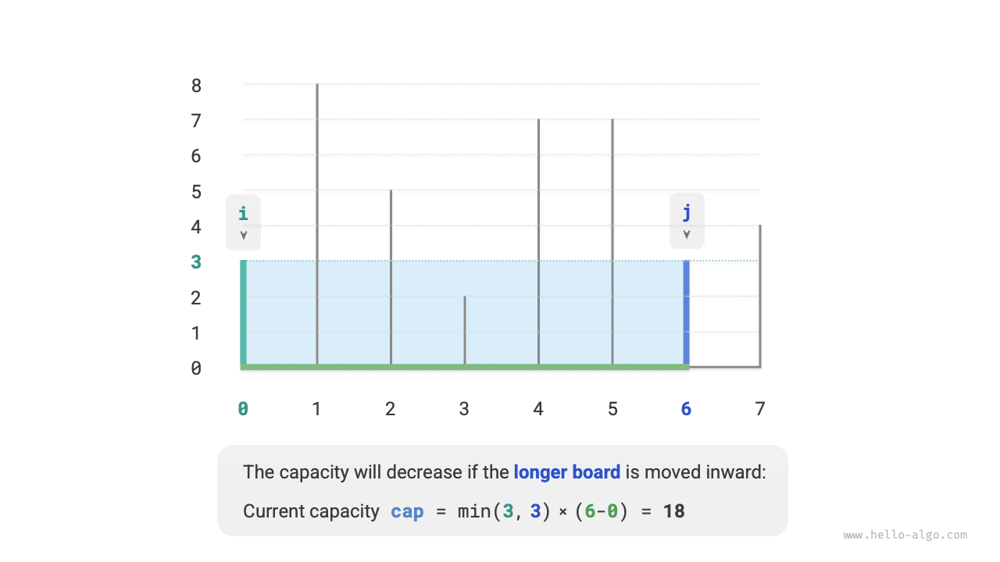
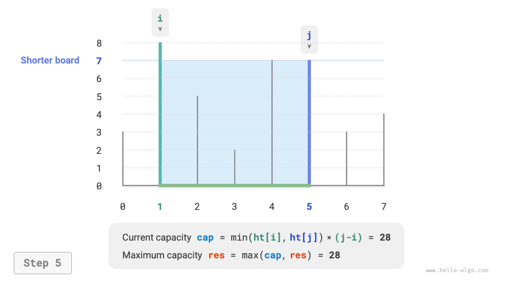

# Maximális kapacitás probléma

!!! question

    Adjon meg egy $ht$ tömböt, ahol minden elem egy függőleges válaszfal magasságát reprezentálja. A tömbben bármely két válaszfal, valamint a köztük lévő tér tárolóedényt alkothat.

    A tartály kapacitása egyenlő a magasság és a szélesség szorzatával (terület), ahol a magasságot a rövidebb válaszfal határozza meg, a szélesség pedig a két válaszfal tömbbeli indexeinek különbsége.

    Válasszon ki két válaszfalat a tömbből úgy, hogy az alkotott tartály kapacitása maximális legyen, és adja vissza a maximális kapacitást. Egy példa az alábbi ábrán látható.


A tartályt bármely két válaszfal alkotja, **ezért ennek a problémának az állapota a két válaszfal indexei, amelyeket $[i, j]$-vel jelölünk**.

A problémaleírás szerint a kapacitás egyenlő a magasság és a szélesség szorzatával, ahol a magasságot a rövidebb válaszfal határozza meg, a szélesség pedig a két válaszfal tömbbeli indexeinek különbsége. Legyen a kapacitás $cap[i, j]$, ekkor a számítási képlet:

$$
cap[i, j] = \min(ht[i], ht[j]) \times (j - i)
$$

Legyen a tömb hossza $n$, ekkor a két válaszfal kombinációinak száma (az állapotok teljes száma) $C_n^2 = \frac{n(n - 1)}{2}$. A legközvetlenebb megközelítés az, hogy **kimerítően felsoroljuk az összes állapotot** a maximális kapacitás megtalálásához, $O(n^2)$ időbonyolultsággal.

### Mohó stratégia meghatározása

Ennek a problémának van egy hatékonyabb megoldása. Ahogy az alábbi ábra mutatja, válasszunk ki egy $[i, j]$ állapotot, ahol az $i < j$ index és a $ht[i] < ht[j]$ magasság, vagyis $i$ a rövid válaszfal és $j$ a hosszú válaszfal.


Ahogy az alábbi ábra mutatja, **ha most a hosszú $j$ válaszfalat közelebb mozgatjuk a rövid $i$ válaszfalhoz, a kapacitás biztosan csökken**.

Ez azért van, mert a hosszú $j$ válaszfal mozgatása után a $j-i$ szélesség biztosan csökken; és mivel a magasságot a rövid válaszfal határozza meg, a magasság csak változatlan maradhat ($i$ még mindig a rövid válaszfal) vagy csökkenhet (az áthelyezett $j$ lesz a rövid válaszfal).



Ezzel szemben **a kapacitást csak a rövid $i$ válaszfal befelé húzásával növelhetjük esetleg**. Mert bár a szélesség biztosan csökken, **a magasság növekedhet** (az áthelyezett rövid $i$ válaszfal magasabb lehet). Például az alábbi ábrán a terület a rövid válaszfal mozgatása után megnő.


Ebből levezethetjük a probléma mohó stratégiáját: inicializálunk két mutatót a tartály mindkét végén, és minden körben a rövid válaszfalhoz tartozó mutatót mozgatjuk befelé, amíg a két mutató találkozik.

Az alábbi ábra a mohó stratégia végrehajtási folyamatát mutatja.

1. A kezdőállapotban az $i$ és $j$ mutatók a tömb két végén vannak.
2. Kiszámítjuk az aktuális $cap[i, j]$ állapot kapacitását, és frissítjük a maximális kapacitást.
3. Összehasonlítjuk az $i$ és $j$ válaszfalak magasságát, és a rövid válaszfalat egy pozícióval befelé mozgatjuk.
4. A `2.` és `3.` lépéseket addig ismételjük, amíg $i$ és $j$ találkozik.

=== "<1>"
    

=== "<2>"
    

=== "<3>"
    

=== "<4>"
    

=== "<5>"
    

=== "<6>"
    

=== "<7>"
    

=== "<8>"
    

=== "<9>"
    

### Kód megvalósítása

A kód legfeljebb $n$ kört fut le, **ezért az időbonyolultság $O(n)$**.

Az $i$, $j$ és $res$ változók állandó mennyiségű extra helyet használnak, **ezért a térbonyolultság $O(1)$**.

```src
[file]{max_capacity}-[class]{}-[func]{max_capacity}
```

### Helyességbizonyítás

A mohó algoritmus azért gyorsabb a kimerítő felsorolásnál, mert minden mohó kiválasztási körben „kihagyja" egyes állapotokat.

Például a $cap[i, j]$ állapotban, ahol $i$ a rövid válaszfal és $j$ a hosszú válaszfal, ha mohón egy pozícióval befelé mozgatjuk a rövid $i$ válaszfalat, az alábbi ábrán látható állapotokat „kihagyjuk". **Ez azt jelenti, hogy ezeknek az állapotoknak a kapacitásait később nem lehet ellenőrizni**.

$$
cap[i, i+1], cap[i, i+2], \dots, cap[i, j-2], cap[i, j-1]
$$


Figyelmesen megfigyelve **ezek a kihagyott állapotok valójában mind azok az állapotok, amelyek a hosszú $j$ válaszfal befelé mozgatásával kaphatók**. Már bizonyítottuk, hogy a hosszú válaszfal befelé mozgatása biztosan csökkenti a kapacitást. Vagyis a kihagyott állapotok nem lehetnek az optimális megoldás, **kihagyásuk nem okozza az optimális megoldás elmulasztását**.

A fenti elemzés azt mutatja, hogy a rövid válaszfal mozgatásának művelete „biztonságos", és a mohó stratégia hatékony.
