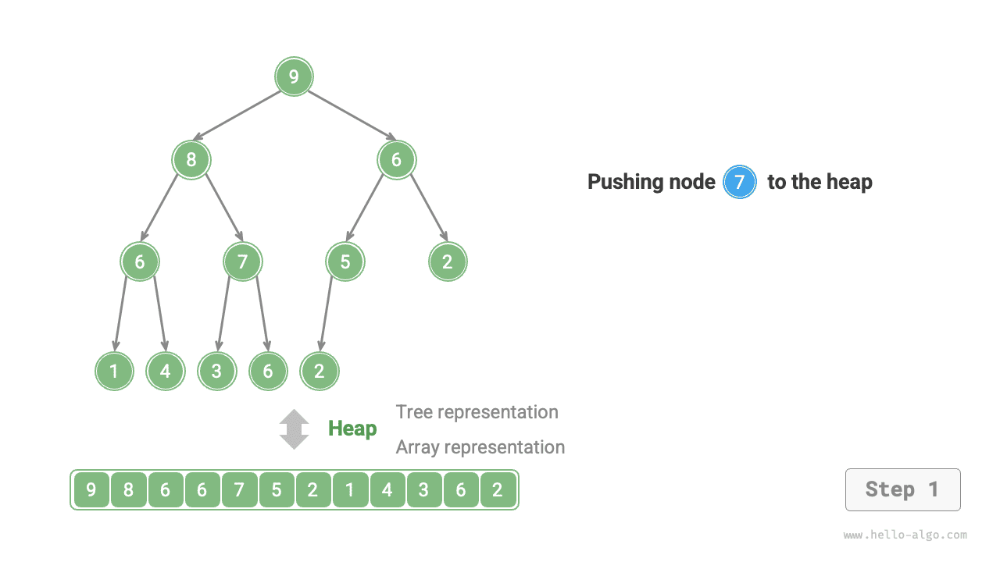
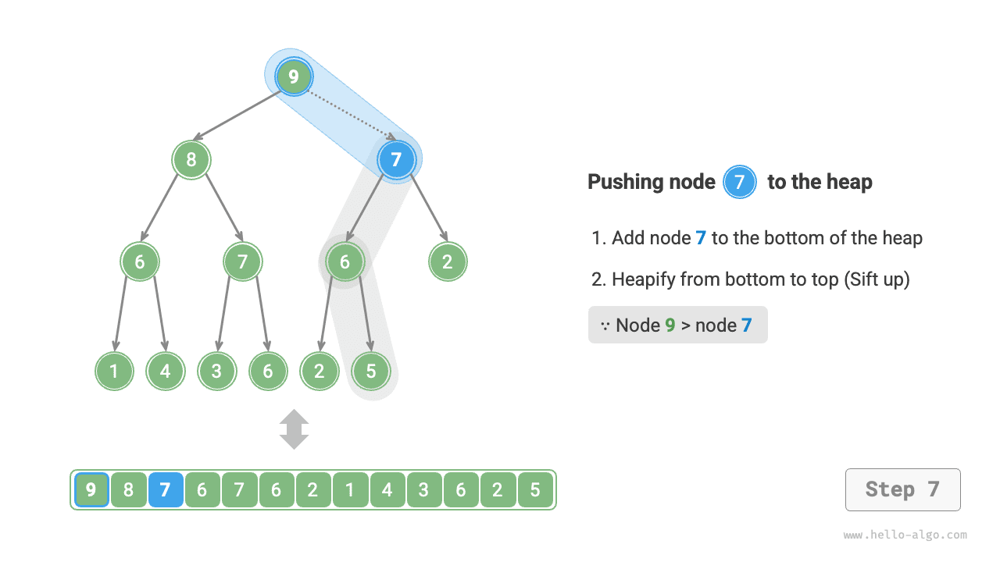
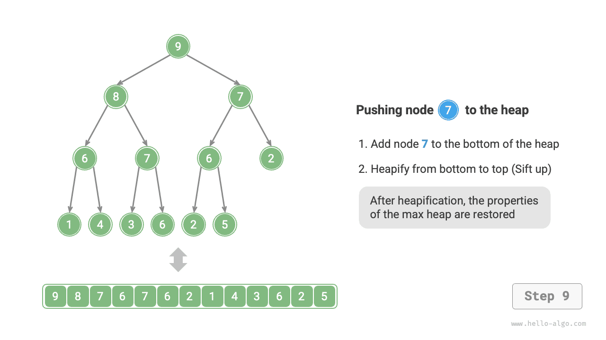
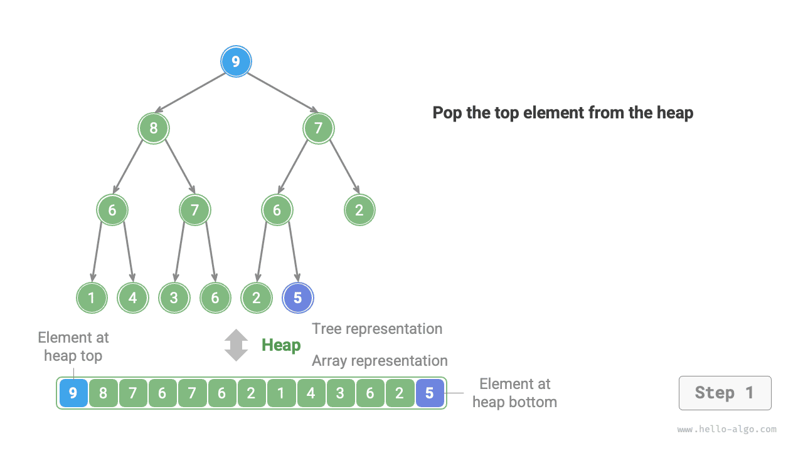
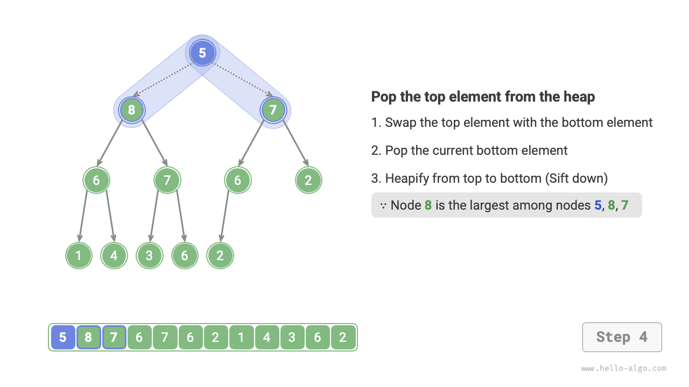
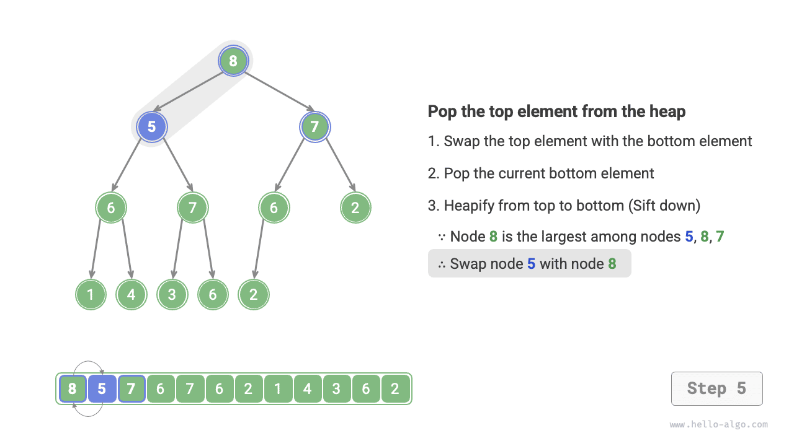
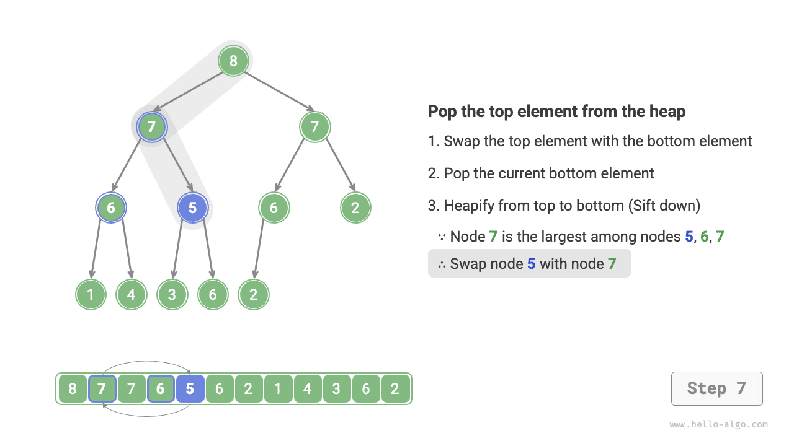
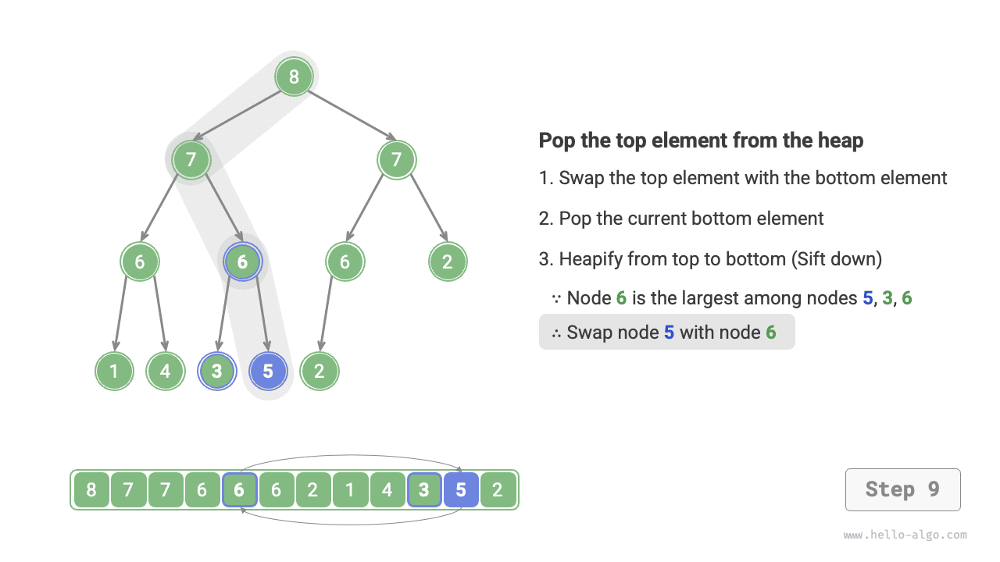

# Kupac

A <u>kupac</u> egy teljes bináris fa, amely meghatározott feltételeket teljesít, és főként két típusba sorolható, ahogy az alábbi ábrán látható.

- <u>min-kupac</u>: Bármely csomópont értéke $\leq$ a gyermekcsomópontjainak értékei.
- <u>max-kupac</u>: Bármely csomópont értéke $\geq$ a gyermekcsomópontjainak értékei.


Mint a teljes bináris fa egy speciális esete, a kupacoknak a következő jellemzői vannak.

- Az alsó réteg csomópontjai balról jobbra töltődnek fel, a többi réteg csomópontjai teljesen kitöltöttek.
- A bináris fa gyökércsomópontját „kupac tetejének", a jobb alsó sarokban lévő csomópontot pedig „kupac aljának" nevezzük.
- Max-kupacokban (min-kupacokban) a kupac tetején lévő elem (gyökércsomópont) értéke a legnagyobb (legkisebb).

## Kupac közönséges műveletei

Meg kell jegyezni, hogy sok programozási nyelv biztosít <u>prioritásos sort</u>, amely egy elvont adatstruktúra, amelyet prioritás szerinti rendezéssel rendelkező sorként definiálnak.

Valójában **a kupacokat általában prioritásos sorok megvalósítására használják, ahol a max-kupacok olyan prioritásos soroknak felelnek meg, amelyekben az elemeket csökkenő sorrendben távolítják el**. Használati szempontból a „prioritásos sor" és a „kupac" kifejezéseket egyenértékű adatstruktúráknak tekinthetjük. Ezért ez a könyv nem tesz különbséget a kettő között, és egységesen „kupacként" hivatkozik rájuk.

A kupac közönséges műveletei az alábbi táblázatban láthatók, a metódusneveket a programozási nyelvtől függően kell meghatározni.

<p align="center"> Table <id> &nbsp; Kupacműveletek hatékonysága </p>

| Metódus neve | Leírás                                                              | Időbonyolultság |
| ------------ | ------------------------------------------------------------------- | --------------- |
| `push()`     | Elem beszúrása a kupacba                                            | $O(\log n)$     |
| `pop()`      | A kupac tetején lévő elem eltávolítása                              | $O(\log n)$     |
| `peek()`     | A kupac tetején lévő elem elérése (max/min érték max/min kupacban)  | $O(1)$          |
| `size()`     | A kupacban lévő elemek számának lekérdezése                         | $O(1)$          |
| `isEmpty()`  | Ellenőrzés, hogy a kupac üres-e                                     | $O(1)$          |

A gyakorlati alkalmazásokban közvetlenül használhatjuk a programozási nyelvek által biztosított kupac osztályt (vagy prioritásos sor osztályt).

Az „növekvő sorrendhez" és „csökkenő sorrendhez" hasonlóan a rendezési algoritmusokban, a „min-kupac" és „max-kupac" közötti konverziót egy `flag` beállításával vagy a `Comparator` módosításával valósíthatjuk meg. A kód a következő:

=== "Python"

    ```python title="heap.py"
    # Min-kupac inicializálása
    min_heap, flag = [], 1
    # Max-kupac inicializálása
    max_heap, flag = [], -1

    # A Python heapq modulja alapértelmezés szerint min-kupacot valósít meg
    # Az elemeket negatívra véve lehet a kupacba tenni, ami megfordítja a nagyság-relációt, és így max-kupacot valósít meg
    # Ebben a példában flag = 1 min-kupacnak, flag = -1 max-kupacnak felel meg

    # Elemek behelyezése a kupacba
    heapq.heappush(max_heap, flag * 1)
    heapq.heappush(max_heap, flag * 3)
    heapq.heappush(max_heap, flag * 2)
    heapq.heappush(max_heap, flag * 5)
    heapq.heappush(max_heap, flag * 4)

    # A kupac tetején lévő elem lekérdezése
    peek: int = flag * max_heap[0] # 5

    # A kupac tetején lévő elem eltávolítása
    # Az eltávolított elemek csökkenő sorrendet alkotnak
    val = flag * heapq.heappop(max_heap) # 5
    val = flag * heapq.heappop(max_heap) # 4
    val = flag * heapq.heappop(max_heap) # 3
    val = flag * heapq.heappop(max_heap) # 2
    val = flag * heapq.heappop(max_heap) # 1

    # A kupac méretének lekérdezése
    size: int = len(max_heap)

    # Ellenőrzés, hogy a kupac üres-e
    is_empty: bool = not max_heap

    # Kupac építése bemeneti listából
    min_heap: list[int] = [1, 3, 2, 5, 4]
    heapq.heapify(min_heap)
    ```

=== "C++"

    ```cpp title="heap.cpp"
    /* Kupac inicializálása */
    // Min-kupac inicializálása
    priority_queue<int, vector<int>, greater<int>> minHeap;
    // Max-kupac inicializálása
    priority_queue<int, vector<int>, less<int>> maxHeap;

    /* Elemek behelyezése a kupacba */
    maxHeap.push(1);
    maxHeap.push(3);
    maxHeap.push(2);
    maxHeap.push(5);
    maxHeap.push(4);

    /* A kupac tetején lévő elem lekérdezése */
    int peek = maxHeap.top(); // 5

    /* A kupac tetején lévő elem eltávolítása */
    // Az eltávolított elemek csökkenő sorrendet alkotnak
    maxHeap.pop(); // 5
    maxHeap.pop(); // 4
    maxHeap.pop(); // 3
    maxHeap.pop(); // 2
    maxHeap.pop(); // 1

    /* A kupac méretének lekérdezése */
    int size = maxHeap.size();

    /* Ellenőrzés, hogy a kupac üres-e */
    bool isEmpty = maxHeap.empty();

    /* Kupac építése bemeneti listából */
    vector<int> input{1, 3, 2, 5, 4};
    priority_queue<int, vector<int>, greater<int>> minHeap(input.begin(), input.end());
    ```

=== "Java"

    ```java title="heap.java"
    /* Kupac inicializálása */
    // Min-kupac inicializálása
    Queue<Integer> minHeap = new PriorityQueue<>();
    // Max-kupac inicializálása (lambda kifejezéssel módosítjuk a Comparator-t)
    Queue<Integer> maxHeap = new PriorityQueue<>((a, b) -> b - a);

    /* Elemek behelyezése a kupacba */
    maxHeap.offer(1);
    maxHeap.offer(3);
    maxHeap.offer(2);
    maxHeap.offer(5);
    maxHeap.offer(4);

    /* A kupac tetején lévő elem lekérdezése */
    int peek = maxHeap.peek(); // 5

    /* A kupac tetején lévő elem eltávolítása */
    // Az eltávolított elemek csökkenő sorrendet alkotnak
    peek = maxHeap.poll(); // 5
    peek = maxHeap.poll(); // 4
    peek = maxHeap.poll(); // 3
    peek = maxHeap.poll(); // 2
    peek = maxHeap.poll(); // 1

    /* A kupac méretének lekérdezése */
    int size = maxHeap.size();

    /* Ellenőrzés, hogy a kupac üres-e */
    boolean isEmpty = maxHeap.isEmpty();

    /* Kupac építése bemeneti listából */
    minHeap = new PriorityQueue<>(Arrays.asList(1, 3, 2, 5, 4));
    ```

=== "C#"

    ```csharp title="heap.cs"
    /* Kupac inicializálása */
    // Min-kupac inicializálása
    PriorityQueue<int, int> minHeap = new();
    // Max-kupac inicializálása (lambda kifejezéssel módosítjuk a Comparer-t)
    PriorityQueue<int, int> maxHeap = new(Comparer<int>.Create((x, y) => y.CompareTo(x)));

    /* Elemek behelyezése a kupacba */
    maxHeap.Enqueue(1, 1);
    maxHeap.Enqueue(3, 3);
    maxHeap.Enqueue(2, 2);
    maxHeap.Enqueue(5, 5);
    maxHeap.Enqueue(4, 4);

    /* A kupac tetején lévő elem lekérdezése */
    int peek = maxHeap.Peek();//5

    /* A kupac tetején lévő elem eltávolítása */
    // Az eltávolított elemek csökkenő sorrendet alkotnak
    peek = maxHeap.Dequeue();  // 5
    peek = maxHeap.Dequeue();  // 4
    peek = maxHeap.Dequeue();  // 3
    peek = maxHeap.Dequeue();  // 2
    peek = maxHeap.Dequeue();  // 1

    /* A kupac méretének lekérdezése */
    int size = maxHeap.Count;

    /* Ellenőrzés, hogy a kupac üres-e */
    bool isEmpty = maxHeap.Count == 0;

    /* Kupac építése bemeneti listából */
    minHeap = new PriorityQueue<int, int>([(1, 1), (3, 3), (2, 2), (5, 5), (4, 4)]);
    ```

=== "Go"

    ```go title="heap.go"
    // Go-ban egész számokból álló max-kupacot a heap.Interface implementálásával hozhatunk létre
    // A heap.Interface implementálásához a sort.Interface implementálása is szükséges
    type intHeap []any

    // Push implementálja a heap.Interface Push metódusát, amellyel elemet adunk a kupachoz
    func (h *intHeap) Push(x any) {
        // A Push és Pop mutató-fogadót (pointer receiver) használnak paraméterként
        // mert nemcsak a szelet tartalmát módosítják, hanem a szelet hosszát is
        *h = append(*h, x.(int))
    }

    // Pop implementálja a heap.Interface Pop metódusát, amellyel eltávolítjuk a kupac tetején lévő elemet
    func (h *intHeap) Pop() any {
        // Az eltávolítandó elem a végén tárolódik
        last := (*h)[len(*h)-1]
        *h = (*h)[:len(*h)-1]
        return last
    }

    // Len a sort.Interface metódusa
    func (h *intHeap) Len() int {
        return len(*h)
    }

    // Less a sort.Interface metódusa
    func (h *intHeap) Less(i, j int) bool {
        // Min-kupac megvalósításához cseréljük kisebb-mint jelre
        return (*h)[i].(int) > (*h)[j].(int)
    }

    // Swap a sort.Interface metódusa
    func (h *intHeap) Swap(i, j int) {
        (*h)[i], (*h)[j] = (*h)[j], (*h)[i]
    }

    // Top lekérdezi a kupac tetején lévő elemet
    func (h *intHeap) Top() any {
        return (*h)[0]
    }

    /* Vezérlő kód */
    func TestHeap(t *testing.T) {
        /* Kupac inicializálása */
        // Max-kupac inicializálása
        maxHeap := &intHeap{}
        heap.Init(maxHeap)
        /* Elemek behelyezése a kupacba */
        // A heap.Interface metódusainak hívása elemek hozzáadásához
        heap.Push(maxHeap, 1)
        heap.Push(maxHeap, 3)
        heap.Push(maxHeap, 2)
        heap.Push(maxHeap, 4)
        heap.Push(maxHeap, 5)

        /* A kupac tetején lévő elem lekérdezése */
        top := maxHeap.Top()
        fmt.Printf("A kupac tetején lévő elem: %d\n", top)

        /* A kupac tetején lévő elem eltávolítása */
        // A heap.Interface metódusainak hívása elemek eltávolításához
        heap.Pop(maxHeap) // 5
        heap.Pop(maxHeap) // 4
        heap.Pop(maxHeap) // 3
        heap.Pop(maxHeap) // 2
        heap.Pop(maxHeap) // 1

        /* A kupac méretének lekérdezése */
        size := len(*maxHeap)
        fmt.Printf("A kupacban lévő elemek száma: %d\n", size)

        /* Ellenőrzés, hogy a kupac üres-e */
        isEmpty := len(*maxHeap) == 0
        fmt.Printf("Üres-e a kupac? %t\n", isEmpty)
    }
    ```

=== "Swift"

    ```swift title="heap.swift"
    /* Kupac inicializálása */
    // A Swift Heap típusa max-kupacot és min-kupacot is támogat, és a swift-collections importálása szükséges hozzá
    var heap = Heap<Int>()

    /* Elemek behelyezése a kupacba */
    heap.insert(1)
    heap.insert(3)
    heap.insert(2)
    heap.insert(5)
    heap.insert(4)

    /* A kupac tetején lévő elem lekérdezése */
    var peek = heap.max()!

    /* A kupac tetején lévő elem eltávolítása */
    peek = heap.removeMax() // 5
    peek = heap.removeMax() // 4
    peek = heap.removeMax() // 3
    peek = heap.removeMax() // 2
    peek = heap.removeMax() // 1

    /* A kupac méretének lekérdezése */
    let size = heap.count

    /* Ellenőrzés, hogy a kupac üres-e */
    let isEmpty = heap.isEmpty

    /* Kupac építése bemeneti listából */
    let heap2 = Heap([1, 3, 2, 5, 4])
    ```

=== "JS"

    ```javascript title="heap.js"
    // A JavaScript nem biztosít beépített Heap osztályt
    ```

=== "TS"

    ```typescript title="heap.ts"
    // A TypeScript nem biztosít beépített Heap osztályt
    ```

=== "Dart"

    ```dart title="heap.dart"
    // A Dart nem biztosít beépített Heap osztályt
    ```

=== "Rust"

    ```rust title="heap.rs"
    use std::collections::BinaryHeap;
    use std::cmp::Reverse;

    /* Kupac inicializálása */
    // Min-kupac inicializálása
    let mut min_heap = BinaryHeap::<Reverse<i32>>::new();
    // Max-kupac inicializálása
    let mut max_heap = BinaryHeap::new();

    /* Elemek behelyezése a kupacba */
    max_heap.push(1);
    max_heap.push(3);
    max_heap.push(2);
    max_heap.push(5);
    max_heap.push(4);

    /* A kupac tetején lévő elem lekérdezése */
    let peek = max_heap.peek().unwrap();  // 5

    /* A kupac tetején lévő elem eltávolítása */
    // Az eltávolított elemek csökkenő sorrendet alkotnak
    let peek = max_heap.pop().unwrap();   // 5
    let peek = max_heap.pop().unwrap();   // 4
    let peek = max_heap.pop().unwrap();   // 3
    let peek = max_heap.pop().unwrap();   // 2
    let peek = max_heap.pop().unwrap();   // 1

    /* A kupac méretének lekérdezése */
    let size = max_heap.len();

    /* Ellenőrzés, hogy a kupac üres-e */
    let is_empty = max_heap.is_empty();

    /* Kupac építése bemeneti listából */
    let min_heap = BinaryHeap::from(vec![Reverse(1), Reverse(3), Reverse(2), Reverse(5), Reverse(4)]);
    ```

=== "C"

    ```c title="heap.c"
    // A C nem biztosít beépített Heap osztályt
    ```

=== "Kotlin"

    ```kotlin title="heap.kt"
    /* Kupac inicializálása */
    // Min-kupac inicializálása
    var minHeap = PriorityQueue<Int>()
    // Max-kupac inicializálása (lambda kifejezéssel módosítjuk a Comparator-t)
    val maxHeap = PriorityQueue { a: Int, b: Int -> b - a }

    /* Elemek behelyezése a kupacba */
    maxHeap.offer(1)
    maxHeap.offer(3)
    maxHeap.offer(2)
    maxHeap.offer(5)
    maxHeap.offer(4)

    /* A kupac tetején lévő elem lekérdezése */
    var peek = maxHeap.peek() // 5

    /* A kupac tetején lévő elem eltávolítása */
    // Az eltávolított elemek csökkenő sorrendet alkotnak
    peek = maxHeap.poll() // 5
    peek = maxHeap.poll() // 4
    peek = maxHeap.poll() // 3
    peek = maxHeap.poll() // 2
    peek = maxHeap.poll() // 1

    /* A kupac méretének lekérdezése */
    val size = maxHeap.size

    /* Ellenőrzés, hogy a kupac üres-e */
    val isEmpty = maxHeap.isEmpty()

    /* Kupac építése bemeneti listából */
    minHeap = PriorityQueue(mutableListOf(1, 3, 2, 5, 4))
    ```

=== "Ruby"

    ```ruby title="heap.rb"
    # A Ruby nem biztosít beépített Heap osztályt
    ```

??? pythontutor "Kód vizualizáció"

    https://pythontutor.com/render.html#code=import%20heapq%0A%0A%22%22%22Driver%20Code%22%22%22%0Aif%20__name__%20%3D%3D%20%22__main__%22%3A%0A%20%20%20%20%23%20%E5%88%9D%E5%A7%8B%E5%8C%96%E5%B0%8F%E9%A1%B6%E5%A0%86%0A%20%20%20%20min_heap,%20flag%20%3D%20%5B%5D,%201%0A%20%20%20%20%23%20%E5%88%9D%E5%A7%8B%E5%8C%96%E5%A4%A7%E9%A1%B6%E5%A0%86%0A%20%20%20%20max_heap,%20flag%20%3D%20%5B%5D,%20-1%0A%20%20%20%20%0A%20%20%20%20%23%20Python%20%E7%9A%84%20heapq%20%E6%A8%A1%E5%9D%97%E9%BB%98%E8%AE%A4%E5%AE%9E%E7%8E%B0%E5%B0%8F%E9%A1%B6%E5%A0%86%0A%20%20%20%20%23%20%E8%80%83%E8%99%91%E5%B0%86%E2%80%9C%E5%85%83%E7%B4%A0%E5%8F%96%E8%B4%9F%E2%80%9D%E5%90%8E%E5%86%8D%E5%85%A5%E5%A0%86%EF%BC%8C%E8%BF%99%E6%A0%B7%E5%B0%B1%E5%8F%AF%E4%BB%A5%E5%B0%86%E5%A4%A7%E5%B0%8F%E5%85%B3%E7%B3%BB%E9%A2%A0%E5%80%92%EF%BC%8C%E4%BB%8E%E8%80%8C%E5%AE%9E%E7%8E%B0%E5%A4%A7%E9%A1%B6%E5%A0%86%0A%20%20%20%20%23%20%E5%9C%A8%E6%9C%AC%E7%A4%BA%E4%BE%8B%E4%B8%AD%EF%BC%8Cflag%20%3D%201%20%E6%97%B6%E5%AF%B9%E5%BA%94%E5%B0%8F%E9%A1%B6%E5%A0%86%EF%BC%8Cflag%20%3D%20-1%20%E6%97%B6%E5%AF%B9%E5%BA%94%E5%A4%A7%E9%A1%B6%E5%A0%86%0A%20%20%20%20%0A%20%20%20%20%23%20%E5%85%83%E7%B4%A0%E5%85%A5%E5%A0%86%0A%20%20%20%20heapq.heappush%28max_heap,%20flag%20*%201%29%0A%20%20%20%20heapq.heappush%28max_heap,%20flag%20*%203%29%0A%20%20%20%20heapq.heappush%28max_heap,%20flag%20*%202%29%0A%20%20%20%20heapq.heappush%28max_heap,%20flag%20*%205%29%0A%20%20%20%20heapq.heappush%28max_heap,%20flag%20*%204%29%0A%20%20%20%20%0A%20%20%20%20%23%20%E8%8E%B7%E5%8F%96%E5%A0%86%E9%A1%B6%E5%85%83%E7%B4%A0%0A%20%20%20%20peek%20%3D%20flag%20*%20max_heap%5B0%5D%20%23%205%0A%20%20%20%20%0A%20%20%20%20%23%20%E5%A0%86%E9%A1%B6%E5%85%83%E7%B4%A0%E5%87%BA%E5%A0%86%0A%20%20%20%20%23%20%E5%87%BA%E5%A0%86%E5%85%83%E7%B4%A0%E4%BC%9A%E5%BD%A2%E6%88%90%E4%B8%80%E4%B8%AA%E4%BB%8E%E5%A4%A7%E5%88%B0%E5%B0%8F%E7%9A%84%E5%BA%8F%E5%88%97%0A%20%20%20%20val%20%3D%20flag%20*%20heapq.heappop%28max_heap%29%20%23%205%0A%20%20%20%20val%20%3D%20flag%20*%20heapq.heappop%28max_heap%29%20%23%204%0A%20%20%20%20val%20%3D%20flag%20*%20heapq.heappop%28max_heap%29%20%23%203%0A%20%20%20%20val%20%3D%20flag%20*%20heapq.heappop%28max_heap%29%20%23%202%0A%20%20%20%20val%20%3D%20flag%20*%20heapq.heappop%28max_heap%29%20%23%201%0A%20%20%20%20%0A%20%20%20%20%23%20%E8%8E%B7%E5%8F%96%E5%A0%86%E5%A4%A7%E5%B0%8F%0A%20%20%20%20size%20%3D%20len%28max_heap%29%0A%20%20%20%20%0A%20%20%20%20%23%20%E5%88%A4%E6%96%AD%E5%A0%86%E6%98%AF%E5%90%A6%E4%B8%BA%E7%A9%BA%0A%20%20%20%20is_empty%20%3D%20not%20max_heap%0A%20%20%20%20%0A%20%20%20%20%23%20%E8%BE%93%E5%85%A5%E5%88%97%E8%A1%A8%E5%B9%B6%E5%BB%BA%E5%A0%86%0A%20%20%20%20min_heap%20%3D%20%5B1,%203,%202,%205,%204%5D%0A%20%20%20%20heapq.heapify%28min_heap%29&cumulative=false&curInstr=3&heapPrimitives=nevernest&mode=display&origin=opt-frontend.js&py=311&rawInputLstJSON=%5B%5D&textReferences=false

## A kupac megvalósítása

Az alábbi implementáció max-kupacé. Min-kupaccá alakításhoz egyszerűen fordítsuk meg az összes méretbeli összehasonlítás logikáját (például cseréljük ki a $\geq$ jelet $\leq$ jelre). Az érdeklődő olvasók ezt önállóan is megvalósíthatják.

### A kupac tárolása és reprezentációja

Ahogy a „Bináris fa" fejezetben megemlítettük, a teljes bináris fák jól alkalmasak tömb alapú reprezentációra. Mivel a kupacok egy teljes bináris fa típusai, **tömböket fogunk használni a kupacok tárolásához**.

Amikor egy bináris fát tömbként ábrázolunk, az elemek a csomópontok értékeit, az indexek pedig a csomópontok pozícióit jelölik a bináris fában. **A csomópontmutatókat indextérképezési képletekkel valósítják meg**.

Ahogy az alábbi ábrán látható, adott egy $i$ index esetén, a bal gyermek indexe $2i + 1$, a jobb gyermek indexe $2i + 2$, a szülő indexe $(i - 1) / 2$ (egészrész osztás). Ha az index túlmutat a határon, ez null csomópontot vagy nem létező csomópontot jelöl.


Az indextérképezési képleteket függvényekbe csomagolhatjuk a kényelmes felhasználás érdekében:

```src
[file]{my_heap}-[class]{max_heap}-[func]{parent}
```

### A kupac tetején lévő elem elérése

A kupac tetején lévő elem a bináris fa gyökércsomópontja, ami egyben a lista első eleme is:

```src
[file]{my_heap}-[class]{max_heap}-[func]{peek}
```

### Elem beszúrása a kupacba

Adott egy `val` elem, először hozzáadjuk a kupac aljához. A hozzáadás után, mivel a `val` értéke nagyobb lehet a kupac többi eleménél, a kupac tulajdonsága megsérülhet. **Ezért szükséges a beszúrt csomóponttól a gyökércsomópontig tartó útvonal helyreállítása**. Ezt a műveletet <u>kupacosításnak</u> nevezzük.

A beszúrt csomóponttól kiindulva **felemelést végzünk alulról felfelé**. Ahogy az alábbi ábrán látható, összehasonlítjuk a beszúrt csomópontot a szülőcsomópontjával, és ha a beszúrt csomópont nagyobb, megcseréljük őket. Ezután folytatjuk ezt a műveletet, alulról felfelé javítva a kupac csomópontjait, amíg el nem jutunk a gyökércsomópontig, vagy nem találkozunk egy olyan csomóponttal, amely nem igényel cserét.

=== "<1>"
    

=== "<2>"
    

=== "<3>"
    

=== "<4>"
    

=== "<5>"
    

=== "<6>"
    

=== "<7>"
    

=== "<8>"
    

=== "<9>"
    

Összesen $n$ csomópont esetén a fa magassága $O(\log n)$. Ezért a kupacosítási műveletben az iterációk száma legfeljebb $O(\log n)$, **ami az elembeillesztési művelet időbonyolultságát $O(\log n)$-né teszi**. A kód a következő:

```src
[file]{my_heap}-[class]{max_heap}-[func]{sift_up}
```

### A kupac tetején lévő elem eltávolítása

A kupac tetején lévő elem a bináris fa gyökércsomópontja, ami a lista első eleme. Ha közvetlenül eltávolítjuk az első elemet a listából, a bináris fa összes csomópontjának indexe megváltozna, ami megnehezítené a kupacosítással való javítást. Az elemindexek változásának minimalizálása érdekében a következő lépéseket alkalmazzuk.

1. A kupac tetején lévő elemet felcseréljük a kupac alján lévő elemmel (a gyökércsomópontot felcseréljük a jobb szélső levélcsomóponttal).
2. A csere után eltávolítjuk a kupac alját a listából (megjegyzés: mivel csere történt, valójában az eredeti kupac tetején lévő elemet távolítjuk el).
3. A gyökércsomóponttól kiindulva **lesüllyesztést végzünk felülről lefelé**.

Ahogy az alábbi ábrán látható, **a „felülről lefelé történő kupacosítás" iránya ellentétes az „alulról felfelé történő kupacosítással"**. A gyökércsomópont értékét összehasonlítjuk két gyermekével, és a legnagyobb gyermekkel cseréljük fel. Ezután ezt a műveletet addig ismételjük, amíg el nem jutunk egy levélcsomópontig, vagy nem találkozunk egy csomóponttal, amely nem igényel cserét.

=== "<1>"
    

=== "<2>"
    

=== "<3>"
    

=== "<4>"
    

=== "<5>"
    

=== "<6>"
    

=== "<7>"
    

=== "<8>"
    

=== "<9>"
    

=== "<10>"
    

Az elembeillesztési művelethez hasonlóan a kupac tetején lévő elem eltávolításának időbonyolultsága szintén $O(\log n)$. A kód a következő:

```src
[file]{my_heap}-[class]{max_heap}-[func]{sift_down}
```

## A kupac általános alkalmazásai

- **Prioritásos sor**: A kupacok általában a prioritásos sorok megvalósításának előnyben részesített adatstruktúrái, ahol mind a sorba helyezés, mind a sorból kivétel időbonyolultsága $O(\log n)$, a kupac felépítési művelete pedig $O(n)$, mindegyik rendkívül hatékony.
- **Kupac rendezés**: Adott egy adathalmaz, belőle kupacot építhetünk, majd folyamatosan végezhetünk elemeltávolítási műveleteket a rendezett adatok megszerzéséhez. Azonban általában egy elegánsabb megközelítést alkalmazunk a kupac rendezés megvalósítására, ahogy azt a „Kupac rendezés" fejezetben részletezzük.
- **A legnagyobb $k$ elem lekérdezése**: Ez egy klasszikus algoritmus-probléma és tipikus alkalmazás is egyben, mint például a Weibo hot search top 10 trending hírének kiválasztása, a top 10 legjobban fogyó termék kiválasztása stb.
