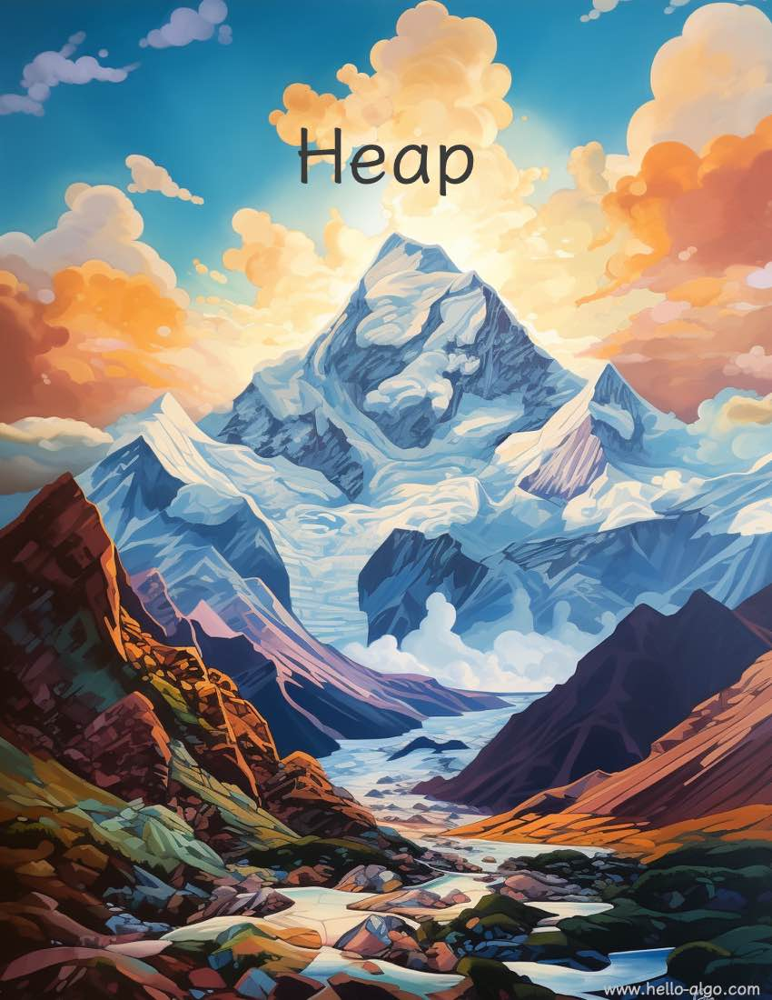

# Kupac

!!! abstract

    A kupacok olyanok, mint a hegycsúcsok, rétegezve és hullámzón, mindegyik egyedi formában.

    A csúcsok különböző magasságokban emelkednek és süllyednek, mégis a legmagasabb csúcs mindig először kapja el a szemet.
