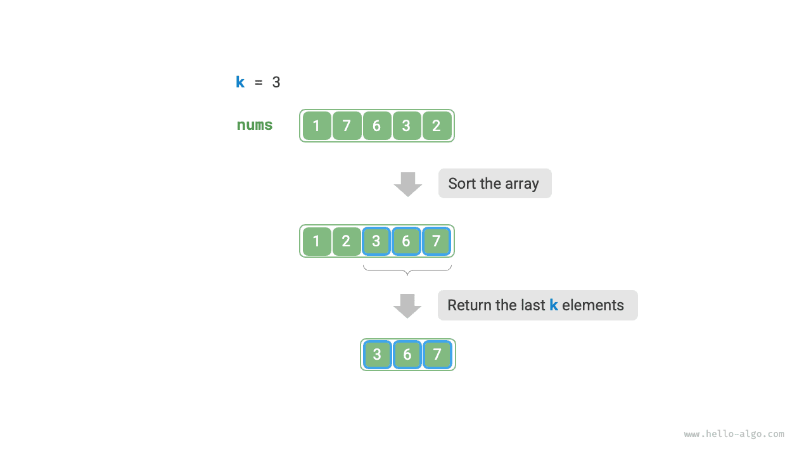
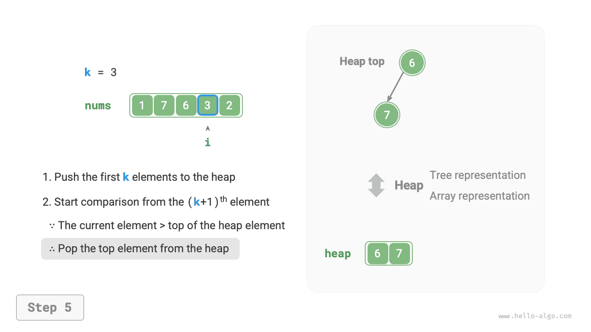
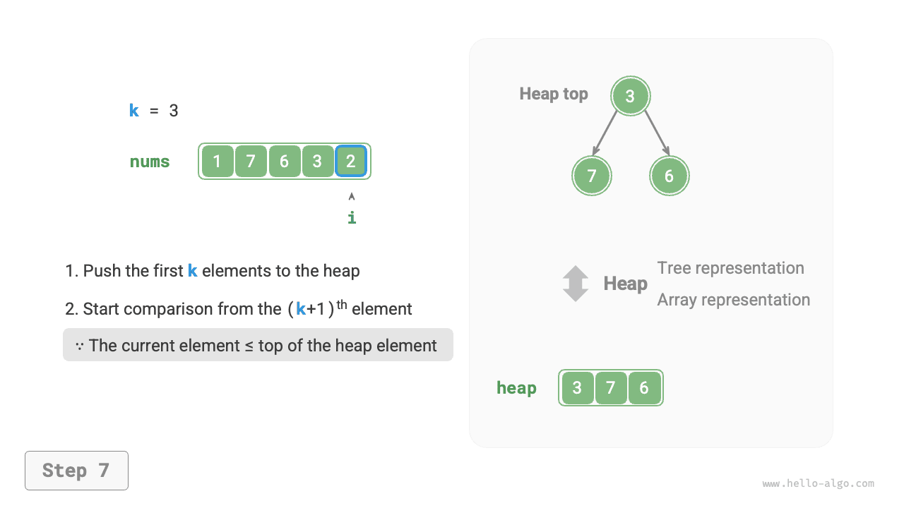

# Top-k probléma

!!! question

    Adott egy $n$ hosszú, rendezetlen `nums` tömb, adjuk vissza a tömb legnagyobb $k$ elemét.

Ennél a problémánál először két viszonylag közvetlen megközelítést mutatunk be, majd egy hatékonyabb kupac alapú megoldást.

## 1. módszer: Iteratív kiválasztás

Az alábbi ábrán látható módon $k$ bejárási kört végezhetünk, és minden körben kinyerjük az $1$., $2.$., $\dots$, $k$. legnagyobb elemet, amelynek időbonyolultsága $O(nk)$.

Ez a módszer csak akkor alkalmazható, ha $k \ll n$, mert ha $k$ közel van $n$-hez, az időbonyolultság $O(n^2)$-hez közelít, ami nagyon időigényes.


!!! tip

    Ha $k = n$, akkor egy teljes rendezett sorozatot kapunk, ami egyenértékű a „kiválasztásos rendezés" algoritmusával.

## 2. módszer: Rendezés

Az alábbi ábrán látható módon először rendezhetjük a `nums` tömböt, majd visszaadjuk a jobb szélső $k$ elemet, amelynek időbonyolultsága $O(n \log n)$.

Nyilvánvalóan ez a módszer „túlteljesíti" a feladatot, hiszen csak a legnagyobb $k$ elemet kell megtalálnunk, a többi elemet nem kell rendeznünk.



## 3. módszer: Kupac

A Top-k problémát hatékonyabban megoldhatjuk kupacok segítségével, ahogy az alábbi ábrán látható.

1. Inicializálunk egy min-kupacot, ahol a kupac tetején lévő elem a legkisebb.
2. Először a tömb első $k$ elemét sorban behelyezzük a kupacba.
3. A $(k + 1)$. elemtől kezdve, ha az aktuális elem nagyobb a kupac tetején lévő elemnél, eltávolítjuk a kupac tetején lévő elemet, és az aktuális elemet behelyezzük a kupacba.
4. A bejárás befejezése után a kupac a legnagyobb $k$ elemet tartalmazza.

=== "<1>"
    

=== "<2>"
    

=== "<3>"
    

=== "<4>"
    

=== "<5>"
    

=== "<6>"
    

=== "<7>"
    

=== "<8>"
    

=== "<9>"
    

A példakód a következő:

```src
[file]{top_k}-[class]{}-[func]{top_k_heap}
```

Összesen $n$ kupacba helyezési és eltávolítási kör hajtódik végre, a kupac maximális hossza $k$, így az időbonyolultság $O(n \log k)$. Ez a módszer rendkívül hatékony; ha $k$ kicsi, az időbonyolultság $O(n)$-hez közelít; ha $k$ nagy, az időbonyolultság nem haladja meg az $O(n \log n)$-t.

Ráadásul ez a módszer dinamikus adatfolyam forgatókönyvekre is alkalmas. Folyamatos adathozzáadással fenntarthatjuk a kupacban lévő elemeket, így a legnagyobb $k$ elem dinamikus frissítését érhetjük el.
