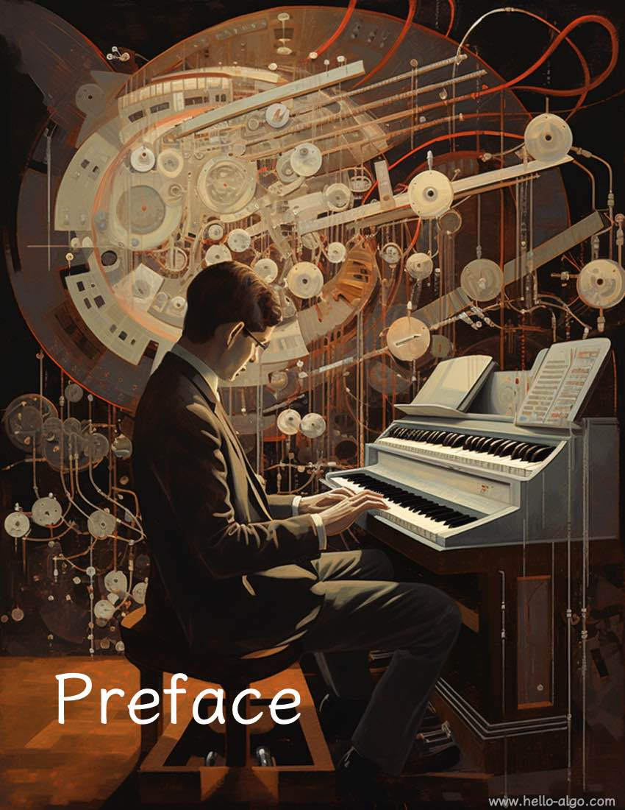

# Előszó

!!! abstract

    Az algoritmusok olyanok, mint egy gyönyörű szimfónia, minden kódsor úgy árad, mint egy dallam.
    
    Reméljük, ez a könyv finoman visszhangzik majd az elmédben, egyedi és mély dallamot hagyva maga után.
