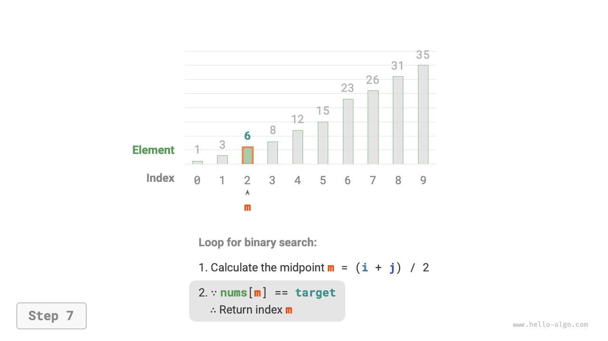

# Bináris keresés

<u>A bináris keresés</u> egy hatékony keresési algoritmus, amely az oszd meg és uralkodj stratégián alapul. Az adatok rendezettségét kihasználva minden körben felezi a keresési tartományt, amíg meg nem találja a célelemet, vagy a keresési intervallum ki nem ürül.

!!! question

    Adott egy `nums` tömb, amelynek hossza $n$, elemei növekvő sorrendben vannak rendezve, és nincsenek ismétlődések. Keresse meg és adja vissza a `target` elem indexét a tömbben. Ha a tömb nem tartalmazza az elemet, adjon vissza $-1$-et. Az alábbi ábra egy példát mutat.


Ahogy az alábbi ábra mutatja, először inicializáljuk az $i = 0$ és $j = n - 1$ mutatókat, amelyek a tömb első és utolsó elemeire mutatnak, ezzel meghatározva a $[0, n - 1]$ keresési intervallumot. Figyeljük meg, hogy a szögletes zárójelek zárt intervallumot jelölnek, amely magában foglalja a határértékeket is.

Ezután hajtsuk végre a következő két lépést ciklikusan:

1. Számítsuk ki a középső index értékét: $m = \lfloor {(i + j) / 2} \rfloor$, ahol $\lfloor \: \rfloor$ a padlófüggvényt jelöli.
2. Hasonlítsuk össze a `nums[m]` és `target` értékeket, amelynek eredménye három eset lehet:
    1. Ha `nums[m] < target`, ez azt jelzi, hogy a `target` a $[m + 1, j]$ intervallumban van, így hajtsuk végre az $i = m + 1$ műveletet.
    2. Ha `nums[m] > target`, ez azt jelzi, hogy a `target` a $[i, m - 1]$ intervallumban van, így hajtsuk végre a $j = m - 1$ műveletet.
    3. Ha `nums[m] = target`, ez azt jelzi, hogy megtaláltuk a `target` elemet, így adjuk vissza az $m$ indexet.

Ha a tömb nem tartalmazza a célelemet, a keresési intervallum végül kiürül. Ebben az esetben adjunk vissza $-1$-et.

=== "<1>"
    

=== "<2>"
    

=== "<3>"
    

=== "<4>"
    

=== "<5>"
    

=== "<6>"
    

=== "<7>"
    

Érdemes megjegyezni, hogy mivel mind $i$, mind $j$ `int` típusú, **az $i + j$ értéke túllépheti az `int` típus tartományát**. A nagy számok túlcsordulásának elkerülése érdekében általában az $m = \lfloor {i + (j - i) / 2} \rfloor$ képletet használjuk a középső index kiszámításához.

A kód az alábbiakban látható:

```src
[file]{binary_search}-[class]{}-[func]{binary_search}
```

**Az időbonyolultság $O(\log n)$**: A bináris ciklusban az intervallum minden körben felére csökken, így a ciklusok száma $\log_2 n$.

**A tárbonyolultság $O(1)$**: Az $i$ és $j$ mutatók állandó méretű tárterületet használnak.

## Intervallum-ábrázolási módszerek

A fent említett zárt intervallumon kívül egy másik elterjedt intervallum-ábrázolás a „bal zárt, jobb nyílt" intervallum, amelyet $[0, n)$-ként definiálunk, vagyis a bal határ tartalmazza magát, míg a jobb határ nem. Ebben az ábrázolásban a $[i, j)$ intervallum üres, ha $i = j$.

Ezen ábrázolás alapján implementálhatunk egy azonos funkcionalitású bináris keresési algoritmust:

```src
[file]{binary_search}-[class]{}-[func]{binary_search_lcro}
```

Ahogy az alábbi ábra mutatja, a két intervallum-ábrázolás esetén a bináris keresési algoritmus inicializálása, ciklusfeltétele és intervallum-szűkítési műveletei mind eltérőek.

Mivel a „zárt intervallum" ábrázolásban mind a bal, mind a jobb határok zártak, az $i$ és $j$ mutatókon keresztüli intervallum-szűkítési műveletek is szimmetrikusak. Ez kevesebb hibalehetőséget jelent, **ezért általában a „zárt intervallum" megközelítés ajánlott**.


## Előnyök és korlátok

A bináris keresés mind idő-, mind tárterület szempontjából jól teljesít.

- A bináris keresés időbeli hatékonysága magas. Nagy adatmennyiség esetén a logaritmikus időbonyolultságnak jelentős előnyei vannak. Például ha az adatméret $n = 2^{20}$, a lineáris kereséshez $2^{20} = 1048576$ cikluskör szükséges, míg a bináris kereséshez csupán $\log_2 2^{20} = 20$ kör.
- A bináris kereséshez nincs szükség extra tárterületre. A keresési algoritmusokhoz képest, amelyek额外tárterületet igényelnek (mint például a hash-alapú keresés), a bináris keresés tárterület-hatékonyabb.

A bináris keresés azonban nem alkalmas minden helyzetre, főként a következő okok miatt:

- A bináris keresés csak rendezett adatokra alkalmazható. Ha a bemeneti adatok rendezetlen, a bináris kereséshez való rendezés kontraproduktív lenne, hiszen a rendező algoritmusok időbonyolultsága általában $O(n \log n)$, ami magasabb mind a lineáris, mind a bináris keresésnél. Olyan forgatókönyvek esetén, ahol gyakoriak az elemek beszúrásai, a tömb rendezettségének fenntartása meghatározott pozíciókba való beillesztést igényel, amelynek időbonyolultsága $O(n)$, ami szintén nagyon költséges.
- A bináris keresés csak tömbökre alkalmazható. A bináris keresés ugrásszerű (nem folytonos) elemhozzáférést igényel, és az ugrásszerű hozzáférés láncoltan tárolt listákban (láncolt listák) alacsony hatékonyságú, így nem alkalmas láncolt listákra vagy láncolt lista megvalósításon alapuló adatszerkezetekre.
- Kis adatmennyiség esetén a lineáris keresés jobban teljesít. A lineáris keresésnél minden körben csupán 1 összehasonlítási művelet szükséges; míg a bináris keresésnél 1 összeadás, 1 osztás, 1-3 összehasonlítási művelet és 1 összeadás (kivonás) szükséges, összesen 4-6 alapműveletet. Ezért ha az adatmennyiség $n$ kicsi, a lineáris keresés valójában gyorsabb a bináris keresésnél.
