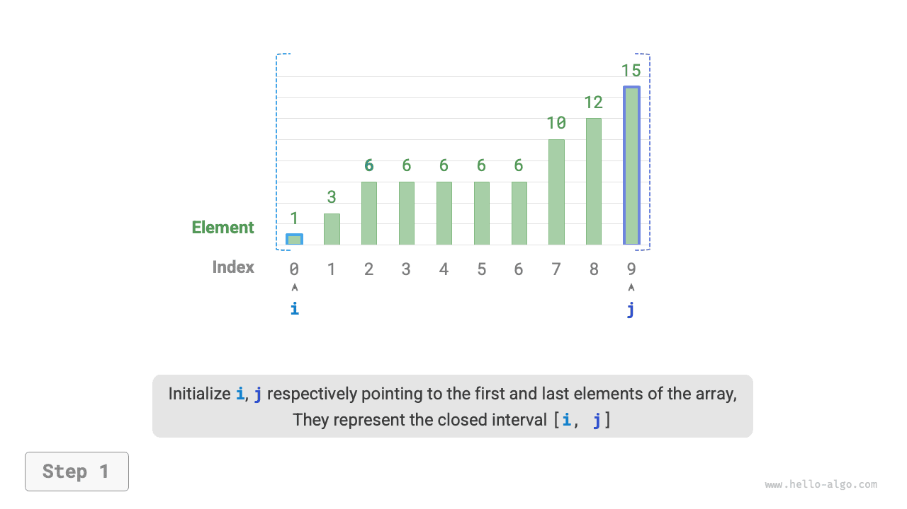

# Bináris keresés beillesztési pontja

A bináris keresés nemcsak célértékek keresésére használható, hanem számos variáns probléma megoldására is, például egy célérték beillesztési pozíciójának megkeresésére.

## Eset ismétlődő elemek nélkül

!!! question

    Adott egy rendezett `nums` tömb, amelynek hossza $n$, és egy `target` elem, ahol a tömb nem tartalmaz ismétlődő elemeket. Szúrja be a `target` értéket a `nums` tömbbe úgy, hogy a rendezett sorrend megmaradjon. Ha a tömb már tartalmazza a `target` elemet, szúrja be annak bal oldalára. Adja vissza a `target` indexét a tömbben a beillesztés után. Az alábbi ábra egy példát mutat.


Ha az előző szakasz bináris keresési kódját szeretnénk újra felhasználni, a következő két kérdést kell megválaszolnunk.

**1. kérdés**: Ha a tömb tartalmazza a `target` értéket, a beillesztési pont indexe megegyezik-e az adott elem indexével?

A feladat megköveteli, hogy a `target` értéket az egyenlő elemek bal oldalára szúrjuk be, ami azt jelenti, hogy az újonnan beillesztett `target` az eredeti `target` helyét foglalja el. Más szóval, **ha a tömb tartalmazza a `target` értéket, a beillesztési pont indexe az adott `target` indexe**.

**2. kérdés**: Ha a tömb nem tartalmazza a `target` értéket, mi a beillesztési pont indexe?

Gondoljuk végig tovább a bináris keresés folyamatát: Ha `nums[m] < target`, az $i$ mutató elmozdul, ami azt jelenti, hogy az $i$ mutató a `target`-nél nagyobb vagy egyenlő elemek felé közelít. Hasonlóan, a $j$ mutató mindig a `target`-nél kisebb vagy egyenlő elemek felé közelít.

Ezért a bináris keresés végén szükségszerűen: $i$ az első `target`-nél nagyobb elemre mutat, $j$ pedig az első `target`-nél kisebb elemre mutat. **Könnyen belátható, hogy ha a tömb nem tartalmazza a `target` értéket, a beillesztési index $i$**. A kód az alábbiakban látható:

```src
[file]{binary_search_insertion}-[class]{}-[func]{binary_search_insertion_simple}
```

## Eset ismétlődő elemekkel

!!! question

    Az előző feladathoz képest feltételezzük, hogy a tömb ismétlődő elemeket is tartalmazhat, minden más változatlan marad.

Tegyük fel, hogy a tömbben több `target` elem is van. Az általános bináris keresés csak az egyik `target` indexét adja vissza, **és nem tudja meghatározni, hogy hány `target` elem található az adott elemtől balra és jobbra**.

A feladat megköveteli, hogy a célelemet a legbaloldalibb pozícióba illesszük be, **ezért meg kell találnunk a legbaloldalibb `target` indexét a tömbben**. Először fontoljuk meg, hogy az alábbi ábra lépésein keresztül valósítsuk meg ezt:

1. Hajtsuk végre a bináris keresést a bármely `target` indexének megszerzéséhez, jelöljük $k$-val.
2. A $k$ indextől kiindulva végezzük el a lineáris bejárást balra, és akkor adjunk vissza, amikor megtaláljuk a legbaloldalibb `target` elemet.


Bár ez a módszer működik, tartalmaz lineáris keresést, ami $O(n)$ időbonyolultságot eredményez. Ha a tömb sok ismétlődő `target` elemet tartalmaz, ez a módszer nagyon nem hatékony.

Most fontoljuk meg a bináris keresési kód kiterjesztését. Ahogy az alábbi ábra mutatja, az általános folyamat változatlan marad: minden körben kiszámítjuk a középső index $m$ értékét, majd összehasonlítjuk a `target` és `nums[m]` értékeket, a következő esetekre bontva:

- Ha `nums[m] < target` vagy `nums[m] > target`, ez azt jelenti, hogy a `target` még nem található meg, ezért az általános bináris keresés intervallum-szűkítési műveletét alkalmazzuk, **hogy az $i$ és $j$ mutatók közelítsenek a `target` felé**.
- Ha `nums[m] == target`, ez azt jelenti, hogy a `target`-nél kisebb elemek a $[i, m - 1]$ intervallumban vannak, ezért $j = m - 1$ segítségével szűkítjük az intervallumot, így **a $j$ mutató a `target`-nél kisebb elemek felé közelít**.

A ciklus befejezése után $i$ a legbaloldalibb `target`-re mutat, $j$ pedig az első `target`-nél kisebb elemre mutat, **tehát az $i$ index a beillesztési pont**.

=== "<1>"
    

=== "<2>"
    

=== "<3>"
    

=== "<4>"
    

=== "<5>"
    

=== "<6>"
    

=== "<7>"
    

=== "<8>"
    

Figyeljük meg a következő kódot: a `nums[m] > target` és a `nums[m] == target` ágak műveletei megegyeznek, ezért a kettő összevonható.

Ennek ellenére megtarthatjuk a feltételes ágakat kibővítve, mivel a logika így egyértelműbb és olvashatóbb.

```src
[file]{binary_search_insertion}-[class]{}-[func]{binary_search_insertion}
```

!!! tip

    Az ebben a szakaszban szereplő kódok mind a „zárt intervallum" megközelítést alkalmazzák. Az érdeklődő olvasók maguk is megvalósíthatják a „bal zárt, jobb nyílt" megközelítést.

Összességében a bináris keresés lényegében az $i$ és $j$ mutatókhoz külön keresési célok meghatározásáról szól. A cél lehet egy konkrét elem (mint a `target`) vagy egy elemtartomány (mint a `target`-nél kisebb elemek).

A folyamatos bináris iterációk révén mind az $i$, mind a $j$ mutató fokozatosan közelít előre beállított céljához. Végül vagy sikeresen megtalálják a választ, vagy a határok átlépése után megállnak.
