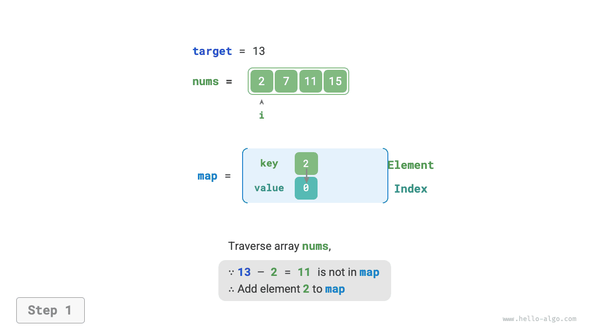
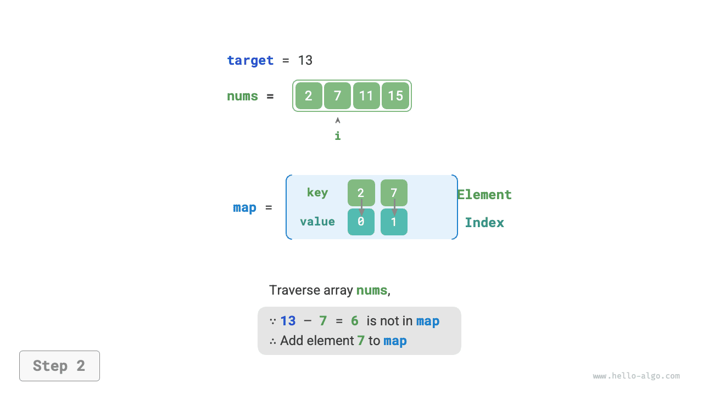
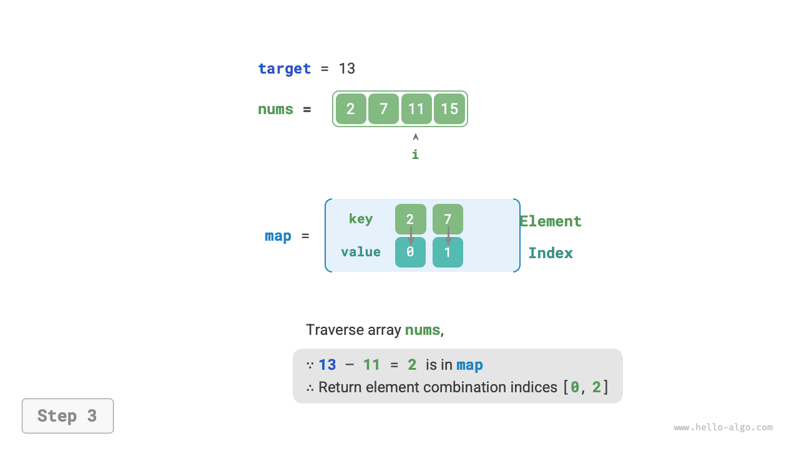

# Hash-alapú optimalizálási stratégia

Az algoritmikus feladatoknál **gyakran csökkentjük az algoritmusok időbonyolultságát azáltal, hogy a lineáris keresést hash-alapú kereséssel váltjuk fel**. Mélyítsük el megértésünket egy algoritmikus feladaton keresztül.

!!! question

    Adott egy egész számokból álló `nums` tömb és egy `target` célérték. Keressünk két elemet a tömbben, amelyek „összege" egyenlő a `target` értékkel, és adjuk vissza tömbindexeiket. Bármely megoldás elfogadható.

## Lineáris keresés: Idő helyett tárterületet áldoz

Fontoljuk meg az összes lehetséges kombináció közvetlen bejárását. Ahogy az alábbi ábra mutatja, egy kétszintű ciklust nyitunk, és minden körben megítéljük, hogy két egész összege egyenlő-e a `target` értékkel. Ha igen, visszaadjuk az indexeiket.


A kód az alábbiakban látható:

```src
[file]{two_sum}-[class]{}-[func]{two_sum_brute_force}
```

Ennek a módszernek az időbonyolultsága $O(n^2)$, a tárbonyolultsága $O(1)$, ami nagy adatmennyiség esetén nagyon időigényes.

## Hash-alapú keresés: Tárterület helyett időt áldoz

Fontoljuk meg egy hash tábla használatát, ahol a kulcs-érték párok tömbjelemek és elem-indexek. Járjuk be a tömböt, az alábbi ábra lépéseit végrehajtva minden körben:

1. Ellenőrizzük, hogy a `target - nums[i]` szám szerepel-e a hash táblában. Ha igen, közvetlenül adjuk vissza a két elem indexét.
2. Adjuk hozzá a `nums[i]` kulcs-érték párt és az `i` indexet a hash táblához.

=== "<1>"
    

=== "<2>"
    

=== "<3>"
    

Az implementációs kód az alábbiakban látható, csupán egyetlen ciklust igényel:

```src
[file]{two_sum}-[class]{}-[func]{two_sum_hash_table}
```

Ez a módszer hash-alapú kereséssel $O(n^2)$-ről $O(n)$-re csökkenti az időbonyolultságot, nagymértékben javítva a futásidő hatékonyságát.

Mivel egy extra hash táblát kell fenntartani, a tárbonyolultság $O(n)$. **Ennek ellenére ez a módszer összességében kiegyensúlyozottabb idő-tárterület hatékonyságot ér el, így ez a feladat optimális megoldása**.
