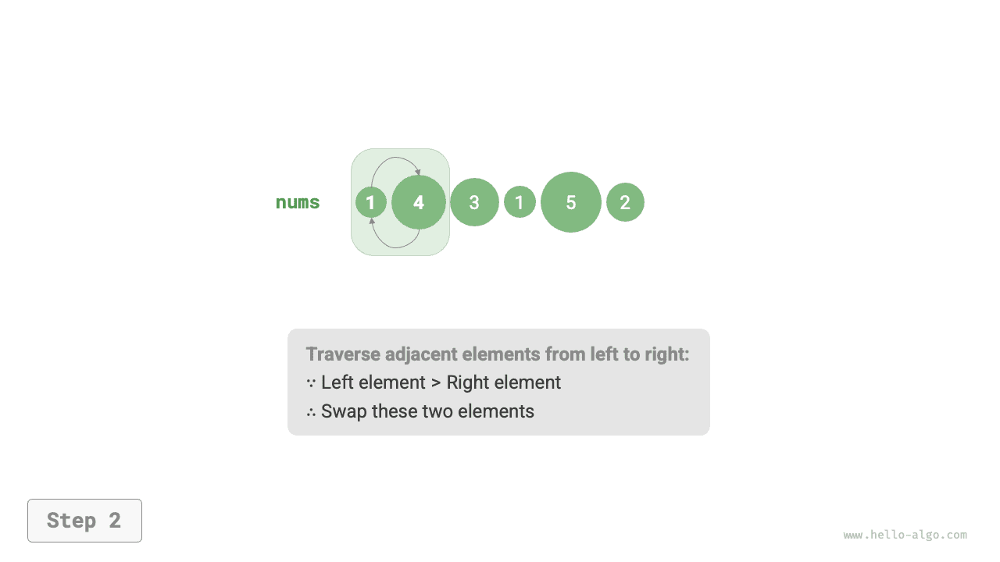
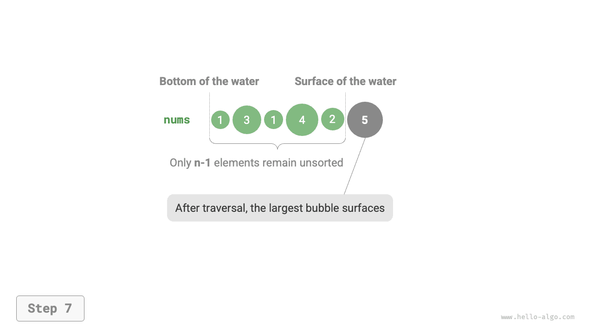

# Buborékrendezés

A <u>buborékrendezés (bubble sort)</u> szomszédos elemek folyamatos összehasonlításával és felcserélésével éri el a rendezést. Ez a folyamat olyan, mint a buborékok emelkedése az aljáról a tetejéig, innen ered a buborékrendezés elnevezés.

Az alábbi ábrán látható módon a buborékolási folyamat elemsere-cserélési műveletek segítségével szimulálható: a tömb bal szélétől indulva jobbra haladunk, összehasonlítjuk a szomszédos elemek méretét, és ha a "bal elem > jobb elem", felcseréljük őket. A bejárás befejezése után a legnagyobb elem a tömb jobb szélére kerül.

=== "<1>"
    

=== "<2>"
    

=== "<3>"
    

=== "<4>"
    

=== "<5>"
    

=== "<6>"
    

=== "<7>"
    

## Az algoritmus folyamata

Tegyük fel, hogy a tömb hossza $n$. A buborékrendezés lépései az alábbi ábrán láthatók.

1. Először végezzük el a "buborékolást" $n$ elemen, **a tömb legnagyobb elemét a megfelelő helyére cserélve**.
2. Ezután végezzük el a "buborékolást" a fennmaradó $n - 1$ elemen, **a második legnagyobb elemet a megfelelő helyére cserélve**.
3. És így tovább. $n - 1$ kör "buborékolás" után **a $n - 1$ legnagyobb elem mind a megfelelő helyére lett cserélve**.
4. A csak fennmaradó elem szükségszerűen a legkisebb elem, nincs szükség rendezésre, így a tömb rendezése kész.


A példakód az alábbi:

```src
[file]{bubble_sort}-[class]{}-[func]{bubble_sort}
```

## Hatékonyságoptimalizálás

Észrevesszük, hogy ha egy adott "buborékolási" körben nem végzünk cserét, az azt jelenti, hogy a tömb már rendezett, és közvetlenül visszatérhetünk az eredménnyel. Ezért hozzáadhatunk egy `flag` jelzőt ennek a helyzetnek a figyelésére, és azonnal visszatérhetünk, amint ez bekövetkezik.

Az optimalizálás után a buborékrendezés legrosszabb esetbeli és átlagos időbonyolultsága megmarad $O(n^2)$-nek; de ha a bemeneti tömb teljesen rendezett, a legjobb esetbeli időbonyolultság elérheti az $O(n)$-t.

```src
[file]{bubble_sort}-[class]{}-[func]{bubble_sort_with_flag}
```

## Az algoritmus jellemzői

- **$O(n^2)$ időbonyolultság, adaptív rendezés**: Az egyes "buborékolási" körökben bejárt tömbhosszak $n - 1$, $n - 2$, $\dots$, $2$, $1$, összesen $(n - 1) n / 2$. A `flag` optimalizálás bevezetésével a legjobb esetbeli időbonyolultság elérheti az $O(n)$-t.
- **$O(1)$ térkomplexitás, helyben történő rendezés**: Az $i$ és $j$ mutatók konstans mennyiségű extra tárhelyet használnak.
- **Stabil rendezés**: Mivel "buborékolás" közben az egyenlő elemeket nem cseréljük fel.
