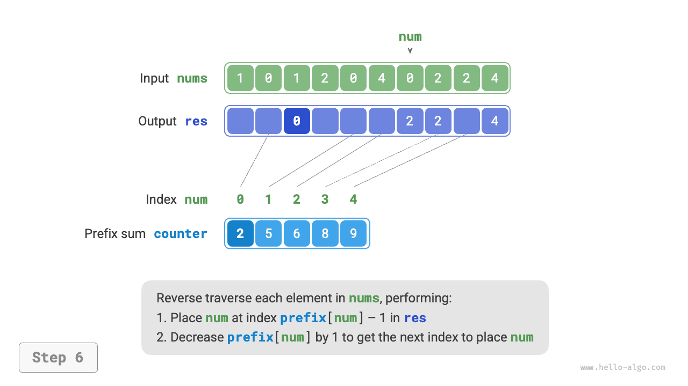

# Számlálórendezés

A <u>számlálórendezés (counting sort)</u> az elemek számának megszámlálásával éri el a rendezést, jellemzően egész tömbökre alkalmazva.

## Egyszerű megvalósítás

Kezdjük egy egyszerű példával. Adott egy $n$ hosszúságú `nums` tömb, amelynek elemei mind "nemnegatív egészek", a számlálórendezés teljes folyamata az alábbi ábrán látható.

1. Bejárjuk a tömböt, megkeressük a legnagyobb számot, amelyet $m$-mel jelölünk, majd létrehozunk egy $m + 1$ hosszúságú `counter` segédtömböt.
2. **A `counter` segítségével megszámoljuk az egyes számok előfordulási számát a `nums`-ban**, ahol `counter[num]` a `num` szám előfordulási számának felel meg. A számlálási módszer egyszerű: bejárjuk a `nums`-t (legyen az aktuális szám `num`), és minden körben $1$-gyel növeljük a `counter[num]`-t.
3. **Mivel a `counter` minden indexe természetes sorrendben van, ez egyenértékű az összes szám rendezettségével**. Ezután bejárjuk a `counter`-t, és az egyes számok előfordulási száma alapján növekvő sorrendben feltöltjük a `nums`-t.


A kód az alábbi:

```src
[file]{counting_sort}-[class]{}-[func]{counting_sort_naive}
```

!!! note "A számlálórendezés és a vödörrendezés kapcsolata"

    A vödörrendezés szempontjából a számlálórendezésben a számlálótömb `counter` minden indexét egy vödörnek tekinthetjük, és a mennyiségek megszámlálásának folyamatát minden elem megfelelő vödörbe való elosztásaként. A számlálórendezés lényegében a vödörrendezés különleges esete egész adatokhoz.

## Teljes megvalósítás

Az éles szemű olvasók észrevehették, hogy **ha a bemeneti adatok objektumok, a fenti `3.` lépés érvénytelen**. Tegyük fel, hogy a bemeneti adatok termék objektumok, és az áruk ár szerint (az osztály egy tagváltozója) szeretnénk rendezni, de a fenti algoritmus csak az árak rendezési eredményét adhatja meg.

Szóval hogyan kaphatjuk meg az eredeti adatok rendezési eredményét? Először kiszámítjuk a `counter` "előtagösszegét". Ahogy a neve is sugallja, az `i` indexen lévő előtagösszeg, `prefix[i]`, a tömb első `i` elemének összege:

$$
\text{prefix}[i] = \sum_{j=0}^i \text{counter[j]}
$$

**Az előtagösszegnek egyértelmű jelentése van: `prefix[num] - 1` a `num` elem utolsó előfordulásának indexét jelöli az eredménytömbben `res`**. Ez az információ rendkívül kritikus, mivel megmondja, hogy az egyes elemeknek hol kell megjelenniük az eredménytömbben. Ezután fordított sorrendben bejárjuk az eredeti `nums` tömb minden `num` elemét, minden iterációban a következő két lépést hajtjuk végre.

1. A `num`-t a `res` tömbnek a `prefix[num] - 1` indexébe töltjük.
2. Az előtagösszeget `prefix[num]`-t $1$-gyel csökkentjük, hogy a `num` következő elhelyezési indexét megkapjuk.

A bejárás befejezése után a `res` tömb tartalmazza a rendezett eredményt, végül a `res`-t felhasználjuk az eredeti `nums` tömb felülírásához. A teljes számlálórendezés folyamata az alábbi ábrán látható.

=== "<1>"
    

=== "<2>"
    

=== "<3>"
    

=== "<4>"
    

=== "<5>"
    

=== "<6>"
    

=== "<7>"
    

=== "<8>"
    

A számlálórendezés megvalósítási kódja az alábbi:

```src
[file]{counting_sort}-[class]{}-[func]{counting_sort}
```

## Az algoritmus jellemzői

- **$O(n + m)$ időbonyolultság, nem adaptív rendezés**: A `nums` és a `counter` bejárása egyaránt lineáris időt vesz igénybe. Általában $n \gg m$, és az időbonyolultság $O(n)$-re tendál.
- **$O(n + m)$ térkomplexitás, nem helyben történő rendezés**: $n$ és $m$ hosszúságú `res` és `counter` tömböket használ.
- **Stabil rendezés**: Mivel az elemeket "jobbról balra" sorrendben töltjük be a `res`-be, a `nums` fordított irányú bejárása elkerüli az egyenlő elemek relatív pozícióinak megváltoztatását, ezáltal stabil rendezést érve el. Valójában a `nums` előre irányú bejárása is helyes rendezési eredményt adhat, de az eredmény instabil lenne.

## Korlátok

Ezen a ponton úgy gondolhatja, hogy a számlálórendezés nagyon ügyes, mivel csupán mennyiségek megszámlálásával hatékony rendezést érhet el. A számlálórendezés alkalmazásának előfeltételei azonban viszonylag szigorúak.

**A számlálórendezés csak nemnegatív egészekhez alkalmas**. Ha más típusú adatokra szeretné alkalmazni, biztosítania kell, hogy az adatok nemnegatív egésszé konvertálhatók az elemek közötti relatív méretkapcsolatok megváltoztatása nélkül. Például negatív számokat tartalmazó egész tömb esetén először hozzáadhat egy konstanst az összes számhoz, hogy mindegyiket pozitív számmá alakítsa, majd a rendezés befejezése után visszaalakíthatja.

**A számlálórendezés olyan helyzetekhez alkalmas, ahol az adatmennyiség nagy, de az adattartomány kicsi**. Például a fenti példában $m$ nem lehet túl nagy, különben túl sok tárhelyet foglal el. És ha $n \ll m$, a számlálórendezés $O(m)$ időt vesz igénybe, ami lassabb lehet az $O(n \log n)$ rendezési algoritmusoknál.
