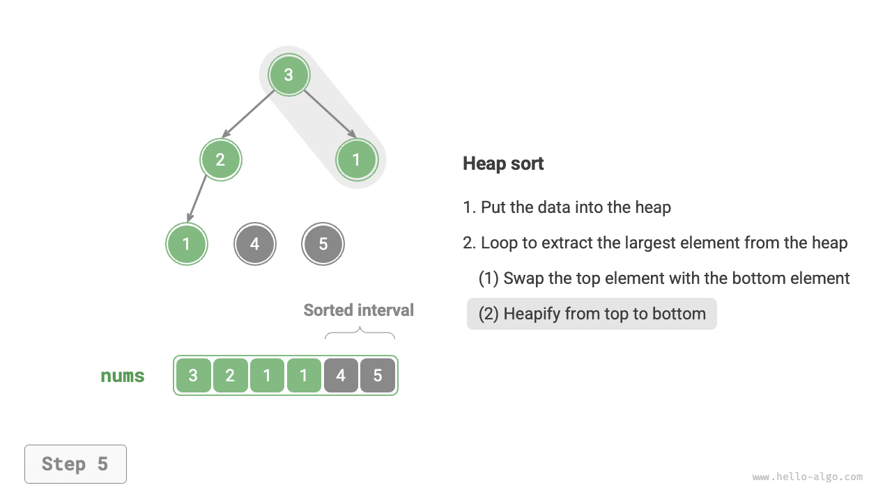
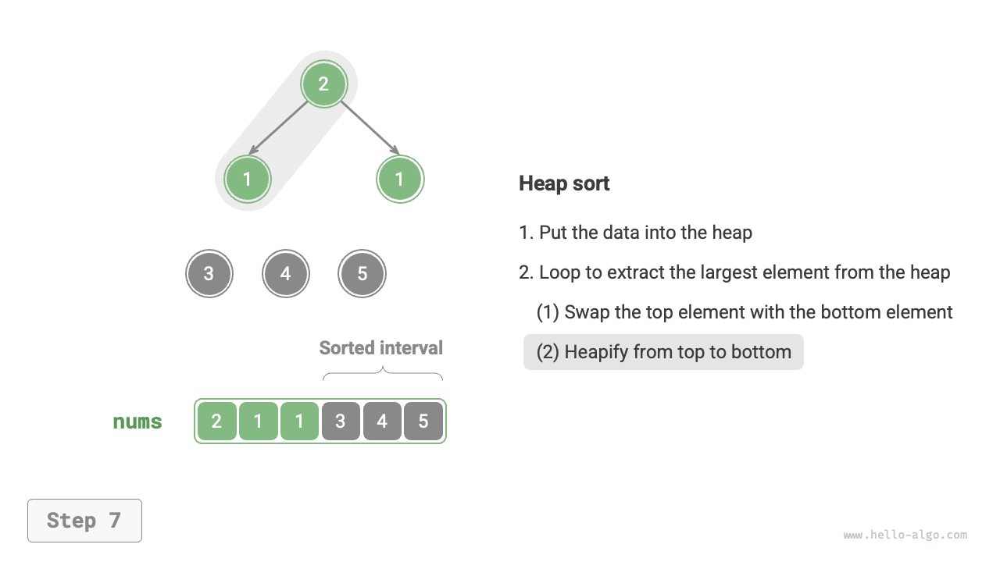
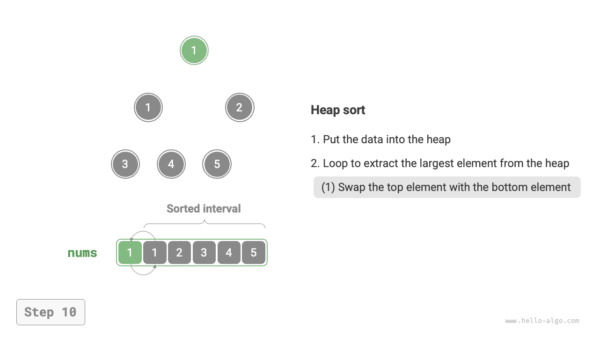

# Kupacrendezés

!!! tip

    Az ezt a fejezetet megelőzően kérjük, győződjön meg arról, hogy elvégezte a "Kupac" fejezetet.

A <u>kupacrendezés (heap sort)</u> egy hatékony, kupac adatstruktúrán alapuló rendezési algoritmus. A kupacrendezés megvalósításához felhasználhatjuk a már megismert "kupac felépítési műveletet" és az "elem kupacból való kivételi műveletét".

1. Betöltjük a tömböt és felépítjük a min-kupacot, ekkor a legkisebb elem a kupac tetején van.
2. Folyamatosan végezzük a kupacból való kivételi műveletet, sorban rögzítjük a kivett elemeket, és egy növekvően rendezett sorozatot kapunk.

Bár a fenti módszer megvalósítható, egy extra tömbköt igényel a kinyomott elemek mentéséhez, ami meglehetősen pazarló a tárhellyel. A gyakorlatban általában egy elegánsabb megvalósítási módszert alkalmazunk.

## Az algoritmus folyamata

Tegyük fel, hogy a tömb hossza $n$. A kupacrendezés folyamata az alábbi ábrán látható.

1. Betöltjük a tömböt és felépítjük a max-kupacot. Befejezés után a legnagyobb elem a kupac tetején van.
2. Felcseréljük a kupac tetején lévő elemet (első elem) a kupac aljában lévő elemmel (utolsó elem). A csere befejezése után csökkentjük a kupac hosszát $1$-gyel, és növeljük a rendezett elemek számát $1$-gyel.
3. A kupac tetején lévő elemtől kezdve elvégezzük a felülről lefelé irányuló kupacosítási műveletet (süllyesztés). A kupacosítás befejezése után a kupac tulajdonsága helyreáll.
4. Ismételjük a `2.` és `3.` lépést. $n - 1$ kör ismétlés után a tömb rendezése elvégezhető.

!!! tip

    Valójában az elem kupacból való kivételi művelete szintén tartalmazza a `2.` és `3.` lépéseket, csupán egy extra lépéssel, az elem kinyomásával egészül ki.

=== "<1>"
    

=== "<2>"
    

=== "<3>"
    

=== "<4>"
    

=== "<5>"
    

=== "<6>"
    

=== "<7>"
    

=== "<8>"
    

=== "<9>"
    

=== "<10>"
    

=== "<11>"
    

=== "<12>"
    

A kód megvalósításban ugyanazt a felülről lefelé irányuló kupacosítási függvényt `sift_down()` használjuk a "Kupac" fejezetből. Megjegyzendő, hogy mivel a kupac hossza csökken, ahogy a legnagyobb elemeket kivonjuk, egy $n$ hosszparamétert kell hozzáadnunk a `sift_down()` függvényhez, amely megadja a kupac aktuális érvényes hosszát. A kód az alábbi:

```src
[file]{heap_sort}-[class]{}-[func]{heap_sort}
```

## Az algoritmus jellemzői

- **$O(n \log n)$ időbonyolultság, nem adaptív rendezés**: A kupac felépítési művelete $O(n)$ időt vesz igénybe. A legnagyobb elem kivonása a kupacból $O(\log n)$ időbonyolultságú, összesen $n - 1$ körben ismételve.
- **$O(1)$ térkomplexitás, helyben történő rendezés**: Néhány mutató változó $O(1)$ tárhelyet használ. Az elemcserélési és kupacosítási műveletek mindkét esetben az eredeti tömbön hajtódnak végre.
- **Nem stabil rendezés**: A kupac tetején és alján lévő elemek felcserélésekor az egyenlő elemek relatív pozíciói megváltozhatnak.
