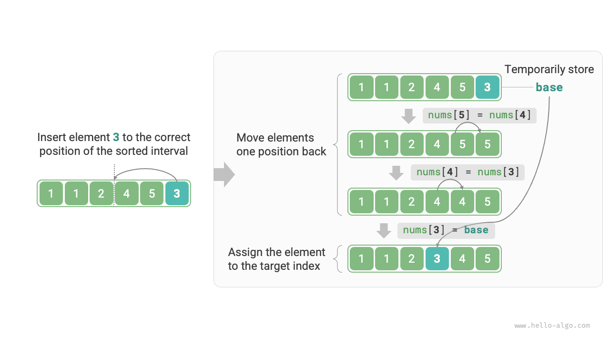

# Beszúrásos rendezés

A <u>beszúrásos rendezés (insertion sort)</u> egy egyszerű rendezési algoritmus, amely nagyon hasonlóan működik a kártyapakli kézi rendezéséhez.

Konkrétan: kiválasztunk egy alapelemet a rendezetlen intervallumból, az elemet összehasonlítjuk a tőle balra lévő rendezett intervallum elemeivel egyenként, és az elemet a megfelelő pozícióba szúrjuk be.

Az alábbi ábra egy elem tömbbe való beszúrásának műveleti folyamatát mutatja. Legyen az alapelem `base`. Az összes elemet a célindextől `base`-ig egy pozícióval jobbra kell mozgatnunk, majd `base`-t a célindexhez rendeljük.



## Az algoritmus folyamata

A beszúrásos rendezés teljes folyamata az alábbi ábrán látható.

1. Kezdetben a tömb első eleme rendezett.
2. A tömb második elemét választjuk `base`-nek, és a megfelelő pozícióba szúrva be, **a tömb első 2 eleme rendezett lesz**.
3. A harmadik elemet választjuk `base`-nek, és a megfelelő pozícióba szúrva be, **a tömb első 3 eleme rendezett lesz**.
4. És így tovább. Az utolsó körben az utolsó elemet választjuk `base`-nek, és a megfelelő pozícióba szúrva be, **minden elem rendezett lesz**.


A példakód az alábbi:

```src
[file]{insertion_sort}-[class]{}-[func]{insertion_sort}
```

## Az algoritmus jellemzői

- **$O(n^2)$ időbonyolultság, adaptív rendezés**: A legrosszabb esetben minden egyes beszúrási művelethez $n - 1$, $n-2$, $\dots$, $2$, $1$ hurokra van szükség, összesen $(n - 1) n / 2$, tehát az időbonyolultság $O(n^2)$. Rendezett adatokkal találkozva a beszúrási művelet korán leáll. Ha a bemeneti tömb teljesen rendezett, a beszúrásos rendezés legjobb esetbeli időbonyolultságot ér el: $O(n)$.
- **$O(1)$ térkomplexitás, helyben történő rendezés**: Az $i$ és $j$ mutatók konstans mennyiségű extra tárhelyet használnak.
- **Stabil rendezés**: A beszúrási művelet során az elemeket egyenlő elemek jobb oldalára szúrjuk be, sorrendjüket nem változtatva.

## A beszúrásos rendezés előnyei

A beszúrásos rendezés időbonyolultsága $O(n^2)$, míg a következőkben tárgyalandó gyorsrendezés időbonyolultsága $O(n \log n)$. Bár a beszúrásos rendezés magasabb időbonyolultságú, **kisebb adatmennyiség esetén a beszúrásos rendezés általában gyorsabb**.

Ez a következtetés hasonló a lineáris keresés és a bináris keresés alkalmazási helyzeteihez. Az $O(n \log n)$ bonyolultságú algoritmusok, mint a gyorsrendezés, oszd meg és uralkodj stratégián alapuló rendezési algoritmusok, és gyakran több egységnyi számítási műveletet tartalmaznak. Kis adatmennyiség esetén az $n^2$ és $n \log n$ értékben közel van egymáshoz, és a bonyolultság nem domináns tényező; az egységnyi műveletek száma minden körben döntő szerepet játszik.

Valójában sok programozási nyelv (például Java) beépített rendezési függvényei alkalmazzák a beszúrásos rendezést. Az általános megközelítés: hosszú tömbök esetén oszd meg és uralkodj stratégián alapuló rendezési algoritmusokat, például gyorsrendezést; rövid tömbök esetén közvetlenül beszúrásos rendezést alkalmaznak.

Bár a buborékrendezés, a kiválasztásos rendezés és a beszúrásos rendezés mind $O(n^2)$ időbonyolultságú, a valóságban **a beszúrásos rendezést lényegesen többször alkalmazzák, mint a buborékrendezést és a kiválasztásos rendezést**, főként a következő okok miatt.

- A buborékrendezés elemcserén alapul, ideiglenes változó használatát igényli, ami 3 egységnyi műveletet foglal magában; a beszúrásos rendezés elemhozzárendelésen alapul, csak 1 egységnyi műveletre van szüksége. Ezért **a buborékrendezés számítási terhe általában nagyobb, mint a beszúrásos rendezésé**.
- A kiválasztásos rendezés bármely esetben $O(n^2)$ időbonyolultságú. **Ha részben rendezett adatokat kap, a beszúrásos rendezés általában hatékonyabb, mint a kiválasztásos rendezés**.
- A kiválasztásos rendezés nem stabil, és nem alkalmazható többszintű rendezésre.
