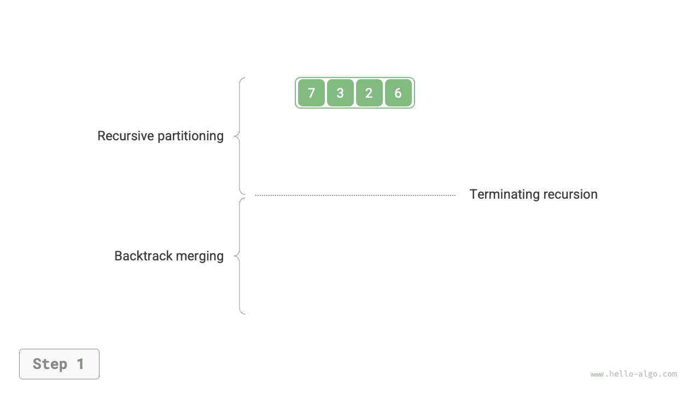
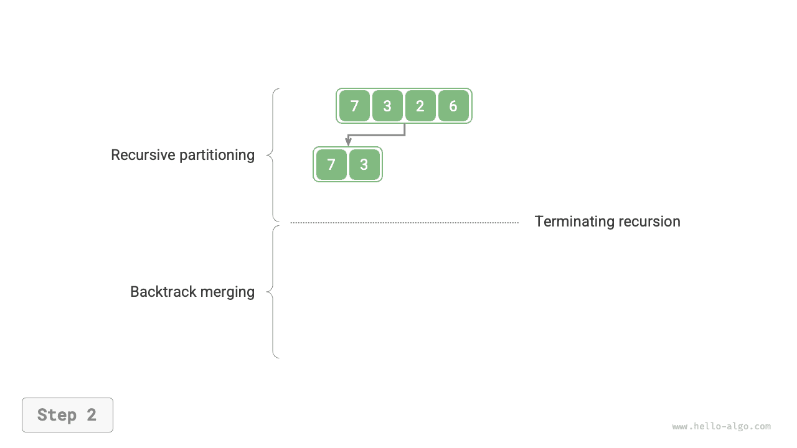
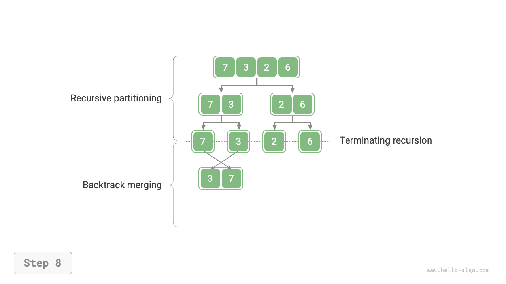
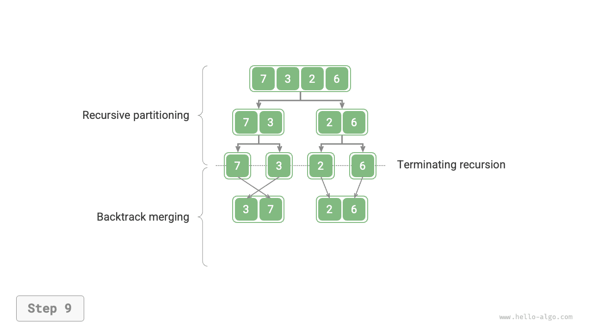

# Összefésüléses rendezés

Az <u>összefésüléses rendezés (merge sort)</u> az oszd meg és uralkodj stratégián alapuló rendezési algoritmus, amely az alábbi ábrán látható "felosztási" és "összefésülési" fázisokat foglalja magában.

1. **Felosztási fázis**: Rekurzívan osztjuk fel a tömböt a középponttól, a hosszú tömb rendezési problémáját rövidebb tömbök rendezési problémáira átalakítva.
2. **Összefésülési fázis**: Ha a résztömb hossza 1, leállítjuk a felosztást és megkezdjük az összefésülést, folyamatosan összefésülve két rövidebb rendezett tömböt egyetlen hosszabb rendezett tömbbé, amíg a folyamat be nem fejeződik.


## Az algoritmus folyamata

Az alábbi ábrán látható módon a "felosztási fázis" rekurzívan osztja fel a tömböt a középponttól felülről lefelé két résztömbre.

1. Kiszámítjuk a tömb középpontját `mid`, rekurzívan felosztjuk a bal résztömböt (`[left, mid]` intervallum) és a jobb résztömböt (`[mid + 1, right]` intervallum).
2. Rekurzívan végrehajtjuk az `1.` lépést, amíg a résztömb intervallumhossza 1 nem lesz, majd leállítjuk.

Az "összefésülési fázis" alulról felfelé fésüli össze a bal és jobb résztömböt rendezett tömbbé. Megjegyzendő, hogy az összefésülés 1 hosszúságú résztömböktől kezdődik, és az összefésülési fázis minden résztömbje rendezett.

=== "<1>"
    

=== "<2>"
    

=== "<3>"
    

=== "<4>"
    

=== "<5>"
    

=== "<6>"
    

=== "<7>"
    

=== "<8>"
    

=== "<9>"
    

=== "<10>"
    

Megfigyelhető, hogy az összefésüléses rendezés rekurzív sorrendje megegyezik egy bináris fa utórendű bejárásával.

- **Utórendű bejárás**: Először rekurzívan bejárjuk a bal részfát, majd rekurzívan a jobb részfát, végül feldolgozzuk a gyökércsomópontot.
- **Összefésüléses rendezés**: Először rekurzívan feldolgozzuk a bal résztömböt, majd rekurzívan a jobb résztömböt, végül elvégezzük az összefésülést.

Az összefésüléses rendezés megvalósítása az alábbi kódban látható. Megjegyzendő, hogy a `nums`-ban összefésülendő intervallum `[left, right]`, míg a `tmp`-ben a megfelelő intervallum `[0, right - left]`.

```src
[file]{merge_sort}-[class]{}-[func]{merge_sort}
```

## Az algoritmus jellemzői

- **$O(n \log n)$ időbonyolultság, nem adaptív rendezés**: A felosztás $\log n$ magasságú rekurziós fát hoz létre, és az összefésülési műveletek teljes száma minden szinten $n$, így az összesített időbonyolultság $O(n \log n)$.
- **$O(n)$ térkomplexitás, nem helyben történő rendezés**: A rekurzió mélysége $\log n$, $O(\log n)$ méretű verem-keret tárhelyet használva. Az összefésülési művelet egy segédtömb segítségét igényli, $O(n)$ méretű extra tárhelyet felhasználva.
- **Stabil rendezés**: Az összefésülési folyamatban az egyenlő elemek sorrendje nem változik.

## Láncolt lista rendezése

Láncolt listák esetén az összefésüléses rendezésnek jelentős előnyei vannak más rendezési algoritmusokhoz képest, **és képes a láncolt lista rendezési feladatainak térkomplexitását $O(1)$-re optimalizálni**.

- **Felosztási fázis**: A "rekurzió" helyett "iteráció" is használható a láncolt lista felosztásához, ezzel megtakarítva a rekurzió által felhasznált verem-keret tárhelyet.
- **Összefésülési fázis**: Láncolt listákban a csomópontok beillesztési és törlési műveletei a hivatkozások (mutatók) megváltoztatásával megvalósíthatók, így az összefésülési fázisban nincs szükség extra láncolt listák létrehozására (két rövid rendezett láncolt lista összefésülése egyetlen hosszú rendezett láncolt listává).

A konkrét megvalósítási részletek meglehetősen összetettek, az érdeklődő olvasók a kapcsolódó anyagokat konzultálhatják tanuláshoz.
