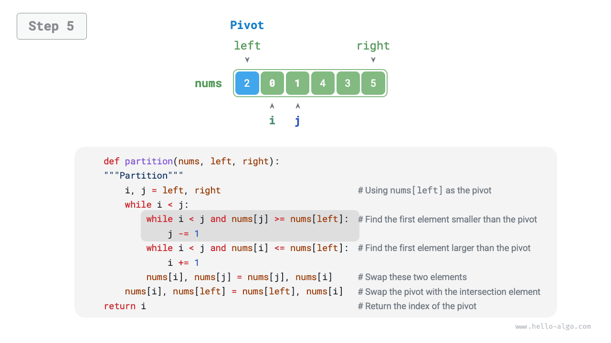
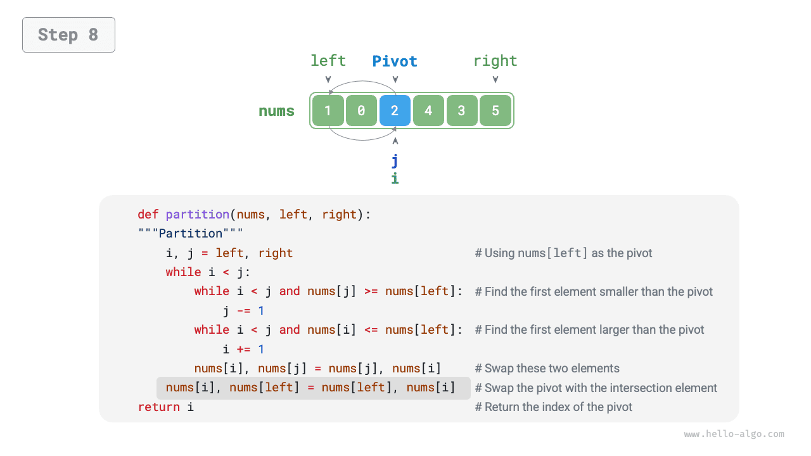

# Gyorsrendezés

A <u>gyorsrendezés (quick sort)</u> az oszd meg és uralkodj stratégián alapuló rendezési algoritmus, amely hatékonyan működik és széles körben alkalmazott.

A gyorsrendezés alapművelete az "őrszem-particionálás", amelynek célja: kiválaszt egy bizonyos elemet a tömbből "pivot elemként", az összes pivot elemnél kisebb elemet a bal oldalára, az összes pivot elemnél nagyobb elemet a jobb oldalára mozgatja. Konkrétan az őrszem-particionálás folyamata az alábbi ábrán látható.

1. Válasszuk ki a tömb bal szélső elemét pivot elemként, és inicializáljunk két mutatót `i` és `j`, amelyek a tömb két végére mutatnak.
2. Állítsunk fel egy hurkot, amelyben minden körben `i` (`j`) az első pivot elemnél nagyobb (kisebb) elemet keresi meg, majd felcseréljük ezt a két elemet.
3. Ismételjük a `2.` lépést, amíg `i` és `j` nem találkozik, végül cseréljük a pivot elemet a két résztömb határvonalára.

=== "<1>"
    

=== "<2>"
    

=== "<3>"
    

=== "<4>"
    

=== "<5>"
    

=== "<6>"
    

=== "<7>"
    

=== "<8>"
    

=== "<9>"
    

Az őrszem-particionálás befejezése után az eredeti tömb három részre osztódik: bal résztömb, pivot elem, jobb résztömb, kielégítve a "bal résztömb bármely eleme $\leq$ pivot elem $\leq$ jobb résztömb bármely eleme" feltételt. Ezért ezután csak ezt a két résztömböt kell rendeznünk.

!!! note "A gyorsrendezés oszd meg és uralkodj stratégiája"

    Az őrszem-particionálás lényege, hogy egy hosszabb tömb rendezési problémáját két rövidebb tömb rendezési problémájára egyszerűsíti.

```src
[file]{quick_sort}-[class]{quick_sort}-[func]{partition}
```

## Az algoritmus folyamata

A gyorsrendezés teljes folyamata az alábbi ábrán látható.

1. Először végezzük el az eredeti tömbön az "őrszem-particionálást", hogy megkapjuk a rendezetlen bal és jobb résztömböt.
2. Ezután rekurzívan végezzük el az "őrszem-particionálást" a bal és a jobb résztömbön külön-külön.
3. Folytassuk rekurzívan, amíg a résztömb hossza 1 nem lesz, ekkor a teljes tömb rendezése kész.


```src
[file]{quick_sort}-[class]{quick_sort}-[func]{quick_sort}
```

## Az algoritmus jellemzői

- **$O(n \log n)$ időbonyolultság, nem adaptív rendezés**: Átlagos esetben az őrszem-particionálás rekurzív szintjeinek száma $\log n$, és az egyes szinteken lévő hurkok teljes száma $n$, összességében $O(n \log n)$ időt felhasználva. A legrosszabb esetben minden egyes őrszem-particionálási kör egy $n$ hosszúságú tömböt $0$ és $n - 1$ hosszúságú két résztömbre oszt fel, ekkor a rekurzív szintek száma eléri az $n$-t, az egyes szinteken lévő hurkok száma $n$, és az összes felhasznált idő $O(n^2)$.
- **$O(n)$ térkomplexitás, helyben történő rendezés**: Abban az esetben, ha a bemeneti tömb teljesen fordított, a legrosszabb rekurzív mélység eléri az $n$-t, $O(n)$ verem-keret tárhelyet felhasználva. A rendezési művelet az eredeti tömbön hajtódik végre, kiegészítő tömb segítsége nélkül.
- **Nem stabil rendezés**: Az őrszem-particionálás utolsó lépésében a pivot elem egyenlő elemek jobb oldalára cserélhető.

## Miért gyors a gyorsrendezés?

A névből láthatjuk, hogy a gyorsrendezésnek bizonyos előnyei vannak a hatékonyság terén. Bár a gyorsrendezés átlagos időbonyolultsága megegyezik az "összefésüléses rendezéssel" és a "kupacrendezéssel", a gyorsrendezés általában hatékonyabb, főként a következő okok miatt.

- **A legrosszabb eset valószínűsége nagyon alacsony**: Bár a gyorsrendezés legrosszabb esetbeli időbonyolultsága $O(n^2)$, ami nem olyan stabil, mint az összefésüléses rendezés, az esetek túlnyomó többségében a gyorsrendezés $O(n \log n)$ időbonyolultsággal fut.
- **Magas gyorsítótár-kihasználás**: Az őrszem-particionálási műveletek végrehajtásakor a rendszer betöltheti a teljes résztömböt a gyorsítótárba, így az elemekhez való hozzáférés hatékonysága viszonylag magas. Az olyan algoritmusok, mint a "kupacrendezés", ugrásszerű elemhozzáférést igényelnek, így nem rendelkeznek ezzel a jellemzővel.
- **A bonyolultság kis konstans együtthatója**: A fent említett három algoritmus közül a gyorsrendezésnek van a legkisebb összesített összehasonlítási, hozzárendelési és cserélési műveletszáma. Ez hasonló ahhoz az okhoz, amiért a "beszúrásos rendezés" gyorsabb, mint a "buborékrendezés".

## Pivot elem optimalizálása

**A gyorsrendezés bizonyos bemeneteknél csökkent időbeli hatékonysággal bírhat**. Vegyünk egy szélsőséges példát: tegyük fel, hogy a bemeneti tömb teljesen fordított. Mivel a bal szélső elemet választjuk pivot elemként, az őrszem-particionálás befejezése után a pivot elem a tömb jobb szélső végéhez kerül, az bal résztömb hossza $n - 1$, a jobb résztömb hossza $0$. Ha így rekurzívan folytatjuk, minden egyes őrszem-particionálási körnek $0$ résztömbhossza lesz, az oszd meg és uralkodj stratégia meghibásodik, és a gyorsrendezés a "buborékrendezéshez" hasonló formává degradálódik.

Ennek a helyzetnek a lehetőség szerinti elkerülése érdekében **optimalizálhatjuk a pivot elem kiválasztási stratégiát az őrszem-particionálásban**. Például véletlenszerűen választhatunk egy elemet pivot elemként. Ha azonban a szerencse nem kegyes, és minden alkalommal nem ideális pivot elemet választunk, a hatékonyság még mindig nem kielégítő.

Meg kell jegyezni, hogy a programozási nyelvek általában "pszeudo-véletlenszámokat" generálnak. Ha egy pszeudo-véletlenszám-sorozathoz specifikus tesztelési esetet konstruálunk, a gyorsrendezés hatékonysága még mindig degradálódhat.

A további javítás érdekében kiválaszthatunk három jelöltet a tömbből (általában a tömb első, utolsó és középső elemét), **és e három jelölt median értékét használhatjuk pivot elemként**. Így a valószínűsége, hogy a pivot elem "se nem túl kicsi, se nem túl nagy", nagymértékben megnövekszik. Természetesen több jelöltet is kiválaszthatunk az algoritmus robosztusságának további javítása érdekében. Ezzel a módszerrel az időbonyolultság $O(n^2)$-re való degradálódásának valószínűsége nagymértékben csökken.

A példakód az alábbi:

```src
[file]{quick_sort}-[class]{quick_sort_median}-[func]{partition}
```

## Rekurziós mélység optimalizálása

**Bizonyos bemeneteknél a gyorsrendezés több tárhelyet foglalhat**. Vegyük például a teljesen rendezett bemeneti tömböt, legyen a rekurzióban lévő résztömb hossza $m$. Minden egyes őrszem-particionálási kör $0$ hosszúságú bal és $m - 1$ hosszúságú jobb résztömböt hoz létre, ami azt jelenti, hogy az egyes rekurzív hívásonként csökkentett problémaskála nagyon kicsi (csak egy elem csökken), és a rekurziós fa magassága eléri az $n - 1$-t, ekkor $O(n)$ méretű verem-keret tárhelyre van szükség.

A verem-keret tárhelyének felhalmozódásának megakadályozása érdekében minden egyes őrszem-rendezési kör befejezése után összehasonlíthatjuk a két résztömb hosszát, **és csak a rövidebb résztömbön rekurzívan folytatjuk**. Mivel a rövidebb résztömb hossza nem haladhatja meg az $n / 2$-t, ez a módszer biztosítja, hogy a rekurzió mélysége ne haladja meg a $\log n$-t, ezáltal a legrosszabb esetbeli térkomplexitást $O(\log n)$-re optimalizálja. A kód az alábbi:

```src
[file]{quick_sort}-[class]{quick_sort_tail_call}-[func]{quick_sort}
```
