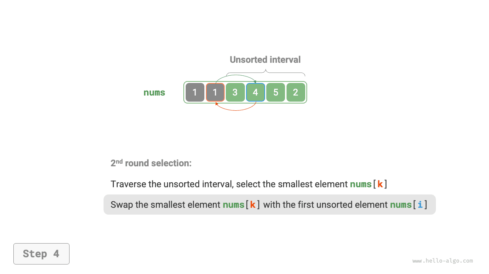
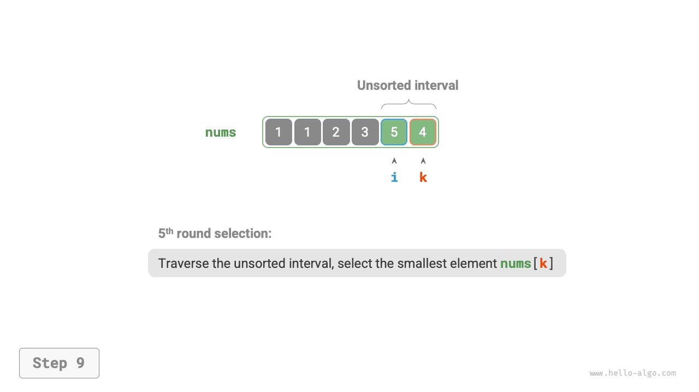
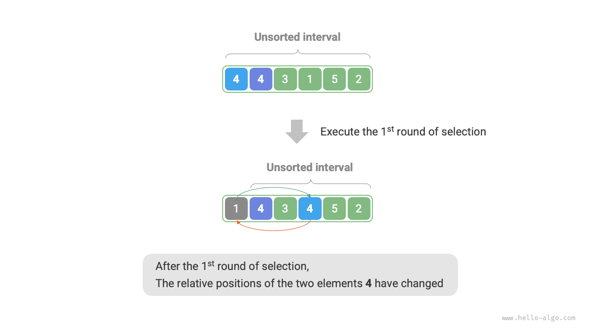

# Kiválasztásos rendezés

A <u>kiválasztásos rendezés (selection sort)</u> nagyon egyszerűen működik: megnyit egy hurkot, és minden körben kiválasztja a legkisebb elemet a rendezetlen intervallumból, majd a rendezett intervallum végéhez helyezi.

Tegyük fel, hogy a tömb hossza $n$. A kiválasztásos rendezés algoritmusfolyamata az alábbi ábrán látható.

1. Kezdetben minden elem rendezetlen, azaz a rendezetlen (index) intervallum $[0, n-1]$.
2. Válasszuk ki a legkisebb elemet a $[0, n-1]$ intervallumban, és cseréljük fel a $0$ indexű elemmel. Befejezés után a tömb első eleme rendezett.
3. Válasszuk ki a legkisebb elemet a $[1, n-1]$ intervallumban, és cseréljük fel az $1$ indexű elemmel. Befejezés után a tömb első 2 eleme rendezett.
4. És így tovább. $n - 1$ kiválasztási és csere kör után a tömb első $n - 1$ eleme rendezett.
5. A csak fennmaradó elem szükségszerűen a legnagyobb elem, nincs szükség rendezésre, így a tömb rendezése kész.

=== "<1>"
    

=== "<2>"
    

=== "<3>"
    

=== "<4>"
    

=== "<5>"
    

=== "<6>"
    

=== "<7>"
    

=== "<8>"
    

=== "<9>"
    

=== "<10>"
    

=== "<11>"
    

A kódban $k$-t használjuk a rendezetlen intervallumon belüli legkisebb elem nyomon követésére:

```src
[file]{selection_sort}-[class]{}-[func]{selection_sort}
```

## Az algoritmus jellemzői

- **$O(n^2)$ időbonyolultság, nem adaptív rendezés**: A külső hurok összesen $n - 1$ kört tartalmaz. Az első körben a rendezetlen intervallum hossza $n$, az utolsó körben $2$. Vagyis a külső hurok minden köre $n$, $n - 1$, $\dots$, $3$, $2$ belső hurokiterációt tartalmaz, összesen $\frac{(n - 1)(n + 2)}{2}$.
- **$O(1)$ térkomplexitás, helyben történő rendezés**: Az $i$ és $j$ mutatók konstans mennyiségű extra tárhelyet használnak.
- **Nem stabil rendezés**: Ahogy az alábbi ábrán látható, a `nums[i]` elem egy vele egyenlő elem jobb oldalára cserélhető, megváltoztatva relatív sorrendjüket.


