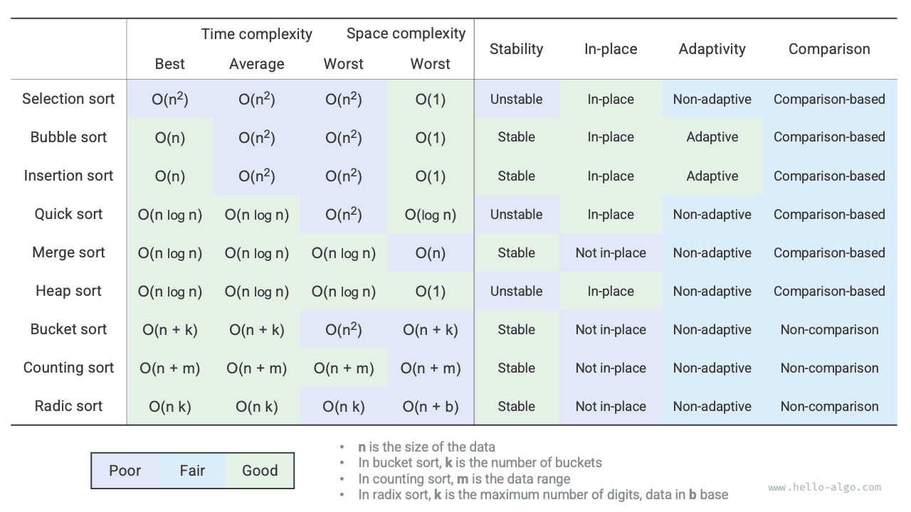

# Összefoglalás

### Fő áttekintés

- A buborékrendezés szomszédos elemek felcserélésével éri el a rendezést. Egy jelző hozzáadásával a korai visszatérés engedélyezéséhez a buborékrendezés legjobb esetbeli időbonyolultságát $O(n)$-re optimalizálhatjuk.
- A beszúrásos rendezés minden körben a rendezetlen intervallumból beilleszti az elemeket a rendezett intervallumban a megfelelő pozícióba. Bár a beszúrásos rendezés időbonyolultsága $O(n^2)$, kis adatmennyiségű rendezési feladatokban nagyon népszerű, mivel viszonylag kevés egységnyi műveletet tartalmaz.
- A gyorsrendezés őrszem-particionálási műveletek alapján valósul meg. Az őrszem-particionálásban lehetséges, hogy minden alkalommal a legrosszabb pivot elemet választjuk, ami az időbonyolultságot $O(n^2)$-re degradálja. A mediánpivot vagy véletlenpivot bevezetése csökkenti az ilyen degradálódás valószínűségét. A rövidebb alintervallumban való preferenciálisan rekurzív feldolgozással a rekurzió mélysége hatékonyan csökkenthető, és a térkomplexitás $O(\log n)$-re optimalizálható.
- Az összefésüléses rendezés két fázist tartalmaz: felosztás és összefésülés, amelyek jellemzően az oszd meg és uralkodj stratégiát testesítik meg. Az összefésüléses rendezésben egy tömb rendezéséhez segédtömbök létrehozása szükséges, térkomplexitása $O(n)$; azonban egy láncolt lista rendezésének térkomplexitása $O(1)$-re optimalizálható.
- A vödörrendezés három lépésből áll: adatok vödrökbe osztása, vödörökön belüli rendezés, és eredmények összefésülése. Ez szintén az oszd meg és uralkodj stratégiát testesíti meg, és nagyon nagy adatmennyiségekhez alkalmas. A vödörrendezés kulcsa az adatok egyenletes elosztása.
- A számlálórendezés a vödörrendezés különleges esete, amely az adatok előfordulási számának megszámlálásával éri el a rendezést. A számlálórendezés olyan helyzetekhez alkalmas, ahol az adatmennyiség nagy, de az adattartomány korlátozott, és megköveteli, hogy az adatok pozitív egésszé konvertálhatók legyenek.
- Az alaprendezés jegyenként rendezi az adatokat, megkövetelve, hogy az adatok rögzített számú jegyű számokként reprezentálhatók legyenek.
- Összességében azt reméljük, hogy olyan rendezési algoritmust találunk, amely hatékony, stabil, helyben történő és adaptív, jó sokoldalúsággal. Azonban, csakúgy mint más adatstruktúrák és algoritmusok esetén, eddig nem találtak olyan rendezési algoritmust, amely egyszerre rendelkezik mindezekkel a jellemzőkkel. A gyakorlati alkalmazásokban az adatok konkrét jellemzői alapján kell kiválasztani a megfelelő rendezési algoritmust.
- Az alábbi ábra összehasonlítja a főbb rendezési algoritmusokat hatékonyság, stabilitás, helyben történő tulajdonság és alkalmazkodóképesség szempontjából.

### Kérdések és válaszok

**K**: Milyen helyzetekben szükséges a rendezési algoritmusok stabilitása?

A valóságban előfordulhat, hogy objektumok egy bizonyos attribútuma alapján rendezünk. Például a hallgatóknak két attribútuma van: név és magasság. Többszintű rendezést szeretnénk megvalósítani: először névszerint rendezünk: `(A, 180) (B, 185) (C, 170) (D, 170)`; majd magasság szerint rendezünk. Mivel a rendezési algoritmus instabil, kaphatjuk a következőt: `(D, 170) (C, 170) (A, 180) (B, 185)`.

Látható, hogy D és C hallgatók pozíciói felcserélődtek, és a nevek rendezettsége megbomlott, ami nem kívánatos eredmény.

**K**: Az őrszem-particionálásban felcserélhető-e a "jobbról balra keresés" és a "balról jobbra keresés" sorrendje?

Nem. Amikor a bal szélső elemet használjuk pivot elemként, először "jobbról balra" kell keresnünk, majd "balról jobbra". Ez a következtetés kissé ellentmondásos az intuícióval; elemezzük az okát.

Az őrszem-particionálás `partition()` utolsó lépése a `nums[left]` és `nums[i]` felcserélése. A csere befejezése után a pivot elemtől balra lévő elemek mind `<=` a pivot elemnél, **ami megköveteli, hogy az utolsó csere előtt `nums[left] >= nums[i]` teljesüljön**. Tegyük fel, hogy először "balról jobbra" keresünk, akkor ha nem találunk a pivot elemnél nagyobb elemet, **kilépünk a hurokból, amikor `i == j`, ekkor elképzelhető, hogy `nums[j] == nums[i] > nums[left]`**. Vagyis az utolsó csere egy a pivot elemnél nagyobb elemet cserél a tömb bal szélső végére, ami miatt az őrszem-particionálás meghibásodik.

Például adott a `[0, 0, 0, 0, 1]` tömb, ha először "balról jobbra" keresünk, az őrszem-particionálás utáni tömb `[1, 0, 0, 0, 0]`, ami helytelen.

Mélyebben gondolkodva, ha a `nums[right]`-t választjuk pivot elemként, akkor pontosan az ellenkezője igaz - először "balról jobbra" kell keresnünk.

**K**: A gyorsrendezés rekurziós mélység optimalizálásával kapcsolatban miért biztosítja a rövidebb tömb kiválasztása, hogy a rekurzió mélysége ne haladja meg a $\log n$-t?

A rekurzió mélysége a jelenleg vissza nem adott rekurzív metódusok száma. Minden egyes őrszem-particionálási kör az eredeti tömböt két résztömbre osztja. A rekurzió mélységének optimalizálása után a rekurzívan feldolgozandó résztömb hossza legfeljebb az eredeti tömb hosszának fele. Feltéve, hogy a legrosszabb eset mindig félhossz, a végső rekurzió mélysége $\log n$ lesz.

Az eredeti gyorsrendezésre visszatekintve, előfordulhat, hogy folyamatosan a hosszabb tömbbel rekurzívan folytatjuk. A legrosszabb esetben ez $n$, $n - 1$, $\dots$, $2$, $1$ lenne, $n$ rekurzió mélységgel. A rekurzió mélységének optimalizálása ezt a helyzetet el tudja kerülni.

**K**: Ha a tömb összes eleme egyenlő, a gyorsrendezés időbonyolultsága $O(n^2)$? Hogyan kezeljük ezt a degradált esetet?

Igen. Erre a helyzetre érdemes megfontolni a tömb három részre osztását az őrszem-particionálással: a pivot elemnél kisebb, azzal egyenlő, és a pivot elemnél nagyobb részekre. Csak a kisebb és nagyobb részeket rekurzívan feldolgozni. Ezzel a módszerrel egy olyan tömb, amelynek összes bemeneti eleme egyenlő, egyetlen őrszem-particionálási körrel befejezi a rendezést.

**K**: Miért $O(n^2)$ a vödörrendezés legrosszabb esetbeli időbonyolultsága?

A legrosszabb esetben az összes elem egy vödörbe kerül. Ha egy $O(n^2)$ algoritmust alkalmazunk ezek rendezésére, az időbonyolultság $O(n^2)$ lesz.
