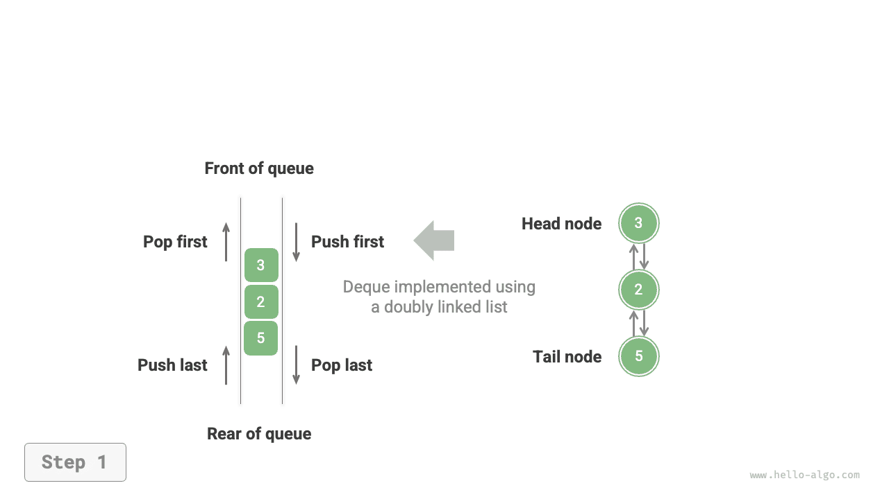
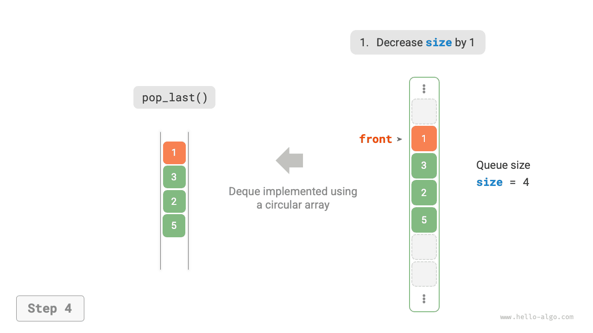
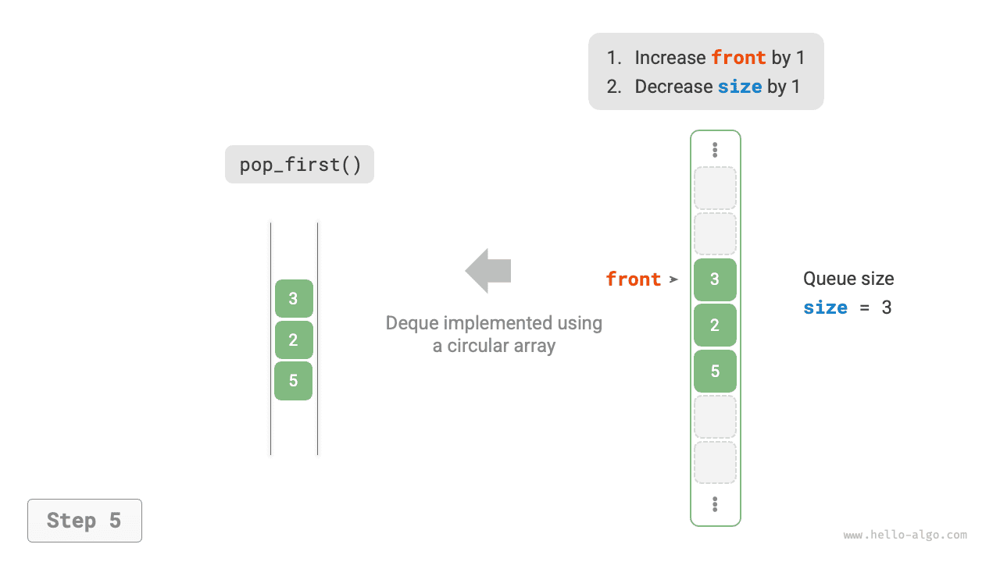

# Kétirányú sor

Egy sorban csak az első elemtől távolíthatunk el elemeket, vagy adhatunk hozzá elemeket az utolsó elemhez. Az alábbi ábrán látható módon a <u>kétirányú sor (deque)</u> nagyobb rugalmasságot biztosít, lehetővé téve elemek hozzáadását vagy eltávolítását mind az első elemnél, mind az utolsó elemnél.


## A kétirányú sor gyakori műveletei

A kétirányú sor leggyakoribb műveleteit az alábbi táblázat mutatja. A konkrét metódusnevek a programozási nyelvtől függnek.

<p align="center"> Táblázat <id> &nbsp; Kétirányú sorműveletek hatékonysága </p>

| Metódus        | Leírás                        | Időbonyolultság |
| -------------- | ----------------------------- | --------------- |
| `push_first()` | Elem hozzáadása az elejéhez   | $O(1)$          |
| `push_last()`  | Elem hozzáadása a végéhez     | $O(1)$          |
| `pop_first()`  | Az első elem eltávolítása     | $O(1)$          |
| `pop_last()`   | Az utolsó elem eltávolítása   | $O(1)$          |
| `peek_first()` | Az első elem megtekintése     | $O(1)$          |
| `peek_last()`  | Az utolsó elem megtekintése   | $O(1)$          |

Hasonlóképpen, közvetlenül használhatjuk a programozási nyelvekben már megvalósított kétirányú sor osztályokat:

=== "Python"

    ```python title="deque.py"
    from collections import deque

    # Kétirányú sor inicializálása
    deq: deque[int] = deque()

    # Elemek sorba állítása
    deq.append(2)      # Hozzáadás a véghez
    deq.append(5)
    deq.append(4)
    deq.appendleft(3)  # Hozzáadás az elejéhez
    deq.appendleft(1)

    # Elemek elérése
    front: int = deq[0]  # Első elem
    rear: int = deq[-1]  # Utolsó elem

    # Elemek kivétele
    pop_front: int = deq.popleft()  # Első elem kivétele
    pop_rear: int = deq.pop()       # Utolsó elem kivétele

    # Kétirányú sor hosszának lekérdezése
    size: int = len(deq)

    # Üresség ellenőrzése
    is_empty: bool = len(deq) == 0
    ```

=== "C++"

    ```cpp title="deque.cpp"
    /* Kétirányú sor inicializálása */
    deque<int> deque;

    /* Elemek sorba állítása */
    deque.push_back(2);   // Hozzáadás a véghez
    deque.push_back(5);
    deque.push_back(4);
    deque.push_front(3);  // Hozzáadás az elejéhez
    deque.push_front(1);

    /* Elemek elérése */
    int front = deque.front(); // Első elem
    int back = deque.back();   // Utolsó elem

    /* Elemek kivétele */
    deque.pop_front();  // Első elem kivétele
    deque.pop_back();   // Utolsó elem kivétele

    /* Kétirányú sor hosszának lekérdezése */
    int size = deque.size();

    /* Üresség ellenőrzése */
    bool empty = deque.empty();
    ```

=== "Java"

    ```java title="deque.java"
    /* Kétirányú sor inicializálása */
    Deque<Integer> deque = new LinkedList<>();

    /* Elemek sorba állítása */
    deque.offerLast(2);   // Hozzáadás a véghez
    deque.offerLast(5);
    deque.offerLast(4);
    deque.offerFirst(3);  // Hozzáadás az elejéhez
    deque.offerFirst(1);

    /* Elemek elérése */
    int peekFirst = deque.peekFirst();  // Első elem
    int peekLast = deque.peekLast();    // Utolsó elem

    /* Elemek kivétele */
    int popFirst = deque.pollFirst();  // Első elem kivétele
    int popLast = deque.pollLast();    // Utolsó elem kivétele

    /* Kétirányú sor hosszának lekérdezése */
    int size = deque.size();

    /* Üresség ellenőrzése */
    boolean isEmpty = deque.isEmpty();
    ```

=== "C#"

    ```csharp title="deque.cs"
    /* Kétirányú sor inicializálása */
    // C#-ban LinkedList-et használunk kétirányú sorként
    LinkedList<int> deque = new();

    /* Elemek sorba állítása */
    deque.AddLast(2);   // Hozzáadás a véghez
    deque.AddLast(5);
    deque.AddLast(4);
    deque.AddFirst(3);  // Hozzáadás az elejéhez
    deque.AddFirst(1);

    /* Elemek elérése */
    int peekFirst = deque.First.Value;  // Első elem
    int peekLast = deque.Last.Value;    // Utolsó elem

    /* Elemek kivétele */
    deque.RemoveFirst();  // Első elem kivétele
    deque.RemoveLast();   // Utolsó elem kivétele

    /* Kétirányú sor hosszának lekérdezése */
    int size = deque.Count;

    /* Üresség ellenőrzése */
    bool isEmpty = deque.Count == 0;
    ```

=== "Go"

    ```go title="deque_test.go"
    /* Kétirányú sor inicializálása */
    // Go-ban list-et használunk kétirányú sorként
    deque := list.New()

    /* Elemek sorba állítása */
    deque.PushBack(2)      // Hozzáadás a véghez
    deque.PushBack(5)
    deque.PushBack(4)
    deque.PushFront(3)     // Hozzáadás az elejéhez
    deque.PushFront(1)

    /* Elemek elérése */
    front := deque.Front() // Első elem
    rear := deque.Back()   // Utolsó elem

    /* Elemek kivétele */
    deque.Remove(front)    // Első elem kivétele
    deque.Remove(rear)     // Utolsó elem kivétele

    /* Kétirányú sor hosszának lekérdezése */
    size := deque.Len()

    /* Üresség ellenőrzése */
    isEmpty := deque.Len() == 0
    ```

=== "Swift"

    ```swift title="deque.swift"
    /* Kétirányú sor inicializálása */
    // A Swiftnek nincs beépített kétirányú sor osztálya, Array-t használhatunk kétirányú sorként
    var deque: [Int] = []

    /* Elemek sorba állítása */
    deque.append(2) // Hozzáadás a véghez
    deque.append(5)
    deque.append(4)
    deque.insert(3, at: 0) // Hozzáadás az elejéhez
    deque.insert(1, at: 0)

    /* Elemek elérése */
    let peekFirst = deque.first! // Első elem
    let peekLast = deque.last! // Utolsó elem

    /* Elemek kivétele */
    // Array szimulációnál a popFirst O(n) bonyolultságú
    let popFirst = deque.removeFirst() // Első elem kivétele
    let popLast = deque.removeLast() // Utolsó elem kivétele

    /* Kétirányú sor hosszának lekérdezése */
    let size = deque.count

    /* Üresség ellenőrzése */
    let isEmpty = deque.isEmpty
    ```

=== "JS"

    ```javascript title="deque.js"
    /* Kétirányú sor inicializálása */
    // A JavaScriptnek nincs beépített kétirányú sora, csak Array-t használhatunk kétirányú sorként
    const deque = [];

    /* Elemek sorba állítása */
    deque.push(2);
    deque.push(5);
    deque.push(4);
    // Vegyük figyelembe, hogy mivel tömb, az unshift() O(n) időbonyolultságú
    deque.unshift(3);
    deque.unshift(1);

    /* Elemek elérése */
    const peekFirst = deque[0];
    const peekLast = deque[deque.length - 1];

    /* Elemek kivétele */
    // Vegyük figyelembe, hogy mivel tömb, a shift() O(n) időbonyolultságú
    const popFront = deque.shift();
    const popBack = deque.pop();

    /* Kétirányú sor hosszának lekérdezése */
    const size = deque.length;

    /* Üresség ellenőrzése */
    const isEmpty = size === 0;
    ```

=== "TS"

    ```typescript title="deque.ts"
    /* Kétirányú sor inicializálása */
    // A TypeScriptnek nincs beépített kétirányú sora, csak Array-t használhatunk kétirányú sorként
    const deque: number[] = [];

    /* Elemek sorba állítása */
    deque.push(2);
    deque.push(5);
    deque.push(4);
    // Vegyük figyelembe, hogy mivel tömb, az unshift() O(n) időbonyolultságú
    deque.unshift(3);
    deque.unshift(1);

    /* Elemek elérése */
    const peekFirst: number = deque[0];
    const peekLast: number = deque[deque.length - 1];

    /* Elemek kivétele */
    // Vegyük figyelembe, hogy mivel tömb, a shift() O(n) időbonyolultságú
    const popFront: number = deque.shift() as number;
    const popBack: number = deque.pop() as number;

    /* Kétirányú sor hosszának lekérdezése */
    const size: number = deque.length;

    /* Üresség ellenőrzése */
    const isEmpty: boolean = size === 0;
    ```

=== "Dart"

    ```dart title="deque.dart"
    /* Kétirányú sor inicializálása */
    // Dartban a Queue kétirányú sorként van definiálva
    Queue<int> deque = Queue<int>();

    /* Elemek sorba állítása */
    deque.addLast(2);  // Hozzáadás a véghez
    deque.addLast(5);
    deque.addLast(4);
    deque.addFirst(3); // Hozzáadás az elejéhez
    deque.addFirst(1);

    /* Elemek elérése */
    int peekFirst = deque.first; // Első elem
    int peekLast = deque.last;   // Utolsó elem

    /* Elemek kivétele */
    int popFirst = deque.removeFirst(); // Első elem kivétele
    int popLast = deque.removeLast();   // Utolsó elem kivétele

    /* Kétirányú sor hosszának lekérdezése */
    int size = deque.length;

    /* Üresség ellenőrzése */
    bool isEmpty = deque.isEmpty;
    ```

=== "Rust"

    ```rust title="deque.rs"
    /* Kétirányú sor inicializálása */
    let mut deque: VecDeque<u32> = VecDeque::new();

    /* Elemek sorba állítása */
    deque.push_back(2);  // Hozzáadás a véghez
    deque.push_back(5);
    deque.push_back(4);
    deque.push_front(3); // Hozzáadás az elejéhez
    deque.push_front(1);

    /* Elemek elérése */
    if let Some(front) = deque.front() { // Első elem
    }
    if let Some(rear) = deque.back() {   // Utolsó elem
    }

    /* Elemek kivétele */
    if let Some(pop_front) = deque.pop_front() { // Első elem kivétele
    }
    if let Some(pop_rear) = deque.pop_back() {   // Utolsó elem kivétele
    }

    /* Kétirányú sor hosszának lekérdezése */
    let size = deque.len();

    /* Üresség ellenőrzése */
    let is_empty = deque.is_empty();
    ```

=== "C"

    ```c title="deque.c"
    // A C nem biztosít beépített kétirányú sort
    ```

=== "Kotlin"

    ```kotlin title="deque.kt"
    /* Kétirányú sor inicializálása */
    val deque = LinkedList<Int>()

    /* Elemek sorba állítása */
    deque.offerLast(2)  // Hozzáadás a véghez
    deque.offerLast(5)
    deque.offerLast(4)
    deque.offerFirst(3) // Hozzáadás az elejéhez
    deque.offerFirst(1)

    /* Elemek elérése */
    val peekFirst = deque.peekFirst() // Első elem
    val peekLast = deque.peekLast()   // Utolsó elem

    /* Elemek kivétele */
    val popFirst = deque.pollFirst() // Első elem kivétele
    val popLast = deque.pollLast()   // Utolsó elem kivétele

    /* Kétirányú sor hosszának lekérdezése */
    val size = deque.size

    /* Üresség ellenőrzése */
    val isEmpty = deque.isEmpty()
    ```

=== "Ruby"

    ```ruby title="deque.rb"
    # Kétirányú sor inicializálása
    # A Rubynek nincs beépített kétirányú sora, csak Array-t használhatunk kétirányú sorként
    deque = []

    # Elemek sorba állítása
    deque << 2
    deque << 5
    deque << 4
    # Vegyük figyelembe, hogy mivel tömb, az Array#unshift O(n) időbonyolultságú
    deque.unshift(3)
    deque.unshift(1)

    # Elemek elérése
    peek_first = deque.first
    peek_last = deque.last

    # Elemek kivétele
    # Vegyük figyelembe, hogy mivel tömb, az Array#shift O(n) időbonyolultságú
    pop_front = deque.shift
    pop_back = deque.pop

    # Kétirányú sor hosszának lekérdezése
    size = deque.length

    # Üresség ellenőrzése
    is_empty = size.zero?
    ```

??? pythontutor "Kód vizualizáció"

    https://pythontutor.com/render.html#code=from%20collections%20import%20deque%0A%0A%22%22%22Driver%20Code%22%22%22%0Aif%20__name__%20%3D%3D%20%22__main__%22%3A%0A%20%20%20%20%23%20%E5%88%9D%E5%A7%8B%E5%8C%96%E5%8F%8C%E5%90%91%E9%98%9F%E5%88%97%0A%20%20%20%20deq%20%3D%20deque%28%29%0A%0A%20%20%20%20%23%20%E5%85%83%E7%B4%A0%E5%85%A5%E9%98%9F%0A%20%20%20%20deq.append%282%29%20%20%23%20%E6%B7%BB%E5%8A%A0%E8%87%B3%E9%98%9F%E5%B0%BE%0A%20%20%20%20deq.append%285%29%0A%20%20%20%20deq.append%284%29%0A%20%20%20%20deq.appendleft%283%29%20%20%23%20%E6%B7%BB%E5%8A%A0%E8%87%B3%E9%98%9F%E9%A6%96%0A%20%20%20%20deq.appendleft%281%29%0A%20%20%20%20print%28%22%E5%8F%8C%E5%90%91%E9%98%9F%E5%88%97%20deque%20%3D%22,%20deq%29%0A%0A%20%20%20%20%23%20%E8%AE%BF%E9%97%AE%E5%85%83%E7%B4%A0%0A%20%20%20%20front%20%3D%20deq%5B0%5D%20%20%23%20%E9%98%9F%E9%A6%96%E5%85%83%E7%B4%A0%0A%20%20%20%20print%28%22%E9%98%9F%E9%A6%96%E5%85%83%E7%B4%A0%20front%20%3D%22,%20front%29%0A%20%20%20%20rear%20%3D%20deq%5B-1%5D%20%20%23%20%E9%98%9F%E5%B0%BE%E5%85%83%E7%B4%A0%0A%20%20%20%20print%28%22%E9%98%9F%E5%B0%BE%E5%85%83%E7%B4%A0%20rear%20%3D%22,%20rear%29%0A%0A%20%20%20%20%23%20%E5%85%83%E7%B4%A0%E5%87%BA%E9%98%9F%0A%20%20%20%20pop_front%20%3D%20deq.popleft%28%29%20%20%23%20%E9%98%9F%E9%A6%96%E5%85%83%E7%B4%A0%E5%87%BA%E9%98%9F%0A%20%20%20%20print%28%22%E9%98%9F%E9%A6%96%E5%87%BA%E9%98%9F%E5%85%83%E7%B4%A0%20%20pop_front%20%3D%22,%20pop_front%29%0A%20%20%20%20print%28%22%E9%98%9F%E9%A6%96%E5%87%BA%E9%98%9F%E5%90%8E%20deque%20%3D%22,%20deq%29%0A%20%20%20%20pop_rear%20%3D%20deq.pop%28%29%20%20%23%20%E9%98%9F%E5%B0%BE%E5%85%83%E7%B4%A0%E5%87%BA%E9%98%9F%0A%20%20%20%20print%28%22%E9%98%9F%E5%B0%BE%E5%87%BA%E9%98%9F%E5%85%83%E7%B4%A0%20%20pop_rear%20%3D%22,%20pop_rear%29%0A%20%20%20%20print%28%22%E9%98%9F%E5%B0%BE%E5%87%BA%E9%98%9F%E5%90%8E%20deque%20%3D%22,%20deq%29%0A%0A%20%20%20%20%23%20%E8%8E%B7%E5%8F%96%E5%8F%8C%E5%90%91%E9%98%9F%E5%88%97%E7%9A%84%E9%95%BF%E5%BA%A6%0A%20%20%20%20size%20%3D%20len%28deq%29%0A%20%20%20%20print%28%22%E5%8F%8C%E5%90%91%E9%98%9F%E5%88%97%E9%95%BF%E5%BA%A6%20size%20%3D%22,%20size%29%0A%0A%20%20%20%20%23%20%E5%88%A4%E6%96%AD%E5%8F%8C%E5%90%91%E9%98%9F%E5%88%97%E6%98%AF%E5%90%A6%E4%B8%BA%E7%A9%BA%0A%20%20%20%20is_empty%20%3D%20len%28deq%29%20%3D%3D%200%0A%20%20%20%20print%28%22%E5%8F%8C%E5%90%91%E9%98%9F%E5%88%97%E6%98%AF%E5%90%A6%E4%B8%BA%E7%A9%BA%20%3D%22,%20is_empty%29&cumulative=false&curInstr=3&heapPrimitives=nevernest&mode=display&origin=opt-frontend.js&py=311&rawInputLstJSON=%5B%5D&textReferences=false

## Kétirányú sor megvalósítása *

A kétirányú sor megvalósítása hasonló a soréhoz. Alapul szolgáló adatszerkezetként választhatunk láncolt listát vagy tömböt.

### Kétszeresen láncolt listával való megvalósítás

Az előző szakaszt áttekintve, normál egyszeresen láncolt listát használtunk sor megvalósítására, mivel kényelmesen lehetővé teszi a fejcsomópont törlését (a kivétel műveletnek megfelelően) és új csomópontok hozzáadását a végcsomópont után (a sorba állítás műveletnek megfelelően).

Kétirányú sor esetén mind az első elem, mind az utolsó elem elvégezhet sorba állítást és kivételt. Más szóval, a kétirányú sornak az ellentétes irányú műveleteket is meg kell valósítania. Ezért "kétszeresen láncolt listát" használunk a kétirányú sor alapjául szolgáló adatszerkezeteként.

Az alábbi ábrán látható módon a kétszeresen láncolt lista fej- és végcsomópontjait a kétirányú sor első és utolsó elemeként kezeljük, megvalósítva a csomópontok mindkét végén való hozzáadásának és eltávolításának funkcionalitását.

=== "<1>"
    

=== "<2>"
    

=== "<3>"
    

=== "<4>"
    

=== "<5>"
    

A megvalósítási kód az alábbiakban látható:

```src
[file]{linkedlist_deque}-[class]{linked_list_deque}-[func]{}
```

### Tömbbel való megvalósítás

Az alábbi ábrán látható módon, hasonlóan a tömbön alapuló sor megvalósításához, körkörösen összekötött tömböt is használhatunk a kétirányú sor megvalósítására.

=== "<1>"
    

=== "<2>"
    

=== "<3>"
    

=== "<4>"
    

=== "<5>"
    

A sor megvalósítása alapján csak az "első elemnél való sorba állítás" és az "utolsó elemnél való kivétel" metódusokat kell hozzáadnunk:

```src
[file]{array_deque}-[class]{array_deque}-[func]{}
```

## Kétirányú sor alkalmazásai

A kétirányú sor ötvözi a veremek és sorok logikáját. **Ezért képes megvalósítani mindkettő összes alkalmazási forgatókönyvét, miközben nagyobb rugalmasságot biztosít**.

Tudjuk, hogy a szoftverek "visszavonás" funkciója általában egy veremmel valósul meg: a rendszer minden változtatási műveletet push-ol a verembe, majd pop segítségével valósítja meg a visszavonást. Azonban rendszererőforrás-korlátozásokat figyelembe véve, a szoftverek általában korlátozzák a visszavonási lépések számát (például csak 50 lépés mentésének engedélyezésével). Amikor a verem hossza meghaladja az 50-et, a szoftvernek törlési műveletet kell végrehajtania a verem alján (a sor első elemén). **Egy verem azonban nem képes ezt a funkcionalitást megvalósítani, ezért szükséges a kétirányú sor használata a verem helyett.** Vegyük figyelembe, hogy a "visszavonás" alapvető logikája még mindig a verem LIFO elvét követi; csupán a kétirányú sor képes rugalmasabban megvalósítani néhány kiegészítő logikát.
