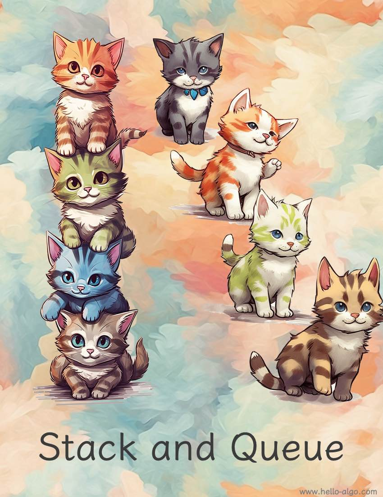

# Verem és Sor

!!! abstract

    A veremek olyanok, mint macskákat egymásra rakni, a sorok pedig olyanok, mint macskák sorban állása.

    Rendre a LIFO (utoljára be, először ki) és a FIFO (először be, először ki) logikát képviselik.
