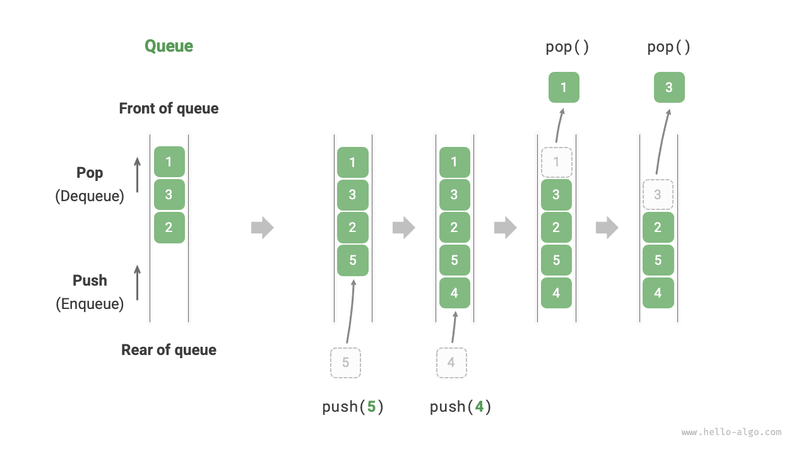
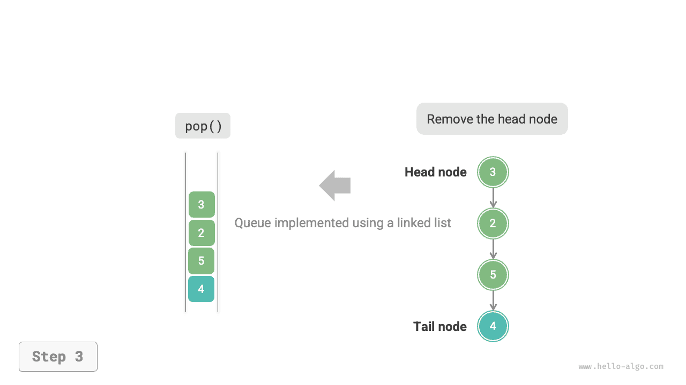

# Sor

A <u>sor</u> egy lineáris adatszerkezet, amely az először be, először ki (FIFO) szabályt követi. Ahogy a neve is sugallja, a sor a sorban állás jelenségét szimulálja, ahol az újonnan érkezők folyamatosan a sor végére csatlakoznak, míg a sor elejéről az emberek egyenként távoznak.

Az alábbi ábrán látható módon a sor elejét "első elemnek", a végét "utolsó elemnek" nevezzük. Az utolsó elemhez való elem hozzáadásának művelete a "sorba állítás" (enqueue), az első elem eltávolításának művelete a "sorból kivétel" (dequeue).



## A sor gyakori műveletei

A sor leggyakoribb műveleteit az alábbi táblázat mutatja. Vegyük figyelembe, hogy a metódusnevek programozási nyelvektől függően eltérhetnek. Itt ugyanolyan elnevezési konvenciót alkalmazunk, mint a veremeknél.

<p align="center"> Táblázat <id> &nbsp; Sorműveletek hatékonysága </p>

| Metódus  | Leírás                                        | Időbonyolultság |
| -------- | --------------------------------------------- | --------------- |
| `push()` | Elem sorba állítása, elem hozzáadása a véghez | $O(1)$          |
| `pop()`  | Az első elem kivétele a sorból                | $O(1)$          |
| `peek()` | Az első elem megtekintése                     | $O(1)$          |

A programozási nyelvekben közvetlenül használhatjuk a kész sor osztályokat:

=== "Python"

    ```python title="queue.py"
    from collections import deque

    # Sor inicializálása
    # Pythonban általában a deque osztályt használjuk sorként
    # Bár a queue.Queue() egy tiszta sor osztály, nem túl felhasználóbarát, ezért nem ajánlott
    que: deque[int] = deque()

    # Elemek sorba állítása
    que.append(1)
    que.append(3)
    que.append(2)
    que.append(5)
    que.append(4)

    # Első elem elérése
    front: int = que[0]

    # Elem kivétele a sorból
    pop: int = que.popleft()

    # Sor hosszának lekérdezése
    size: int = len(que)

    # Üresség ellenőrzése
    is_empty: bool = len(que) == 0
    ```

=== "C++"

    ```cpp title="queue.cpp"
    /* Sor inicializálása */
    queue<int> queue;

    /* Elemek sorba állítása */
    queue.push(1);
    queue.push(3);
    queue.push(2);
    queue.push(5);
    queue.push(4);

    /* Első elem elérése */
    int front = queue.front();

    /* Elem kivétele a sorból */
    queue.pop();

    /* Sor hosszának lekérdezése */
    int size = queue.size();

    /* Üresség ellenőrzése */
    bool empty = queue.empty();
    ```

=== "Java"

    ```java title="queue.java"
    /* Sor inicializálása */
    Queue<Integer> queue = new LinkedList<>();

    /* Elemek sorba állítása */
    queue.offer(1);
    queue.offer(3);
    queue.offer(2);
    queue.offer(5);
    queue.offer(4);

    /* Első elem elérése */
    int peek = queue.peek();

    /* Elem kivétele a sorból */
    int pop = queue.poll();

    /* Sor hosszának lekérdezése */
    int size = queue.size();

    /* Üresség ellenőrzése */
    boolean isEmpty = queue.isEmpty();
    ```

=== "C#"

    ```csharp title="queue.cs"
    /* Sor inicializálása */
    Queue<int> queue = new();

    /* Elemek sorba állítása */
    queue.Enqueue(1);
    queue.Enqueue(3);
    queue.Enqueue(2);
    queue.Enqueue(5);
    queue.Enqueue(4);

    /* Első elem elérése */
    int peek = queue.Peek();

    /* Elem kivétele a sorból */
    int pop = queue.Dequeue();

    /* Sor hosszának lekérdezése */
    int size = queue.Count;

    /* Üresség ellenőrzése */
    bool isEmpty = queue.Count == 0;
    ```

=== "Go"

    ```go title="queue_test.go"
    /* Sor inicializálása */
    // Go-ban list-et használunk sorként
    queue := list.New()

    /* Elemek sorba állítása */
    queue.PushBack(1)
    queue.PushBack(3)
    queue.PushBack(2)
    queue.PushBack(5)
    queue.PushBack(4)

    /* Első elem elérése */
    peek := queue.Front()

    /* Elem kivétele a sorból */
    pop := queue.Front()
    queue.Remove(pop)

    /* Sor hosszának lekérdezése */
    size := queue.Len()

    /* Üresség ellenőrzése */
    isEmpty := queue.Len() == 0
    ```

=== "Swift"

    ```swift title="queue.swift"
    /* Sor inicializálása */
    // A Swiftnek nincs beépített sor osztálya, Array-t használhatunk sorként
    var queue: [Int] = []

    /* Elemek sorba állítása */
    queue.append(1)
    queue.append(3)
    queue.append(2)
    queue.append(5)
    queue.append(4)

    /* Első elem elérése */
    let peek = queue.first!

    /* Elem kivétele a sorból */
    // Mivel tömb, a removeFirst O(n) bonyolultságú
    let pool = queue.removeFirst()

    /* Sor hosszának lekérdezése */
    let size = queue.count

    /* Üresség ellenőrzése */
    let isEmpty = queue.isEmpty
    ```

=== "JS"

    ```javascript title="queue.js"
    /* Sor inicializálása */
    // A JavaScriptnek nincs beépített sora, Array-t használhatunk sorként
    const queue = [];

    /* Elemek sorba állítása */
    queue.push(1);
    queue.push(3);
    queue.push(2);
    queue.push(5);
    queue.push(4);

    /* Első elem elérése */
    const peek = queue[0];

    /* Elem kivétele a sorból */
    // Az alapstruktúra tömb, ezért a shift() O(n) időbonyolultságú
    const pop = queue.shift();

    /* Sor hosszának lekérdezése */
    const size = queue.length;

    /* Üresség ellenőrzése */
    const empty = queue.length === 0;
    ```

=== "TS"

    ```typescript title="queue.ts"
    /* Sor inicializálása */
    // A TypeScriptnek nincs beépített sora, Array-t használhatunk sorként
    const queue: number[] = [];

    /* Elemek sorba állítása */
    queue.push(1);
    queue.push(3);
    queue.push(2);
    queue.push(5);
    queue.push(4);

    /* Első elem elérése */
    const peek = queue[0];

    /* Elem kivétele a sorból */
    // Az alapstruktúra tömb, ezért a shift() O(n) időbonyolultságú
    const pop = queue.shift();

    /* Sor hosszának lekérdezése */
    const size = queue.length;

    /* Üresség ellenőrzése */
    const empty = queue.length === 0;
    ```

=== "Dart"

    ```dart title="queue.dart"
    /* Sor inicializálása */
    // Dartban a Queue osztály egy kétirányú sor, és sorként is használható
    Queue<int> queue = Queue();

    /* Elemek sorba állítása */
    queue.add(1);
    queue.add(3);
    queue.add(2);
    queue.add(5);
    queue.add(4);

    /* Első elem elérése */
    int peek = queue.first;

    /* Elem kivétele a sorból */
    int pop = queue.removeFirst();

    /* Sor hosszának lekérdezése */
    int size = queue.length;

    /* Üresség ellenőrzése */
    bool isEmpty = queue.isEmpty;
    ```

=== "Rust"

    ```rust title="queue.rs"
    /* Kétirányú sor inicializálása */
    // Rustban kétirányú sort használunk normál sorként
    let mut deque: VecDeque<u32> = VecDeque::new();

    /* Elemek sorba állítása */
    deque.push_back(1);
    deque.push_back(3);
    deque.push_back(2);
    deque.push_back(5);
    deque.push_back(4);

    /* Első elem elérése */
    if let Some(front) = deque.front() {
    }

    /* Elem kivétele a sorból */
    if let Some(pop) = deque.pop_front() {
    }

    /* Sor hosszának lekérdezése */
    let size = deque.len();

    /* Üresség ellenőrzése */
    let is_empty = deque.is_empty();
    ```

=== "C"

    ```c title="queue.c"
    // A C nem biztosít beépített sort
    ```

=== "Kotlin"

    ```kotlin title="queue.kt"
    /* Sor inicializálása */
    val queue = LinkedList<Int>()

    /* Elemek sorba állítása */
    queue.offer(1)
    queue.offer(3)
    queue.offer(2)
    queue.offer(5)
    queue.offer(4)

    /* Első elem elérése */
    val peek = queue.peek()

    /* Elem kivétele a sorból */
    val pop = queue.poll()

    /* Sor hosszának lekérdezése */
    val size = queue.size

    /* Üresség ellenőrzése */
    val isEmpty = queue.isEmpty()
    ```

=== "Ruby"

    ```ruby title="queue.rb"
    # Sor inicializálása
    # A Ruby beépített sora (Thread::Queue) nem rendelkezik peek és bejárási metódusokkal, Array-t használhatunk sorként
    queue = []

    # Elemek sorba állítása
    queue.push(1)
    queue.push(3)
    queue.push(2)
    queue.push(5)
    queue.push(4)

    # Első elem elérése
    peek = queue.first

    # Elem kivétele a sorból
    # Vegyük figyelembe, hogy mivel tömb, az Array#shift O(n) időbonyolultságú
    pop = queue.shift

    # Sor hosszának lekérdezése
    size = queue.length

    # Üresség ellenőrzése
    is_empty = queue.empty?
    ```

??? pythontutor "Kód vizualizáció"

    https://pythontutor.com/render.html#code=from%20collections%20import%20deque%0A%0A%22%22%22Driver%20Code%22%22%22%0Aif%20__name__%20%3D%3D%20%22__main__%22%3A%0A%20%20%20%20%23%20%E5%88%9D%E5%A7%8B%E5%8C%96%E9%98%9F%E5%88%97%0A%20%20%20%20%23%20%E5%9C%A8%20Python%20%E4%B8%AD%EF%BC%8C%E6%88%91%E4%BB%AC%E4%B8%80%E8%88%AC%E5%B0%86%E5%8F%8C%E5%90%91%E9%98%9F%E5%88%97%E7%B1%BB%20deque%20%E7%9C%8B%E4%BD%9C%E9%98%9F%E5%88%97%E4%BD%BF%E7%94%A8%0A%20%20%20%20%23%20%E8%99%BD%E7%84%B6%20queue.Queue%28%29%20%E6%98%AF%E7%BA%AF%E6%AD%A3%E7%9A%84%E9%98%9F%E5%88%97%E7%B1%BB%EF%BC%8C%E4%BD%86%E4%B8%8D%E5%A4%AA%E5%A5%BD%E7%94%A8%0A%20%20%20%20que%20%3D%20deque%28%29%0A%0A%20%20%20%20%23%20%E5%85%83%E7%B4%A0%E5%85%A5%E9%98%9F%0A%20%20%20%20que.append%281%29%0A%20%20%20%20que.append%283%29%0A%20%20%20%20que.append%282%29%0A%20%20%20%20que.append%285%29%0A%20%20%20%20que.append%284%29%0A%20%20%20%20print%28%22%E9%98%9F%E5%88%97%20que%20%3D%22,%20que%29%0A%0A%20%20%20%20%23%20%E8%AE%BF%E9%97%AE%E9%98%9F%E9%A6%96%E5%85%83%E7%B4%A0%0A%20%20%20%20front%20%3D%20que%5B0%5D%0A%20%20%20%20print%28%22%E9%98%9F%E9%A6%96%E5%85%83%E7%B4%A0%20front%20%3D%22,%20front%29%0A%0A%20%20%20%20%23%20%E5%85%83%E7%B4%A0%E5%87%BA%E9%98%9F%0A%20%20%20%20pop%20%3D%20que.popleft%28%29%0A%20%20%20%20print%28%22%E5%87%BA%E9%98%9F%E5%85%83%E7%B4%A0%20pop%20%3D%22,%20pop%29%0A%20%20%20%20print%28%22%E5%87%BA%E9%98%9F%E5%90%8E%20que%20%3D%22,%20que%29%0A%0A%20%20%20%20%23%20%E8%8E%B7%E5%8F%96%E9%98%9F%E5%88%97%E7%9A%84%E9%95%BF%E5%BA%A6%0A%20%20%20%20size%20%3D%20len%28que%29%0A%20%20%20%20print%28%22%E9%98%9F%E5%88%97%E9%95%BF%E5%BA%A6%20size%20%3D%22,%20size%29%0A%0A%20%20%20%20%23%20%E5%88%A4%E6%96%AD%E9%98%9F%E5%88%97%E6%98%AF%E5%90%A6%E4%B8%BA%E7%A9%BA%0A%20%20%20%20is_empty%20%3D%20len%28que%29%20%3D%3D%200%0A%20%20%20%20print%28%22%E9%98%9F%E5%88%97%E6%98%AF%E5%90%A6%E4%B8%BA%E7%A9%BA%20%3D%22,%20is_empty%29&cumulative=false&curInstr=3&heapPrimitives=nevernest&mode=display&origin=opt-frontend.js&py=311&rawInputLstJSON=%5B%5D&textReferences=false

## Sor megvalósítása

Egy sor megvalósításához szükségünk van egy adatszerkezetre, amely lehetővé teszi elemek hozzáadását az egyik végén és eltávolítását a másik végén. Mind a láncolt listák, mind a tömbök megfelelnek ennek a követelménynek.

### Láncolt listával való megvalósítás

Az alábbi ábrán látható módon a láncolt lista "fejcsomópontját" és "végcsomópontját" a sor "első elemének" és "utolsó elemének" kezelhetjük, azzal a szabállyal, hogy csomópontok csak az utolsó elemnél adhatók hozzá és csak az első elemnél távolíthatók el.

=== "<1>"
    

=== "<2>"
    

=== "<3>"
    

Az alábbiakban látható a sor láncolt listával való megvalósításának kódja:

```src
[file]{linkedlist_queue}-[class]{linked_list_queue}-[func]{}
```

### Tömbbel való megvalósítás

Egy tömb első elemének törlése $O(n)$ időbonyolultságú, ami a kivétel műveletet nem hatékonnyá tenné. Azonban a következő okos módszerrel elkerülhetjük ezt a problémát.

Egy `front` változóval mutathatunk az első elem indexére, és egy `size` változóval tarthatjuk nyilván a sor hosszát. Definiáljuk `rear = front + size`-t, amely kiszámítja az utolsó elem utáni pozíciót.

Ezen kialakítás alapján **a tömb elemeket tartalmazó érvényes intervalluma `[front, rear - 1]`**. A különböző műveletek megvalósítási módszereit az alábbi ábra mutatja:

- Sorba állítás: Rendeljük hozzá a bemeneti elemet a `rear` indexhez, és növeljük `size`-t 1-gyel.
- Kivétel: Egyszerűen növeljük `front`-ot 1-gyel, és csökkentjük `size`-t 1-gyel.

Amint látható, mind a sorba állítás, mind a kivétel művelete csak egy műveletet igényel, $O(1)$ időbonyolultsággal.

=== "<1>"
    

=== "<2>"
    

=== "<3>"
    

Észrevehetünk egy problémát: ahogy folyamatosan sorba állítunk és kiveszünk, mind `front`, mind `rear` jobbra mozdul. **Amikor elérik a tömb végét, nem tudnak tovább mozogni.** Ennek megoldásához a tömböt "körkörösen összekötött tömbként" kezelhetjük, amelynek eleje és vége össze van kapcsolva.

Körkörösen összekötött tömbnél szükséges, hogy `front` vagy `rear` a tömb elejére kerüljön vissza, amikor átlép a végén. Ezt az ismétlődő mintát a "modulo művelet" segítségével valósíthatjuk meg, ahogy az alábbi kódban látható:

```src
[file]{array_queue}-[class]{array_queue}-[func]{}
```

A fent megvalósított sornak még mindig vannak korlátai: hossza nem változtatható. Ez a probléma azonban nem nehéz megoldani. A tömböt dinamikus tömbbel helyettesíthetjük, hogy bővítési mechanizmust vezessünk be. Az érdeklődő olvasók megpróbálhatják ezt saját maguk megvalósítani.

A két megvalósítás összehasonlítási következtetései megegyeznek a veremeknél tettekkel, ezért itt nem ismételjük meg.

## A sor tipikus alkalmazásai

- **Online rendelések**. Miután a vásárlók leadják rendeléseiket, a rendelések hozzáadódnak egy sorhoz, és a rendszer ezt követően sorban dolgozza fel a sorban lévő rendeléseket. Nagy forgalmi csúcsokon rövid idő alatt hatalmas mennyiségű rendelés keletkezik, és a nagy párhuzamosság fontos kihívás, amellyel a mérnököknek meg kell küzdeniük.
- **Különböző elvégzendő feladatok**. Bármely forgatókönyv, amelynek "először érkezett, először kiszolgált" funkciót kell megvalósítania, mint például a nyomtató feladatsora vagy az étterem rendelési sora, hatékonyan fenntarthatja a feldolgozási sorrendet sorok segítségével.
