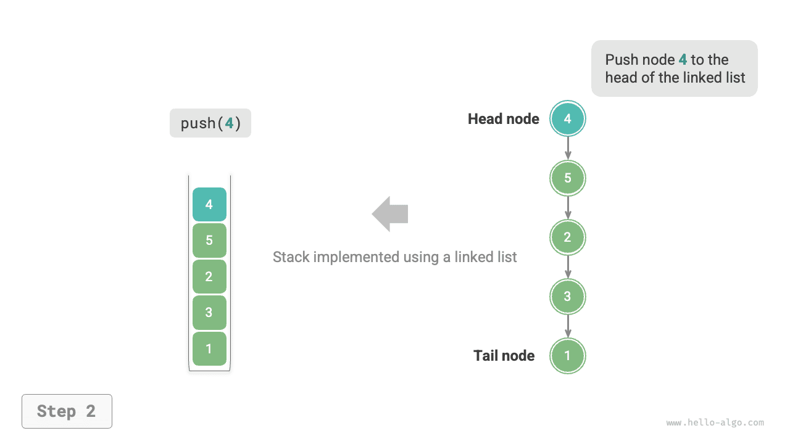
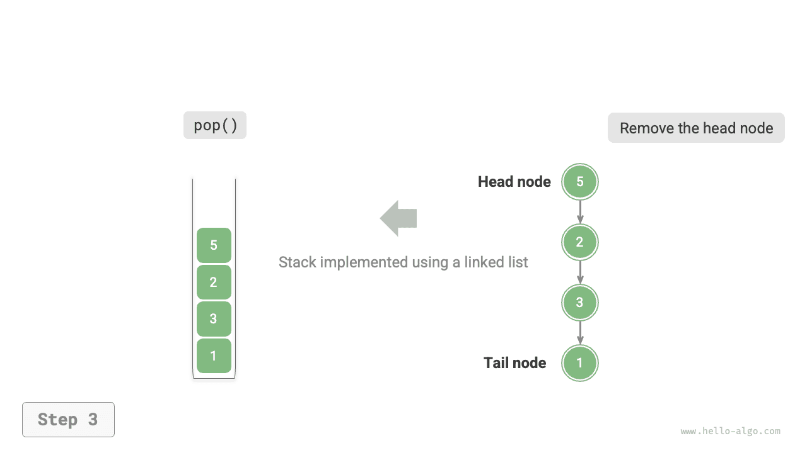
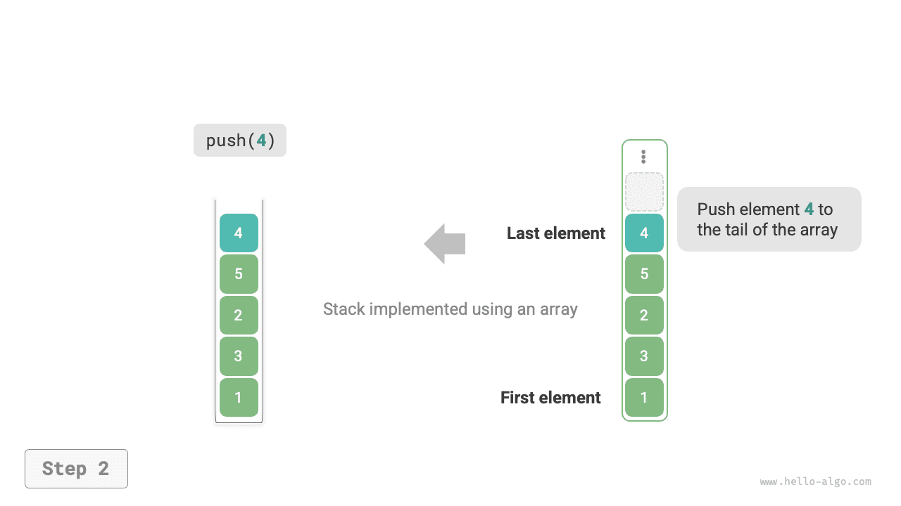

# Verem

A <u>verem</u> egy lineáris adatszerkezet, amely az utoljára be, először ki (LIFO) logikát követi.

A vermet összehasonlíthatjuk egy asztalon lévő tányérokból álló köteghez. Ha meghatározzuk, hogy egyszerre csak egy tányér mozdítható, akkor az alsó tányérhoz való hozzáféréshez előbb el kell távolítani a felette lévő tányérokat egyenként. Ha a tányérokat különféle típusú elemekkel (például egészek, karakterek, objektumok stb.) helyettesítjük, megkapjuk a verem adatszerkezetet.

Az alábbi ábrán látható módon az elemek tetejét "tetőnek", az alját "alapnak" nevezzük. A tetőre elem hozzáadásának művelete a "push" (tolás), a tető elemének eltávolítása a "pop" (kivétel).


## A verem gyakori műveletei

A verem leggyakoribb műveleteit az alábbi táblázat mutatja. A konkrét metódusnevek a programozási nyelvtől függnek. Itt a `push()`, `pop()` és `peek()` szokásos elnevezéseket használjuk.

<p align="center"> Táblázat <id> &nbsp; Veremműveletek hatékonysága </p>

| Metódus  | Leírás                                              | Időbonyolultság |
| -------- | --------------------------------------------------- | --------------- |
| `push()` | Elem push-olása a verembe (hozzáadás a tetőre)     | $O(1)$          |
| `pop()`  | A tető elem pop-olása a veremből                   | $O(1)$          |
| `peek()` | A tető elem megtekintése (peek)                    | $O(1)$          |

Általában közvetlenül használhatjuk a programozási nyelv által biztosított beépített verem osztályt. Egyes nyelvek azonban nem rendelkeznek dedikált verem osztállyal. Ezekben az esetekben a nyelv "tömbjét" vagy "láncolt listáját" veremként használhatjuk, és figyelmen kívül hagyhatjuk a veremhez nem kapcsolódó műveleteket a programlogikában.

=== "Python"

    ```python title="stack.py"
    # Verem inicializálása
    # A Pythonnak nincs beépített verem osztálya, listát használhatunk veremként
    stack: list[int] = []

    # Elemek push-olása
    stack.append(1)
    stack.append(3)
    stack.append(2)
    stack.append(5)
    stack.append(4)

    # Tető elem elérése
    peek: int = stack[-1]

    # Elem pop-olása
    pop: int = stack.pop()

    # Verem hosszának lekérdezése
    size: int = len(stack)

    # Üresség ellenőrzése
    is_empty: bool = len(stack) == 0
    ```

=== "C++"

    ```cpp title="stack.cpp"
    /* Verem inicializálása */
    stack<int> stack;

    /* Elemek push-olása */
    stack.push(1);
    stack.push(3);
    stack.push(2);
    stack.push(5);
    stack.push(4);

    /* Tető elem elérése */
    int top = stack.top();

    /* Elem pop-olása */
    stack.pop(); // Nincs visszatérési értéke

    /* Verem hosszának lekérdezése */
    int size = stack.size();

    /* Üresség ellenőrzése */
    bool empty = stack.empty();
    ```

=== "Java"

    ```java title="stack.java"
    /* Verem inicializálása */
    Stack<Integer> stack = new Stack<>();

    /* Elemek push-olása */
    stack.push(1);
    stack.push(3);
    stack.push(2);
    stack.push(5);
    stack.push(4);

    /* Tető elem elérése */
    int peek = stack.peek();

    /* Elem pop-olása */
    int pop = stack.pop();

    /* Verem hosszának lekérdezése */
    int size = stack.size();

    /* Üresség ellenőrzése */
    boolean isEmpty = stack.isEmpty();
    ```

=== "C#"

    ```csharp title="stack.cs"
    /* Verem inicializálása */
    Stack<int> stack = new();

    /* Elemek push-olása */
    stack.Push(1);
    stack.Push(3);
    stack.Push(2);
    stack.Push(5);
    stack.Push(4);

    /* Tető elem elérése */
    int peek = stack.Peek();

    /* Elem pop-olása */
    int pop = stack.Pop();

    /* Verem hosszának lekérdezése */
    int size = stack.Count;

    /* Üresség ellenőrzése */
    bool isEmpty = stack.Count == 0;
    ```

=== "Go"

    ```go title="stack_test.go"
    /* Verem inicializálása */
    // Go-ban ajánlott a Slice-t veremként használni
    var stack []int

    /* Elemek push-olása */
    stack = append(stack, 1)
    stack = append(stack, 3)
    stack = append(stack, 2)
    stack = append(stack, 5)
    stack = append(stack, 4)

    /* Tető elem elérése */
    peek := stack[len(stack)-1]

    /* Elem pop-olása */
    pop := stack[len(stack)-1]
    stack = stack[:len(stack)-1]

    /* Verem hosszának lekérdezése */
    size := len(stack)

    /* Üresség ellenőrzése */
    isEmpty := len(stack) == 0
    ```

=== "Swift"

    ```swift title="stack.swift"
    /* Verem inicializálása */
    // A Swiftnek nincs beépített verem osztálya, Array-t használhatunk veremként
    var stack: [Int] = []

    /* Elemek push-olása */
    stack.append(1)
    stack.append(3)
    stack.append(2)
    stack.append(5)
    stack.append(4)

    /* Tető elem elérése */
    let peek = stack.last!

    /* Elem pop-olása */
    let pop = stack.removeLast()

    /* Verem hosszának lekérdezése */
    let size = stack.count

    /* Üresség ellenőrzése */
    let isEmpty = stack.isEmpty
    ```

=== "JS"

    ```javascript title="stack.js"
    /* Verem inicializálása */
    // A JavaScriptnek nincs beépített verem osztálya, Array-t használhatunk veremként
    const stack = [];

    /* Elemek push-olása */
    stack.push(1);
    stack.push(3);
    stack.push(2);
    stack.push(5);
    stack.push(4);

    /* Tető elem elérése */
    const peek = stack[stack.length-1];

    /* Elem pop-olása */
    const pop = stack.pop();

    /* Verem hosszának lekérdezése */
    const size = stack.length;

    /* Üresség ellenőrzése */
    const is_empty = stack.length === 0;
    ```

=== "TS"

    ```typescript title="stack.ts"
    /* Verem inicializálása */
    // A TypeScriptnek nincs beépített verem osztálya, Array-t használhatunk veremként
    const stack: number[] = [];

    /* Elemek push-olása */
    stack.push(1);
    stack.push(3);
    stack.push(2);
    stack.push(5);
    stack.push(4);

    /* Tető elem elérése */
    const peek = stack[stack.length - 1];

    /* Elem pop-olása */
    const pop = stack.pop();

    /* Verem hosszának lekérdezése */
    const size = stack.length;

    /* Üresség ellenőrzése */
    const is_empty = stack.length === 0;
    ```

=== "Dart"

    ```dart title="stack.dart"
    /* Verem inicializálása */
    // A Dartnak nincs beépített verem osztálya, List-et használhatunk veremként
    List<int> stack = [];

    /* Elemek push-olása */
    stack.add(1);
    stack.add(3);
    stack.add(2);
    stack.add(5);
    stack.add(4);

    /* Tető elem elérése */
    int peek = stack.last;

    /* Elem pop-olása */
    int pop = stack.removeLast();

    /* Verem hosszának lekérdezése */
    int size = stack.length;

    /* Üresség ellenőrzése */
    bool isEmpty = stack.isEmpty;
    ```

=== "Rust"

    ```rust title="stack.rs"
    /* Verem inicializálása */
    // Vec-et használunk veremként
    let mut stack: Vec<i32> = Vec::new();

    /* Elemek push-olása */
    stack.push(1);
    stack.push(3);
    stack.push(2);
    stack.push(5);
    stack.push(4);

    /* Tető elem elérése */
    let top = stack.last().unwrap();

    /* Elem pop-olása */
    let pop = stack.pop().unwrap();

    /* Verem hosszának lekérdezése */
    let size = stack.len();

    /* Üresség ellenőrzése */
    let is_empty = stack.is_empty();
    ```

=== "C"

    ```c title="stack.c"
    // A C nem biztosít beépített vermet
    ```

=== "Kotlin"

    ```kotlin title="stack.kt"
    /* Verem inicializálása */
    val stack = Stack<Int>()

    /* Elemek push-olása */
    stack.push(1)
    stack.push(3)
    stack.push(2)
    stack.push(5)
    stack.push(4)

    /* Tető elem elérése */
    val peek = stack.peek()

    /* Elem pop-olása */
    val pop = stack.pop()

    /* Verem hosszának lekérdezése */
    val size = stack.size

    /* Üresség ellenőrzése */
    val isEmpty = stack.isEmpty()
    ```

=== "Ruby"

    ```ruby title="stack.rb"
    # Verem inicializálása
    # A Rubynek nincs beépített verem osztálya, Array-t használhatunk veremként
    stack = []

    # Elemek push-olása
    stack << 1
    stack << 3
    stack << 2
    stack << 5
    stack << 4

    # Tető elem elérése
    peek = stack.last

    # Elem pop-olása
    pop = stack.pop

    # Verem hosszának lekérdezése
    size = stack.length

    # Üresség ellenőrzése
    is_empty = stack.empty?
    ```

??? pythontutor "Kód vizualizáció"

    https://pythontutor.com/render.html#code=%22%22%22Driver%20Code%22%22%22%0Aif%20__name__%20%3D%3D%20%22__main__%22%3A%0A%20%20%20%20%23%20%E5%88%9D%E5%A7%8B%E5%8C%96%E6%A0%88%0A%20%20%20%20%23%20Python%20%E6%B2%A1%E6%9C%89%E5%86%85%E7%BD%AE%E7%9A%84%E6%A0%88%E7%B1%BB%EF%BC%8C%E5%8F%AF%E4%BB%A5%E6%8A%8A%20list%20%E5%BD%93%E4%BD%9C%E6%A0%88%E6%9D%A5%E4%BD%BF%E7%94%A8%0A%20%20%20%20stack%20%3D%20%5B%5D%0A%0A%20%20%20%20%23%20%E5%85%83%E7%B4%A0%E5%85%A5%E6%A0%88%0A%20%20%20%20stack.append%281%29%0A%20%20%20%20stack.append%283%29%0A%20%20%20%20stack.append%282%29%0A%20%20%20%20stack.append%285%29%0A%20%20%20%20stack.append%284%29%0A%20%20%20%20print%28%22%E6%A0%88%20stack%20%3D%22,%20stack%29%0A%0A%20%20%20%20%23%20%E8%AE%BF%E9%97%AE%E6%A0%88%E9%A1%B6%E5%85%83%E7%B4%A0%0A%20%20%20%20peek%20%3D%20stack%5B-1%5D%0A%20%20%20%20print%28%22%E6%A0%88%E9%A1%B6%E5%85%83%E7%B4%A0%20peek%20%3D%22,%20peek%29%0A%0A%20%20%20%20%23%20%E5%85%83%E7%B4%A0%E5%87%BA%E6%A0%88%0A%20%20%20%20pop%20%3D%20stack.pop%28%29%0A%20%20%20%20print%28%22%E5%87%BA%E6%A0%88%E5%85%83%E7%B4%A0%20pop%20%3D%22,%20pop%29%0A%20%20%20%20print%28%22%E5%87%BA%E6%A0%88%E5%90%8E%20stack%20%3D%22,%20stack%29%0A%0A%20%20%20%20%23%20%E8%8E%B7%E5%8F%96%E6%A0%88%E7%9A%84%E9%95%BF%E5%BA%A6%0A%20%20%20%20size%20%3D%20len%28stack%29%0A%20%20%20%20print%28%22%E6%A0%88%E7%9A%84%E9%95%BF%E5%BA%A6%20size%20%3D%22,%20size%29%0A%0A%20%20%20%20%23%20%E5%88%A4%E6%96%AD%E6%98%AF%E5%90%A6%E4%B8%BA%E7%A9%BA%0A%20%20%20%20is_empty%20%3D%20len%28stack%29%20%3D%3D%200%0A%20%20%20%20print%28%22%E6%A0%88%E6%98%AF%E5%90%A6%E4%B8%BA%E7%A9%BA%20%3D%22,%20is_empty%29&cumulative=false&curInstr=2&heapPrimitives=nevernest&mode=display&origin=opt-frontend.js&py=311&rawInputLstJSON=%5B%5D&textReferences=false

## Verem megvalósítása

A verem működésének mélyebb megértéséhez próbáljuk meg saját magunk megvalósítani egy verem osztályt.

A verem a LIFO elvét követi, ezért csak a tetőn adhatunk hozzá vagy távolíthatunk el elemeket. A tömbök és a láncolt listák azonban mindkettő lehetővé teszik elemek hozzáadását és eltávolítását bármely pozícióban. **Ezért a verem egy korlátozott tömbnek vagy láncolt listának tekinthető.** Más szóval, a tömbök vagy a láncolt listák bizonyos irreleváns műveleteit "elrejthetjük", hogy külső logikájuk megfeleljen a verem jellemzőinek.

### Láncolt listával való megvalósítás

Amikor láncolt listával valósítunk meg egy vermet, a láncolt lista fejecsomópontját a verem tetőjeként, a végcsomópontját alapként kezelhetjük.

Az alábbi ábrán látható módon a push művelethez egyszerűen egy elemet szúrunk be a láncolt lista elejére. Ezt a csomópontbeszúrási módszert "elejére szúrás módszernek" nevezik. A pop művelethez csak a fejcsomópontot kell eltávolítani a láncolt listából.

=== "<1>"
    

=== "<2>"
    

=== "<3>"
    

Az alábbiakban látható egy láncolt listán alapuló verem megvalósításának mintakódja:

```src
[file]{linkedlist_stack}-[class]{linked_list_stack}-[func]{}
```

### Tömbbel való megvalósítás

Amikor tömbbel valósítunk meg egy vermet, a tömb végét tekinthetjük a verem tetőjének. Az alábbi ábrán látható módon a push és pop műveletek a tömb végén lévő elemek hozzáadásának és eltávolításának felelnek meg, mindkét esetben $O(1)$ időbonyolultsággal.

=== "<1>"
    

=== "<2>"
    

=== "<3>"
    

Mivel a verembe push-olt elemek folyamatosan növekedhetnek, dinamikus tömböt használhatunk, amely megszünteti a tömbbővítés kézi kezelésének szükségességét. Íme a mintakód:

```src
[file]{array_stack}-[class]{array_stack}-[func]{}
```

## A két megvalósítás összehasonlítása

**Támogatott műveletek**

Mindkét megvalósítás támogatja a verem által meghatározott összes műveletet. A tömbös megvalósítás ezen felül véletlenszerű hozzáférést is támogat, de ez túlmutat a verem definícióján, és általában nem használják.

**Időhatékonyság**

A tömbös megvalósításban mind a push, mind a pop műveletek előre lefoglalt folytonos memóriában zajlanak, ami jó gyorsítótár-lokalitással rendelkezik, és ezért hatékonyabb. Ha azonban a push meghaladja a tömb kapacitását, bővítési mechanizmust indít, ami miatt az adott push művelet időbonyolultsága $O(n)$-re romlik.

A láncolt listás megvalósításban a lista bővítése nagyon rugalmas, és nincs a tömbbővítés miatti hatékonyságcsökkenés. A push művelet azonban egy csomópontobjektum inicializálását és mutatók módosítását igényli, ezért viszonylag kevésbé hatékony. Mindazonáltal, ha a push-olt elemek már csomópontobjektumok, az inicializálási lépés kihagyható, ezáltal javítva a hatékonyságot.

Összefoglalva, amikor a push-olt és pop-olt elemek alapadattípusok, mint az `int` vagy `double`, a következő következtetések vonhatók le:

- A tömbös verem megvalósítás hatékonysága csökken bővítés esetén, de mivel a bővítés ritka művelet, az átlagos hatékonyság magasabb.
- A láncolt listás verem megvalósítás stabilabb hatékonyságteljesítményt nyújthat.

**Területhatékonyság**

Lista inicializálásakor a rendszer egy "kezdeti kapacitást" foglal le, amely meghaladhatja a tényleges szükségletet. Ezenkívül a bővítési mechanizmus általában meghatározott arányban bővít (pl. 2x-esére), és a bővítés utáni kapacitás szintén meghaladhatja a tényleges szükségletet. Ezért **a tömbös verem megvalósítás bizonyos területpazarlást okozhat**.

Ugyanakkor, mivel a láncolt lista csomópontjainak további mutatókat kell tárolniuk, **a láncolt lista csomópontjai által elfoglalt terület viszonylag nagyobb**.

Összefoglalva, nem tudjuk egyszerűen meghatározni, melyik megvalósítás memóriahatékonyabb, és az adott helyzetet kell elemezni.

## A verem tipikus alkalmazásai

- **Visszalépés és előrelépés a böngészőkben, visszavonás és újra elvégzés a szoftverekben**. Minden alkalommal, amikor új weboldalt nyitunk meg, a böngésző az előző oldalt a verembe push-olja, lehetővé téve a visszalépés műveleten keresztüli visszatérést az előző oldalra. A visszalépés lényegében pop műveletet hajt végre. A visszalépés és előrelépés támogatásához két veremnek kell együttműködnie.
- **Programmemória-kezelés**. Minden alkalommal, amikor egy függvényt hívunk meg, a rendszer egy veremkeretet ad a verem tetőjére, hogy rögzítse a függvény kontextusinformációit. A rekurzió során a lefelé haladó rekurzív fázis folyamatosan push műveleteket hajt végre, míg a felfelé haladó visszakövetési fázis folyamatosan pop műveleteket.
