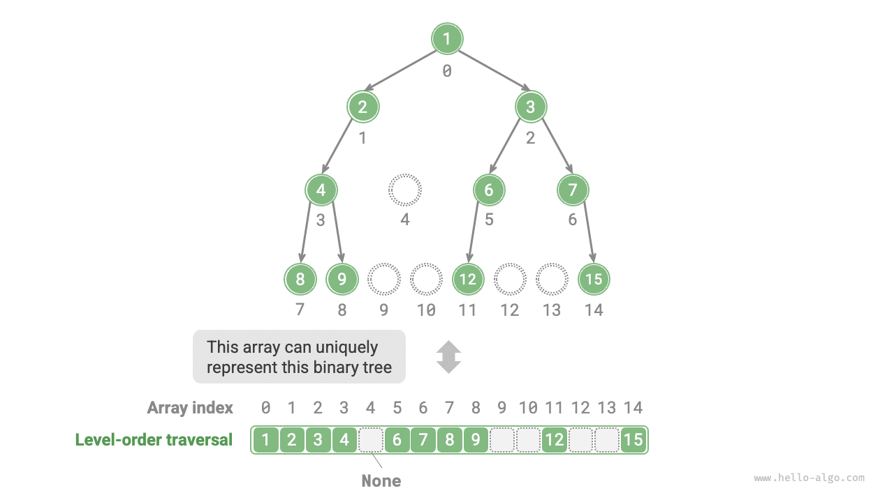
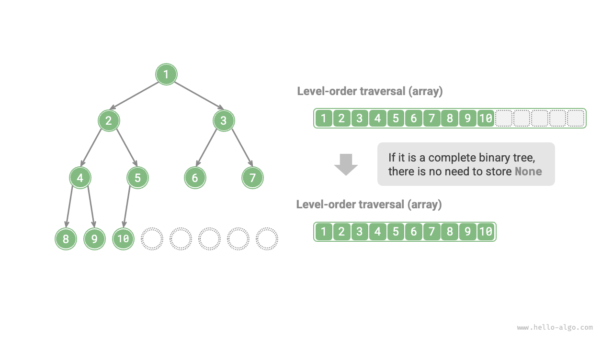

# Bináris fák tömbös ábrázolása

A láncolt listás ábrázolás esetén a bináris fa tárolási egysége a `TreeNode` csomópont, a csomópontokat mutatók kötik össze. Az előző fejezet bevezette a bináris fák alapvető műveleteit a láncolt listás ábrázolás keretein belül.

Felmerül a kérdés: lehet-e tömbben ábrázolni egy bináris fát? A válasz igen.

## Tökéletes bináris fák ábrázolása

Először vizsgáljunk meg egy egyszerű esetet. Adott egy tökéletes bináris fa; az összes csomópontot egy tömbben tároljuk a szintenkénti bejárás sorrendjében, ahol minden csomópont egyedi tömbindexnek felel meg.

A szintenkénti bejárás jellemzői alapján levezethetünk egy "leképezési képletet" a szülő csomópont indexe és a gyermek csomópontok indexei között: **Ha egy csomópont indexe $i$, akkor a bal gyermekének indexe $2i + 1$, a jobb gyermekének indexe pedig $2i + 2$**. Az alábbi ábra a különböző csomópontindexek közötti leképezési kapcsolatokat mutatja be.


**A leképezési képlet szerepe hasonló a láncolt listákban lévő csomópont-hivatkozásokhoz (mutatókhoz)**. A tömbben bármely csomóponthoz megtalálhatjuk a bal (jobb) gyermek csomópontját a leképezési képlet segítségével.

## Tetszőleges bináris fák ábrázolása

A tökéletes bináris fák speciális esetnek számítanak; a bináris fa középső szintjein általában sok `None` érték található. Mivel a szintenkénti bejárás sorozata nem tartalmazza ezeket a `None` értékeket, nem tudjuk kizárólag e sorozat alapján meghatározni a `None` értékek számát és eloszlását. **Ez azt jelenti, hogy több bináris fastruktúra is megfelelhet ugyanannak a szintenkénti bejárási sorozatnak**.

Az alábbi ábrán látható módon egy nem tökéletes bináris fa esetén a fenti tömbös ábrázolási módszer nem működik.


E probléma megoldására **a szintenkénti bejárási sorozatban az összes `None` értéket expliciten feltüntethetjük**. Az alábbi ábrán látható módon e kezelés után a szintenkénti bejárási sorozat egyértelműen meghatározza a bináris fát. A példakód a következő:

=== "Python"

    ```python title=""
    # Bináris fa tömbös ábrázolása
    # None értékkel jelöljük az üres helyeket
    tree = [1, 2, 3, 4, None, 6, 7, 8, 9, None, None, 12, None, None, 15]
    ```

=== "C++"

    ```cpp title=""
    /* Bináris fa tömbös ábrázolása */
    // INT_MAX maximális egész értékkel jelöljük az üres helyeket
    vector<int> tree = {1, 2, 3, 4, INT_MAX, 6, 7, 8, 9, INT_MAX, INT_MAX, 12, INT_MAX, INT_MAX, 15};
    ```

=== "Java"

    ```java title=""
    /* Bináris fa tömbös ábrázolása */
    // Az Integer burkoló osztály lehetővé teszi a null használatát az üres helyek jelölésére
    Integer[] tree = { 1, 2, 3, 4, null, 6, 7, 8, 9, null, null, 12, null, null, 15 };
    ```

=== "C#"

    ```csharp title=""
    /* Bináris fa tömbös ábrázolása */
    // A nullable int (int?) lehetővé teszi a null használatát az üres helyek jelölésére
    int?[] tree = [1, 2, 3, 4, null, 6, 7, 8, 9, null, null, 12, null, null, 15];
    ```

=== "Go"

    ```go title=""
    /* Bináris fa tömbös ábrázolása */
    // any típusú szelet használatával a nil jelölheti az üres helyeket
    tree := []any{1, 2, 3, 4, nil, 6, 7, 8, 9, nil, nil, 12, nil, nil, 15}
    ```

=== "Swift"

    ```swift title=""
    /* Bináris fa tömbös ábrázolása */
    // Az opcionális Int (Int?) lehetővé teszi a nil használatát az üres helyek jelölésére
    let tree: [Int?] = [1, 2, 3, 4, nil, 6, 7, 8, 9, nil, nil, 12, nil, nil, 15]
    ```

=== "JS"

    ```javascript title=""
    /* Bináris fa tömbös ábrázolása */
    // null értékkel jelöljük az üres helyeket
    let tree = [1, 2, 3, 4, null, 6, 7, 8, 9, null, null, 12, null, null, 15];
    ```

=== "TS"

    ```typescript title=""
    /* Bináris fa tömbös ábrázolása */
    // null értékkel jelöljük az üres helyeket
    let tree: (number | null)[] = [1, 2, 3, 4, null, 6, 7, 8, 9, null, null, 12, null, null, 15];
    ```

=== "Dart"

    ```dart title=""
    /* Bináris fa tömbös ábrázolása */
    // A nullable int (int?) lehetővé teszi a null használatát az üres helyek jelölésére
    List<int?> tree = [1, 2, 3, 4, null, 6, 7, 8, 9, null, null, 12, null, null, 15];
    ```

=== "Rust"

    ```rust title=""
    /* Bináris fa tömbös ábrázolása */
    // None értékkel jelöljük az üres helyeket
    let tree = [Some(1), Some(2), Some(3), Some(4), None, Some(6), Some(7), Some(8), Some(9), None, None, Some(12), None, None, Some(15)];
    ```

=== "C"

    ```c title=""
    /* Bináris fa tömbös ábrázolása */
    // A maximális int értékkel jelöljük az üres helyeket, ezért a csomópontok értékei nem lehetnek INT_MAX
    int tree[] = {1, 2, 3, 4, INT_MAX, 6, 7, 8, 9, INT_MAX, INT_MAX, 12, INT_MAX, INT_MAX, 15};
    ```

=== "Kotlin"

    ```kotlin title=""
    /* Bináris fa tömbös ábrázolása */
    // null értékkel jelöljük az üres helyeket
    val tree = arrayOf( 1, 2, 3, 4, null, 6, 7, 8, 9, null, null, 12, null, null, 15 )
    ```

=== "Ruby"

    ```ruby title=""
    ### Bináris fa tömbös ábrázolása ###
    # nil értékkel jelöljük az üres helyeket
    tree = [1, 2, 3, 4, nil, 6, 7, 8, 9, nil, nil, 12, nil, nil, 15]
    ```



Megjegyzendő, hogy **a teljes bináris fák különösen jól alkalmasak tömbös ábrázolásra**. Visszagondolva a teljes bináris fa definíciójára, a `None` értékek csak az alsó szinten és jobb oldalon jelennek meg, **ami azt jelenti, hogy az összes `None` értéknek a szintenkénti bejárási sorozat végén kell szerepelnie**.

Ez azt jelenti, hogy tömbös ábrázolás esetén a teljes bináris fánál lehetséges az összes `None` érték tárolásának kihagyása, ami igen kényelmes. Az alábbi ábra erre mutat példát.



A következő kód tömbös ábrázolás alapján valósít meg egy bináris fát, amely a következő műveleteket foglalja magában:

- Adott csomópont esetén meghatározza annak értékét, bal (jobb) gyermek csomópontját és szülő csomópontját.
- Előrendű, szimmetrikus rendű, utórendű és szintenkénti bejárási sorozatot állít elő.

```src
[file]{array_binary_tree}-[class]{array_binary_tree}-[func]{}
```

## Előnyök és korlátok

A bináris fák tömbös ábrázolásának a következő előnyei vannak:

- A tömbök folytonos memóriaterületen tárolódnak, ami gyorsítótár-barát, lehetővé téve a gyorsabb hozzáférést és bejárást.
- Nem igényel mutatók tárolását, ami tárhelyet takarít meg.
- Véletlenszerű hozzáférést tesz lehetővé a csomópontokhoz.

Ugyanakkor a tömbös ábrázolásnak vannak korlátai is:

- A tömbös tárolás folytonos memóriaterületet igényel, ezért nem alkalmas nagy mennyiségű adatot tartalmazó fák tárolására.
- A csomópontok hozzáadása vagy eltávolítása tömb-beszúrási és törlési műveleteket igényel, amelyek kevésbé hatékonyak.
- Ha a bináris fában sok `None` érték található, a tömbben tárolt csomópontadatok aránya alacsony, ami alacsonyabb tárterület-kihasználtsághoz vezet.
