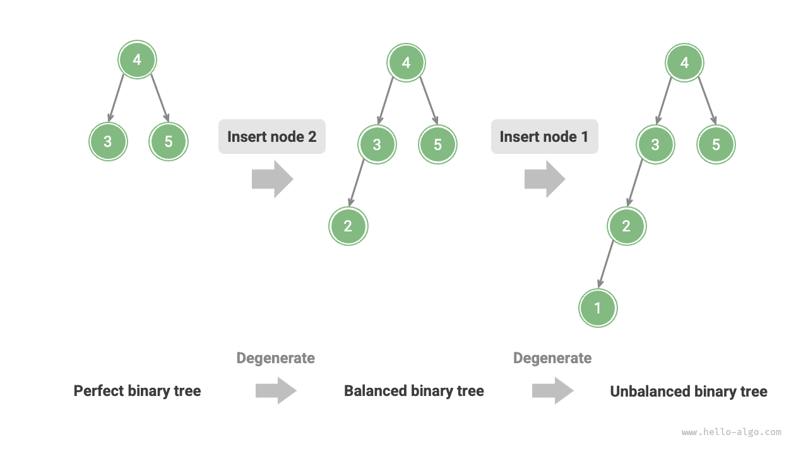
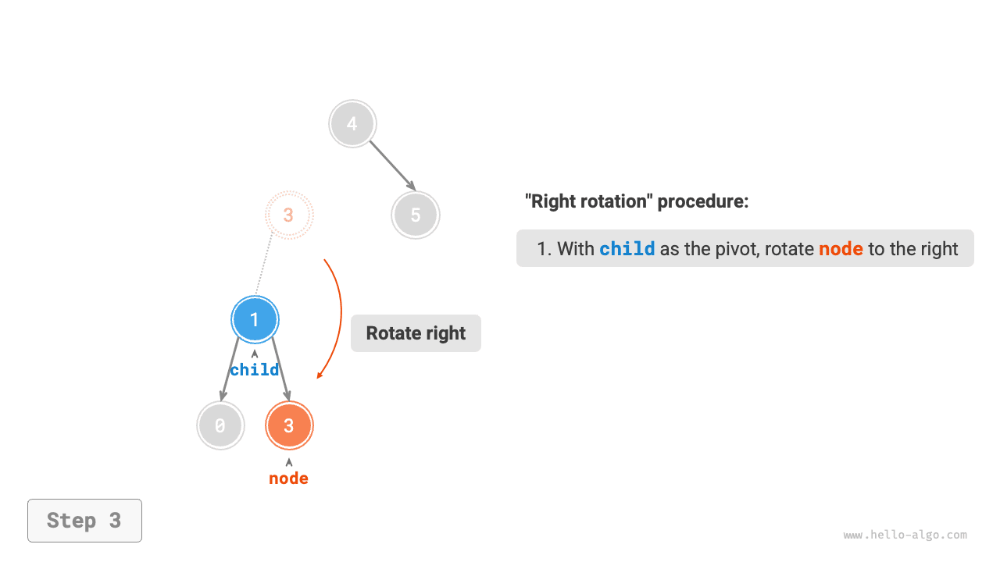
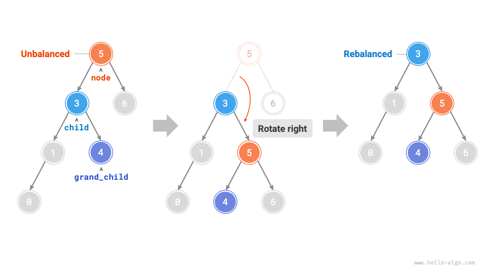
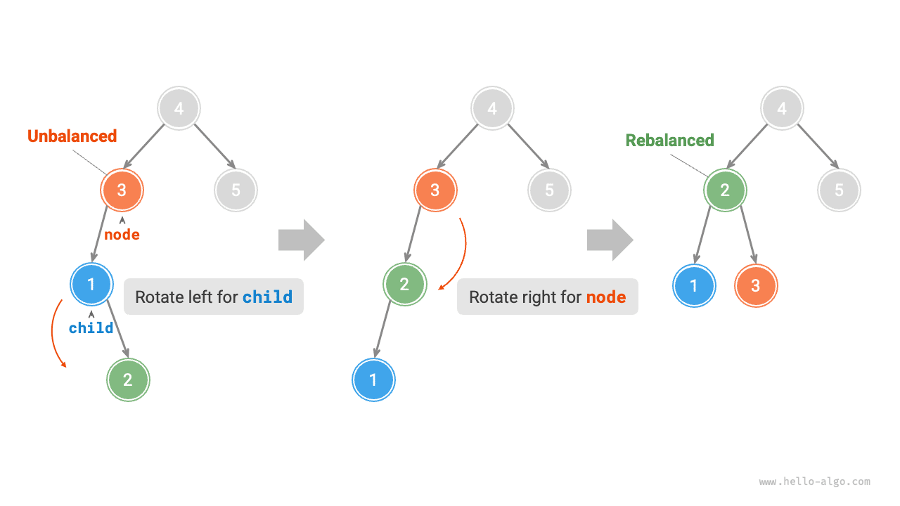

# AVL-fa *

A "Bináris keresőfa" fejezetben megemlítettük, hogy többszörös beszúrási és törlési műveletek után a bináris keresőfa láncolt listává degenerálódhat. Ebben az esetben az összes művelet időbonyolultsága $O(\log n)$-ről $O(n)$-re romlik.

Az alábbi ábrán látható módon két csomópont-törlési művelet után ez a bináris keresőfa láncolt listává degenerálódik.


Például az alábbi ábrán látható tökéletes bináris fában két csomópont beszúrása után a fa erősen balra fog dőlni, és a keresési műveletek időbonyolultsága is romlik.



1962-ben G. M. Adelson-Velsky és E. M. Landis az <u>AVL-fát</u> az "An algorithm for the organization of information" (Információszervezési algoritmus) című cikkükben javasolta. A cikk részletesen leír egy sor olyan műveletet, amelyek biztosítják, hogy csomópontok folyamatos hozzáadása és eltávolítása után az AVL-fa nem degenerálódik, így a különböző műveletek időbonyolultsága $O(\log n)$ szinten marad. Más szóval, olyan esetekben, ahol gyakori a beszúrás, törlés, keresés és módosítás, az AVL-fa mindig képes fenntartani a hatékony adatmanipulálást, ami nagy értékkel bír az alkalmazásokban.

## Az AVL-fák általános terminológiája

Az AVL-fa egyszerre bináris keresőfa és kiegyensúlyozott bináris fa, ezért mindkét fajta bináris fa összes tulajdonságát kielégíti; következésképpen <u>kiegyensúlyozott bináris keresőfa</u>.

### Csomópont magassága

Mivel az AVL-fákhoz kapcsolódó műveletek megkövetelik a csomópontok magasságának lekérdezését, a `height` változót hozzá kell adni a csomópont osztályhoz:

=== "Python"

    ```python title=""
    class TreeNode:
        """AVL-fa csomópontja"""
        def __init__(self, val: int):
            self.val: int = val                 # Csomópont értéke
            self.height: int = 0                # Csomópont magassága
            self.left: TreeNode | None = None   # Bal gyermek hivatkozás
            self.right: TreeNode | None = None  # Jobb gyermek hivatkozás
    ```

=== "C++"

    ```cpp title=""
    /* AVL-fa csomópontja */
    struct TreeNode {
        int val{};          // Csomópont értéke
        int height = 0;     // Csomópont magassága
        TreeNode *left{};   // Bal gyermek
        TreeNode *right{};  // Jobb gyermek
        TreeNode() = default;
        explicit TreeNode(int x) : val(x){}
    };
    ```

=== "Java"

    ```java title=""
    /* AVL-fa csomópontja */
    class TreeNode {
        public int val;        // Csomópont értéke
        public int height;     // Csomópont magassága
        public TreeNode left;  // Bal gyermek
        public TreeNode right; // Jobb gyermek
        public TreeNode(int x) { val = x; }
    }
    ```

=== "C#"

    ```csharp title=""
    /* AVL-fa csomópontja */
    class TreeNode(int? x) {
        public int? val = x;    // Csomópont értéke
        public int height;      // Csomópont magassága
        public TreeNode? left;  // Bal gyermek hivatkozás
        public TreeNode? right; // Jobb gyermek hivatkozás
    }
    ```

=== "Go"

    ```go title=""
    /* AVL-fa csomópontja */
    type TreeNode struct {
        Val    int       // Csomópont értéke
        Height int       // Csomópont magassága
        Left   *TreeNode // Bal gyermek hivatkozás
        Right  *TreeNode // Jobb gyermek hivatkozás
    }
    ```

=== "Swift"

    ```swift title=""
    /* AVL-fa csomópontja */
    class TreeNode {
        var val: Int // Csomópont értéke
        var height: Int // Csomópont magassága
        var left: TreeNode? // Bal gyermek
        var right: TreeNode? // Jobb gyermek

        init(x: Int) {
            val = x
            height = 0
        }
    }
    ```

=== "JS"

    ```javascript title=""
    /* AVL-fa csomópontja */
    class TreeNode {
        val; // Csomópont értéke
        height; // Csomópont magassága
        left; // Bal gyermek mutató
        right; // Jobb gyermek mutató
        constructor(val, left, right, height) {
            this.val = val === undefined ? 0 : val;
            this.height = height === undefined ? 0 : height;
            this.left = left === undefined ? null : left;
            this.right = right === undefined ? null : right;
        }
    }
    ```

=== "TS"

    ```typescript title=""
    /* AVL-fa csomópontja */
    class TreeNode {
        val: number;            // Csomópont értéke
        height: number;         // Csomópont magassága
        left: TreeNode | null;  // Bal gyermek mutató
        right: TreeNode | null; // Jobb gyermek mutató
        constructor(val?: number, height?: number, left?: TreeNode | null, right?: TreeNode | null) {
            this.val = val === undefined ? 0 : val;
            this.height = height === undefined ? 0 : height; 
            this.left = left === undefined ? null : left; 
            this.right = right === undefined ? null : right; 
        }
    }
    ```

=== "Dart"

    ```dart title=""
    /* AVL-fa csomópontja */
    class TreeNode {
      int val;         // Csomópont értéke
      int height;      // Csomópont magassága
      TreeNode? left;  // Bal gyermek
      TreeNode? right; // Jobb gyermek
      TreeNode(this.val, [this.height = 0, this.left, this.right]);
    }
    ```

=== "Rust"

    ```rust title=""
    use std::rc::Rc;
    use std::cell::RefCell;

    /* AVL-fa csomópontja */
    struct TreeNode {
        val: i32,                               // Csomópont értéke
        height: i32,                            // Csomópont magassága
        left: Option<Rc<RefCell<TreeNode>>>,    // Bal gyermek
        right: Option<Rc<RefCell<TreeNode>>>,   // Jobb gyermek
    }

    impl TreeNode {
        /* Konstruktor */
        fn new(val: i32) -> Rc<RefCell<Self>> {
            Rc::new(RefCell::new(Self {
                val,
                height: 0,
                left: None,
                right: None
            }))
        }
    }
    ```

=== "C"

    ```c title=""
    /* AVL-fa csomópontja */
    typedef struct TreeNode {
        int val;
        int height;
        struct TreeNode *left;
        struct TreeNode *right;
    } TreeNode;

    /* Konstruktor */
    TreeNode *newTreeNode(int val) {
        TreeNode *node;

        node = (TreeNode *)malloc(sizeof(TreeNode));
        node->val = val;
        node->height = 0;
        node->left = NULL;
        node->right = NULL;
        return node;
    }
    ```

=== "Kotlin"

    ```kotlin title=""
    /* AVL-fa csomópontja */
    class TreeNode(val _val: Int) {  // Csomópont értéke
        val height: Int = 0          // Csomópont magassága
        val left: TreeNode? = null   // Bal gyermek
        val right: TreeNode? = null  // Jobb gyermek
    }
    ```

=== "Ruby"

    ```ruby title=""
    ### AVL-fa csomópont osztálya ###
    class TreeNode
      attr_accessor :val    # Csomópont értéke
      attr_accessor :height # Csomópont magassága
      attr_accessor :left   # Bal gyermek hivatkozás
      attr_accessor :right  # Jobb gyermek hivatkozás

      def initialize(val)
        @val = val
        @height = 0
      end
    end
    ```

A "csomópont magassága" az adott csomóponttól a legtávolabbi levél csomópontig megtett távolságot jelenti, azaz az átlépett "élek" számát. Fontos megjegyezni, hogy a levél csomópontok magassága $0$, a null csomópontok magassága pedig $-1$. Létrehozunk két segédfüggvényt a csomópont magasságának lekérdezéséhez és frissítéséhez:

```src
[file]{avl_tree}-[class]{avl_tree}-[func]{update_height}
```

### Csomópont egyensúlyi tényezője

Egy csomópont <u>egyensúlyi tényezője</u> a csomópont bal részfájának magassága mínusz a jobb részfájának magassága; a null csomópont egyensúlyi tényezője $0$ értékre van definiálva. A csomópont egyensúlyi tényezőjét lekérdező függvényt szintén becsomagoljuk a kényelmes felhasználás érdekében:

```src
[file]{avl_tree}-[class]{avl_tree}-[func]{balance_factor}
```

!!! tip

    Legyen az egyensúlyi tényező $f$; ekkor az AVL-fa bármely csomópontjának egyensúlyi tényezője kielégíti a $-1 \le f \le 1$ feltételt.

## Forgatások az AVL-fákban

Az AVL-fák jellemzője a "forgatás" művelete, amely képes helyreállítani az egyensúlyt a kiegyensúlyozatlan csomópontoknál anélkül, hogy érintené a bináris fa szimmetrikus rendű bejárási sorozatát. Más szóval, **a forgatási műveletek egyszerre képesek fenntartani a "bináris keresőfa" tulajdonságát és visszaállítani a fát "kiegyensúlyozott bináris fává"**.

Azokat a csomópontokat, amelyek egyensúlyi tényezőjének abszolút értéke $> 1$, "kiegyensúlyozatlan csomópontoknak" nevezzük. A kiegyensúlyozatlanság jellegétől függően a forgatási műveletek négy típusra oszthatók: jobbra forgatás, balra forgatás, balra majd jobbra forgatás, és jobbra majd balra forgatás. Az alábbiakban részletesen leírjuk ezeket a forgatási műveleteket.

### Jobbra forgatás

Az alábbi ábrán látható módon, a csomópont alatt lévő szám az egyensúlyi tényező. Alulról felfelé haladva a bináris fa első kiegyensúlyozatlan csomópontja a "3. csomópont". Erre a kiegyensúlyozatlan csomópontra mint gyökérre fókuszálunk, a csomópontot `node`-nak, bal gyermekét `child`-nak nevezzük, és "jobbra forgatás" műveletet hajtunk végre. A jobbra forgatás befejezése után a részfa visszanyeri egyensúlyát, és megőrzi a bináris keresőfa tulajdonságait.

=== "<1>"
    

=== "<2>"
    

=== "<3>"
    

=== "<4>"
    

Az alábbi ábrán látható módon, ha a `child` csomópontnak van jobb gyermeke (amelyet `grand_child`-nak jelölünk), a jobbra forgatáshoz egy lépést kell hozzáadni: a `grand_child`-ot a `node` bal gyermekeként kell beállítani.



A "jobbra forgatás" szemléletes elnevezés; a gyakorlatban a csomópont mutatóinak módosításával valósítják meg, ahogy a következő kódban látható:

```src
[file]{avl_tree}-[class]{avl_tree}-[func]{right_rotate}
```

### Balra forgatás

Megfelelően, ha a fenti kiegyensúlyozatlan bináris fa "tükörképét" tekintjük, az alábbi ábrán látható "balra forgatás" műveletet kell elvégezni.


Hasonlóan, az alábbi ábrán látható módon, ha a `child` csomópontnak van bal gyermeke (amelyet `grand_child`-nak jelölünk), a balra forgatáshoz egy lépést kell hozzáadni: a `grand_child`-ot a `node` jobb gyermekeként kell beállítani.


Megfigyelhető, hogy **a jobbra és balra forgatási műveletek tükörszimmetrikusak logikailag, és az általuk megoldott két kiegyensúlyozatlansági eset szintén szimmetrikus**. A szimmetria alapján csak annyi szükséges, hogy a jobbra forgatás megvalósítási kódjában az összes `left`-et `right`-ra, az összes `right`-ot `left`-re cseréljük, így megkapjuk a balra forgatás megvalósítási kódját:

```src
[file]{avl_tree}-[class]{avl_tree}-[func]{left_rotate}
```

### Balra majd jobbra forgatás

Az alábbi ábra 3-as kiegyensúlyozatlan csomópontja esetén sem a balra forgatás, sem a jobbra forgatás önmagában nem képes visszaállítani a részfa egyensúlyát. Ebben az esetben először "balra forgatást" kell végezni a `child`-on, majd "jobbra forgatást" a `node`-on.



### Jobbra majd balra forgatás

Az alábbi ábrán látható módon, a fenti kiegyensúlyozatlan bináris fa tükörképe esetén először "jobbra forgatást" kell végezni a `child`-on, majd "balra forgatást" a `node`-on.


### A forgatás megválasztása

Az alábbi ábrán látható négy kiegyensúlyozatlansági eset egy-egy megfelel a fenti eseteknek, amelyek rendre jobbra forgatást, balra majd jobbra forgatást, jobbra majd balra forgatást és balra forgatást igényelnek.


Az alábbi táblázatban látható módon meghatározzuk, melyik esethez tartozik a kiegyensúlyozatlan csomópont, ha megvizsgáljuk a kiegyensúlyozatlan csomópont egyensúlyi tényezőjének és a magasabb oldalon lévő gyermek csomópont egyensúlyi tényezőjének előjelét.

<p align="center"> Táblázat <id> &nbsp; A négy forgatási eset megválasztásának feltételei </p>

| A kiegyensúlyozatlan csomópont egyensúlyi tényezője | A gyermek csomópont egyensúlyi tényezője | Alkalmazandó forgatási módszer    |
| ---------------------------------------------------- | ---------------------------------------- | --------------------------------- |
| $> 1$ (balra dőlő fa)                               | $\geq 0$                                 | Jobbra forgatás                   |
| $> 1$ (balra dőlő fa)                               | $<0$                                     | Balra majd jobbra forgatás        |
| $< -1$ (jobbra dőlő fa)                             | $\leq 0$                                 | Balra forgatás                    |
| $< -1$ (jobbra dőlő fa)                             | $>0$                                     | Jobbra majd balra forgatás        |

A könnyebb felhasználás érdekében a forgatási műveleteket egy függvénybe csomagoljuk. **Ezzel a függvénnyel különböző kiegyensúlyozatlansági helyzetekhez végezhetünk forgatásokat, helyreállítva az egyensúlyt a kiegyensúlyozatlan csomópontoknál**. A kód a következő:

```src
[file]{avl_tree}-[class]{avl_tree}-[func]{rotate}
```

## Az AVL-fák általánosan végzett műveletei

### Csomópont-beszúrás

Az AVL-fákban végzett csomópont-beszúrás elve hasonló a bináris keresőfákban végzett csomópont-beszúráshoz. Az egyetlen különbség az, hogy az AVL-fában csomópont-beszúrás után az adott csomóponttól a gyökérig vezető úton kiegyensúlyozatlan csomópontok sorozata jelenhet meg. Ezért **ennél a csomópontnál kell elkezdenünk, és alulról felfelé haladva kell forgatási műveleteket végrehajtani, helyreállítva az egyensúlyt az összes kiegyensúlyozatlan csomópontnál**. A kód a következő:

```src
[file]{avl_tree}-[class]{avl_tree}-[func]{insert_helper}
```

### Csomópont-törlés

Hasonlóan, a bináris keresőfa csomópont-törlési módszerére alapozva alulról felfelé haladva kell forgatási műveleteket végrehajtani az összes kiegyensúlyozatlan csomópont egyensúlyának helyreállítása érdekében. A kód a következő:

```src
[file]{avl_tree}-[class]{avl_tree}-[func]{remove_helper}
```

### Csomópont-keresés

Az AVL-fákban végzett csomópont-keresés megegyezik a bináris keresőfákban végzett csomópont-kereséssel, ezért ezt itt nem részletezzük.

## Az AVL-fák tipikus alkalmazásai

- Nagy méretű adatok rendszerezéséhez és tárolásához, olyan esetekben alkalmas, ahol a keresés magas, a beszúrás és törlés pedig alacsony gyakorisággal történik.
- Adatbázisokban indexrendszerek építésére használják.
- A piros-fekete fák szintén elterjedt kiegyensúlyozott bináris keresőfák. Az AVL-fákhoz képest a piros-fekete fáknak lazább egyensúlyi feltételei vannak, csomópont-beszúráshoz és -törléshez kevesebb forgatási műveletet igényelnek, és átlagosan hatékonyabbak a csomópontok hozzáadásában és törlésében.
