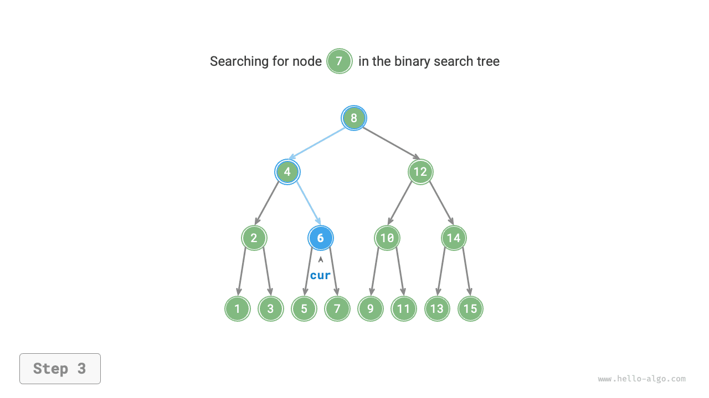
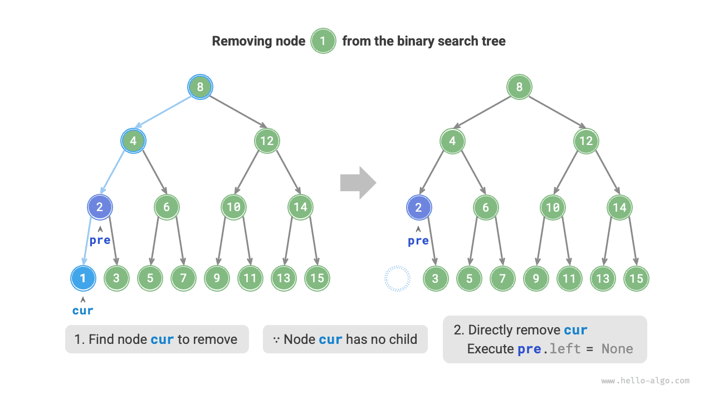
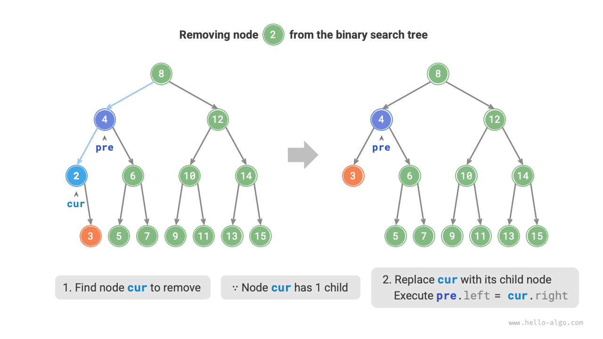

# Bináris keresőfa

Az alábbi ábrán látható módon, a <u>bináris keresőfa</u> (BST) a következő feltételeket teljesíti.

1. A gyökér csomópontra nézve a bal részfában lévő összes csomópont értéke $<$ a gyökér csomópont értéke $<$ a jobb részfában lévő összes csomópont értéke.
2. Bármely csomópont bal és jobb részfája szintén bináris keresőfa, azaz az `1.` feltételt is teljesíti.


## Műveletek bináris keresőfán

A bináris keresőfát egy `BinarySearchTree` osztályba csomagoljuk, és deklarálunk egy `root` tagváltozót, amely a fa gyökér csomópontjára mutat.

### Csomópont keresése

Adott `num` célérték esetén a bináris keresőfa tulajdonságait felhasználva kereshetünk. Az alábbi ábrán látható módon deklarálunk egy `cur` csomópontot, és a bináris fa gyökér csomópontjától (`root`) indulva ciklusban összehasonlítjuk a `cur.val` csomópontértéket `num`-mal.

- Ha `cur.val < num`, akkor a célcsomópont `cur` jobb részfájában van, ezért `cur = cur.right` lépést hajtunk végre.
- Ha `cur.val > num`, akkor a célcsomópont `cur` bal részfájában van, ezért `cur = cur.left` lépést hajtunk végre.
- Ha `cur.val = num`, akkor megtaláltuk a célcsomópontot, kilépünk a ciklusból, és visszaadjuk a csomópontot.

=== "<1>"
    

=== "<2>"
    

=== "<3>"
    

=== "<4>"
    

A bináris keresőfában végzett keresési művelet ugyanazon az elven alapul, mint a bináris keresési algoritmus: minden körben az esetek felét zárja ki. A ciklus iterációinak száma legfeljebb a bináris fa magasságával egyenlő. Ha a bináris fa kiegyensúlyozott, $O(\log n)$ időt vesz igénybe. A példakód a következő:

```src
[file]{binary_search_tree}-[class]{binary_search_tree}-[func]{search}
```

### Csomópont beszúrása

Adott `num` elem beszúrása esetén a bináris keresőfa "bal részfa < gyökér csomópont < jobb részfa" tulajdonságának fenntartása érdekében a beszúrási folyamat az alábbi ábrán látható módon zajlik.

1. **A beszúrási pozíció megkeresése**: A keresési művelethez hasonlóan a gyökér csomóponttól indulva lefelé haladunk ciklusban, az aktuális csomópontérték és `num` közötti méretviszonyt figyelembe véve, amíg el nem érjük a levél csomópontot (azaz `None`-hoz jutunk), majd kilépünk a ciklusból.
2. **A csomópont beszúrása arra a pozícióra**: Inicializáljuk a `num` csomópontot, és elhelyezzük a `None` pozícióra.


A kódmegvalósításban figyelembe kell venni a következő két pontot:

- A bináris keresőfa nem engedélyez duplikált csomópontokat; egyébként megsértené a definícióját. Ezért ha a beszúrandó csomópont már létezik a fában, a beszúrás nem kerül végrehajtásra, és a függvény közvetlenül visszatér.
- A csomópont-beszúrás megvalósításához a `pre` csomópontot kell használni az előző ciklus-iteráció csomópontjának tárolásához. Így amikor `None`-hoz jutunk, megkaphatjuk a szülő csomópontját, ezáltal elvégezhetjük a csomópont-beszúrási műveletet.

```src
[file]{binary_search_tree}-[class]{binary_search_tree}-[func]{insert}
```

A csomópont kereséséhez hasonlóan a csomópont-beszúrás $O(\log n)$ időt igényel.

### Csomópont törlése

Először megkeressük a célcsomópontot a bináris fában, majd töröljük. A csomópont-beszúráshoz hasonlóan biztosítanunk kell, hogy a törlési művelet befejezése után a bináris keresőfa "bal részfa $<$ gyökér csomópont $<$ jobb részfa" tulajdonsága megmaradjon. Ezért a célcsomópont gyermek csomópontjainak számától függően 0, 1 és 2 esetekre osztjuk fel, és elvégezzük a megfelelő csomópont-törlési műveleteket.

Az alábbi ábrán látható módon, ha a törlendő csomópont fokszáma $0$, az azt jelenti, hogy a csomópont levél csomópont, és közvetlenül törölhető.



Az alábbi ábrán látható módon, ha a törlendő csomópont fokszáma $1$, elegendő a törlendő csomópontot gyermek csomópontjával helyettesíteni.



Ha a törlendő csomópont fokszáma $2$, nem törölhetjük közvetlenül; ehelyett egy csomóponttal kell helyettesíteni. A bináris keresőfa "bal részfa $<$ gyökér csomópont $<$ jobb részfa" tulajdonságának fenntartásához **ez a csomópont lehet a jobb részfa legkisebb csomópontja vagy a bal részfa legnagyobb csomópontja**.

Feltéve, hogy a jobb részfa legkisebb csomópontját választjuk (a szimmetrikus rendű bejárás következő csomópontja), a törlési folyamat az alábbi ábrán látható módon zajlik.

1. Megkeressük a törlendő csomópont "szimmetrikus rendű bejárási sorozatban" következő csomópontját, amelyet `tmp`-vel jelölünk.
2. Felülírjuk a törlendő csomópont értékét `tmp` értékével, majd rekurzívan töröljük a `tmp` csomópontot a fában.

=== "<1>"
    

=== "<2>"
    

=== "<3>"
    

=== "<4>"
    

A csomópont-törlési művelet szintén $O(\log n)$ időt igényel, ahol a törlendő csomópont megkeresése $O(\log n)$ időt, a szimmetrikus rendű utód csomópont megszerzése pedig $O(\log n)$ időt vesz igénybe. A példakód a következő:

```src
[file]{binary_search_tree}-[class]{binary_search_tree}-[func]{remove}
```

### A szimmetrikus rendű bejárás rendezett

Az alábbi ábrán látható módon a bináris fa szimmetrikus rendű bejárása a "bal $\rightarrow$ gyökér $\rightarrow$ jobb" bejárási sorrendet követi, míg a bináris keresőfa kielégíti a "bal gyermek csomópont $<$ gyökér csomópont $<$ jobb gyermek csomópont" méretviszonyt.

Ez azt jelenti, hogy bináris keresőfán szimmetrikus rendű bejárást végezve mindig a következő legkisebb csomópontot járjuk be először, ami egy fontos tulajdonságot eredményez: **A bináris keresőfa szimmetrikus rendű bejárási sorozata növekvő sorrendű**.

A szimmetrikus rendű bejárás növekvő sorrendjének tulajdonságát felhasználva csupán $O(n)$ idővel tudunk rendezett adatokat kinyerni a bináris keresőfából, anélkül, hogy szükség lenne további rendezési műveletekre, ami igen hatékony.


## Bináris keresőfák hatékonysága

Adott adathalmaz esetén megfontoljuk, hogy tömbben vagy bináris keresőfában tároljuk-e. Az alábbi táblázatból látható, hogy a bináris keresőfában minden művelet logaritmikus időbonyolultsággal rendelkezik, ami stabil és hatékony teljesítményt nyújt. A tömbök csak nagy gyakorisággal végzett hozzáadási és alacsony gyakorisággal végzett keresési és törlési műveletek esetén hatékonyabbak a bináris keresőfáknál.

<p align="center"> Táblázat <id> &nbsp; Tömbök és keresőfák hatékonyságának összehasonlítása </p>

|                   | Rendezetlen tömb | Bináris keresőfa |
| ----------------- | ---------------- | ---------------- |
| Elem keresése     | $O(n)$           | $O(\log n)$      |
| Elem beszúrása    | $O(1)$           | $O(\log n)$      |
| Elem törlése      | $O(n)$           | $O(\log n)$      |

Ideális esetben a bináris keresőfa "kiegyensúlyozott", így bármely csomópont megtalálható $\log n$ ciklus-iteráción belül.

Ha azonban folyamatosan szúrunk be és törlünk csomópontokat a bináris keresőfában, az az alábbi ábrán látható módon láncolt listává degenerálódhat, ahol a különböző műveletek időbonyolultsága is $O(n)$-re romlik.


## Bináris keresőfák általánosan alkalmazott területei

- Többszintű indexek létrehozására használják rendszerekben hatékony keresési, beszúrási és törlési műveletek megvalósítása érdekében.
- Egyes keresési algoritmusok alapjául szolgáló adatszerkezetként funkcionál.
- Adatfolyamok tárolására használják azok rendezett állapotának fenntartása érdekében.
