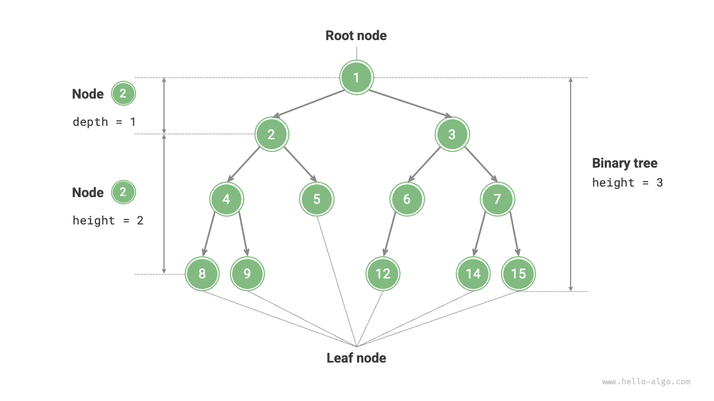

# Bináris fa

A <u>bináris fa</u> egy nemlineáris adatszerkezet, amely az "ősök" és "leszármazottak" közötti levezetési kapcsolatot ábrázolja, és megtestesíti az "egy kettőre bomlik" osztd-meg-és-uralkodj logikát. A láncolt listához hasonlóan a bináris fa alapegysége a csomópont, és minden csomópont tartalmaz egy értéket, egy hivatkozást a bal gyermek csomópontra és egy hivatkozást a jobb gyermek csomópontra.

=== "Python"

    ```python title=""
    class TreeNode:
        """Bináris fa csomópontja"""
        def __init__(self, val: int):
            self.val: int = val                # Csomópont értéke
            self.left: TreeNode | None = None  # Hivatkozás a bal gyermek csomópontra
            self.right: TreeNode | None = None # Hivatkozás a jobb gyermek csomópontra
    ```

=== "C++"

    ```cpp title=""
    /* Bináris fa csomópontja */
    struct TreeNode {
        int val;          // Csomópont értéke
        TreeNode *left;   // Mutató a bal gyermek csomópontra
        TreeNode *right;  // Mutató a jobb gyermek csomópontra
        TreeNode(int x) : val(x), left(nullptr), right(nullptr) {}
    };
    ```

=== "Java"

    ```java title=""
    /* Bináris fa csomópontja */
    class TreeNode {
        int val;         // Csomópont értéke
        TreeNode left;   // Hivatkozás a bal gyermek csomópontra
        TreeNode right;  // Hivatkozás a jobb gyermek csomópontra
        TreeNode(int x) { val = x; }
    }
    ```

=== "C#"

    ```csharp title=""
    /* Bináris fa csomópontja */
    class TreeNode(int? x) {
        public int? val = x;    // Csomópont értéke
        public TreeNode? left;  // Hivatkozás a bal gyermek csomópontra
        public TreeNode? right; // Hivatkozás a jobb gyermek csomópontra
    }
    ```

=== "Go"

    ```go title=""
    /* Bináris fa csomópontja */
    type TreeNode struct {
        Val   int
        Left  *TreeNode
        Right *TreeNode
    }
    /* Konstruktor */
    func NewTreeNode(v int) *TreeNode {
        return &TreeNode{
            Left:  nil, // Mutató a bal gyermek csomópontra
            Right: nil, // Mutató a jobb gyermek csomópontra
            Val:   v,   // Csomópont értéke
        }
    }
    ```

=== "Swift"

    ```swift title=""
    /* Bináris fa csomópontja */
    class TreeNode {
        var val: Int // Csomópont értéke
        var left: TreeNode? // Hivatkozás a bal gyermek csomópontra
        var right: TreeNode? // Hivatkozás a jobb gyermek csomópontra

        init(x: Int) {
            val = x
        }
    }
    ```

=== "JS"

    ```javascript title=""
    /* Bináris fa csomópontja */
    class TreeNode {
        val; // Csomópont értéke
        left; // Mutató a bal gyermek csomópontra
        right; // Mutató a jobb gyermek csomópontra
        constructor(val, left, right) {
            this.val = val === undefined ? 0 : val;
            this.left = left === undefined ? null : left;
            this.right = right === undefined ? null : right;
        }
    }
    ```

=== "TS"

    ```typescript title=""
    /* Bináris fa csomópontja */
    class TreeNode {
        val: number;
        left: TreeNode | null;
        right: TreeNode | null;

        constructor(val?: number, left?: TreeNode | null, right?: TreeNode | null) {
            this.val = val === undefined ? 0 : val; // Csomópont értéke
            this.left = left === undefined ? null : left; // Hivatkozás a bal gyermek csomópontra
            this.right = right === undefined ? null : right; // Hivatkozás a jobb gyermek csomópontra
        }
    }
    ```

=== "Dart"

    ```dart title=""
    /* Bináris fa csomópontja */
    class TreeNode {
      int val;         // Csomópont értéke
      TreeNode? left;  // Hivatkozás a bal gyermek csomópontra
      TreeNode? right; // Hivatkozás a jobb gyermek csomópontra
      TreeNode(this.val, [this.left, this.right]);
    }
    ```

=== "Rust"

    ```rust title=""
    use std::rc::Rc;
    use std::cell::RefCell;

    /* Bináris fa csomópontja */
    struct TreeNode {
        val: i32,                               // Csomópont értéke
        left: Option<Rc<RefCell<TreeNode>>>,    // Hivatkozás a bal gyermek csomópontra
        right: Option<Rc<RefCell<TreeNode>>>,   // Hivatkozás a jobb gyermek csomópontra
    }

    impl TreeNode {
        /* Konstruktor */
        fn new(val: i32) -> Rc<RefCell<Self>> {
            Rc::new(RefCell::new(Self {
                val,
                left: None,
                right: None
            }))
        }
    }
    ```

=== "C"

    ```c title=""
    /* Bináris fa csomópontja */
    typedef struct TreeNode {
        int val;                // Csomópont értéke
        int height;             // Csomópont magassága
        struct TreeNode *left;  // Mutató a bal gyermek csomópontra
        struct TreeNode *right; // Mutató a jobb gyermek csomópontra
    } TreeNode;

    /* Konstruktor */
    TreeNode *newTreeNode(int val) {
        TreeNode *node;

        node = (TreeNode *)malloc(sizeof(TreeNode));
        node->val = val;
        node->height = 0;
        node->left = NULL;
        node->right = NULL;
        return node;
    }
    ```

=== "Kotlin"

    ```kotlin title=""
    /* Bináris fa csomópontja */
    class TreeNode(val _val: Int) {  // Csomópont értéke
        val left: TreeNode? = null   // Hivatkozás a bal gyermek csomópontra
        val right: TreeNode? = null  // Hivatkozás a jobb gyermek csomópontra
    }
    ```

=== "Ruby"

    ```ruby title=""
    ### Bináris fa csomópont osztálya ###
    class TreeNode
      attr_accessor :val    # Csomópont értéke
      attr_accessor :left   # Hivatkozás a bal gyermek csomópontra
      attr_accessor :right  # Hivatkozás a jobb gyermek csomópontra

      def initialize(val)
        @val = val
      end
    end
    ```

Minden csomópontnak két hivatkozása (mutatója) van, amelyek rendre a <u>bal gyermek csomópontra</u> és a <u>jobb gyermek csomópontra</u> mutatnak. Ezt a csomópontot nevezzük e két gyermek csomópont <u>szülő csomópontjának</u>. Ha adott egy bináris fa csomópontja, akkor az e csomópont bal gyermeke és az alatta lévő összes csomópont által alkotott fát az adott csomópont <u>bal részfájának</u> nevezzük. Hasonlóan definiálható a <u>jobb részfa</u>.

**A bináris fában a levél csomópontok kivételével minden más csomópont tartalmaz gyermek csomópontokat és nem üres részfákat.** Az alábbi ábrán látható módon, ha a "2. csomópontot" szülő csomópontnak tekintjük, akkor bal és jobb gyermekei rendre a "4. csomópont" és az "5. csomópont". A bal részfát a "4. csomópont" és az alatta lévő összes csomópont alkotja, míg a jobb részfát az "5. csomópont" és az alatta lévő összes csomópont alkotja.


## A bináris fák általános terminológiája

A bináris fák általánosan használt terminológiája az alábbi ábrán látható.

- <u>Gyökér csomópont</u>: A bináris fa legfelső szintjén lévő csomópont, amelynek nincs szülő csomópontja.
- <u>Levél csomópont</u>: Az a csomópont, amelynek nincsenek gyermek csomópontjai, mindkét mutatója `None` értékre mutat.
- <u>Él</u>: Két csomópontot összekötő vonalszakasz, amely a csomópontok közötti hivatkozást (mutatót) ábrázolja.
- Egy csomópont <u>szintje</u>: Felülről lefelé növekszik, a gyökér csomópont az 1. szinten van.
- Egy csomópont <u>fokszáma</u>: A csomópontnak megfelelő gyermek csomópontok száma. Bináris fában a fokszám 0, 1 vagy 2 lehet.
- A bináris fa <u>magassága</u>: Az élek száma a gyökér csomóponttól a legtávolabbi levél csomópontig.
- Egy csomópont <u>mélysége</u>: Az élek száma a gyökér csomóponttól az adott csomópontig.
- Egy csomópont <u>magassága</u>: Az élek száma a legtávolabbi levél csomóponttól az adott csomópontig.



!!! tip

    Felhívjuk a figyelmet, hogy a "magasságot" és a "mélységet" általában "a bejárt élek számával" definiáljuk, azonban egyes feladatok vagy tankönyvek "a bejárt csomópontok számával" definiálhatják őket. Ebben az esetben mind a magasságot, mind a mélységet 1-gyel kell növelni.

## A bináris fák alapműveletei

### Bináris fa inicializálása

A láncolt listához hasonlóan a bináris fa inicializálása során először a csomópontokat hozzuk létre, majd meghatározzuk köztük a hivatkozásokat (mutatókat).

=== "Python"

    ```python title="binary_tree.py"
    # Bináris fa inicializálása
    # Csomópontok inicializálása
    n1 = TreeNode(val=1)
    n2 = TreeNode(val=2)
    n3 = TreeNode(val=3)
    n4 = TreeNode(val=4)
    n5 = TreeNode(val=5)
    # Csomópontok közötti hivatkozások (mutatók) összekötése
    n1.left = n2
    n1.right = n3
    n2.left = n4
    n2.right = n5
    ```

=== "C++"

    ```cpp title="binary_tree.cpp"
    /* Bináris fa inicializálása */
    // Csomópontok inicializálása
    TreeNode* n1 = new TreeNode(1);
    TreeNode* n2 = new TreeNode(2);
    TreeNode* n3 = new TreeNode(3);
    TreeNode* n4 = new TreeNode(4);
    TreeNode* n5 = new TreeNode(5);
    // Csomópontok közötti hivatkozások (mutatók) összekötése
    n1->left = n2;
    n1->right = n3;
    n2->left = n4;
    n2->right = n5;
    ```

=== "Java"

    ```java title="binary_tree.java"
    // Csomópontok inicializálása
    TreeNode n1 = new TreeNode(1);
    TreeNode n2 = new TreeNode(2);
    TreeNode n3 = new TreeNode(3);
    TreeNode n4 = new TreeNode(4);
    TreeNode n5 = new TreeNode(5);
    // Csomópontok közötti hivatkozások (mutatók) összekötése
    n1.left = n2;
    n1.right = n3;
    n2.left = n4;
    n2.right = n5;
    ```

=== "C#"

    ```csharp title="binary_tree.cs"
    /* Bináris fa inicializálása */
    // Csomópontok inicializálása
    TreeNode n1 = new(1);
    TreeNode n2 = new(2);
    TreeNode n3 = new(3);
    TreeNode n4 = new(4);
    TreeNode n5 = new(5);
    // Csomópontok közötti hivatkozások (mutatók) összekötése
    n1.left = n2;
    n1.right = n3;
    n2.left = n4;
    n2.right = n5;
    ```

=== "Go"

    ```go title="binary_tree.go"
    /* Bináris fa inicializálása */
    // Csomópontok inicializálása
    n1 := NewTreeNode(1)
    n2 := NewTreeNode(2)
    n3 := NewTreeNode(3)
    n4 := NewTreeNode(4)
    n5 := NewTreeNode(5)
    // Csomópontok közötti hivatkozások (mutatók) összekötése
    n1.Left = n2
    n1.Right = n3
    n2.Left = n4
    n2.Right = n5
    ```

=== "Swift"

    ```swift title="binary_tree.swift"
    // Csomópontok inicializálása
    let n1 = TreeNode(x: 1)
    let n2 = TreeNode(x: 2)
    let n3 = TreeNode(x: 3)
    let n4 = TreeNode(x: 4)
    let n5 = TreeNode(x: 5)
    // Csomópontok közötti hivatkozások (mutatók) összekötése
    n1.left = n2
    n1.right = n3
    n2.left = n4
    n2.right = n5
    ```

=== "JS"

    ```javascript title="binary_tree.js"
    /* Bináris fa inicializálása */
    // Csomópontok inicializálása
    let n1 = new TreeNode(1),
        n2 = new TreeNode(2),
        n3 = new TreeNode(3),
        n4 = new TreeNode(4),
        n5 = new TreeNode(5);
    // Csomópontok közötti hivatkozások (mutatók) összekötése
    n1.left = n2;
    n1.right = n3;
    n2.left = n4;
    n2.right = n5;
    ```

=== "TS"

    ```typescript title="binary_tree.ts"
    /* Bináris fa inicializálása */
    // Csomópontok inicializálása
    let n1 = new TreeNode(1),
        n2 = new TreeNode(2),
        n3 = new TreeNode(3),
        n4 = new TreeNode(4),
        n5 = new TreeNode(5);
    // Csomópontok közötti hivatkozások (mutatók) összekötése
    n1.left = n2;
    n1.right = n3;
    n2.left = n4;
    n2.right = n5;
    ```

=== "Dart"

    ```dart title="binary_tree.dart"
    /* Bináris fa inicializálása */
    // Csomópontok inicializálása
    TreeNode n1 = new TreeNode(1);
    TreeNode n2 = new TreeNode(2);
    TreeNode n3 = new TreeNode(3);
    TreeNode n4 = new TreeNode(4);
    TreeNode n5 = new TreeNode(5);
    // Csomópontok közötti hivatkozások (mutatók) összekötése
    n1.left = n2;
    n1.right = n3;
    n2.left = n4;
    n2.right = n5;
    ```

=== "Rust"

    ```rust title="binary_tree.rs"
    // Csomópontok inicializálása
    let n1 = TreeNode::new(1);
    let n2 = TreeNode::new(2);
    let n3 = TreeNode::new(3);
    let n4 = TreeNode::new(4);
    let n5 = TreeNode::new(5);
    // Csomópontok közötti hivatkozások (mutatók) összekötése
    n1.borrow_mut().left = Some(n2.clone());
    n1.borrow_mut().right = Some(n3);
    n2.borrow_mut().left = Some(n4);
    n2.borrow_mut().right = Some(n5);
    ```

=== "C"

    ```c title="binary_tree.c"
    /* Bináris fa inicializálása */
    // Csomópontok inicializálása
    TreeNode *n1 = newTreeNode(1);
    TreeNode *n2 = newTreeNode(2);
    TreeNode *n3 = newTreeNode(3);
    TreeNode *n4 = newTreeNode(4);
    TreeNode *n5 = newTreeNode(5);
    // Csomópontok közötti hivatkozások (mutatók) összekötése
    n1->left = n2;
    n1->right = n3;
    n2->left = n4;
    n2->right = n5;
    ```

=== "Kotlin"

    ```kotlin title="binary_tree.kt"
    // Csomópontok inicializálása
    val n1 = TreeNode(1)
    val n2 = TreeNode(2)
    val n3 = TreeNode(3)
    val n4 = TreeNode(4)
    val n5 = TreeNode(5)
    // Csomópontok közötti hivatkozások (mutatók) összekötése
    n1.left = n2
    n1.right = n3
    n2.left = n4
    n2.right = n5
    ```

=== "Ruby"

    ```ruby title="binary_tree.rb"
    # Bináris fa inicializálása
    # Csomópontok inicializálása
    n1 = TreeNode.new(1)
    n2 = TreeNode.new(2)
    n3 = TreeNode.new(3)
    n4 = TreeNode.new(4)
    n5 = TreeNode.new(5)
    # Csomópontok közötti hivatkozások (mutatók) összekötése
    n1.left = n2
    n1.right = n3
    n2.left = n4
    n2.right = n5
    ```

??? pythontutor "Kód vizualizáció"

    https://pythontutor.com/render.html#code=class%20TreeNode%3A%0A%20%20%20%20%22%22%22%E4%BA%8C%E5%8F%89%E6%A0%91%E8%8A%82%E7%82%B9%E7%B1%BB%22%22%22%0A%20%20%20%20def%20__init__%28self,%20val%3A%20int%29%3A%0A%20%20%20%20%20%20%20%20self.val%3A%20int%20%3D%20val%20%20%20%20%20%20%20%20%20%20%20%20%20%20%20%20%23%20%E8%8A%82%E7%82%B9%E5%80%BC%0A%20%20%20%20%20%20%20%20self.left%3A%20TreeNode%20%7C%20None%20%3D%20None%20%20%23%20%E5%B7%A6%E5%AD%90%E8%8A%82%E7%82%B9%E5%BC%95%E7%94%A8%0A%20%20%20%20%20%20%20%20self.right%3A%20TreeNode%20%7C%20None%20%3D%20None%20%23%20%E5%8F%B3%E5%AD%90%E8%8A%82%E7%82%B9%E5%BC%95%E7%94%A8%0A%0A%22%22%22Driver%20Code%22%22%22%0Aif%20__name__%20%3D%3D%20%22__main__%22%3A%0A%20%20%20%20%23%20%E5%88%9D%E5%A7%8B%E5%8C%96%E4%BA%8C%E5%8F%89%E6%A0%91%0A%20%20%20%20%23%20%E5%88%9D%E5%A7%8B%E5%8C%96%E8%8A%82%E7%82%B9%0A%20%20%20%20n1%20%3D%20TreeNode%28val%3D1%29%0A%20%20%20%20n2%20%3D%20TreeNode%28val%3D2%29%0A%20%20%20%20n3%20%3D%20TreeNode%28val%3D3%29%0A%20%20%20%20n4%20%3D%20TreeNode%28val%3D4%29%0A%20%20%20%20n5%20%3D%20TreeNode%28val%3D5%29%0A%20%20%20%20%23%20%E6%9E%84%E5%BB%BA%E8%8A%82%E7%82%B9%E4%B9%8B%E9%97%B4%E7%9A%84%E5%BC%95%E7%94%A8%EF%BC%88%E6%8C%87%E9%92%88%EF%BC%89%0A%20%20%20%20n1.left%20%3D%20n2%0A%20%20%20%20n1.right%20%3D%20n3%0A%20%20%20%20n2.left%20%3D%20n4%0A%20%20%20%20n2.right%20%3D%20n5&cumulative=false&curInstr=3&heapPrimitives=nevernest&mode=display&origin=opt-frontend.js&py=311&rawInputLstJSON=%5B%5D&textReferences=false

### Csomópontok beszúrása és törlése

A láncolt listához hasonlóan a bináris fában a csomópontok beszúrása és törlése a mutatók módosításával valósítható meg. Az alábbi ábra erre mutat példát.


=== "Python"

    ```python title="binary_tree.py"
    # Csomópontok beszúrása és törlése
    p = TreeNode(0)
    # P csomópont beszúrása n1 -> n2 közé
    n1.left = p
    p.left = n2
    # P csomópont törlése
    n1.left = n2
    ```

=== "C++"

    ```cpp title="binary_tree.cpp"
    /* Csomópontok beszúrása és törlése */
    TreeNode* P = new TreeNode(0);
    // P csomópont beszúrása n1 és n2 közé
    n1->left = P;
    P->left = n2;
    // P csomópont törlése
    n1->left = n2;
    ```

=== "Java"

    ```java title="binary_tree.java"
    TreeNode P = new TreeNode(0);
    // P csomópont beszúrása n1 és n2 közé
    n1.left = P;
    P.left = n2;
    // P csomópont törlése
    n1.left = n2;
    ```

=== "C#"

    ```csharp title="binary_tree.cs"
    /* Csomópontok beszúrása és törlése */
    TreeNode P = new(0);
    // P csomópont beszúrása n1 és n2 közé
    n1.left = P;
    P.left = n2;
    // P csomópont törlése
    n1.left = n2;
    ```

=== "Go"

    ```go title="binary_tree.go"
    /* Csomópontok beszúrása és törlése */
    // P csomópont beszúrása n1 és n2 közé
    p := NewTreeNode(0)
    n1.Left = p
    p.Left = n2
    // P csomópont törlése
    n1.Left = n2
    ```

=== "Swift"

    ```swift title="binary_tree.swift"
    let P = TreeNode(x: 0)
    // P csomópont beszúrása n1 és n2 közé
    n1.left = P
    P.left = n2
    // P csomópont törlése
    n1.left = n2
    ```

=== "JS"

    ```javascript title="binary_tree.js"
    /* Csomópontok beszúrása és törlése */
    let P = new TreeNode(0);
    // P csomópont beszúrása n1 és n2 közé
    n1.left = P;
    P.left = n2;
    // P csomópont törlése
    n1.left = n2;
    ```

=== "TS"

    ```typescript title="binary_tree.ts"
    /* Csomópontok beszúrása és törlése */
    const P = new TreeNode(0);
    // P csomópont beszúrása n1 és n2 közé
    n1.left = P;
    P.left = n2;
    // P csomópont törlése
    n1.left = n2;
    ```

=== "Dart"

    ```dart title="binary_tree.dart"
    /* Csomópontok beszúrása és törlése */
    TreeNode P = new TreeNode(0);
    // P csomópont beszúrása n1 és n2 közé
    n1.left = P;
    P.left = n2;
    // P csomópont törlése
    n1.left = n2;
    ```

=== "Rust"

    ```rust title="binary_tree.rs"
    let p = TreeNode::new(0);
    // P csomópont beszúrása n1 és n2 közé
    n1.borrow_mut().left = Some(p.clone());
    p.borrow_mut().left = Some(n2.clone());
    // P csomópont törlése
    n1.borrow_mut().left = Some(n2);
    ```

=== "C"

    ```c title="binary_tree.c"
    /* Csomópontok beszúrása és törlése */
    TreeNode *P = newTreeNode(0);
    // P csomópont beszúrása n1 és n2 közé
    n1->left = P;
    P->left = n2;
    // P csomópont törlése
    n1->left = n2;
    ```

=== "Kotlin"

    ```kotlin title="binary_tree.kt"
    val P = TreeNode(0)
    // P csomópont beszúrása n1 és n2 közé
    n1.left = P
    P.left = n2
    // P csomópont törlése
    n1.left = n2
    ```

=== "Ruby"

    ```ruby title="binary_tree.rb"
    # Csomópontok beszúrása és törlése
    _p = TreeNode.new(0)
    # _p csomópont beszúrása n1 és n2 közé
    n1.left = _p
    _p.left = n2
    # _p csomópont törlése
    n1.left = n2
    ```

??? pythontutor "Kód vizualizáció"

    https://pythontutor.com/render.html#code=class%20TreeNode%3A%0A%20%20%20%20%22%22%22%E4%BA%8C%E5%8F%89%E6%A0%91%E8%8A%82%E7%82%B9%E7%B1%BB%22%22%22%0A%20%20%20%20def%20__init__%28self,%20val%3A%20int%29%3A%0A%20%20%20%20%20%20%20%20self.val%3A%20int%20%3D%20val%20%20%20%20%20%20%20%20%20%20%20%20%20%20%20%20%23%20%E8%8A%82%E7%82%B9%E5%80%BC%0A%20%20%20%20%20%20%20%20self.left%3A%20TreeNode%20%7C%20None%20%3D%20None%20%20%23%20%E5%B7%A6%E5%AD%90%E8%8A%82%E7%82%B9%E5%BC%95%E7%94%A8%0A%20%20%20%20%20%20%20%20self.right%3A%20TreeNode%20%7C%20None%20%3D%20None%20%23%20%E5%8F%B3%E5%AD%90%E8%8A%82%E7%82%B9%E5%BC%95%E7%94%A8%0A%0A%22%22%22Driver%20Code%22%22%22%0Aif%20__name__%20%3D%3D%20%22__main__%22%3A%0A%20%20%20%20%23%20%E5%88%9D%E5%A7%8B%E5%8C%96%E4%BA%8C%E5%8F%89%E6%A0%91%0A%20%20%20%20%23%20%E5%88%9D%E5%A7%8B%E5%8C%96%E8%8A%82%E7%82%B9%0A%20%20%20%20n1%20%3D%20TreeNode%28val%3D1%29%0A%20%20%20%20n2%20%3D%20TreeNode%28val%3D2%29%0A%20%20%20%20n3%20%3D%20TreeNode%28val%3D3%29%0A%20%20%20%20n4%20%3D%20TreeNode%28val%3D4%29%0A%20%20%20%20n5%20%3D%20TreeNode%28val%3D5%29%0A%20%20%20%20%23%20%E6%9E%84%E5%BB%BA%E8%8A%82%E7%82%B9%E4%B9%8B%E9%97%B4%E7%9A%84%E5%BC%95%E7%94%A8%EF%BC%88%E6%8C%87%E9%92%88%EF%BC%89%0A%20%20%20%20n1.left%20%3D%20n2%0A%20%20%20%20n1.right%20%3D%20n3%0A%20%20%20%20n2.left%20%3D%20n4%0A%20%20%20%20n2.right%20%3D%20n5%0A%0A%20%20%20%20%23%20%E6%8F%92%E5%85%A5%E4%B8%8E%E5%88%A0%E9%99%A4%E8%8A%82%E7%82%B9%0A%20%20%20%20p%20%3D%20TreeNode%280%29%0A%20%20%20%20%23%20%E5%9C%A8%20n1%20-%3E%20n2%20%E4%B8%AD%E9%97%B4%E6%8F%92%E5%85%A5%E8%8A%82%E7%82%B9%20P%0A%20%20%20%20n1.left%20%3D%20p%0A%20%20%20%20p.left%20%3D%20n2%0A%20%20%20%20%23%20%E5%88%A0%E9%99%A4%E8%8A%82%E7%82%B9%20P%0A%20%20%20%20n1.left%20%3D%20n2&cumulative=false&curInstr=37&heapPrimitives=nevernest&mode=display&origin=opt-frontend.js&py=311&rawInputLstJSON=%5B%5D&textReferences=false

!!! tip

    Megjegyzendő, hogy a csomópontok beszúrása megváltoztathatja a bináris fa eredeti logikai struktúráját, míg a csomópontok törlése általában magában foglalja az adott csomópont és az összes részfájának törlését. Ezért a bináris fában a beszúrás és törlés általában egy műveletsort igényel az értelmes eredmény eléréséhez.

## A bináris fák általános típusai

### Tökéletes bináris fa

Az alábbi ábrán látható módon, a <u>tökéletes bináris fában</u> minden szint teljesen ki van töltve csomópontokkal. A tökéletes bináris fában a levél csomópontok fokszáma $0$, míg az összes többi csomópont fokszáma $2$. Ha a fa magassága $h$, a csomópontok összesített száma $2^{h+1} - 1$, ami egy szabályos exponenciális összefüggést mutat, tükrözve a természetben megfigyelhető sejtoszlás jelenségét.

!!! tip

    Felhívjuk a figyelmet, hogy a kínai szakmai közösségben a tökéletes bináris fát általában <u>teljes bináris fának</u> (full binary tree) is nevezik.


### Teljes bináris fa

Az alábbi ábrán látható módon, a <u>teljes bináris fában</u> csak az alsó szint lehet hiányosan kitöltve, és az alsó szint csomópontjait balról jobbra haladva kell folyamatosan feltölteni. Megjegyezzük, hogy a tökéletes bináris fa egyben teljes bináris fa is.


### Szigorúan bináris fa

Az alábbi ábrán látható módon, a <u>szigorúan bináris fában</u> a levél csomópontok kivételével minden csomópontnak két gyermek csomópontja van.


### Kiegyensúlyozott bináris fa

Az alábbi ábrán látható módon, a <u>kiegyensúlyozott bináris fában</u> bármely csomópont bal és jobb részfájának magasságkülönbsége legfeljebb 1.


## A bináris fák degenerálódása

Az alábbi ábra a bináris fák ideális és degenerált struktúráit mutatja. Amikor a bináris fa minden szintje tele van, elérjük a "tökéletes bináris fa" állapotát; amikor az összes csomópont egy irányba tolódik, a bináris fa "láncolt listává" degenerálódik.

- A tökéletes bináris fa az ideális eset, amely teljes mértékben kihasználja a bináris fák "osztd-meg-és-uralkodj" előnyét.
- A láncolt lista a másik véglet, ahol az összes művelet lineárissá válik, és az időbonyolultság $O(n)$-re romlik.


Az alábbi táblázat szerint a legjobb és legrosszabb struktúrában a bináris fa a levél csomópontok számát, az összes csomópont számát és a magasságot tekintve vagy maximális, vagy minimális értékeket ér el.

<p align="center"> Táblázat <id> &nbsp; A bináris fák legjobb és legrosszabb struktúrái </p>

|                                                        | Tökéletes bináris fa | Láncolt lista |
| ------------------------------------------------------ | -------------------- | ------------- |
| Az $i$. szint csomópontjainak száma                    | $2^{i-1}$            | $1$           |
| A $h$ magasságú fa levél csomópontjainak száma         | $2^h$                | $1$           |
| A $h$ magasságú fa összes csomópontjainak száma        | $2^{h+1} - 1$        | $h + 1$       |
| Az $n$ összes csomópontot tartalmazó fa magassága      | $\log_2 (n+1) - 1$   | $n - 1$       |
