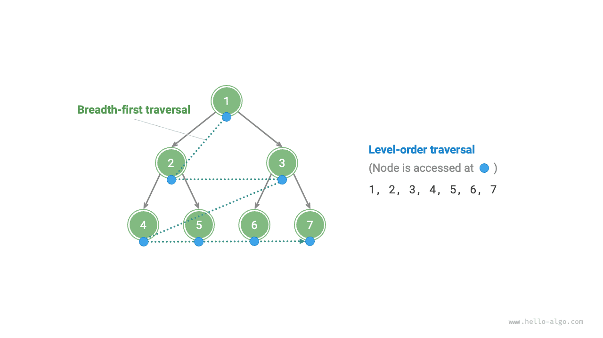
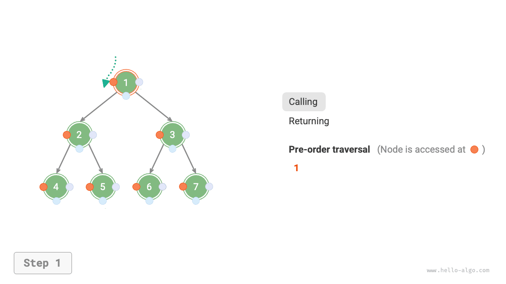
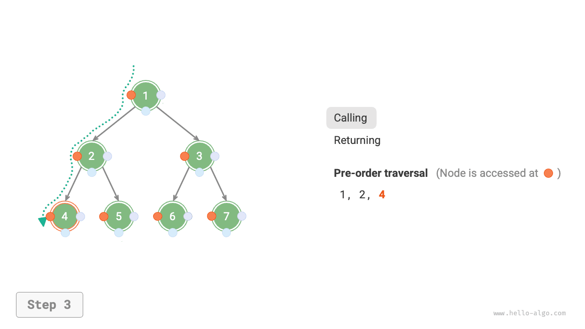
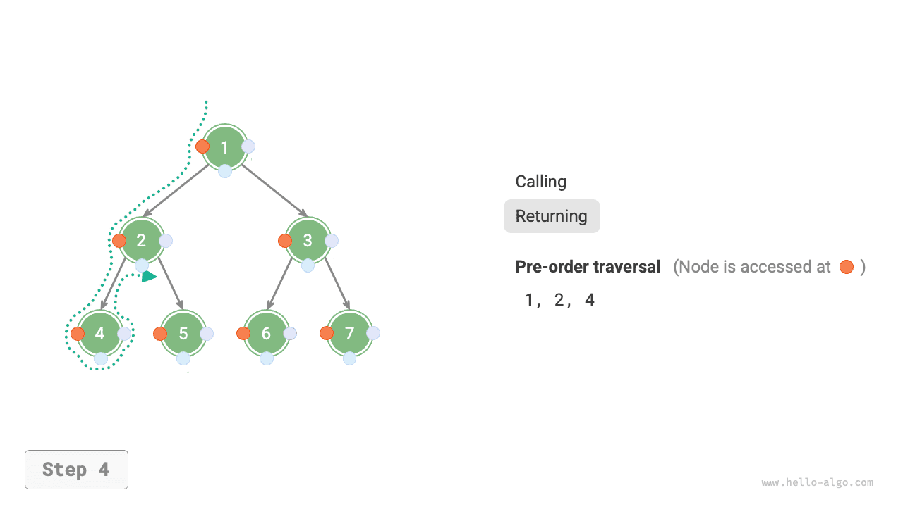
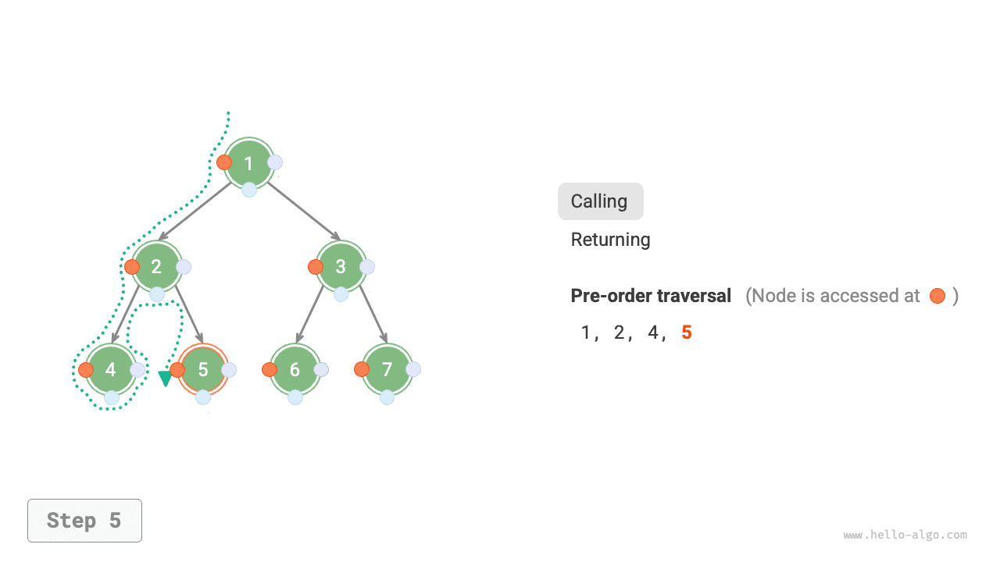
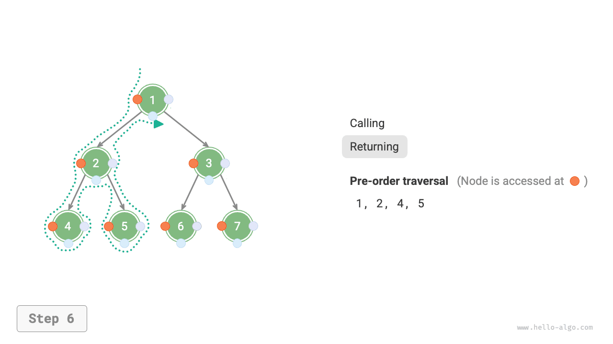
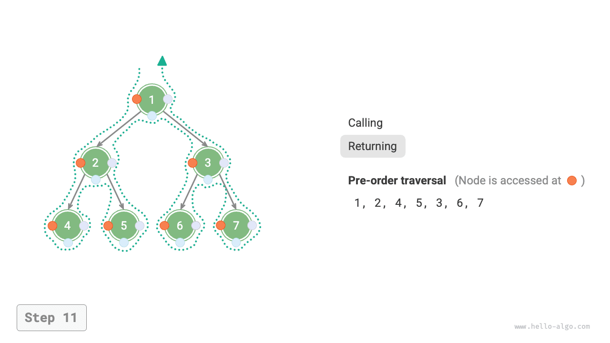

# Bináris fa bejárása

A fizikai struktúra szempontjából a fa egy láncolt listákon alapuló adatszerkezet. Ezért a bejárási módszer a csomópontok mutatókon keresztüli egyenkénti elérését foglalja magában. Ugyanakkor a fa egy nemlineáris adatszerkezet, ami bonyolultabbá teszi a fa bejárását a láncolt lista bejárásához képest, és keresési algoritmusok segítségét igényli.

A bináris fák általánosan használt bejárási módszerei közé tartozik a szintenkénti bejárás, az előrendű bejárás, a szimmetrikus rendű bejárás és az utórendű bejárás.

## Szintenkénti bejárás

Az alábbi ábrán látható módon, a <u>szintenkénti bejárás</u> a bináris fát felülről lefelé, rétegről rétegre járja be. Minden szinten belül a csomópontokat balról jobbra látogatja meg.

A szintenkénti bejárás lényegében <u>szélességi keresés</u>, más néven <u>szélességi első keresés (BFS)</u>, amely egy "köröket kifelé terjesztve" szintenként haladó bejárási módszert testesít meg.



### Kódmegvalósítás

A szélességi keresést általában egy "sor" (queue) segítségével valósítják meg. A sor az "elsőnek be, elsőnek ki" szabályt követi, míg a szélességi keresés a "szintenkénti haladás" szabályt követi; a kettő alapelve megegyezik. A megvalósítási kód a következő:

```src
[file]{binary_tree_bfs}-[class]{}-[func]{level_order}
```

### Bonyolultság elemzése

- **Az időbonyolultság $O(n)$**: Az összes csomópontot egyszer látogatjuk meg, ami $O(n)$ időt igényel, ahol $n$ a csomópontok száma.
- **A tárbonyolultság $O(n)$**: A legrosszabb esetben, azaz egy tökéletes bináris fa esetén az alsó szintre való bejárás előtt a sor egyszerre legfeljebb $(n + 1) / 2$ csomópontot tartalmaz, ami $O(n)$ tárterületet foglal.

## Előrendű, szimmetrikus rendű és utórendű bejárás

Ezzel szemben az előrendű, szimmetrikus rendű és utórendű bejárások mind a <u>mélységi kereséshez</u> tartoznak, más néven <u>mélységi első keresésnek (DFS)</u>, amelyek a "először menj a végéig, aztán visszalépve folytasd" bejárási módszert testesítik meg.

Az alábbi ábra bemutatja, hogyan működik a mélységi keresés egy bináris fán. **A mélységi keresés olyan, mint a teljes bináris fa kerületének "bejárása"**, ahol minden csomópontnál három pozícióval találkozunk, amelyek az előrendű, szimmetrikus rendű és utórendű bejárásnak felelnek meg.


### Kódmegvalósítás

A mélységi keresést általában rekurzió alapján valósítják meg:

```src
[file]{binary_tree_dfs}-[class]{}-[func]{post_order}
```

!!! tip

    A mélységi keresés iteráción alapuló megvalósítása is lehetséges; az érdeklődő olvasóknak ajánlott ezt önállóan tanulmányozni.

Az alábbi ábra a bináris fa előrendű bejárásának rekurzív folyamatát mutatja be, amely két ellentétes részre bontható: "rekurzió" és "visszatérés".

1. A "rekurzió" egy új metódus megnyitását jelenti, amelynek során a program a következő csomóponthoz lép.
2. A "visszatérés" a függvény visszatérését jelenti, ami azt jelzi, hogy az aktuális csomópont teljes mértékben meg lett látogatva.

=== "<1>"
    

=== "<2>"
    

=== "<3>"
    

=== "<4>"
    

=== "<5>"
    

=== "<6>"
    

=== "<7>"
    

=== "<8>"
    

=== "<9>"
    

=== "<10>"
    

=== "<11>"
    

### Bonyolultság elemzése

- **Az időbonyolultság $O(n)$**: Az összes csomópontot egyszer látogatjuk meg, ami $O(n)$ időt igényel.
- **A tárbonyolultság $O(n)$**: A legrosszabb esetben, azaz amikor a fa láncolt listává degenerálódik, a rekurzió mélysége eléri az $n$-t, és a rendszer $O(n)$ stack keret területet foglal.
